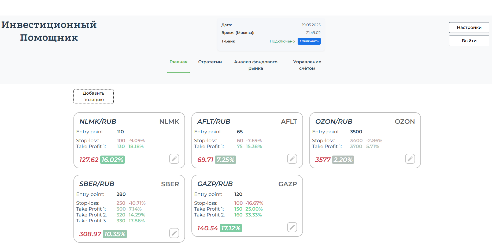
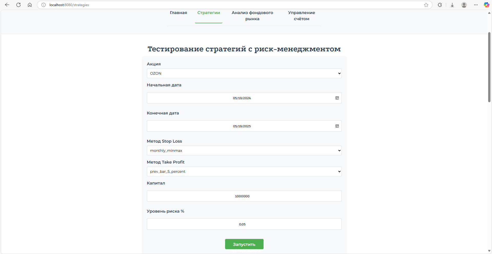
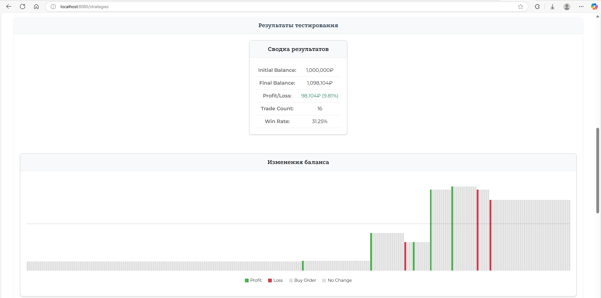
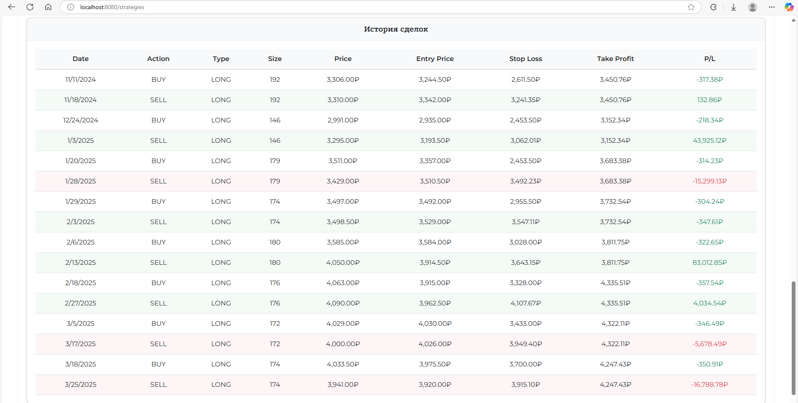
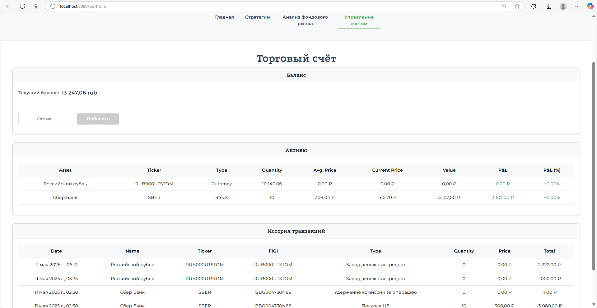
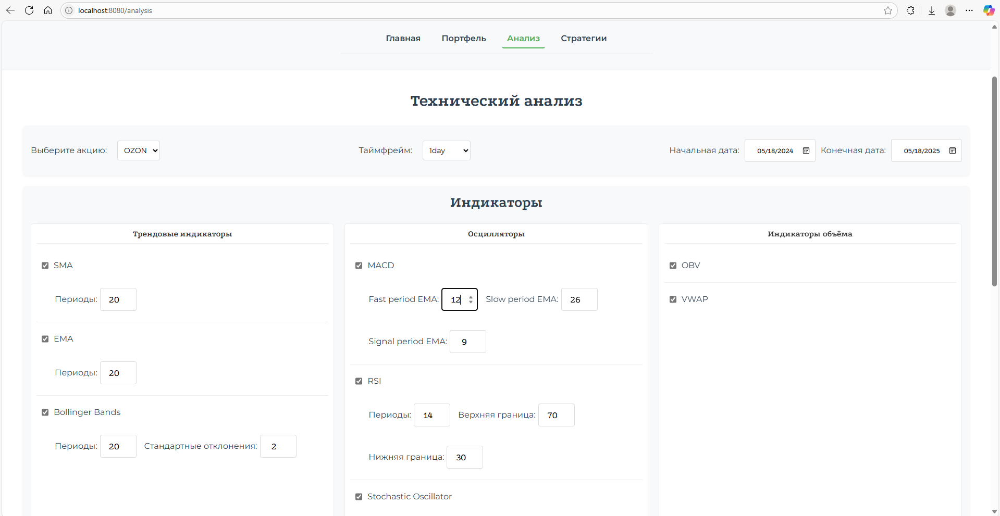
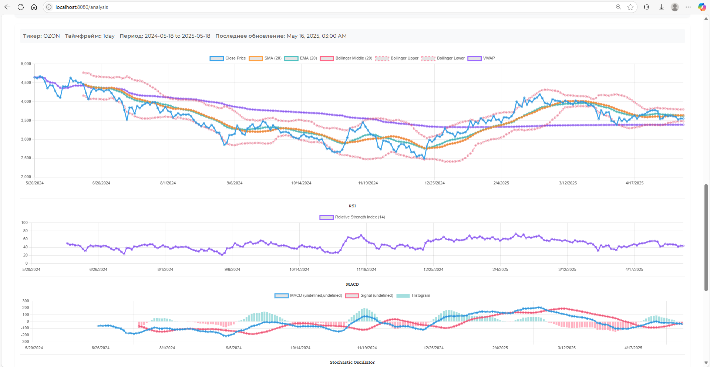
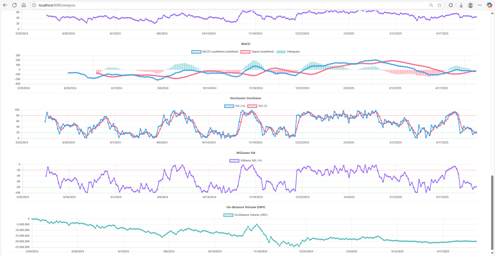

# Веб-приложение для анализа фондового рынка и управления торговым счётом

## Возможности
- Главная — обзор рынка и сводная информация
- Стратегии — настройка конфигураций и тестирование на исторических данных
- Управление счётом — управление и отслеживание ваших торговых позиций
- Анализ фондового рынка — проведение технического анализа заданных акций

### Главная
Экран предоставляет сводную информацию по добавленным акциям - цену входа в позицию, Take Profit, Stop Loss в числовом выражении и в процентах.


### Стратегии
Позволяет настраивать параметры и риск-менеджмент торговых стратегий и запускать их тестирование на исторических данных. Результаты отображаются в виде графиков и таблиц.




### Управление счётом
Отображает текущие позиции в портфолио, историю сделок.



### Технический анализ фондового рынка
Вкладка "Аналитика" предоставляет следующий функционал:
- Выбор тикера из настроенного списка
- Визуализация ценовых данных с настраиваемыми диапазонами дат
- Применение технических индикаторов:
  - Простая скользящая средняя (SMA), экспоненциальная (EMA)
  - Полосы Боллинджера
  - MACD, индекс относительной силы (RSI)
  - Stochastic Oscillator, Williams %R
  - OBV, VWAP



 

## Инструкция по эксплуатации

Зайдите на сайт, нажмите "Подключиться"

Нажмите "Добавить позицию" для создания карточки с акцией на главном экране


## Стек
- Backend: Django REST Framework
- Frontend: Vue.js

## Конфигурация
Систему можно настроить, изменяя следующие файлы:
- `backend/config/analysis_config.json` — настройка акций и параметров для технического анализа
- `config_ru.json` - для ручного исследования риск-менеджмента на Python
- `config_web_ru.json` - для запросов на тестирование стратегии риск-менеджмента из веб-приложения

## Настройка переменных окружения и секретов

Перед запуском проекта необходимо задать собственные секреты и токены.

1. Скопируйте пример файла переменных окружения:
   ```sh
   cp .env.example .env
   ```
2. Откройте файл `.env` и заполните его своими значениями (секретный ключ Django, токены, пароли и т.д.).
3. В production-окружении переменные окружения также должны быть заданы (например, через CI/CD, Docker или вручную на сервере).
   - Для Docker Compose используется опция `env_file: .env` или экспорт переменных перед запуском.

**Обязательные переменные:**
- `SECRET_KEY`: Секретный ключ Django (можно сгенерировать командой `python -c 'from django.core.management.utils import get_random_secret_key; print(get_random_secret_key())'`)
- `SQL_PASSWORD`: Пароль от вашей базы данных
- `TINKOFF_TOKEN`: Ваш токен T-Invest API - https://www.tbank.ru/invest/settings/api/
- ...и другие, перечисленные в `.env.example`

## Инструкция по запуску

Если возникают проблемы с установкой, отправьте Issue на GitHub или свяжитесь со мной по контактам в профиле.

1. Открыть терминал на вашей операционной системе, склонировать репозиторий и перейти в эту папку
	```
	git clone https://github.com/timermakov/bachelor_thesis.git

	cd bachelor_thesis/
	```
2. Создать и скопировать токен песочницы T-Bank Invest API по ссылке: https://www.tbank.ru/invest/settings/api/
3. Переименовать файлы `.env.dev` и `.env.prod`, убрав "_example" на конце
4. Задать значение `TINKOFF_TOKEN`, вставив после знака равно без кавычек скопированный токен из шага 1
5. Установить Docker на ПК, если отсутствует
6. Открыть терминал, выполнить:
	```shell
	docker-compose up --build
	```
	Веб-приложение должно быть доступно по адресу: http://localhost:8080/
7. Для изучения детального риск-менеджмента, перейдите в папку `RiskManagement/` и прочтите инструкцию по запуску в `README.md`
