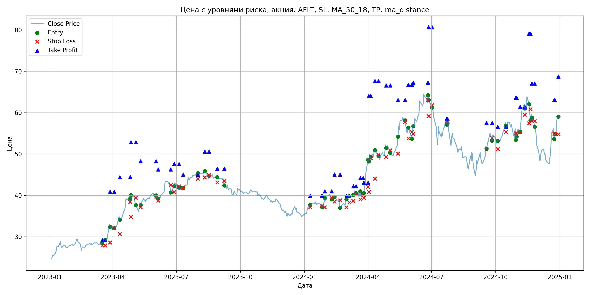
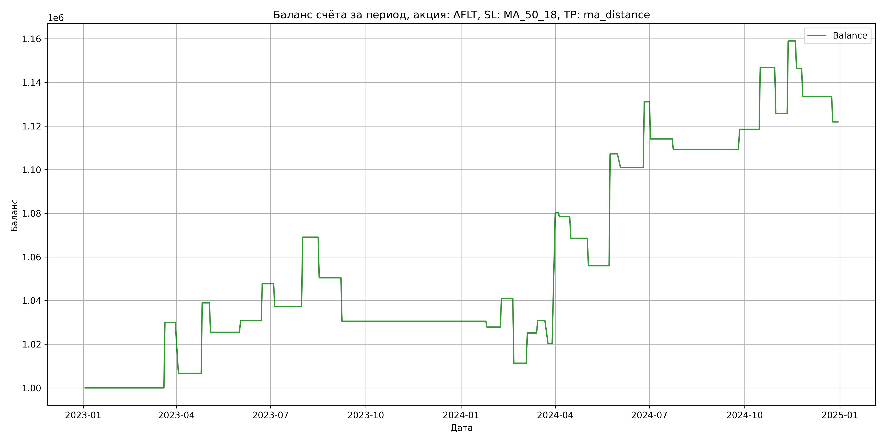

# Результаты торговой стратегии для AFLT

**Дата:** 2025-05-17 12:23:07  
**Стратегия:** AFLT,_SL_MA_50_18,_TP_ma_distance

## Конфигурация

```json
{
    "TICKER": "AFLT",
    "EXCHANGE": "MOEX",
    "START_DATE": "2023-01-01",
    "END_DATE": "2024-12-31",
    "INTERVAL": "1d",
    "CAPITAL": 1000000,
    "RISK_PERCENT": 0.02,
    "PROFIT_TO_RISK": 3,
    "ATR_MULTIPLIER": 1.5,
    "ATR_WINDOW": 14,
    "STOP_LOSS_METHOD": "MA_50_18",
    "TAKE_PROFIT_METHOD": "ma_distance",
    "POSITION": "long"
}
```

## Метрики эффективности

- **Начальный баланс:** 1000000.00
- **Конечный баланс:** 1121891.54
- **Прибыль/Убыток:** 121891.54 (12.19% за период тестирования)
- **Количество сделок:** 32
- **Процент выигрышных сделок:** 43.75% (14 выигрышных, 18 убыточных)
- **Средняя прибыль:** 25781.65
- **Средний убыток:** -13280.64
- **Максимальная прибыль:** 59938.56
- **Максимальный убыток:** -29676.96
- **Коэффициент прибыли:** 1.51
- **Максимальная просадка:** -5.40%

## Графики

### График цены с уровнями риска



### График баланса счёта



## Завершённые сделки

**Всего сделок:** 65

| Сделка № | Дата | Тип | Покупка / продажа | Количество акций | Цена | Stop Loss в момент сделки | Take Profit в момент сделки | Прибыль / убыток | Прибыль / убыток с учётом комиссии |
|:--------:|:----:|:---:|:-----------------:|:----------------:|:----:|:-------------------------:|:---------------------------:|:----------------:|:----------------------------------:|
| 1 | 2023-03-17 00:00:00 | LONG | BUY | 19045 | 28.29 | 27.88 | 29.15 | 0.00 | -269.39 |
| 2 | 2023-03-21 00:00:00 | LONG | SELL | -19045 | 29.86 | 27.88 | 29.15 | 29900.65 | 29346.92 |
| 3 | 2023-03-28 00:00:00 | LONG | BUY | 13295 | 33.25 | 28.61 | 40.86 | 0.00 | -221.03 |
| 4 | 2023-04-03 00:00:00 | LONG | SELL | -13295 | 31.50 | 32.09 | 40.86 | -23266.25 | -23696.68 |
| 5 | 2023-04-11 00:00:00 | LONG | BUY | 10701 | 34.96 | 30.63 | 44.39 | 0.00 | -187.05 |
| 6 | 2023-04-26 00:00:00 | LONG | SELL | -10701 | 37.98 | 38.43 | 44.39 | 32317.02 | 31926.75 |
| 7 | 2023-04-27 00:00:00 | LONG | BUY | 8693 | 39.07 | 34.83 | 52.86 | 0.00 | -169.82 |
| 8 | 2023-05-04 00:00:00 | LONG | SELL | -8693 | 37.52 | 39.44 | 52.86 | -13474.15 | -13807.05 |
| 9 | 2023-05-11 00:00:00 | LONG | BUY | 7229 | 38.49 | 37.14 | 48.23 | 0.00 | -139.12 |
| 10 | 2023-06-02 00:00:00 | LONG | SELL | -7229 | 39.22 | 39.72 | 48.23 | 5277.17 | 4996.29 |
| 11 | 2023-06-05 00:00:00 | LONG | BUY | 9270 | 40.07 | 38.72 | 46.28 | 0.00 | -185.72 |
| 12 | 2023-06-23 00:00:00 | LONG | SELL | -9270 | 41.90 | 42.51 | 46.28 | 16964.10 | 16584.17 |
| 13 | 2023-06-28 00:00:00 | LONG | BUY | 9451 | 42.51 | 40.81 | 47.58 | 0.00 | -200.88 |
| 14 | 2023-07-05 00:00:00 | LONG | SELL | -9451 | 41.40 | 42.15 | 47.58 | -10490.61 | -10887.13 |
| 15 | 2023-07-11 00:00:00 | LONG | BUY | 8608 | 42.12 | 41.81 | 45.04 | 0.00 | -181.28 |
| 16 | 2023-08-01 00:00:00 | LONG | SELL | -8608 | 45.82 | 44.03 | 45.04 | 31849.60 | 31471.11 |
| 17 | 2023-08-11 00:00:00 | LONG | BUY | 10536 | 45.66 | 44.33 | 50.58 | 0.00 | -240.54 |
| 18 | 2023-08-17 00:00:00 | LONG | SELL | -10536 | 43.89 | 44.92 | 50.58 | -18648.72 | -19120.47 |
| 19 | 2023-08-29 00:00:00 | LONG | BUY | 8989 | 44.80 | 43.15 | 46.48 | 0.00 | -201.35 |
| 20 | 2023-09-08 00:00:00 | LONG | SELL | -8989 | 42.59 | 43.49 | 46.48 | -19865.69 | -20258.46 |
| 21 | 2024-01-09 00:00:00 | LONG | BUY | 11188 | 37.60 | 37.14 | 39.95 | 0.00 | -210.33 |
| 22 | 2024-01-26 00:00:00 | LONG | SELL | -11188 | 37.36 | 37.55 | 39.95 | -2685.12 | -3104.45 |
| 23 | 2024-01-30 00:00:00 | LONG | BUY | 14888 | 38.32 | 37.11 | 40.98 | 0.00 | -285.25 |
| 24 | 2024-02-09 00:00:00 | LONG | SELL | -14888 | 39.20 | 39.47 | 40.98 | 13101.44 | 12524.38 |
| 25 | 2024-02-13 00:00:00 | LONG | BUY | 13368 | 39.96 | 38.46 | 45.03 | 0.00 | -267.09 |
| 26 | 2024-02-21 00:00:00 | LONG | SELL | -13368 | 37.74 | 38.81 | 45.03 | -29676.96 | -30196.31 |
| 27 | 2024-03-01 00:00:00 | LONG | BUY | 9954 | 38.56 | 37.13 | 39.77 | 0.00 | -191.91 |
| 28 | 2024-03-05 00:00:00 | LONG | SELL | -9954 | 39.95 | 38.28 | 39.77 | 13836.06 | 13445.32 |
| 29 | 2024-03-11 00:00:00 | LONG | BUY | 12677 | 39.67 | 38.65 | 42.21 | 0.00 | -251.45 |
| 30 | 2024-03-15 00:00:00 | LONG | SELL | -12677 | 40.12 | 40.26 | 42.21 | 5704.65 | 5198.90 |
| 31 | 2024-03-21 00:00:00 | LONG | BUY | 11712 | 40.79 | 39.03 | 44.17 | 0.00 | -238.87 |
| 32 | 2024-03-25 00:00:00 | LONG | SELL | -11712 | 39.90 | 40.16 | 44.17 | -10423.68 | -10896.20 |
| 33 | 2024-03-26 00:00:00 | LONG | BUY | 11352 | 40.50 | 39.39 | 43.08 | 0.00 | -229.88 |
| 34 | 2024-04-01 00:00:00 | LONG | SELL | -11352 | 45.78 | 42.07 | 43.08 | 59938.56 | 59448.83 |
| 35 | 2024-04-02 00:00:00 | LONG | BUY | 8558 | 48.65 | 40.82 | 64.02 | 0.00 | -208.17 |
| 36 | 2024-04-05 00:00:00 | LONG | SELL | -8558 | 48.43 | 49.00 | 64.02 | -1882.76 | -2298.17 |
| 37 | 2024-04-11 00:00:00 | LONG | BUY | 7228 | 51.23 | 44.06 | 67.67 | 0.00 | -185.15 |
| 38 | 2024-04-16 00:00:00 | LONG | SELL | -7228 | 49.86 | 49.90 | 67.67 | -9902.36 | -10267.70 |
| 39 | 2024-04-27 00:00:00 | LONG | BUY | 7975 | 52.18 | 49.31 | 66.58 | 0.00 | -208.07 |
| 40 | 2024-05-03 00:00:00 | LONG | SELL | -7975 | 50.60 | 50.92 | 66.58 | -12600.50 | -13010.34 |
| 41 | 2024-05-14 00:00:00 | LONG | BUY | 9124 | 52.20 | 50.11 | 63.08 | 0.00 | -238.14 |
| 42 | 2024-05-24 00:00:00 | LONG | SELL | -9124 | 57.82 | 57.76 | 63.08 | 51276.88 | 50774.97 |
| 43 | 2024-05-29 00:00:00 | LONG | BUY | 6205 | 56.00 | 53.78 | 66.76 | 0.00 | -173.74 |
| 44 | 2024-06-03 00:00:00 | LONG | SELL | -6205 | 55.00 | 55.27 | 66.76 | -6205.00 | -6549.38 |
| 45 | 2024-06-05 00:00:00 | LONG | BUY | 5323 | 57.00 | 54.85 | 67.26 | 0.00 | -151.71 |
| 46 | 2024-06-26 00:00:00 | LONG | SELL | -5323 | 62.65 | 63.11 | 67.26 | 30074.95 | 29756.50 |
| 47 | 2024-06-27 00:00:00 | LONG | BUY | 5301 | 64.35 | 59.17 | 80.63 | 0.00 | -170.56 |
| 48 | 2024-07-02 00:00:00 | LONG | SELL | -5301 | 61.14 | 61.81 | 80.63 | -17016.21 | -17348.82 |
| 49 | 2024-07-23 00:00:00 | LONG | BUY | 4390 | 58.22 | 57.86 | 58.50 | 0.00 | -127.79 |
| 50 | 2024-07-24 00:00:00 | LONG | SELL | -4390 | 57.12 | 57.86 | 58.50 | -4829.00 | -5082.17 |
| 51 | 2024-09-18 00:00:00 | LONG | BUY | 5608 | 51.70 | 51.10 | 57.53 | 0.00 | -144.97 |
| 52 | 2024-09-26 00:00:00 | LONG | SELL | -5608 | 53.35 | 53.90 | 57.53 | 9253.20 | 8958.64 |
| 53 | 2024-10-04 00:00:00 | LONG | BUY | 6496 | 53.20 | 51.20 | 56.62 | 0.00 | -172.79 |
| 54 | 2024-10-16 00:00:00 | LONG | SELL | -6496 | 57.55 | 55.30 | 56.62 | 28257.60 | 27897.88 |
| 55 | 2024-10-30 00:00:00 | LONG | BUY | 6972 | 56.35 | 55.00 | 63.63 | 0.00 | -196.44 |
| 56 | 2024-10-31 00:00:00 | LONG | SELL | -6972 | 53.34 | 55.00 | 63.63 | -20985.72 | -21368.10 |
| 57 | 2024-11-05 00:00:00 | LONG | BUY | 5569 | 56.03 | 55.29 | 61.41 | 0.00 | -156.02 |
| 58 | 2024-11-12 00:00:00 | LONG | SELL | -5569 | 61.99 | 59.52 | 61.41 | 33191.24 | 32862.61 |
| 59 | 2024-11-18 00:00:00 | LONG | BUY | 6564 | 62.05 | 57.41 | 79.12 | 0.00 | -203.65 |
| 60 | 2024-11-20 00:00:00 | LONG | SELL | -6564 | 60.14 | 60.84 | 79.12 | -12537.24 | -12938.27 |
| 61 | 2024-11-22 00:00:00 | LONG | BUY | 5711 | 59.60 | 57.95 | 67.05 | 0.00 | -170.19 |
| 62 | 2024-11-26 00:00:00 | LONG | SELL | -5711 | 57.33 | 57.95 | 67.05 | -12963.97 | -13297.86 |
| 63 | 2024-12-24 00:00:00 | LONG | BUY | 4566 | 56.10 | 54.95 | 63.00 | 0.00 | -128.08 |
| 64 | 2024-12-25 00:00:00 | LONG | SELL | -4566 | 53.56 | 54.95 | 63.00 | -11597.64 | -11847.99 |
| 65 | 2024-12-30 00:00:00 | LONG | BUY | 5504 | 59.04 | 54.78 | 68.72 | 0.00 | -162.48 |
