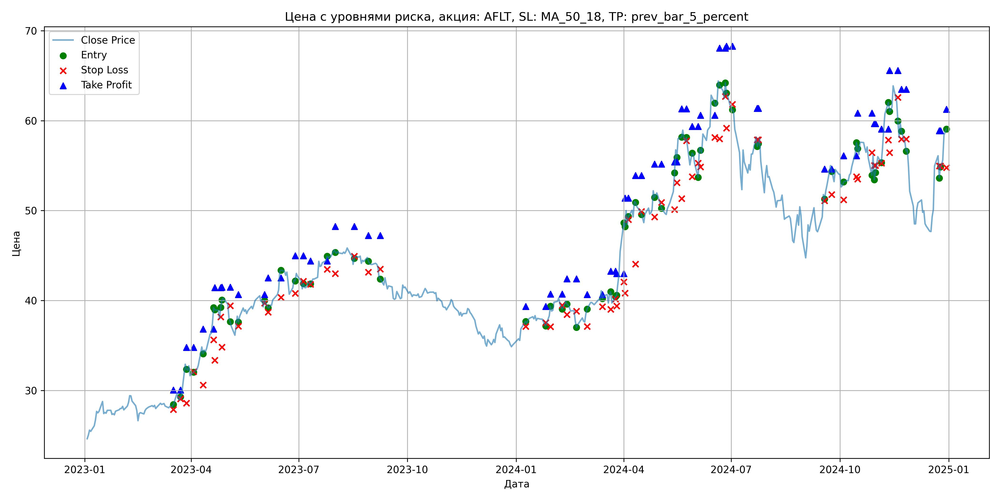
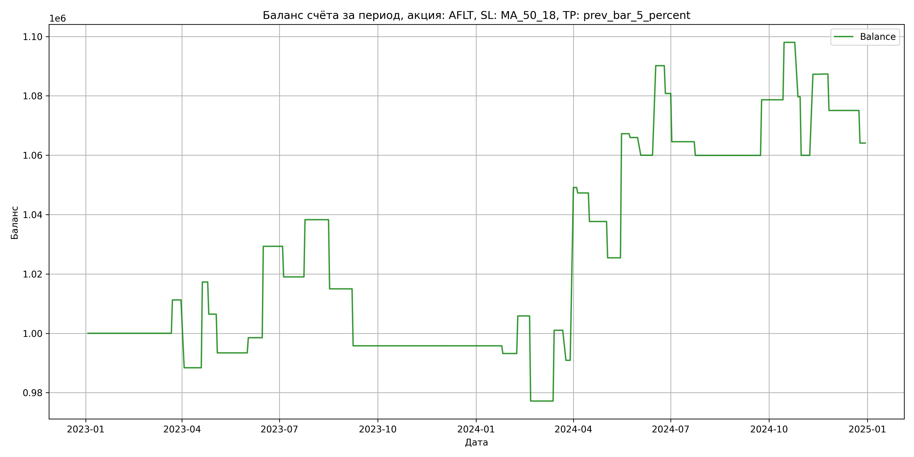

# Результаты торговой стратегии для AFLT

**Дата:** 2025-05-17 12:23:03  
**Стратегия:** AFLT,_SL_MA_50_18,_TP_prev_bar_5_percent

## Конфигурация

```json
{
    "TICKER": "AFLT",
    "EXCHANGE": "MOEX",
    "START_DATE": "2023-01-01",
    "END_DATE": "2024-12-31",
    "INTERVAL": "1d",
    "CAPITAL": 1000000,
    "RISK_PERCENT": 0.02,
    "PROFIT_TO_RISK": 3,
    "ATR_MULTIPLIER": 1.5,
    "ATR_WINDOW": 14,
    "STOP_LOSS_METHOD": "MA_50_18",
    "TAKE_PROFIT_METHOD": "prev_bar_5_percent",
    "POSITION": "long"
}
```

## Метрики эффективности

- **Начальный баланс:** 1000000.00
- **Конечный баланс:** 1064084.15
- **Прибыль/Убыток:** 64084.15 (6.41% за период тестирования)
- **Количество сделок:** 35
- **Процент выигрышных сделок:** 40.00% (14 выигрышных, 21 убыточных)
- **Средняя прибыль:** 23390.89
- **Средний убыток:** -12542.30
- **Максимальная прибыль:** 58206.72
- **Максимальный убыток:** -28662.42
- **Коэффициент прибыли:** 1.24
- **Максимальная просадка:** -5.88%

## Графики

### График цены с уровнями риска



### График баланса счёта



## Завершённые сделки

**Всего сделок:** 71

| Сделка № | Дата | Тип | Покупка / продажа | Количество акций | Цена | Stop Loss в момент сделки | Take Profit в момент сделки | Прибыль / убыток | Прибыль / убыток с учётом комиссии |
|:--------:|:----:|:---:|:-----------------:|:----------------:|:----:|:-------------------------:|:---------------------------:|:----------------:|:----------------------------------:|
| 1 | 2023-03-17 00:00:00 | LONG | BUY | 19045 | 28.29 | 27.88 | 30.05 | 0.00 | -269.39 |
| 2 | 2023-03-23 00:00:00 | LONG | SELL | -19045 | 28.88 | 29.07 | 30.05 | 11236.55 | 10692.15 |
| 3 | 2023-03-28 00:00:00 | LONG | BUY | 13054 | 33.25 | 28.61 | 34.79 | 0.00 | -217.02 |
| 4 | 2023-04-03 00:00:00 | LONG | SELL | -13054 | 31.50 | 32.09 | 34.79 | -22844.50 | -23267.12 |
| 5 | 2023-04-11 00:00:00 | LONG | BUY | 10507 | 34.96 | 30.63 | 36.82 | 0.00 | -183.66 |
| 6 | 2023-04-20 00:00:00 | LONG | SELL | -10507 | 37.71 | 35.63 | 36.82 | 28894.25 | 28512.48 |
| 7 | 2023-04-21 00:00:00 | LONG | BUY | 8880 | 39.20 | 33.36 | 41.44 | 0.00 | -174.05 |
| 8 | 2023-04-26 00:00:00 | LONG | SELL | -8880 | 37.98 | 38.19 | 41.44 | -10833.60 | -11176.28 |
| 9 | 2023-04-27 00:00:00 | LONG | BUY | 8418 | 39.07 | 34.83 | 41.48 | 0.00 | -164.45 |
| 10 | 2023-05-04 00:00:00 | LONG | SELL | -8418 | 37.52 | 39.44 | 41.48 | -13047.90 | -13370.27 |
| 11 | 2023-05-11 00:00:00 | LONG | BUY | 7000 | 38.49 | 37.14 | 40.68 | 0.00 | -134.72 |
| 12 | 2023-06-02 00:00:00 | LONG | SELL | -7000 | 39.22 | 39.72 | 40.68 | 5110.00 | 4838.01 |
| 13 | 2023-06-05 00:00:00 | LONG | BUY | 8976 | 40.07 | 38.72 | 42.53 | 0.00 | -179.83 |
| 14 | 2023-06-16 00:00:00 | LONG | SELL | -8976 | 43.50 | 40.36 | 42.53 | 30787.68 | 30412.62 |
| 15 | 2023-06-28 00:00:00 | LONG | BUY | 9282 | 42.51 | 40.81 | 44.98 | 0.00 | -197.29 |
| 16 | 2023-07-05 00:00:00 | LONG | SELL | -9282 | 41.40 | 42.15 | 44.98 | -10303.02 | -10692.45 |
| 17 | 2023-07-11 00:00:00 | LONG | BUY | 8454 | 42.12 | 41.81 | 44.40 | 0.00 | -178.04 |
| 18 | 2023-07-25 00:00:00 | LONG | SELL | -8454 | 44.40 | 43.47 | 44.40 | 19275.12 | 18909.40 |
| 19 | 2023-08-01 00:00:00 | LONG | BUY | 12074 | 45.82 | 42.99 | 48.23 | 0.00 | -276.62 |
| 20 | 2023-08-17 00:00:00 | LONG | SELL | -12074 | 43.89 | 44.92 | 48.23 | -23302.82 | -23844.40 |
| 21 | 2023-08-29 00:00:00 | LONG | BUY | 8682 | 44.80 | 43.15 | 47.24 | 0.00 | -194.48 |
| 22 | 2023-09-08 00:00:00 | LONG | SELL | -8682 | 42.59 | 43.49 | 47.24 | -19187.22 | -19566.58 |
| 23 | 2024-01-09 00:00:00 | LONG | BUY | 10805 | 37.60 | 37.14 | 39.36 | 0.00 | -203.13 |
| 24 | 2024-01-26 00:00:00 | LONG | SELL | -10805 | 37.36 | 37.55 | 39.36 | -2593.20 | -2998.17 |
| 25 | 2024-01-30 00:00:00 | LONG | BUY | 14379 | 38.32 | 37.11 | 40.72 | 0.00 | -275.50 |
| 26 | 2024-02-09 00:00:00 | LONG | SELL | -14379 | 39.20 | 39.47 | 40.72 | 12653.52 | 12096.19 |
| 27 | 2024-02-13 00:00:00 | LONG | BUY | 12911 | 39.96 | 38.46 | 42.41 | 0.00 | -257.96 |
| 28 | 2024-02-21 00:00:00 | LONG | SELL | -12911 | 37.74 | 38.81 | 42.41 | -28662.42 | -29164.01 |
| 29 | 2024-03-01 00:00:00 | LONG | BUY | 9614 | 38.56 | 37.13 | 40.66 | 0.00 | -185.36 |
| 30 | 2024-03-14 00:00:00 | LONG | SELL | -9614 | 41.04 | 39.33 | 40.66 | 23842.72 | 23460.08 |
| 31 | 2024-03-21 00:00:00 | LONG | BUY | 11374 | 40.79 | 39.03 | 43.27 | 0.00 | -231.97 |
| 32 | 2024-03-25 00:00:00 | LONG | SELL | -11374 | 39.90 | 40.16 | 43.27 | -10122.86 | -10581.74 |
| 33 | 2024-03-26 00:00:00 | LONG | BUY | 11024 | 40.50 | 39.39 | 42.99 | 0.00 | -223.24 |
| 34 | 2024-04-01 00:00:00 | LONG | SELL | -11024 | 45.78 | 42.07 | 42.99 | 58206.72 | 57731.14 |
| 35 | 2024-04-02 00:00:00 | LONG | BUY | 8311 | 48.65 | 40.82 | 51.40 | 0.00 | -202.17 |
| 36 | 2024-04-05 00:00:00 | LONG | SELL | -8311 | 48.43 | 49.00 | 51.40 | -1828.42 | -2231.84 |
| 37 | 2024-04-11 00:00:00 | LONG | BUY | 7019 | 51.23 | 44.06 | 53.91 | 0.00 | -179.79 |
| 38 | 2024-04-16 00:00:00 | LONG | SELL | -7019 | 49.86 | 49.90 | 53.91 | -9616.03 | -9970.81 |
| 39 | 2024-04-27 00:00:00 | LONG | BUY | 7745 | 52.18 | 49.31 | 55.17 | 0.00 | -202.07 |
| 40 | 2024-05-03 00:00:00 | LONG | SELL | -7745 | 50.60 | 50.92 | 55.17 | -12237.10 | -12635.12 |
| 41 | 2024-05-14 00:00:00 | LONG | BUY | 8860 | 52.20 | 50.11 | 55.41 | 0.00 | -231.25 |
| 42 | 2024-05-16 00:00:00 | LONG | SELL | -8860 | 56.92 | 53.11 | 55.41 | 41819.20 | 41335.80 |
| 43 | 2024-05-20 00:00:00 | LONG | BUY | 7155 | 58.00 | 51.33 | 61.30 | 0.00 | -207.50 |
| 44 | 2024-05-24 00:00:00 | LONG | SELL | -7155 | 57.82 | 57.76 | 61.30 | -1287.90 | -1702.25 |
| 45 | 2024-05-29 00:00:00 | LONG | BUY | 5971 | 56.00 | 53.78 | 59.35 | 0.00 | -167.19 |
| 46 | 2024-06-03 00:00:00 | LONG | SELL | -5971 | 55.00 | 55.27 | 59.35 | -5971.00 | -6302.39 |
| 47 | 2024-06-05 00:00:00 | LONG | BUY | 5123 | 57.00 | 54.85 | 60.61 | 0.00 | -146.01 |
| 48 | 2024-06-17 00:00:00 | LONG | SELL | -5123 | 62.89 | 58.13 | 60.61 | 30174.47 | 29867.37 |
| 49 | 2024-06-21 00:00:00 | LONG | BUY | 4593 | 64.69 | 57.98 | 68.07 | 0.00 | -148.56 |
| 50 | 2024-06-26 00:00:00 | LONG | SELL | -4593 | 62.65 | 62.69 | 68.07 | -9369.72 | -9662.16 |
| 51 | 2024-06-27 00:00:00 | LONG | BUY | 5061 | 64.35 | 59.17 | 68.26 | 0.00 | -162.84 |
| 52 | 2024-07-02 00:00:00 | LONG | SELL | -5061 | 61.14 | 61.81 | 68.26 | -16245.81 | -16563.36 |
| 53 | 2024-07-23 00:00:00 | LONG | BUY | 4192 | 58.22 | 57.86 | 61.37 | 0.00 | -122.03 |
| 54 | 2024-07-24 00:00:00 | LONG | SELL | -4192 | 57.12 | 57.86 | 61.37 | -4611.20 | -4852.95 |
| 55 | 2024-09-18 00:00:00 | LONG | BUY | 5354 | 51.70 | 51.10 | 54.63 | 0.00 | -138.40 |
| 56 | 2024-09-24 00:00:00 | LONG | SELL | -5354 | 55.20 | 51.77 | 54.63 | 18739.00 | 18452.83 |
| 57 | 2024-10-04 00:00:00 | LONG | BUY | 6260 | 53.20 | 51.20 | 56.11 | 0.00 | -166.52 |
| 58 | 2024-10-15 00:00:00 | LONG | SELL | -6260 | 56.29 | 53.78 | 56.11 | 19343.40 | 19000.70 |
| 59 | 2024-10-16 00:00:00 | LONG | BUY | 7187 | 57.55 | 53.51 | 60.83 | 0.00 | -206.81 |
| 60 | 2024-10-28 00:00:00 | LONG | SELL | -7187 | 55.00 | 56.45 | 60.83 | -18326.85 | -18731.30 |
| 61 | 2024-10-30 00:00:00 | LONG | BUY | 6555 | 56.35 | 55.00 | 59.66 | 0.00 | -184.69 |
| 62 | 2024-10-31 00:00:00 | LONG | SELL | -6555 | 53.34 | 55.00 | 59.66 | -19730.55 | -20090.06 |
| 63 | 2024-11-05 00:00:00 | LONG | BUY | 5236 | 56.03 | 55.29 | 59.07 | 0.00 | -146.69 |
| 64 | 2024-11-11 00:00:00 | LONG | SELL | -5236 | 61.25 | 57.84 | 59.07 | 27331.92 | 27024.88 |
| 65 | 2024-11-12 00:00:00 | LONG | BUY | 5792 | 61.99 | 56.44 | 65.56 | 0.00 | -179.52 |
| 66 | 2024-11-19 00:00:00 | LONG | SELL | -5792 | 62.00 | 62.58 | 65.56 | 57.92 | -301.16 |
| 67 | 2024-11-22 00:00:00 | LONG | BUY | 5410 | 59.60 | 57.95 | 63.48 | 0.00 | -161.22 |
| 68 | 2024-11-26 00:00:00 | LONG | SELL | -5410 | 57.33 | 57.95 | 63.48 | -12280.70 | -12597.00 |
| 69 | 2024-12-24 00:00:00 | LONG | BUY | 4325 | 56.10 | 54.95 | 58.87 | 0.00 | -121.32 |
| 70 | 2024-12-25 00:00:00 | LONG | SELL | -4325 | 53.56 | 54.95 | 58.87 | -10985.50 | -11222.64 |
| 71 | 2024-12-30 00:00:00 | LONG | BUY | 5214 | 59.04 | 54.78 | 61.27 | 0.00 | -153.92 |
