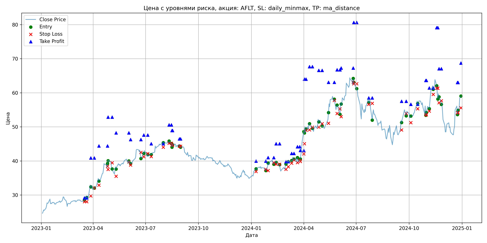
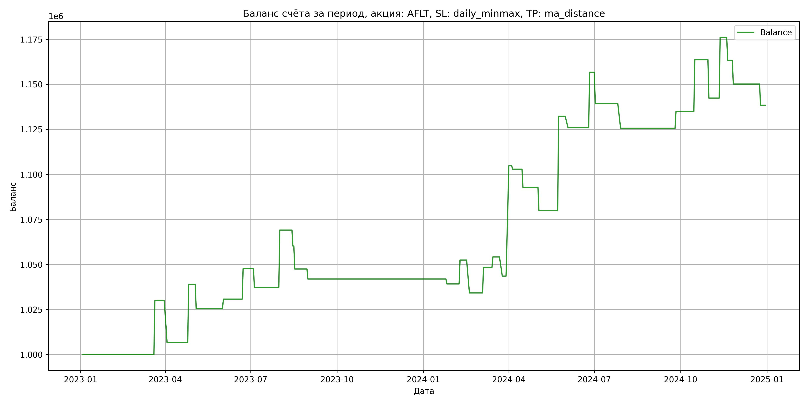

# Результаты торговой стратегии для AFLT

**Дата:** 2025-05-17 12:22:50  
**Стратегия:** AFLT,_SL_daily_minmax,_TP_ma_distance

## Конфигурация

```json
{
    "TICKER": "AFLT",
    "EXCHANGE": "MOEX",
    "START_DATE": "2023-01-01",
    "END_DATE": "2024-12-31",
    "INTERVAL": "1d",
    "CAPITAL": 1000000,
    "RISK_PERCENT": 0.02,
    "PROFIT_TO_RISK": 3,
    "ATR_MULTIPLIER": 1.5,
    "ATR_WINDOW": 14,
    "STOP_LOSS_METHOD": "daily_minmax",
    "TAKE_PROFIT_METHOD": "ma_distance",
    "POSITION": "long"
}
```

## Метрики эффективности

- **Начальный баланс:** 1000000.00
- **Конечный баланс:** 1138402.96
- **Прибыль/Убыток:** 138402.96 (13.84% за период тестирования)
- **Количество сделок:** 33
- **Процент выигрышных сделок:** 42.42% (14 выигрышных, 19 убыточных)
- **Средняя прибыль:** 26119.58
- **Средний убыток:** -11961.64
- **Максимальная прибыль:** 61274.40
- **Максимальный убыток:** -23266.25
- **Коэффициент прибыли:** 1.61
- **Максимальная просадка:** -3.26%

## Графики

### График цены с уровнями риска



### График баланса счёта



## Завершённые сделки

**Всего сделок:** 67

| Сделка № | Дата | Тип | Покупка / продажа | Количество акций | Цена | Stop Loss в момент сделки | Take Profit в момент сделки | Прибыль / убыток | Прибыль / убыток с учётом комиссии |
|:--------:|:----:|:---:|:-----------------:|:----------------:|:----:|:-------------------------:|:---------------------------:|:----------------:|:----------------------------------:|
| 1 | 2023-03-17 00:00:00 | LONG | BUY | 19045 | 28.29 | 28.03 | 29.15 | 0.00 | -269.39 |
| 2 | 2023-03-21 00:00:00 | LONG | SELL | -19045 | 29.86 | 28.03 | 29.15 | 29900.65 | 29346.92 |
| 3 | 2023-03-28 00:00:00 | LONG | BUY | 13295 | 33.25 | 29.72 | 40.86 | 0.00 | -221.03 |
| 4 | 2023-04-03 00:00:00 | LONG | SELL | -13295 | 31.50 | 32.09 | 40.86 | -23266.25 | -23696.68 |
| 5 | 2023-04-11 00:00:00 | LONG | BUY | 10701 | 34.96 | 32.89 | 44.39 | 0.00 | -187.05 |
| 6 | 2023-04-26 00:00:00 | LONG | SELL | -10701 | 37.98 | 38.43 | 44.39 | 32317.02 | 31926.75 |
| 7 | 2023-04-27 00:00:00 | LONG | BUY | 8693 | 39.07 | 37.52 | 52.86 | 0.00 | -169.82 |
| 8 | 2023-05-04 00:00:00 | LONG | SELL | -8693 | 37.52 | 39.44 | 52.86 | -13474.15 | -13807.05 |
| 9 | 2023-05-11 00:00:00 | LONG | BUY | 7229 | 38.49 | 35.51 | 48.23 | 0.00 | -139.12 |
| 10 | 2023-06-02 00:00:00 | LONG | SELL | -7229 | 39.22 | 39.72 | 48.23 | 5277.17 | 4996.29 |
| 11 | 2023-06-05 00:00:00 | LONG | BUY | 9270 | 40.07 | 38.80 | 46.28 | 0.00 | -185.72 |
| 12 | 2023-06-23 00:00:00 | LONG | SELL | -9270 | 41.90 | 42.51 | 46.28 | 16964.10 | 16584.17 |
| 13 | 2023-06-28 00:00:00 | LONG | BUY | 9451 | 42.51 | 41.23 | 47.58 | 0.00 | -200.88 |
| 14 | 2023-07-05 00:00:00 | LONG | SELL | -9451 | 41.40 | 42.15 | 47.58 | -10490.61 | -10887.13 |
| 15 | 2023-07-11 00:00:00 | LONG | BUY | 8608 | 42.12 | 41.28 | 45.04 | 0.00 | -181.28 |
| 16 | 2023-08-01 00:00:00 | LONG | SELL | -8608 | 45.82 | 44.03 | 45.04 | 31849.60 | 31471.11 |
| 17 | 2023-08-11 00:00:00 | LONG | BUY | 10536 | 45.66 | 45.19 | 50.58 | 0.00 | -240.54 |
| 18 | 2023-08-15 00:00:00 | LONG | SELL | -10536 | 44.82 | 45.19 | 50.58 | -8850.24 | -9326.89 |
| 19 | 2023-08-16 00:00:00 | LONG | BUY | 10372 | 45.12 | 44.68 | 48.93 | 0.00 | -233.99 |
| 20 | 2023-08-17 00:00:00 | LONG | SELL | -10372 | 43.89 | 44.68 | 48.93 | -12757.56 | -13219.17 |
| 21 | 2023-08-29 00:00:00 | LONG | BUY | 8960 | 44.80 | 44.29 | 46.48 | 0.00 | -200.70 |
| 22 | 2023-08-31 00:00:00 | LONG | SELL | -8960 | 44.18 | 44.29 | 46.48 | -5555.20 | -5953.83 |
| 23 | 2024-01-09 00:00:00 | LONG | BUY | 11307 | 37.60 | 36.90 | 39.95 | 0.00 | -212.57 |
| 24 | 2024-01-26 00:00:00 | LONG | SELL | -11307 | 37.36 | 37.55 | 39.95 | -2713.68 | -3137.47 |
| 25 | 2024-01-30 00:00:00 | LONG | BUY | 15046 | 38.32 | 37.17 | 40.98 | 0.00 | -288.28 |
| 26 | 2024-02-09 00:00:00 | LONG | SELL | -15046 | 39.20 | 39.47 | 40.98 | 13240.48 | 12657.30 |
| 27 | 2024-02-13 00:00:00 | LONG | BUY | 13510 | 39.96 | 39.05 | 45.03 | 0.00 | -269.93 |
| 28 | 2024-02-19 00:00:00 | LONG | SELL | -13510 | 38.61 | 39.05 | 45.03 | -18238.50 | -18769.24 |
| 29 | 2024-03-01 00:00:00 | LONG | BUY | 10176 | 38.56 | 37.55 | 39.77 | 0.00 | -196.19 |
| 30 | 2024-03-05 00:00:00 | LONG | SELL | -10176 | 39.95 | 38.28 | 39.77 | 14144.64 | 13745.18 |
| 31 | 2024-03-11 00:00:00 | LONG | BUY | 12959 | 39.67 | 39.35 | 42.21 | 0.00 | -257.04 |
| 32 | 2024-03-15 00:00:00 | LONG | SELL | -12959 | 40.12 | 40.26 | 42.21 | 5831.55 | 5314.55 |
| 33 | 2024-03-21 00:00:00 | LONG | BUY | 11973 | 40.79 | 39.52 | 44.17 | 0.00 | -244.19 |
| 34 | 2024-03-25 00:00:00 | LONG | SELL | -11973 | 39.90 | 40.16 | 44.17 | -10655.97 | -11139.02 |
| 35 | 2024-03-26 00:00:00 | LONG | BUY | 11605 | 40.50 | 39.86 | 43.08 | 0.00 | -235.00 |
| 36 | 2024-04-01 00:00:00 | LONG | SELL | -11605 | 45.78 | 42.07 | 43.08 | 61274.40 | 60773.76 |
| 37 | 2024-04-02 00:00:00 | LONG | BUY | 8748 | 48.65 | 45.04 | 64.02 | 0.00 | -212.80 |
| 38 | 2024-04-05 00:00:00 | LONG | SELL | -8748 | 48.43 | 49.00 | 64.02 | -1924.56 | -2349.19 |
| 39 | 2024-04-11 00:00:00 | LONG | BUY | 7389 | 51.23 | 49.12 | 67.67 | 0.00 | -189.27 |
| 40 | 2024-04-16 00:00:00 | LONG | SELL | -7389 | 49.86 | 49.90 | 67.67 | -10122.93 | -10496.41 |
| 41 | 2024-04-27 00:00:00 | LONG | BUY | 8153 | 52.18 | 49.94 | 66.58 | 0.00 | -212.71 |
| 42 | 2024-05-03 00:00:00 | LONG | SELL | -8153 | 50.60 | 50.92 | 66.58 | -12881.74 | -13300.72 |
| 43 | 2024-05-14 00:00:00 | LONG | BUY | 9327 | 52.20 | 51.05 | 63.08 | 0.00 | -243.43 |
| 44 | 2024-05-24 00:00:00 | LONG | SELL | -9327 | 57.82 | 57.76 | 63.08 | 52417.74 | 51904.66 |
| 45 | 2024-05-29 00:00:00 | LONG | BUY | 6343 | 56.00 | 53.90 | 66.76 | 0.00 | -177.60 |
| 46 | 2024-06-03 00:00:00 | LONG | SELL | -6343 | 55.00 | 55.27 | 66.76 | -6343.00 | -6695.04 |
| 47 | 2024-06-05 00:00:00 | LONG | BUY | 5442 | 57.00 | 52.99 | 67.26 | 0.00 | -155.10 |
| 48 | 2024-06-26 00:00:00 | LONG | SELL | -5442 | 62.65 | 63.11 | 67.26 | 30747.30 | 30421.73 |
| 49 | 2024-06-27 00:00:00 | LONG | BUY | 5419 | 64.35 | 62.65 | 80.63 | 0.00 | -174.36 |
| 50 | 2024-07-02 00:00:00 | LONG | SELL | -5419 | 61.14 | 62.65 | 80.63 | -17394.99 | -17735.01 |
| 51 | 2024-07-23 00:00:00 | LONG | BUY | 4488 | 58.22 | 56.61 | 58.50 | 0.00 | -130.65 |
| 52 | 2024-07-29 00:00:00 | LONG | SELL | -4488 | 55.17 | 56.90 | 58.50 | -13688.40 | -13942.85 |
| 53 | 2024-09-18 00:00:00 | LONG | BUY | 5688 | 51.70 | 49.10 | 57.53 | 0.00 | -147.03 |
| 54 | 2024-09-26 00:00:00 | LONG | SELL | -5688 | 53.35 | 53.90 | 57.53 | 9385.20 | 9086.44 |
| 55 | 2024-10-04 00:00:00 | LONG | BUY | 6589 | 53.20 | 51.22 | 56.62 | 0.00 | -175.27 |
| 56 | 2024-10-16 00:00:00 | LONG | SELL | -6589 | 57.55 | 55.30 | 56.62 | 28662.15 | 28297.28 |
| 57 | 2024-10-30 00:00:00 | LONG | BUY | 7071 | 56.35 | 53.53 | 63.63 | 0.00 | -199.23 |
| 58 | 2024-10-31 00:00:00 | LONG | SELL | -7071 | 53.34 | 53.53 | 63.63 | -21283.71 | -21671.52 |
| 59 | 2024-11-05 00:00:00 | LONG | BUY | 5648 | 56.03 | 54.62 | 61.41 | 0.00 | -158.23 |
| 60 | 2024-11-12 00:00:00 | LONG | SELL | -5648 | 61.99 | 59.52 | 61.41 | 33662.08 | 33328.79 |
| 61 | 2024-11-18 00:00:00 | LONG | BUY | 6658 | 62.05 | 61.35 | 79.12 | 0.00 | -206.56 |
| 62 | 2024-11-20 00:00:00 | LONG | SELL | -6658 | 60.14 | 61.35 | 79.12 | -12716.78 | -13123.55 |
| 63 | 2024-11-22 00:00:00 | LONG | BUY | 5793 | 59.60 | 57.06 | 67.05 | 0.00 | -172.63 |
| 64 | 2024-11-26 00:00:00 | LONG | SELL | -5793 | 57.33 | 57.64 | 67.05 | -13150.11 | -13488.80 |
| 65 | 2024-12-24 00:00:00 | LONG | BUY | 4631 | 56.10 | 54.15 | 63.00 | 0.00 | -129.90 |
| 66 | 2024-12-25 00:00:00 | LONG | SELL | -4631 | 53.56 | 54.15 | 63.00 | -11762.74 | -12016.66 |
| 67 | 2024-12-30 00:00:00 | LONG | BUY | 5582 | 59.04 | 55.58 | 68.72 | 0.00 | -164.78 |
