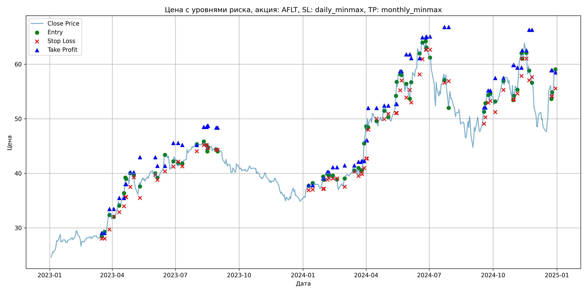
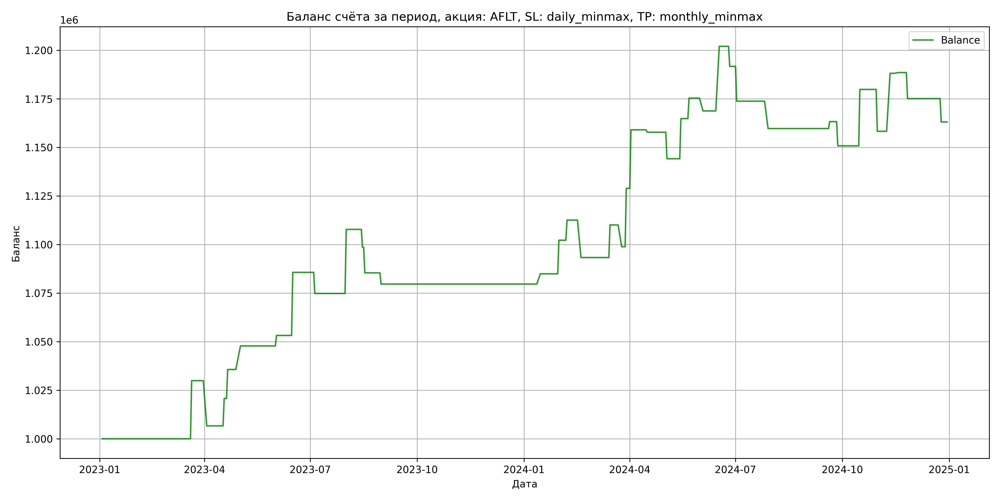

# Результаты торговой стратегии для AFLT

**Дата:** 2025-05-17 12:22:49  
**Стратегия:** AFLT,_SL_daily_minmax,_TP_monthly_minmax

## Конфигурация

```json
{
    "TICKER": "AFLT",
    "EXCHANGE": "MOEX",
    "START_DATE": "2023-01-01",
    "END_DATE": "2024-12-31",
    "INTERVAL": "1d",
    "CAPITAL": 1000000,
    "RISK_PERCENT": 0.02,
    "PROFIT_TO_RISK": 3,
    "ATR_MULTIPLIER": 1.5,
    "ATR_WINDOW": 14,
    "STOP_LOSS_METHOD": "daily_minmax",
    "TAKE_PROFIT_METHOD": "monthly_minmax",
    "POSITION": "long"
}
```

## Метрики эффективности

- **Начальный баланс:** 1000000.00
- **Конечный баланс:** 1163048.47
- **Прибыль/Убыток:** 163048.47 (16.30% за период тестирования)
- **Количество сделок:** 37
- **Процент выигрышных сделок:** 54.05% (20 выигрышных, 17 убыточных)
- **Средняя прибыль:** 18948.89
- **Средний убыток:** -12701.73
- **Максимальная прибыль:** 33243.16
- **Максимальный убыток:** -23266.25
- **Коэффициент прибыли:** 1.76
- **Максимальная просадка:** -4.26%

## Графики

### График цены с уровнями риска



### График баланса счёта



## Завершённые сделки

**Всего сделок:** 75

| Сделка № | Дата | Тип | Покупка / продажа | Количество акций | Цена | Stop Loss в момент сделки | Take Profit в момент сделки | Прибыль / убыток | Прибыль / убыток с учётом комиссии |
|:--------:|:----:|:---:|:-----------------:|:----------------:|:----:|:-------------------------:|:---------------------------:|:----------------:|:----------------------------------:|
| 1 | 2023-03-17 00:00:00 | LONG | BUY | 19045 | 28.29 | 28.03 | 29.07 | 0.00 | -269.39 |
| 2 | 2023-03-21 00:00:00 | LONG | SELL | -19045 | 29.86 | 28.03 | 29.07 | 29900.65 | 29346.92 |
| 3 | 2023-03-28 00:00:00 | LONG | BUY | 13295 | 33.25 | 29.72 | 33.46 | 0.00 | -221.03 |
| 4 | 2023-04-03 00:00:00 | LONG | SELL | -13295 | 31.50 | 32.09 | 33.46 | -23266.25 | -23696.68 |
| 5 | 2023-04-11 00:00:00 | LONG | BUY | 10701 | 34.96 | 32.89 | 35.47 | 0.00 | -187.05 |
| 6 | 2023-04-18 00:00:00 | LONG | SELL | -10701 | 36.28 | 33.96 | 35.47 | 14125.32 | 13744.15 |
| 7 | 2023-04-20 00:00:00 | LONG | BUY | 9989 | 37.71 | 35.65 | 38.01 | 0.00 | -188.34 |
| 8 | 2023-04-21 00:00:00 | LONG | SELL | -9989 | 39.20 | 35.65 | 38.01 | 14883.61 | 14499.48 |
| 9 | 2023-04-27 00:00:00 | LONG | BUY | 8662 | 39.07 | 37.52 | 40.18 | 0.00 | -169.21 |
| 10 | 2023-05-02 00:00:00 | LONG | SELL | -8662 | 40.47 | 39.25 | 40.18 | 12126.80 | 11782.31 |
| 11 | 2023-05-11 00:00:00 | LONG | BUY | 7384 | 38.49 | 35.51 | 42.94 | 0.00 | -142.11 |
| 12 | 2023-06-02 00:00:00 | LONG | SELL | -7384 | 39.22 | 39.72 | 42.94 | 5390.32 | 5103.41 |
| 13 | 2023-06-05 00:00:00 | LONG | BUY | 9468 | 40.07 | 38.80 | 41.36 | 0.00 | -189.69 |
| 14 | 2023-06-16 00:00:00 | LONG | SELL | -9468 | 43.50 | 40.36 | 41.36 | 32475.24 | 32079.62 |
| 15 | 2023-06-28 00:00:00 | LONG | BUY | 9790 | 42.51 | 41.23 | 45.54 | 0.00 | -208.09 |
| 16 | 2023-07-05 00:00:00 | LONG | SELL | -9790 | 41.40 | 42.15 | 45.54 | -10866.90 | -11277.64 |
| 17 | 2023-07-11 00:00:00 | LONG | BUY | 8916 | 42.12 | 41.28 | 45.20 | 0.00 | -187.77 |
| 18 | 2023-08-01 00:00:00 | LONG | SELL | -8916 | 45.82 | 44.03 | 45.20 | 32989.20 | 32597.16 |
| 19 | 2023-08-11 00:00:00 | LONG | BUY | 10914 | 45.66 | 45.19 | 48.49 | 0.00 | -249.17 |
| 20 | 2023-08-15 00:00:00 | LONG | SELL | -10914 | 44.82 | 45.19 | 48.49 | -9167.76 | -9661.51 |
| 21 | 2023-08-16 00:00:00 | LONG | BUY | 10744 | 45.12 | 44.68 | 48.69 | 0.00 | -242.38 |
| 22 | 2023-08-17 00:00:00 | LONG | SELL | -10744 | 43.89 | 44.68 | 48.69 | -13215.12 | -13693.28 |
| 23 | 2023-08-29 00:00:00 | LONG | BUY | 9281 | 44.80 | 44.29 | 48.36 | 0.00 | -207.89 |
| 24 | 2023-08-31 00:00:00 | LONG | SELL | -9281 | 44.18 | 44.29 | 48.36 | -5754.22 | -6167.13 |
| 25 | 2024-01-09 00:00:00 | LONG | BUY | 11712 | 37.60 | 36.90 | 37.81 | 0.00 | -220.19 |
| 26 | 2024-01-15 00:00:00 | LONG | SELL | -11712 | 38.05 | 37.04 | 37.81 | 5270.40 | 4827.39 |
| 27 | 2024-01-30 00:00:00 | LONG | BUY | 15703 | 38.32 | 37.17 | 39.06 | 0.00 | -300.87 |
| 28 | 2024-01-31 00:00:00 | LONG | SELL | -15703 | 39.42 | 37.17 | 39.06 | 17273.30 | 16662.92 |
| 29 | 2024-02-05 00:00:00 | LONG | BUY | 15021 | 39.81 | 38.84 | 40.22 | 0.00 | -298.99 |
| 30 | 2024-02-07 00:00:00 | LONG | SELL | -15021 | 40.50 | 39.11 | 40.22 | 10364.49 | 9761.32 |
| 31 | 2024-02-13 00:00:00 | LONG | BUY | 14271 | 39.96 | 39.05 | 41.09 | 0.00 | -285.13 |
| 32 | 2024-02-19 00:00:00 | LONG | SELL | -14271 | 38.61 | 39.05 | 41.09 | -19265.85 | -19826.49 |
| 33 | 2024-03-01 00:00:00 | LONG | BUY | 10749 | 38.56 | 37.55 | 41.44 | 0.00 | -207.24 |
| 34 | 2024-03-15 00:00:00 | LONG | SELL | -10749 | 40.12 | 40.26 | 41.44 | 16768.44 | 16345.57 |
| 35 | 2024-03-21 00:00:00 | LONG | BUY | 12604 | 40.79 | 39.52 | 42.11 | 0.00 | -257.06 |
| 36 | 2024-03-25 00:00:00 | LONG | SELL | -12604 | 39.90 | 40.16 | 42.11 | -11217.56 | -11726.07 |
| 37 | 2024-03-26 00:00:00 | LONG | BUY | 12216 | 40.50 | 39.86 | 42.26 | 0.00 | -247.37 |
| 38 | 2024-03-29 00:00:00 | LONG | SELL | -12216 | 42.96 | 40.97 | 42.26 | 30051.36 | 29541.59 |
| 39 | 2024-04-01 00:00:00 | LONG | BUY | 10496 | 45.78 | 42.71 | 46.05 | 0.00 | -240.25 |
| 40 | 2024-04-02 00:00:00 | LONG | SELL | -10496 | 48.65 | 42.71 | 46.05 | 30123.52 | 29627.95 |
| 41 | 2024-04-04 00:00:00 | LONG | BUY | 8194 | 50.01 | 48.00 | 51.98 | 0.00 | -204.89 |
| 42 | 2024-04-16 00:00:00 | LONG | SELL | -8194 | 49.86 | 49.99 | 51.98 | -1229.10 | -1638.27 |
| 43 | 2024-04-27 00:00:00 | LONG | BUY | 8636 | 52.18 | 49.94 | 52.40 | 0.00 | -225.31 |
| 44 | 2024-05-03 00:00:00 | LONG | SELL | -8636 | 50.60 | 50.92 | 52.40 | -13644.88 | -14088.68 |
| 45 | 2024-05-14 00:00:00 | LONG | BUY | 9879 | 52.20 | 51.05 | 52.70 | 0.00 | -257.84 |
| 46 | 2024-05-15 00:00:00 | LONG | SELL | -9879 | 54.29 | 51.05 | 52.70 | 20647.11 | 20121.10 |
| 47 | 2024-05-20 00:00:00 | LONG | BUY | 7802 | 58.00 | 55.21 | 58.68 | 0.00 | -226.26 |
| 48 | 2024-05-22 00:00:00 | LONG | SELL | -7802 | 59.35 | 57.01 | 58.68 | 10532.70 | 10074.92 |
| 49 | 2024-05-29 00:00:00 | LONG | BUY | 6579 | 56.00 | 53.90 | 61.78 | 0.00 | -184.21 |
| 50 | 2024-06-03 00:00:00 | LONG | SELL | -6579 | 55.00 | 55.27 | 61.78 | -6579.00 | -6944.13 |
| 51 | 2024-06-05 00:00:00 | LONG | BUY | 5644 | 57.00 | 52.99 | 61.10 | 0.00 | -160.85 |
| 52 | 2024-06-17 00:00:00 | LONG | SELL | -5644 | 62.89 | 58.13 | 61.10 | 33243.16 | 32904.83 |
| 53 | 2024-06-21 00:00:00 | LONG | BUY | 5061 | 64.69 | 60.95 | 64.90 | 0.00 | -163.70 |
| 54 | 2024-06-26 00:00:00 | LONG | SELL | -5061 | 62.65 | 62.69 | 64.90 | -10324.44 | -10646.67 |
| 55 | 2024-06-27 00:00:00 | LONG | BUY | 5576 | 64.35 | 62.65 | 65.07 | 0.00 | -179.41 |
| 56 | 2024-07-02 00:00:00 | LONG | SELL | -5576 | 61.14 | 62.65 | 65.07 | -17898.96 | -18248.83 |
| 57 | 2024-07-23 00:00:00 | LONG | BUY | 4619 | 58.22 | 56.61 | 66.79 | 0.00 | -134.46 |
| 58 | 2024-07-29 00:00:00 | LONG | SELL | -4619 | 55.17 | 56.90 | 66.79 | -14087.95 | -14349.82 |
| 59 | 2024-09-18 00:00:00 | LONG | BUY | 5853 | 51.70 | 49.10 | 52.05 | 0.00 | -151.30 |
| 60 | 2024-09-20 00:00:00 | LONG | SELL | -5853 | 52.31 | 50.24 | 52.05 | 3570.33 | 3265.94 |
| 61 | 2024-09-24 00:00:00 | LONG | BUY | 6258 | 55.20 | 52.95 | 55.17 | 0.00 | -172.72 |
| 62 | 2024-09-27 00:00:00 | LONG | SELL | -6258 | 53.21 | 53.26 | 55.17 | -12453.42 | -12792.63 |
| 63 | 2024-10-04 00:00:00 | LONG | BUY | 6670 | 53.20 | 51.22 | 57.47 | 0.00 | -177.42 |
| 64 | 2024-10-16 00:00:00 | LONG | SELL | -6670 | 57.55 | 55.30 | 57.47 | 29014.50 | 28645.15 |
| 65 | 2024-10-30 00:00:00 | LONG | BUY | 7158 | 56.35 | 53.53 | 59.81 | 0.00 | -201.68 |
| 66 | 2024-10-31 00:00:00 | LONG | SELL | -7158 | 53.34 | 53.53 | 59.81 | -21545.58 | -21938.16 |
| 67 | 2024-11-05 00:00:00 | LONG | BUY | 5718 | 56.03 | 54.62 | 59.37 | 0.00 | -160.19 |
| 68 | 2024-11-11 00:00:00 | LONG | SELL | -5718 | 61.25 | 57.84 | 59.37 | 29847.96 | 29512.66 |
| 69 | 2024-11-12 00:00:00 | LONG | BUY | 6324 | 61.99 | 61.01 | 62.54 | 0.00 | -196.01 |
| 70 | 2024-11-18 00:00:00 | LONG | SELL | -6324 | 62.05 | 61.01 | 62.54 | 379.44 | -12.77 |
| 71 | 2024-11-22 00:00:00 | LONG | BUY | 5909 | 59.60 | 57.06 | 66.28 | 0.00 | -176.09 |
| 72 | 2024-11-26 00:00:00 | LONG | SELL | -5909 | 57.33 | 57.64 | 66.28 | -13413.43 | -13758.90 |
| 73 | 2024-12-24 00:00:00 | LONG | BUY | 4724 | 56.10 | 54.15 | 58.86 | 0.00 | -132.51 |
| 74 | 2024-12-25 00:00:00 | LONG | SELL | -4724 | 53.56 | 54.15 | 58.86 | -11998.96 | -12257.98 |
| 75 | 2024-12-30 00:00:00 | LONG | BUY | 5695 | 59.04 | 55.58 | 58.50 | 0.00 | -168.12 |
