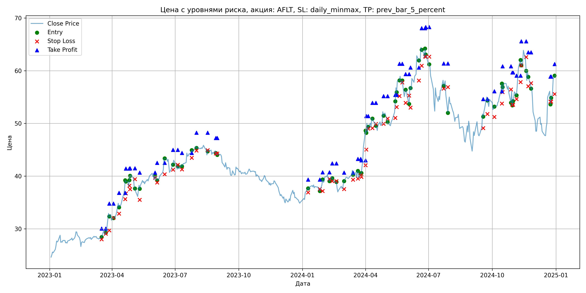
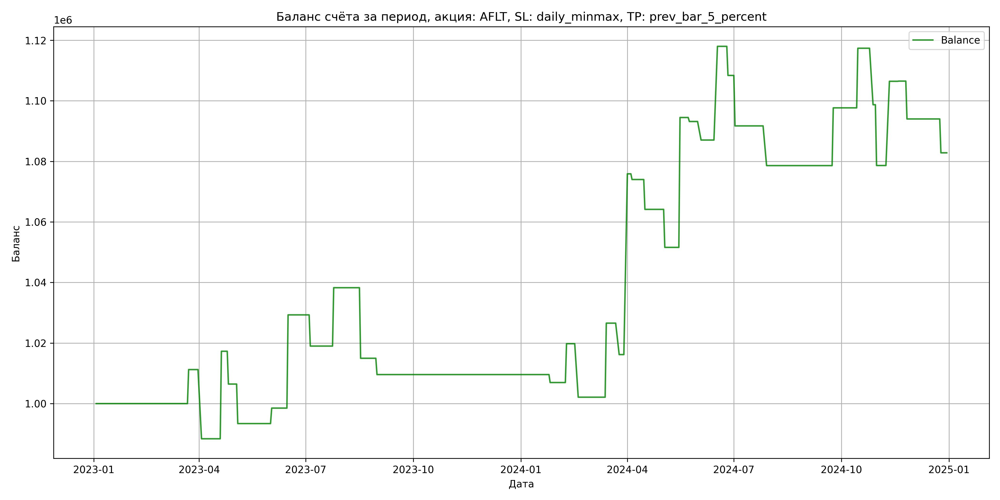

# Результаты торговой стратегии для AFLT

**Дата:** 2025-05-17 12:22:47  
**Стратегия:** AFLT,_SL_daily_minmax,_TP_prev_bar_5_percent

## Конфигурация

```json
{
    "TICKER": "AFLT",
    "EXCHANGE": "MOEX",
    "START_DATE": "2023-01-01",
    "END_DATE": "2024-12-31",
    "INTERVAL": "1d",
    "CAPITAL": 1000000,
    "RISK_PERCENT": 0.02,
    "PROFIT_TO_RISK": 3,
    "ATR_MULTIPLIER": 1.5,
    "ATR_WINDOW": 14,
    "STOP_LOSS_METHOD": "daily_minmax",
    "TAKE_PROFIT_METHOD": "prev_bar_5_percent",
    "POSITION": "long"
}
```

## Метрики эффективности

- **Начальный баланс:** 1000000.00
- **Конечный баланс:** 1082825.39
- **Прибыль/Убыток:** 82825.39 (8.28% за период тестирования)
- **Количество сделок:** 35
- **Процент выигрышных сделок:** 40.00% (14 выигрышных, 21 убыточных)
- **Средняя прибыль:** 23768.04
- **Средний убыток:** -11901.29
- **Максимальная прибыль:** 59695.68
- **Максимальный убыток:** -23302.82
- **Коэффициент прибыли:** 1.33
- **Максимальная просадка:** -3.52%

## Графики

### График цены с уровнями риска



### График баланса счёта



## Завершённые сделки

**Всего сделок:** 71

| Сделка № | Дата | Тип | Покупка / продажа | Количество акций | Цена | Stop Loss в момент сделки | Take Profit в момент сделки | Прибыль / убыток | Прибыль / убыток с учётом комиссии |
|:--------:|:----:|:---:|:-----------------:|:----------------:|:----:|:-------------------------:|:---------------------------:|:----------------:|:----------------------------------:|
| 1 | 2023-03-17 00:00:00 | LONG | BUY | 19045 | 28.29 | 28.03 | 30.05 | 0.00 | -269.39 |
| 2 | 2023-03-23 00:00:00 | LONG | SELL | -19045 | 28.88 | 29.07 | 30.05 | 11236.55 | 10692.15 |
| 3 | 2023-03-28 00:00:00 | LONG | BUY | 13054 | 33.25 | 29.72 | 34.79 | 0.00 | -217.02 |
| 4 | 2023-04-03 00:00:00 | LONG | SELL | -13054 | 31.50 | 32.09 | 34.79 | -22844.50 | -23267.12 |
| 5 | 2023-04-11 00:00:00 | LONG | BUY | 10507 | 34.96 | 32.89 | 36.82 | 0.00 | -183.66 |
| 6 | 2023-04-20 00:00:00 | LONG | SELL | -10507 | 37.71 | 35.63 | 36.82 | 28894.25 | 28512.48 |
| 7 | 2023-04-21 00:00:00 | LONG | BUY | 8880 | 39.20 | 36.72 | 41.44 | 0.00 | -174.05 |
| 8 | 2023-04-26 00:00:00 | LONG | SELL | -8880 | 37.98 | 38.19 | 41.44 | -10833.60 | -11176.28 |
| 9 | 2023-04-27 00:00:00 | LONG | BUY | 8418 | 39.07 | 37.52 | 41.48 | 0.00 | -164.45 |
| 10 | 2023-05-04 00:00:00 | LONG | SELL | -8418 | 37.52 | 39.44 | 41.48 | -13047.90 | -13370.27 |
| 11 | 2023-05-11 00:00:00 | LONG | BUY | 7000 | 38.49 | 35.51 | 40.68 | 0.00 | -134.72 |
| 12 | 2023-06-02 00:00:00 | LONG | SELL | -7000 | 39.22 | 39.72 | 40.68 | 5110.00 | 4838.01 |
| 13 | 2023-06-05 00:00:00 | LONG | BUY | 8976 | 40.07 | 38.80 | 42.53 | 0.00 | -179.83 |
| 14 | 2023-06-16 00:00:00 | LONG | SELL | -8976 | 43.50 | 40.36 | 42.53 | 30787.68 | 30412.62 |
| 15 | 2023-06-28 00:00:00 | LONG | BUY | 9282 | 42.51 | 41.23 | 44.98 | 0.00 | -197.29 |
| 16 | 2023-07-05 00:00:00 | LONG | SELL | -9282 | 41.40 | 42.15 | 44.98 | -10303.02 | -10692.45 |
| 17 | 2023-07-11 00:00:00 | LONG | BUY | 8454 | 42.12 | 41.28 | 44.40 | 0.00 | -178.04 |
| 18 | 2023-07-25 00:00:00 | LONG | SELL | -8454 | 44.40 | 43.47 | 44.40 | 19275.12 | 18909.40 |
| 19 | 2023-08-01 00:00:00 | LONG | BUY | 12074 | 45.82 | 44.85 | 48.23 | 0.00 | -276.62 |
| 20 | 2023-08-17 00:00:00 | LONG | SELL | -12074 | 43.89 | 44.92 | 48.23 | -23302.82 | -23844.40 |
| 21 | 2023-08-29 00:00:00 | LONG | BUY | 8682 | 44.80 | 44.29 | 47.24 | 0.00 | -194.48 |
| 22 | 2023-08-31 00:00:00 | LONG | SELL | -8682 | 44.18 | 44.29 | 47.24 | -5382.84 | -5769.10 |
| 23 | 2024-01-09 00:00:00 | LONG | BUY | 10956 | 37.60 | 36.90 | 39.36 | 0.00 | -205.97 |
| 24 | 2024-01-26 00:00:00 | LONG | SELL | -10956 | 37.36 | 37.55 | 39.36 | -2629.44 | -3040.07 |
| 25 | 2024-01-30 00:00:00 | LONG | BUY | 14579 | 38.32 | 37.17 | 40.72 | 0.00 | -279.33 |
| 26 | 2024-02-09 00:00:00 | LONG | SELL | -14579 | 39.20 | 39.47 | 40.72 | 12829.52 | 12264.44 |
| 27 | 2024-02-13 00:00:00 | LONG | BUY | 13091 | 39.96 | 39.05 | 42.41 | 0.00 | -261.56 |
| 28 | 2024-02-19 00:00:00 | LONG | SELL | -13091 | 38.61 | 39.05 | 42.41 | -17672.85 | -18187.13 |
| 29 | 2024-03-01 00:00:00 | LONG | BUY | 9860 | 38.56 | 37.55 | 40.66 | 0.00 | -190.10 |
| 30 | 2024-03-14 00:00:00 | LONG | SELL | -9860 | 41.04 | 39.33 | 40.66 | 24452.80 | 24060.37 |
| 31 | 2024-03-21 00:00:00 | LONG | BUY | 11665 | 40.79 | 39.52 | 43.27 | 0.00 | -237.91 |
| 32 | 2024-03-25 00:00:00 | LONG | SELL | -11665 | 39.90 | 40.16 | 43.27 | -10381.85 | -10852.47 |
| 33 | 2024-03-26 00:00:00 | LONG | BUY | 11306 | 40.50 | 39.86 | 42.99 | 0.00 | -228.95 |
| 34 | 2024-04-01 00:00:00 | LONG | SELL | -11306 | 45.78 | 42.07 | 42.99 | 59695.68 | 59207.94 |
| 35 | 2024-04-02 00:00:00 | LONG | BUY | 8524 | 48.65 | 45.04 | 51.40 | 0.00 | -207.35 |
| 36 | 2024-04-05 00:00:00 | LONG | SELL | -8524 | 48.43 | 49.00 | 51.40 | -1875.28 | -2289.03 |
| 37 | 2024-04-11 00:00:00 | LONG | BUY | 7199 | 51.23 | 49.12 | 53.91 | 0.00 | -184.40 |
| 38 | 2024-04-16 00:00:00 | LONG | SELL | -7199 | 49.86 | 49.90 | 53.91 | -9862.63 | -10226.50 |
| 39 | 2024-04-27 00:00:00 | LONG | BUY | 7943 | 52.18 | 49.94 | 55.17 | 0.00 | -207.23 |
| 40 | 2024-05-03 00:00:00 | LONG | SELL | -7943 | 50.60 | 50.92 | 55.17 | -12549.94 | -12958.13 |
| 41 | 2024-05-14 00:00:00 | LONG | BUY | 9087 | 52.20 | 51.05 | 55.41 | 0.00 | -237.17 |
| 42 | 2024-05-16 00:00:00 | LONG | SELL | -9087 | 56.92 | 53.11 | 55.41 | 42890.64 | 42394.85 |
| 43 | 2024-05-20 00:00:00 | LONG | BUY | 7338 | 58.00 | 55.21 | 61.30 | 0.00 | -212.80 |
| 44 | 2024-05-24 00:00:00 | LONG | SELL | -7338 | 57.82 | 57.76 | 61.30 | -1320.84 | -1745.78 |
| 45 | 2024-05-29 00:00:00 | LONG | BUY | 6124 | 56.00 | 53.90 | 59.35 | 0.00 | -171.47 |
| 46 | 2024-06-03 00:00:00 | LONG | SELL | -6124 | 55.00 | 55.27 | 59.35 | -6124.00 | -6463.88 |
| 47 | 2024-06-05 00:00:00 | LONG | BUY | 5254 | 57.00 | 52.99 | 60.61 | 0.00 | -149.74 |
| 48 | 2024-06-17 00:00:00 | LONG | SELL | -5254 | 62.89 | 58.13 | 60.61 | 30946.06 | 30631.11 |
| 49 | 2024-06-21 00:00:00 | LONG | BUY | 4711 | 64.69 | 60.95 | 68.07 | 0.00 | -152.38 |
| 50 | 2024-06-26 00:00:00 | LONG | SELL | -4711 | 62.65 | 62.69 | 68.07 | -9610.44 | -9910.39 |
| 51 | 2024-06-27 00:00:00 | LONG | BUY | 5191 | 64.35 | 62.65 | 68.26 | 0.00 | -167.02 |
| 52 | 2024-07-02 00:00:00 | LONG | SELL | -5191 | 61.14 | 62.65 | 68.26 | -16663.11 | -16988.82 |
| 53 | 2024-07-23 00:00:00 | LONG | BUY | 4299 | 58.22 | 56.61 | 61.37 | 0.00 | -125.14 |
| 54 | 2024-07-29 00:00:00 | LONG | SELL | -4299 | 55.17 | 56.90 | 61.37 | -13111.95 | -13355.68 |
| 55 | 2024-09-18 00:00:00 | LONG | BUY | 5449 | 51.70 | 49.10 | 54.63 | 0.00 | -140.86 |
| 56 | 2024-09-24 00:00:00 | LONG | SELL | -5449 | 55.20 | 51.77 | 54.63 | 19071.50 | 18780.25 |
| 57 | 2024-10-04 00:00:00 | LONG | BUY | 6371 | 53.20 | 51.22 | 56.11 | 0.00 | -169.47 |
| 58 | 2024-10-15 00:00:00 | LONG | SELL | -6371 | 56.29 | 53.78 | 56.11 | 19686.39 | 19337.61 |
| 59 | 2024-10-16 00:00:00 | LONG | BUY | 7314 | 57.55 | 55.94 | 60.83 | 0.00 | -210.46 |
| 60 | 2024-10-28 00:00:00 | LONG | SELL | -7314 | 55.00 | 56.45 | 60.83 | -18650.70 | -19062.30 |
| 61 | 2024-10-30 00:00:00 | LONG | BUY | 6671 | 56.35 | 53.53 | 59.66 | 0.00 | -187.96 |
| 62 | 2024-10-31 00:00:00 | LONG | SELL | -6671 | 53.34 | 53.53 | 59.66 | -20079.71 | -20445.58 |
| 63 | 2024-11-05 00:00:00 | LONG | BUY | 5329 | 56.03 | 54.62 | 59.07 | 0.00 | -149.29 |
| 64 | 2024-11-11 00:00:00 | LONG | SELL | -5329 | 61.25 | 57.84 | 59.07 | 27817.38 | 27504.89 |
| 65 | 2024-11-12 00:00:00 | LONG | BUY | 5894 | 61.99 | 61.01 | 65.56 | 0.00 | -182.68 |
| 66 | 2024-11-19 00:00:00 | LONG | SELL | -5894 | 62.00 | 62.58 | 65.56 | 58.94 | -306.46 |
| 67 | 2024-11-22 00:00:00 | LONG | BUY | 5506 | 59.60 | 57.06 | 63.48 | 0.00 | -164.08 |
| 68 | 2024-11-26 00:00:00 | LONG | SELL | -5506 | 57.33 | 57.64 | 63.48 | -12498.62 | -12820.53 |
| 69 | 2024-12-24 00:00:00 | LONG | BUY | 4402 | 56.10 | 54.15 | 58.87 | 0.00 | -123.48 |
| 70 | 2024-12-25 00:00:00 | LONG | SELL | -4402 | 53.56 | 54.15 | 58.87 | -11181.08 | -11422.44 |
| 71 | 2024-12-30 00:00:00 | LONG | BUY | 5306 | 59.04 | 55.58 | 61.27 | 0.00 | -156.63 |
