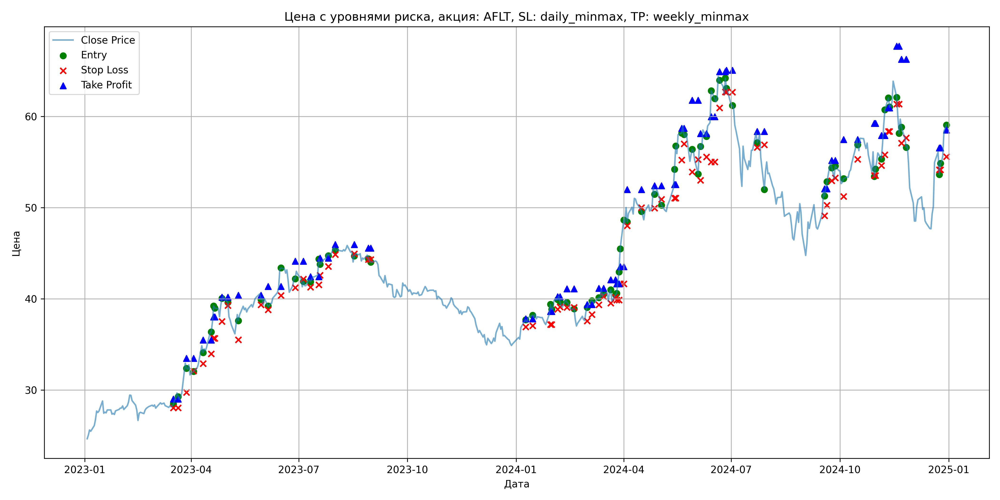
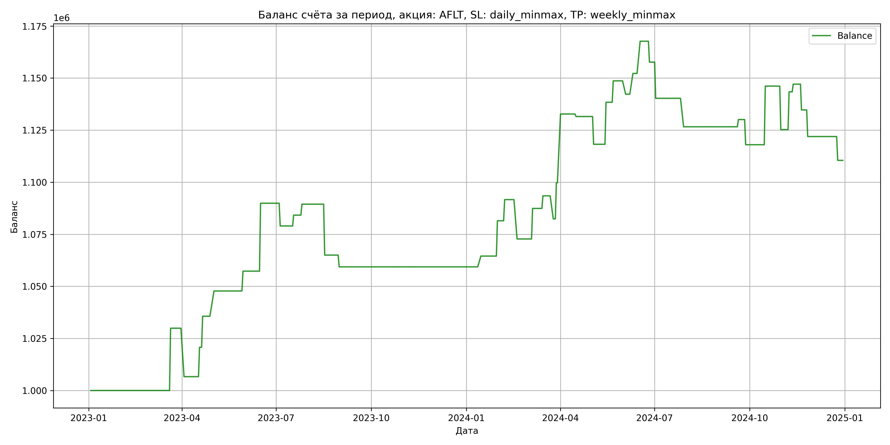

# Результаты торговой стратегии для AFLT

**Дата:** 2025-05-17 12:22:48  
**Стратегия:** AFLT,_SL_daily_minmax,_TP_weekly_minmax

## Конфигурация

```json
{
    "TICKER": "AFLT",
    "EXCHANGE": "MOEX",
    "START_DATE": "2023-01-01",
    "END_DATE": "2024-12-31",
    "INTERVAL": "1d",
    "CAPITAL": 1000000,
    "RISK_PERCENT": 0.02,
    "PROFIT_TO_RISK": 3,
    "ATR_MULTIPLIER": 1.5,
    "ATR_WINDOW": 14,
    "STOP_LOSS_METHOD": "daily_minmax",
    "TAKE_PROFIT_METHOD": "weekly_minmax",
    "POSITION": "long"
}
```

## Метрики эффективности

- **Начальный баланс:** 1000000.00
- **Конечный баланс:** 1110482.16
- **Прибыль/Убыток:** 110482.16 (11.05% за период тестирования)
- **Количество сделок:** 40
- **Процент выигрышных сделок:** 57.50% (23 выигрышных, 17 убыточных)
- **Средняя прибыль:** 14621.41
- **Средний убыток:** -13282.96
- **Максимальная прибыль:** 33010.92
- **Максимальный убыток:** -24439.59
- **Коэффициент прибыли:** 1.49
- **Максимальная просадка:** -4.90%

## Графики

### График цены с уровнями риска



### График баланса счёта



## Завершённые сделки

**Всего сделок:** 81

| Сделка № | Дата | Тип | Покупка / продажа | Количество акций | Цена | Stop Loss в момент сделки | Take Profit в момент сделки | Прибыль / убыток | Прибыль / убыток с учётом комиссии |
|:--------:|:----:|:---:|:-----------------:|:----------------:|:----:|:-------------------------:|:---------------------------:|:----------------:|:----------------------------------:|
| 1 | 2023-03-17 00:00:00 | LONG | BUY | 19045 | 28.29 | 28.03 | 29.00 | 0.00 | -269.39 |
| 2 | 2023-03-21 00:00:00 | LONG | SELL | -19045 | 29.86 | 28.03 | 29.00 | 29900.65 | 29346.92 |
| 3 | 2023-03-28 00:00:00 | LONG | BUY | 13295 | 33.25 | 29.72 | 33.46 | 0.00 | -221.03 |
| 4 | 2023-04-03 00:00:00 | LONG | SELL | -13295 | 31.50 | 32.09 | 33.46 | -23266.25 | -23696.68 |
| 5 | 2023-04-11 00:00:00 | LONG | BUY | 10701 | 34.96 | 32.89 | 35.47 | 0.00 | -187.05 |
| 6 | 2023-04-18 00:00:00 | LONG | SELL | -10701 | 36.28 | 33.96 | 35.47 | 14125.32 | 13744.15 |
| 7 | 2023-04-20 00:00:00 | LONG | BUY | 9989 | 37.71 | 35.65 | 38.01 | 0.00 | -188.34 |
| 8 | 2023-04-21 00:00:00 | LONG | SELL | -9989 | 39.20 | 35.65 | 38.01 | 14883.61 | 14499.48 |
| 9 | 2023-04-27 00:00:00 | LONG | BUY | 8662 | 39.07 | 37.52 | 40.18 | 0.00 | -169.21 |
| 10 | 2023-05-02 00:00:00 | LONG | SELL | -8662 | 40.47 | 39.25 | 40.18 | 12126.80 | 11782.31 |
| 11 | 2023-05-11 00:00:00 | LONG | BUY | 7384 | 38.49 | 35.51 | 40.38 | 0.00 | -142.11 |
| 12 | 2023-05-30 00:00:00 | LONG | SELL | -7384 | 39.78 | 39.35 | 40.38 | 9525.36 | 9236.39 |
| 13 | 2023-06-05 00:00:00 | LONG | BUY | 9505 | 40.07 | 38.80 | 41.36 | 0.00 | -190.43 |
| 14 | 2023-06-16 00:00:00 | LONG | SELL | -9505 | 43.50 | 40.36 | 41.36 | 32602.15 | 32204.98 |
| 15 | 2023-06-28 00:00:00 | LONG | BUY | 9829 | 42.51 | 41.23 | 44.12 | 0.00 | -208.92 |
| 16 | 2023-07-05 00:00:00 | LONG | SELL | -9829 | 41.40 | 42.15 | 44.12 | -10910.19 | -11322.57 |
| 17 | 2023-07-11 00:00:00 | LONG | BUY | 8952 | 42.12 | 41.28 | 42.42 | 0.00 | -188.53 |
| 18 | 2023-07-18 00:00:00 | LONG | SELL | -8952 | 42.70 | 41.54 | 42.42 | 5192.16 | 4812.51 |
| 19 | 2023-07-19 00:00:00 | LONG | BUY | 11455 | 44.48 | 42.57 | 44.46 | 0.00 | -254.76 |
| 20 | 2023-07-26 00:00:00 | LONG | SELL | -11455 | 44.94 | 43.53 | 44.46 | 5269.30 | 4757.15 |
| 21 | 2023-08-01 00:00:00 | LONG | BUY | 12663 | 45.82 | 44.85 | 45.94 | 0.00 | -290.11 |
| 22 | 2023-08-17 00:00:00 | LONG | SELL | -12663 | 43.89 | 44.92 | 45.94 | -24439.59 | -25007.59 |
| 23 | 2023-08-29 00:00:00 | LONG | BUY | 9106 | 44.80 | 44.29 | 45.55 | 0.00 | -203.97 |
| 24 | 2023-08-31 00:00:00 | LONG | SELL | -9106 | 44.18 | 44.29 | 45.55 | -5645.72 | -6050.85 |
| 25 | 2024-01-09 00:00:00 | LONG | BUY | 11490 | 37.60 | 36.90 | 37.81 | 0.00 | -216.01 |
| 26 | 2024-01-15 00:00:00 | LONG | SELL | -11490 | 38.05 | 37.04 | 37.81 | 5170.50 | 4735.89 |
| 27 | 2024-01-30 00:00:00 | LONG | BUY | 15406 | 38.32 | 37.17 | 38.62 | 0.00 | -295.18 |
| 28 | 2024-01-31 00:00:00 | LONG | SELL | -15406 | 39.42 | 37.17 | 38.62 | 16946.60 | 16347.77 |
| 29 | 2024-02-05 00:00:00 | LONG | BUY | 14736 | 39.81 | 38.84 | 40.22 | 0.00 | -293.32 |
| 30 | 2024-02-07 00:00:00 | LONG | SELL | -14736 | 40.50 | 39.11 | 40.22 | 10167.84 | 9576.12 |
| 31 | 2024-02-13 00:00:00 | LONG | BUY | 14000 | 39.96 | 39.05 | 41.09 | 0.00 | -279.72 |
| 32 | 2024-02-19 00:00:00 | LONG | SELL | -14000 | 38.61 | 39.05 | 41.09 | -18900.00 | -19449.99 |
| 33 | 2024-03-01 00:00:00 | LONG | BUY | 10546 | 38.56 | 37.55 | 39.37 | 0.00 | -203.33 |
| 34 | 2024-03-05 00:00:00 | LONG | SELL | -10546 | 39.95 | 38.28 | 39.37 | 14658.94 | 14244.96 |
| 35 | 2024-03-11 00:00:00 | LONG | BUY | 13430 | 39.67 | 39.35 | 41.14 | 0.00 | -266.38 |
| 36 | 2024-03-15 00:00:00 | LONG | SELL | -13430 | 40.12 | 40.26 | 41.14 | 6043.50 | 5507.71 |
| 37 | 2024-03-21 00:00:00 | LONG | BUY | 12407 | 40.79 | 39.52 | 42.09 | 0.00 | -253.04 |
| 38 | 2024-03-25 00:00:00 | LONG | SELL | -12407 | 39.90 | 40.16 | 42.09 | -11042.23 | -11542.79 |
| 39 | 2024-03-26 00:00:00 | LONG | BUY | 12026 | 40.50 | 39.86 | 41.65 | 0.00 | -243.53 |
| 40 | 2024-03-28 00:00:00 | LONG | SELL | -12026 | 41.94 | 39.86 | 41.65 | 17317.44 | 16821.73 |
| 41 | 2024-03-29 00:00:00 | LONG | BUY | 11706 | 42.96 | 41.64 | 43.53 | 0.00 | -251.44 |
| 42 | 2024-04-01 00:00:00 | LONG | SELL | -11706 | 45.78 | 41.64 | 43.53 | 33010.92 | 32491.52 |
| 43 | 2024-04-04 00:00:00 | LONG | BUY | 8003 | 50.01 | 48.00 | 51.98 | 0.00 | -200.12 |
| 44 | 2024-04-16 00:00:00 | LONG | SELL | -8003 | 49.86 | 49.99 | 51.98 | -1200.45 | -1600.08 |
| 45 | 2024-04-27 00:00:00 | LONG | BUY | 8434 | 52.18 | 49.94 | 52.40 | 0.00 | -220.04 |
| 46 | 2024-05-03 00:00:00 | LONG | SELL | -8434 | 50.60 | 50.92 | 52.40 | -13325.72 | -13759.14 |
| 47 | 2024-05-14 00:00:00 | LONG | BUY | 9649 | 52.20 | 51.05 | 52.52 | 0.00 | -251.84 |
| 48 | 2024-05-15 00:00:00 | LONG | SELL | -9649 | 54.29 | 51.05 | 52.52 | 20166.41 | 19652.65 |
| 49 | 2024-05-20 00:00:00 | LONG | BUY | 7620 | 58.00 | 55.21 | 58.68 | 0.00 | -220.98 |
| 50 | 2024-05-22 00:00:00 | LONG | SELL | -7620 | 59.35 | 57.01 | 58.68 | 10287.00 | 9839.90 |
| 51 | 2024-05-29 00:00:00 | LONG | BUY | 6425 | 56.00 | 53.90 | 61.78 | 0.00 | -179.90 |
| 52 | 2024-06-03 00:00:00 | LONG | SELL | -6425 | 55.00 | 55.27 | 61.78 | -6425.00 | -6781.59 |
| 53 | 2024-06-05 00:00:00 | LONG | BUY | 5513 | 57.00 | 52.99 | 58.11 | 0.00 | -157.12 |
| 54 | 2024-06-10 00:00:00 | LONG | SELL | -5513 | 58.81 | 55.57 | 58.11 | 9978.53 | 9659.30 |
| 55 | 2024-06-14 00:00:00 | LONG | BUY | 5119 | 59.87 | 55.00 | 59.97 | 0.00 | -153.24 |
| 56 | 2024-06-17 00:00:00 | LONG | SELL | -5119 | 62.89 | 55.00 | 59.97 | 15459.38 | 15145.18 |
| 57 | 2024-06-21 00:00:00 | LONG | BUY | 4912 | 64.69 | 60.95 | 64.90 | 0.00 | -158.88 |
| 58 | 2024-06-26 00:00:00 | LONG | SELL | -4912 | 62.65 | 62.69 | 64.90 | -10020.48 | -10333.23 |
| 59 | 2024-06-27 00:00:00 | LONG | BUY | 5412 | 64.35 | 62.65 | 65.07 | 0.00 | -174.13 |
| 60 | 2024-07-02 00:00:00 | LONG | SELL | -5412 | 61.14 | 62.65 | 65.07 | -17372.52 | -17712.10 |
| 61 | 2024-07-23 00:00:00 | LONG | BUY | 4482 | 58.22 | 56.61 | 58.35 | 0.00 | -130.47 |
| 62 | 2024-07-29 00:00:00 | LONG | SELL | -4482 | 55.17 | 56.90 | 58.35 | -13670.10 | -13924.21 |
| 63 | 2024-09-18 00:00:00 | LONG | BUY | 5681 | 51.70 | 49.10 | 52.05 | 0.00 | -146.85 |
| 64 | 2024-09-20 00:00:00 | LONG | SELL | -5681 | 52.31 | 50.24 | 52.05 | 3465.41 | 3169.97 |
| 65 | 2024-09-24 00:00:00 | LONG | BUY | 6074 | 55.20 | 52.95 | 55.17 | 0.00 | -167.64 |
| 66 | 2024-09-27 00:00:00 | LONG | SELL | -6074 | 53.21 | 53.26 | 55.17 | -12087.26 | -12416.50 |
| 67 | 2024-10-04 00:00:00 | LONG | BUY | 6473 | 53.20 | 51.22 | 57.47 | 0.00 | -172.18 |
| 68 | 2024-10-16 00:00:00 | LONG | SELL | -6473 | 57.55 | 55.30 | 57.47 | 28157.55 | 27799.11 |
| 69 | 2024-10-30 00:00:00 | LONG | BUY | 6947 | 56.35 | 53.53 | 59.24 | 0.00 | -195.73 |
| 70 | 2024-10-31 00:00:00 | LONG | SELL | -6947 | 53.34 | 53.53 | 59.24 | -20910.47 | -21291.48 |
| 71 | 2024-11-05 00:00:00 | LONG | BUY | 5549 | 56.03 | 54.62 | 57.91 | 0.00 | -155.46 |
| 72 | 2024-11-08 00:00:00 | LONG | SELL | -5549 | 59.30 | 55.79 | 57.91 | 18145.23 | 17825.25 |
| 73 | 2024-11-11 00:00:00 | LONG | BUY | 4989 | 61.25 | 58.34 | 60.93 | 0.00 | -152.79 |
| 74 | 2024-11-12 00:00:00 | LONG | SELL | -4989 | 61.99 | 58.34 | 60.93 | 3691.86 | 3384.44 |
| 75 | 2024-11-18 00:00:00 | LONG | BUY | 6475 | 62.05 | 61.35 | 67.69 | 0.00 | -200.89 |
| 76 | 2024-11-20 00:00:00 | LONG | SELL | -6475 | 60.14 | 61.35 | 67.69 | -12367.25 | -12762.84 |
| 77 | 2024-11-22 00:00:00 | LONG | BUY | 5633 | 59.60 | 57.06 | 66.28 | 0.00 | -167.86 |
| 78 | 2024-11-26 00:00:00 | LONG | SELL | -5633 | 57.33 | 57.64 | 66.28 | -12786.91 | -13116.24 |
| 79 | 2024-12-24 00:00:00 | LONG | BUY | 4504 | 56.10 | 54.15 | 56.56 | 0.00 | -126.34 |
| 80 | 2024-12-25 00:00:00 | LONG | SELL | -4504 | 53.56 | 54.15 | 56.56 | -11440.16 | -11687.11 |
| 81 | 2024-12-30 00:00:00 | LONG | BUY | 5429 | 59.04 | 55.58 | 58.50 | 0.00 | -160.26 |
