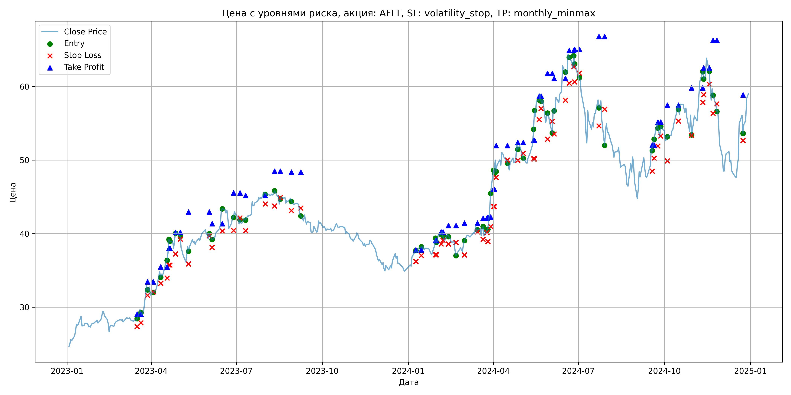

# Результаты торговой стратегии для AFLT

**Дата:** 2025-05-17 12:22:53  
**Стратегия:** AFLT,_SL_volatility_stop,_TP_monthly_minmax

## Конфигурация

```json
{
    "TICKER": "AFLT",
    "EXCHANGE": "MOEX",
    "START_DATE": "2023-01-01",
    "END_DATE": "2024-12-31",
    "INTERVAL": "1d",
    "CAPITAL": 1000000,
    "RISK_PERCENT": 0.02,
    "PROFIT_TO_RISK": 3,
    "ATR_MULTIPLIER": 1.5,
    "ATR_WINDOW": 14,
    "STOP_LOSS_METHOD": "volatility_stop",
    "TAKE_PROFIT_METHOD": "monthly_minmax",
    "POSITION": "long"
}
```

## Метрики эффективности

- **Начальный баланс:** 1000000.00
- **Конечный баланс:** 1174972.13
- **Прибыль/Убыток:** 174972.13 (17.50% за период тестирования)
- **Количество сделок:** 34
- **Процент выигрышных сделок:** 58.82% (20 выигрышных, 14 убыточных)
- **Средняя прибыль:** 18965.28
- **Средний убыток:** -14595.25
- **Максимальная прибыль:** 34309.80
- **Максимальный убыток:** -31348.62
- **Коэффициент прибыли:** 1.86
- **Максимальная просадка:** -4.26%

## Графики

### График цены с уровнями риска



### График баланса счёта


## Завершённые сделки

**Всего сделок:** 69

| Сделка № | Дата | Тип | Покупка / продажа | Количество акций | Цена | Stop Loss в момент сделки | Take Profit в момент сделки | Прибыль / убыток | Прибыль / убыток с учётом комиссии |
|:--------:|:----:|:---:|:-----------------:|:----------------:|:----:|:-------------------------:|:---------------------------:|:----------------:|:----------------------------------:|
| 1 | 2023-03-17 00:00:00 | LONG | BUY | 19045 | 28.29 | 27.38 | 29.07 | 0.00 | -269.39 |
| 2 | 2023-03-21 00:00:00 | LONG | SELL | -19045 | 29.86 | 27.88 | 29.07 | 29900.65 | 29346.92 |
| 3 | 2023-03-28 00:00:00 | LONG | BUY | 13295 | 33.25 | 31.62 | 33.46 | 0.00 | -221.03 |
| 4 | 2023-04-03 00:00:00 | LONG | SELL | -13295 | 31.50 | 32.09 | 33.46 | -23266.25 | -23696.68 |
| 5 | 2023-04-11 00:00:00 | LONG | BUY | 10701 | 34.96 | 33.26 | 35.47 | 0.00 | -187.05 |
| 6 | 2023-04-18 00:00:00 | LONG | SELL | -10701 | 36.28 | 33.96 | 35.47 | 14125.32 | 13744.15 |
| 7 | 2023-04-20 00:00:00 | LONG | BUY | 9989 | 37.71 | 35.74 | 38.01 | 0.00 | -188.34 |
| 8 | 2023-04-21 00:00:00 | LONG | SELL | -9989 | 39.20 | 35.74 | 38.01 | 14883.61 | 14499.48 |
| 9 | 2023-04-27 00:00:00 | LONG | BUY | 8662 | 39.07 | 37.24 | 40.18 | 0.00 | -169.21 |
| 10 | 2023-05-02 00:00:00 | LONG | SELL | -8662 | 40.47 | 39.25 | 40.18 | 12126.80 | 11782.31 |
| 11 | 2023-05-11 00:00:00 | LONG | BUY | 7384 | 38.49 | 35.88 | 42.94 | 0.00 | -142.11 |
| 12 | 2023-06-02 00:00:00 | LONG | SELL | -7384 | 39.22 | 39.72 | 42.94 | 5390.32 | 5103.41 |
| 13 | 2023-06-05 00:00:00 | LONG | BUY | 9468 | 40.07 | 38.14 | 41.36 | 0.00 | -189.69 |
| 14 | 2023-06-16 00:00:00 | LONG | SELL | -9468 | 43.50 | 40.36 | 41.36 | 32475.24 | 32079.62 |
| 15 | 2023-06-28 00:00:00 | LONG | BUY | 9790 | 42.51 | 40.44 | 45.54 | 0.00 | -208.09 |
| 16 | 2023-07-05 00:00:00 | LONG | SELL | -9790 | 41.40 | 42.15 | 45.54 | -10866.90 | -11277.64 |
| 17 | 2023-07-11 00:00:00 | LONG | BUY | 8916 | 42.12 | 40.41 | 45.20 | 0.00 | -187.77 |
| 18 | 2023-08-01 00:00:00 | LONG | SELL | -8916 | 45.82 | 44.03 | 45.20 | 32989.20 | 32597.16 |
| 19 | 2023-08-11 00:00:00 | LONG | BUY | 10914 | 45.66 | 43.77 | 48.49 | 0.00 | -249.17 |
| 20 | 2023-08-17 00:00:00 | LONG | SELL | -10914 | 43.89 | 44.92 | 48.49 | -19317.78 | -19806.45 |
| 21 | 2023-08-29 00:00:00 | LONG | BUY | 9312 | 44.80 | 43.15 | 48.36 | 0.00 | -208.59 |
| 22 | 2023-09-08 00:00:00 | LONG | SELL | -9312 | 42.59 | 43.49 | 48.36 | -20579.52 | -20986.41 |
| 23 | 2024-01-09 00:00:00 | LONG | BUY | 11589 | 37.60 | 36.22 | 37.81 | 0.00 | -217.87 |
| 24 | 2024-01-15 00:00:00 | LONG | SELL | -11589 | 38.05 | 37.04 | 37.81 | 5215.05 | 4776.70 |
| 25 | 2024-01-30 00:00:00 | LONG | BUY | 15539 | 38.32 | 37.15 | 39.06 | 0.00 | -297.73 |
| 26 | 2024-01-31 00:00:00 | LONG | SELL | -15539 | 39.42 | 37.15 | 39.06 | 17092.90 | 16488.90 |
| 27 | 2024-02-05 00:00:00 | LONG | BUY | 14863 | 39.81 | 38.58 | 40.22 | 0.00 | -295.85 |
| 28 | 2024-02-07 00:00:00 | LONG | SELL | -14863 | 40.50 | 39.11 | 40.22 | 10255.47 | 9658.65 |
| 29 | 2024-02-13 00:00:00 | LONG | BUY | 14121 | 39.96 | 38.59 | 41.09 | 0.00 | -282.14 |
| 30 | 2024-02-21 00:00:00 | LONG | SELL | -14121 | 37.74 | 38.81 | 41.09 | -31348.62 | -31897.22 |
| 31 | 2024-03-01 00:00:00 | LONG | BUY | 10515 | 38.56 | 37.13 | 41.44 | 0.00 | -202.73 |
| 32 | 2024-03-15 00:00:00 | LONG | SELL | -10515 | 40.12 | 40.26 | 41.44 | 16403.40 | 15989.74 |
| 33 | 2024-03-21 00:00:00 | LONG | BUY | 12329 | 40.79 | 39.23 | 42.11 | 0.00 | -251.45 |
| 34 | 2024-03-25 00:00:00 | LONG | SELL | -12329 | 39.90 | 40.16 | 42.11 | -10972.81 | -11470.22 |
| 35 | 2024-03-26 00:00:00 | LONG | BUY | 11950 | 40.50 | 38.93 | 42.26 | 0.00 | -241.99 |
| 36 | 2024-03-29 00:00:00 | LONG | SELL | -11950 | 42.96 | 40.97 | 42.26 | 29397.00 | 28898.33 |
| 37 | 2024-04-01 00:00:00 | LONG | BUY | 10268 | 45.78 | 43.69 | 46.05 | 0.00 | -235.03 |
| 38 | 2024-04-02 00:00:00 | LONG | SELL | -10268 | 48.65 | 43.69 | 46.05 | 29469.16 | 28984.36 |
| 39 | 2024-04-04 00:00:00 | LONG | BUY | 8015 | 50.01 | 47.64 | 51.98 | 0.00 | -200.42 |
| 40 | 2024-04-16 00:00:00 | LONG | SELL | -8015 | 49.86 | 49.99 | 51.98 | -1202.25 | -1602.48 |
| 41 | 2024-04-27 00:00:00 | LONG | BUY | 8447 | 52.18 | 49.97 | 52.40 | 0.00 | -220.38 |
| 42 | 2024-05-03 00:00:00 | LONG | SELL | -8447 | 50.60 | 50.92 | 52.40 | -13346.26 | -13780.35 |
| 43 | 2024-05-14 00:00:00 | LONG | BUY | 9664 | 52.20 | 50.18 | 52.70 | 0.00 | -252.23 |
| 44 | 2024-05-15 00:00:00 | LONG | SELL | -9664 | 54.29 | 50.18 | 52.70 | 20197.76 | 19683.20 |
| 45 | 2024-05-20 00:00:00 | LONG | BUY | 7632 | 58.00 | 55.51 | 58.68 | 0.00 | -221.33 |
| 46 | 2024-05-22 00:00:00 | LONG | SELL | -7632 | 59.35 | 57.01 | 58.68 | 10303.20 | 9855.39 |
| 47 | 2024-05-29 00:00:00 | LONG | BUY | 6435 | 56.00 | 52.85 | 61.78 | 0.00 | -180.18 |
| 48 | 2024-06-03 00:00:00 | LONG | SELL | -6435 | 55.00 | 55.27 | 61.78 | -6435.00 | -6792.14 |
| 49 | 2024-06-05 00:00:00 | LONG | BUY | 5521 | 57.00 | 53.56 | 61.10 | 0.00 | -157.35 |
| 50 | 2024-06-17 00:00:00 | LONG | SELL | -5521 | 62.89 | 58.13 | 61.10 | 32518.69 | 32187.73 |
| 51 | 2024-06-21 00:00:00 | LONG | BUY | 4951 | 64.69 | 60.45 | 64.90 | 0.00 | -160.14 |
| 52 | 2024-06-26 00:00:00 | LONG | SELL | -4951 | 62.65 | 62.69 | 64.90 | -10100.04 | -10415.27 |
| 53 | 2024-06-27 00:00:00 | LONG | BUY | 5455 | 64.35 | 60.65 | 65.07 | 0.00 | -175.51 |
| 54 | 2024-07-02 00:00:00 | LONG | SELL | -5455 | 61.14 | 61.81 | 65.07 | -17510.55 | -17852.82 |
| 55 | 2024-07-23 00:00:00 | LONG | BUY | 4518 | 58.22 | 54.65 | 66.79 | 0.00 | -131.52 |
| 56 | 2024-07-29 00:00:00 | LONG | SELL | -4518 | 55.17 | 56.90 | 66.79 | -13779.90 | -14036.05 |
| 57 | 2024-09-18 00:00:00 | LONG | BUY | 5726 | 51.70 | 48.49 | 52.05 | 0.00 | -148.02 |
| 58 | 2024-09-20 00:00:00 | LONG | SELL | -5726 | 52.31 | 50.24 | 52.05 | 3492.86 | 3195.08 |
| 59 | 2024-09-24 00:00:00 | LONG | BUY | 6122 | 55.20 | 51.91 | 55.17 | 0.00 | -168.97 |
| 60 | 2024-09-27 00:00:00 | LONG | SELL | -6122 | 53.21 | 53.26 | 55.17 | -12182.78 | -12514.62 |
| 61 | 2024-10-04 00:00:00 | LONG | BUY | 6524 | 53.20 | 49.90 | 57.47 | 0.00 | -173.54 |
| 62 | 2024-10-16 00:00:00 | LONG | SELL | -6524 | 57.55 | 55.30 | 57.47 | 28379.40 | 28018.13 |
| 63 | 2024-10-30 00:00:00 | LONG | BUY | 7002 | 56.35 | 53.37 | 59.81 | 0.00 | -197.28 |
| 64 | 2024-11-11 00:00:00 | LONG | SELL | -7002 | 61.25 | 57.84 | 59.81 | 34309.80 | 33898.08 |
| 65 | 2024-11-12 00:00:00 | LONG | BUY | 6329 | 61.99 | 58.91 | 62.54 | 0.00 | -196.17 |
| 66 | 2024-11-18 00:00:00 | LONG | SELL | -6329 | 62.05 | 60.30 | 62.54 | 379.74 | -12.78 |
| 67 | 2024-11-22 00:00:00 | LONG | BUY | 5914 | 59.60 | 56.36 | 66.28 | 0.00 | -176.24 |
| 68 | 2024-11-26 00:00:00 | LONG | SELL | -5914 | 57.33 | 57.64 | 66.28 | -13424.78 | -13770.54 |
| 69 | 2024-12-24 00:00:00 | LONG | BUY | 4728 | 56.10 | 52.65 | 58.86 | 0.00 | -132.62 |
