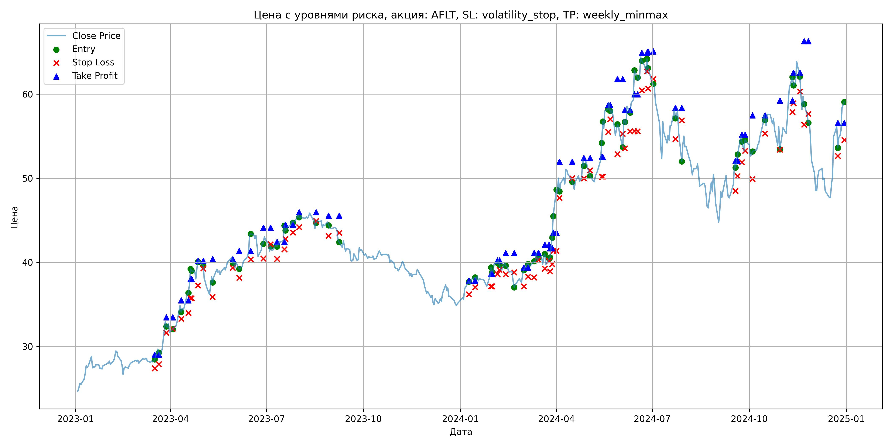
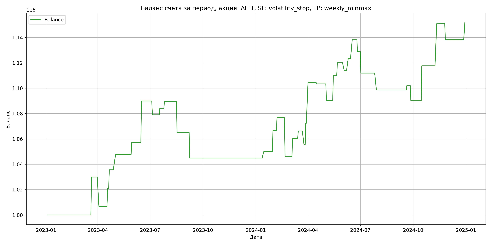

# Результаты торговой стратегии для AFLT

**Дата:** 2025-05-17 12:22:52  
**Стратегия:** AFLT,_SL_volatility_stop,_TP_weekly_minmax

## Конфигурация

```json
{
    "TICKER": "AFLT",
    "EXCHANGE": "MOEX",
    "START_DATE": "2023-01-01",
    "END_DATE": "2024-12-31",
    "INTERVAL": "1d",
    "CAPITAL": 1000000,
    "RISK_PERCENT": 0.02,
    "PROFIT_TO_RISK": 3,
    "ATR_MULTIPLIER": 1.5,
    "ATR_WINDOW": 14,
    "STOP_LOSS_METHOD": "volatility_stop",
    "TAKE_PROFIT_METHOD": "weekly_minmax",
    "POSITION": "long"
}
```

## Метрики эффективности

- **Начальный баланс:** 1000000.00
- **Конечный баланс:** 1151652.43
- **Прибыль/Убыток:** 151652.43 (15.17% за период тестирования)
- **Количество сделок:** 38
- **Процент выигрышных сделок:** 63.16% (24 выигрышных, 14 убыточных)
- **Средняя прибыль:** 14876.92
- **Средний убыток:** -14670.97
- **Максимальная прибыль:** 33187.70
- **Максимальный убыток:** -30653.76
- **Коэффициент прибыли:** 1.74
- **Максимальная просадка:** -4.25%

## Графики

### График цены с уровнями риска



### График баланса счёта



## Завершённые сделки

**Всего сделок:** 76

| Сделка № | Дата | Тип | Покупка / продажа | Количество акций | Цена | Stop Loss в момент сделки | Take Profit в момент сделки | Прибыль / убыток | Прибыль / убыток с учётом комиссии |
|:--------:|:----:|:---:|:-----------------:|:----------------:|:----:|:-------------------------:|:---------------------------:|:----------------:|:----------------------------------:|
| 1 | 2023-03-17 00:00:00 | LONG | BUY | 19045 | 28.29 | 27.38 | 29.00 | 0.00 | -269.39 |
| 2 | 2023-03-21 00:00:00 | LONG | SELL | -19045 | 29.86 | 27.88 | 29.00 | 29900.65 | 29346.92 |
| 3 | 2023-03-28 00:00:00 | LONG | BUY | 13295 | 33.25 | 31.62 | 33.46 | 0.00 | -221.03 |
| 4 | 2023-04-03 00:00:00 | LONG | SELL | -13295 | 31.50 | 32.09 | 33.46 | -23266.25 | -23696.68 |
| 5 | 2023-04-11 00:00:00 | LONG | BUY | 10701 | 34.96 | 33.26 | 35.47 | 0.00 | -187.05 |
| 6 | 2023-04-18 00:00:00 | LONG | SELL | -10701 | 36.28 | 33.96 | 35.47 | 14125.32 | 13744.15 |
| 7 | 2023-04-20 00:00:00 | LONG | BUY | 9989 | 37.71 | 35.74 | 38.01 | 0.00 | -188.34 |
| 8 | 2023-04-21 00:00:00 | LONG | SELL | -9989 | 39.20 | 35.74 | 38.01 | 14883.61 | 14499.48 |
| 9 | 2023-04-27 00:00:00 | LONG | BUY | 8662 | 39.07 | 37.24 | 40.18 | 0.00 | -169.21 |
| 10 | 2023-05-02 00:00:00 | LONG | SELL | -8662 | 40.47 | 39.25 | 40.18 | 12126.80 | 11782.31 |
| 11 | 2023-05-11 00:00:00 | LONG | BUY | 7384 | 38.49 | 35.88 | 40.38 | 0.00 | -142.11 |
| 12 | 2023-05-30 00:00:00 | LONG | SELL | -7384 | 39.78 | 39.35 | 40.38 | 9525.36 | 9236.39 |
| 13 | 2023-06-05 00:00:00 | LONG | BUY | 9505 | 40.07 | 38.14 | 41.36 | 0.00 | -190.43 |
| 14 | 2023-06-16 00:00:00 | LONG | SELL | -9505 | 43.50 | 40.36 | 41.36 | 32602.15 | 32204.98 |
| 15 | 2023-06-28 00:00:00 | LONG | BUY | 9829 | 42.51 | 40.44 | 44.12 | 0.00 | -208.92 |
| 16 | 2023-07-05 00:00:00 | LONG | SELL | -9829 | 41.40 | 42.15 | 44.12 | -10910.19 | -11322.57 |
| 17 | 2023-07-11 00:00:00 | LONG | BUY | 8952 | 42.12 | 40.41 | 42.42 | 0.00 | -188.53 |
| 18 | 2023-07-18 00:00:00 | LONG | SELL | -8952 | 42.70 | 41.54 | 42.42 | 5192.16 | 4812.51 |
| 19 | 2023-07-19 00:00:00 | LONG | BUY | 11455 | 44.48 | 42.78 | 44.46 | 0.00 | -254.76 |
| 20 | 2023-07-26 00:00:00 | LONG | SELL | -11455 | 44.94 | 43.53 | 44.46 | 5269.30 | 4757.15 |
| 21 | 2023-08-01 00:00:00 | LONG | BUY | 12663 | 45.82 | 44.19 | 45.94 | 0.00 | -290.11 |
| 22 | 2023-08-17 00:00:00 | LONG | SELL | -12663 | 43.89 | 44.92 | 45.94 | -24439.59 | -25007.59 |
| 23 | 2023-08-29 00:00:00 | LONG | BUY | 9106 | 44.80 | 43.15 | 45.55 | 0.00 | -203.97 |
| 24 | 2023-09-08 00:00:00 | LONG | SELL | -9106 | 42.59 | 43.49 | 45.55 | -20124.26 | -20522.15 |
| 25 | 2024-01-09 00:00:00 | LONG | BUY | 11333 | 37.60 | 36.22 | 37.81 | 0.00 | -213.06 |
| 26 | 2024-01-15 00:00:00 | LONG | SELL | -11333 | 38.05 | 37.04 | 37.81 | 5099.85 | 4671.18 |
| 27 | 2024-01-30 00:00:00 | LONG | BUY | 15194 | 38.32 | 37.15 | 38.62 | 0.00 | -291.12 |
| 28 | 2024-01-31 00:00:00 | LONG | SELL | -15194 | 39.42 | 37.15 | 38.62 | 16713.40 | 16122.81 |
| 29 | 2024-02-05 00:00:00 | LONG | BUY | 14534 | 39.81 | 38.58 | 40.22 | 0.00 | -289.30 |
| 30 | 2024-02-07 00:00:00 | LONG | SELL | -14534 | 40.50 | 39.11 | 40.22 | 10028.46 | 9444.85 |
| 31 | 2024-02-13 00:00:00 | LONG | BUY | 13808 | 39.96 | 38.59 | 41.09 | 0.00 | -275.88 |
| 32 | 2024-02-21 00:00:00 | LONG | SELL | -13808 | 37.74 | 38.81 | 41.09 | -30653.76 | -31190.20 |
| 33 | 2024-03-01 00:00:00 | LONG | BUY | 10282 | 38.56 | 37.13 | 39.37 | 0.00 | -198.24 |
| 34 | 2024-03-05 00:00:00 | LONG | SELL | -10282 | 39.95 | 38.28 | 39.37 | 14291.98 | 13888.36 |
| 35 | 2024-03-11 00:00:00 | LONG | BUY | 13094 | 39.67 | 38.19 | 41.14 | 0.00 | -259.72 |
| 36 | 2024-03-15 00:00:00 | LONG | SELL | -13094 | 40.12 | 40.26 | 41.14 | 5892.30 | 5369.91 |
| 37 | 2024-03-21 00:00:00 | LONG | BUY | 12097 | 40.79 | 39.23 | 42.09 | 0.00 | -246.72 |
| 38 | 2024-03-25 00:00:00 | LONG | SELL | -12097 | 39.90 | 40.16 | 42.09 | -10766.33 | -11254.38 |
| 39 | 2024-03-26 00:00:00 | LONG | BUY | 11725 | 40.50 | 38.93 | 41.65 | 0.00 | -237.43 |
| 40 | 2024-03-28 00:00:00 | LONG | SELL | -11725 | 41.94 | 39.77 | 41.65 | 16884.00 | 16400.70 |
| 41 | 2024-03-29 00:00:00 | LONG | BUY | 11413 | 42.96 | 41.36 | 43.53 | 0.00 | -245.15 |
| 42 | 2024-04-01 00:00:00 | LONG | SELL | -11413 | 45.78 | 41.36 | 43.53 | 32184.66 | 31678.27 |
| 43 | 2024-04-04 00:00:00 | LONG | BUY | 7803 | 50.01 | 47.64 | 51.98 | 0.00 | -195.11 |
| 44 | 2024-04-16 00:00:00 | LONG | SELL | -7803 | 49.86 | 49.99 | 51.98 | -1170.45 | -1560.09 |
| 45 | 2024-04-27 00:00:00 | LONG | BUY | 8223 | 52.18 | 49.97 | 52.40 | 0.00 | -214.54 |
| 46 | 2024-05-03 00:00:00 | LONG | SELL | -8223 | 50.60 | 50.92 | 52.40 | -12992.34 | -13414.92 |
| 47 | 2024-05-14 00:00:00 | LONG | BUY | 9408 | 52.20 | 50.18 | 52.52 | 0.00 | -245.55 |
| 48 | 2024-05-15 00:00:00 | LONG | SELL | -9408 | 54.29 | 50.18 | 52.52 | 19662.72 | 19161.79 |
| 49 | 2024-05-20 00:00:00 | LONG | BUY | 7430 | 58.00 | 55.51 | 58.68 | 0.00 | -215.47 |
| 50 | 2024-05-22 00:00:00 | LONG | SELL | -7430 | 59.35 | 57.01 | 58.68 | 10030.50 | 9594.54 |
| 51 | 2024-05-29 00:00:00 | LONG | BUY | 6265 | 56.00 | 52.85 | 61.78 | 0.00 | -175.42 |
| 52 | 2024-06-03 00:00:00 | LONG | SELL | -6265 | 55.00 | 55.27 | 61.78 | -6265.00 | -6612.71 |
| 53 | 2024-06-05 00:00:00 | LONG | BUY | 5375 | 57.00 | 53.56 | 58.11 | 0.00 | -153.19 |
| 54 | 2024-06-10 00:00:00 | LONG | SELL | -5375 | 58.81 | 55.57 | 58.11 | 9728.75 | 9417.51 |
| 55 | 2024-06-14 00:00:00 | LONG | BUY | 4991 | 59.87 | 55.58 | 59.97 | 0.00 | -149.41 |
| 56 | 2024-06-17 00:00:00 | LONG | SELL | -4991 | 62.89 | 55.58 | 59.97 | 15072.82 | 14766.47 |
| 57 | 2024-06-21 00:00:00 | LONG | BUY | 4789 | 64.69 | 60.45 | 64.90 | 0.00 | -154.90 |
| 58 | 2024-06-26 00:00:00 | LONG | SELL | -4789 | 62.65 | 62.69 | 64.90 | -9769.56 | -10074.48 |
| 59 | 2024-06-27 00:00:00 | LONG | BUY | 5276 | 64.35 | 60.65 | 65.07 | 0.00 | -169.76 |
| 60 | 2024-07-02 00:00:00 | LONG | SELL | -5276 | 61.14 | 61.81 | 65.07 | -16935.96 | -17267.00 |
| 61 | 2024-07-23 00:00:00 | LONG | BUY | 4370 | 58.22 | 54.65 | 58.35 | 0.00 | -127.21 |
| 62 | 2024-07-29 00:00:00 | LONG | SELL | -4370 | 55.17 | 56.90 | 58.35 | -13328.50 | -13576.26 |
| 63 | 2024-09-18 00:00:00 | LONG | BUY | 5539 | 51.70 | 48.49 | 52.05 | 0.00 | -143.18 |
| 64 | 2024-09-20 00:00:00 | LONG | SELL | -5539 | 52.31 | 50.24 | 52.05 | 3378.79 | 3090.73 |
| 65 | 2024-09-24 00:00:00 | LONG | BUY | 5922 | 55.20 | 51.91 | 55.17 | 0.00 | -163.45 |
| 66 | 2024-09-27 00:00:00 | LONG | SELL | -5922 | 53.21 | 53.26 | 55.17 | -11784.78 | -12105.78 |
| 67 | 2024-10-04 00:00:00 | LONG | BUY | 6311 | 53.20 | 49.90 | 57.47 | 0.00 | -167.87 |
| 68 | 2024-10-16 00:00:00 | LONG | SELL | -6311 | 57.55 | 55.30 | 57.47 | 27452.85 | 27103.38 |
| 69 | 2024-10-30 00:00:00 | LONG | BUY | 6773 | 56.35 | 53.37 | 59.24 | 0.00 | -190.83 |
| 70 | 2024-11-11 00:00:00 | LONG | SELL | -6773 | 61.25 | 57.84 | 59.24 | 33187.70 | 32789.45 |
| 71 | 2024-11-12 00:00:00 | LONG | BUY | 6122 | 61.99 | 58.91 | 62.54 | 0.00 | -189.75 |
| 72 | 2024-11-18 00:00:00 | LONG | SELL | -6122 | 62.05 | 60.30 | 62.54 | 367.32 | -12.37 |
| 73 | 2024-11-22 00:00:00 | LONG | BUY | 5721 | 59.60 | 56.36 | 66.28 | 0.00 | -170.49 |
| 74 | 2024-11-26 00:00:00 | LONG | SELL | -5721 | 57.33 | 57.64 | 66.28 | -12986.67 | -13321.15 |
| 75 | 2024-12-24 00:00:00 | LONG | BUY | 4573 | 56.10 | 52.65 | 56.56 | 0.00 | -128.27 |
| 76 | 2024-12-30 00:00:00 | LONG | SELL | -4573 | 59.04 | 54.54 | 56.56 | 13444.62 | 13181.35 |
