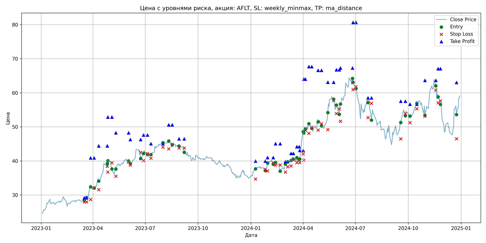
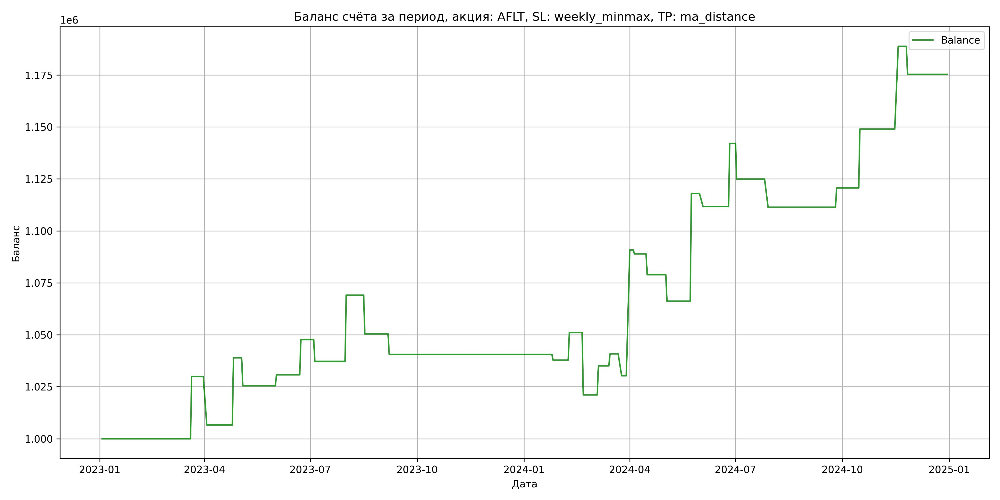

# Результаты торговой стратегии для AFLT

**Дата:** 2025-05-17 12:22:58  
**Стратегия:** AFLT,_SL_weekly_minmax,_TP_ma_distance

## Конфигурация

```json
{
    "TICKER": "AFLT",
    "EXCHANGE": "MOEX",
    "START_DATE": "2023-01-01",
    "END_DATE": "2024-12-31",
    "INTERVAL": "1d",
    "CAPITAL": 1000000,
    "RISK_PERCENT": 0.02,
    "PROFIT_TO_RISK": 3,
    "ATR_MULTIPLIER": 1.5,
    "ATR_WINDOW": 14,
    "STOP_LOSS_METHOD": "weekly_minmax",
    "TAKE_PROFIT_METHOD": "ma_distance",
    "POSITION": "long"
}
```

## Метрики эффективности

- **Начальный баланс:** 1000000.00
- **Конечный баланс:** 1175305.41
- **Прибыль/Убыток:** 175305.41 (17.53% за период тестирования)
- **Количество сделок:** 29
- **Процент выигрышных сделок:** 48.28% (14 выигрышных, 15 убыточных)
- **Средняя прибыль:** 26379.74
- **Средний убыток:** -12934.06
- **Максимальная прибыль:** 60519.36
- **Максимальный убыток:** -29965.56
- **Коэффициент прибыли:** 1.90
- **Максимальная просадка:** -4.49%

## Графики

### График цены с уровнями риска



### График баланса счёта



## Завершённые сделки

**Всего сделок:** 59

| Сделка № | Дата | Тип | Покупка / продажа | Количество акций | Цена | Stop Loss в момент сделки | Take Profit в момент сделки | Прибыль / убыток | Прибыль / убыток с учётом комиссии |
|:--------:|:----:|:---:|:-----------------:|:----------------:|:----:|:-------------------------:|:---------------------------:|:----------------:|:----------------------------------:|
| 1 | 2023-03-17 00:00:00 | LONG | BUY | 19045 | 28.29 | 27.96 | 29.15 | 0.00 | -269.39 |
| 2 | 2023-03-21 00:00:00 | LONG | SELL | -19045 | 29.86 | 27.96 | 29.15 | 29900.65 | 29346.92 |
| 3 | 2023-03-28 00:00:00 | LONG | BUY | 13295 | 33.25 | 28.67 | 40.86 | 0.00 | -221.03 |
| 4 | 2023-04-03 00:00:00 | LONG | SELL | -13295 | 31.50 | 32.09 | 40.86 | -23266.25 | -23696.68 |
| 5 | 2023-04-11 00:00:00 | LONG | BUY | 10701 | 34.96 | 31.55 | 44.39 | 0.00 | -187.05 |
| 6 | 2023-04-26 00:00:00 | LONG | SELL | -10701 | 37.98 | 38.43 | 44.39 | 32317.02 | 31926.75 |
| 7 | 2023-04-27 00:00:00 | LONG | BUY | 8693 | 39.07 | 36.72 | 52.86 | 0.00 | -169.82 |
| 8 | 2023-05-04 00:00:00 | LONG | SELL | -8693 | 37.52 | 39.44 | 52.86 | -13474.15 | -13807.05 |
| 9 | 2023-05-11 00:00:00 | LONG | BUY | 7229 | 38.49 | 35.51 | 48.23 | 0.00 | -139.12 |
| 10 | 2023-06-02 00:00:00 | LONG | SELL | -7229 | 39.22 | 39.72 | 48.23 | 5277.17 | 4996.29 |
| 11 | 2023-06-05 00:00:00 | LONG | BUY | 9270 | 40.07 | 38.80 | 46.28 | 0.00 | -185.72 |
| 12 | 2023-06-23 00:00:00 | LONG | SELL | -9270 | 41.90 | 42.51 | 46.28 | 16964.10 | 16584.17 |
| 13 | 2023-06-28 00:00:00 | LONG | BUY | 9451 | 42.51 | 40.10 | 47.58 | 0.00 | -200.88 |
| 14 | 2023-07-05 00:00:00 | LONG | SELL | -9451 | 41.40 | 42.15 | 47.58 | -10490.61 | -10887.13 |
| 15 | 2023-07-11 00:00:00 | LONG | BUY | 8608 | 42.12 | 40.81 | 45.04 | 0.00 | -181.28 |
| 16 | 2023-08-01 00:00:00 | LONG | SELL | -8608 | 45.82 | 44.03 | 45.04 | 31849.60 | 31471.11 |
| 17 | 2023-08-11 00:00:00 | LONG | BUY | 10536 | 45.66 | 43.57 | 50.58 | 0.00 | -240.54 |
| 18 | 2023-08-17 00:00:00 | LONG | SELL | -10536 | 43.89 | 44.92 | 50.58 | -18648.72 | -19120.47 |
| 19 | 2023-08-29 00:00:00 | LONG | BUY | 8989 | 44.80 | 43.80 | 46.48 | 0.00 | -201.35 |
| 20 | 2023-09-07 00:00:00 | LONG | SELL | -8989 | 43.70 | 43.80 | 46.48 | -9887.90 | -10285.66 |
| 21 | 2024-01-09 00:00:00 | LONG | BUY | 11297 | 37.60 | 34.70 | 39.95 | 0.00 | -212.38 |
| 22 | 2024-01-26 00:00:00 | LONG | SELL | -11297 | 37.36 | 37.55 | 39.95 | -2711.28 | -3134.69 |
| 23 | 2024-01-30 00:00:00 | LONG | BUY | 15033 | 38.32 | 37.06 | 40.98 | 0.00 | -288.03 |
| 24 | 2024-02-09 00:00:00 | LONG | SELL | -15033 | 39.20 | 39.47 | 40.98 | 13229.04 | 12646.36 |
| 25 | 2024-02-13 00:00:00 | LONG | BUY | 13498 | 39.96 | 38.75 | 45.03 | 0.00 | -269.69 |
| 26 | 2024-02-21 00:00:00 | LONG | SELL | -13498 | 37.74 | 38.81 | 45.03 | -29965.56 | -30489.96 |
| 27 | 2024-03-01 00:00:00 | LONG | BUY | 10051 | 38.56 | 36.71 | 39.77 | 0.00 | -193.78 |
| 28 | 2024-03-05 00:00:00 | LONG | SELL | -10051 | 39.95 | 38.28 | 39.77 | 13970.89 | 13576.34 |
| 29 | 2024-03-11 00:00:00 | LONG | BUY | 12800 | 39.67 | 38.54 | 42.21 | 0.00 | -253.89 |
| 30 | 2024-03-15 00:00:00 | LONG | SELL | -12800 | 40.12 | 40.26 | 42.21 | 5760.00 | 5249.34 |
| 31 | 2024-03-21 00:00:00 | LONG | BUY | 11826 | 40.79 | 39.52 | 44.17 | 0.00 | -241.19 |
| 32 | 2024-03-25 00:00:00 | LONG | SELL | -11826 | 39.90 | 40.16 | 44.17 | -10525.14 | -11002.26 |
| 33 | 2024-03-26 00:00:00 | LONG | BUY | 11462 | 40.50 | 39.52 | 43.08 | 0.00 | -232.11 |
| 34 | 2024-04-01 00:00:00 | LONG | SELL | -11462 | 45.78 | 42.07 | 43.08 | 60519.36 | 60024.89 |
| 35 | 2024-04-02 00:00:00 | LONG | BUY | 8641 | 48.65 | 40.19 | 64.02 | 0.00 | -210.19 |
| 36 | 2024-04-05 00:00:00 | LONG | SELL | -8641 | 48.43 | 49.00 | 64.02 | -1901.02 | -2320.45 |
| 37 | 2024-04-11 00:00:00 | LONG | BUY | 7298 | 51.23 | 48.12 | 67.67 | 0.00 | -186.94 |
| 38 | 2024-04-16 00:00:00 | LONG | SELL | -7298 | 49.86 | 49.90 | 67.67 | -9998.26 | -10367.14 |
| 39 | 2024-04-27 00:00:00 | LONG | BUY | 8052 | 52.18 | 49.05 | 66.58 | 0.00 | -210.08 |
| 40 | 2024-05-03 00:00:00 | LONG | SELL | -8052 | 50.60 | 50.92 | 66.58 | -12722.16 | -13135.95 |
| 41 | 2024-05-14 00:00:00 | LONG | BUY | 9212 | 52.20 | 49.20 | 63.08 | 0.00 | -240.43 |
| 42 | 2024-05-24 00:00:00 | LONG | SELL | -9212 | 57.82 | 57.76 | 63.08 | 51771.44 | 51264.69 |
| 43 | 2024-05-29 00:00:00 | LONG | BUY | 6265 | 56.00 | 53.90 | 66.76 | 0.00 | -175.42 |
| 44 | 2024-06-03 00:00:00 | LONG | SELL | -6265 | 55.00 | 55.27 | 66.76 | -6265.00 | -6612.71 |
| 45 | 2024-06-05 00:00:00 | LONG | BUY | 5375 | 57.00 | 51.64 | 67.26 | 0.00 | -153.19 |
| 46 | 2024-06-26 00:00:00 | LONG | SELL | -5375 | 62.65 | 63.11 | 67.26 | 30368.75 | 30047.19 |
| 47 | 2024-06-27 00:00:00 | LONG | BUY | 5352 | 64.35 | 60.95 | 80.63 | 0.00 | -172.20 |
| 48 | 2024-07-02 00:00:00 | LONG | SELL | -5352 | 61.14 | 61.81 | 80.63 | -17179.92 | -17515.73 |
| 49 | 2024-07-23 00:00:00 | LONG | BUY | 4433 | 58.22 | 52.71 | 58.50 | 0.00 | -129.04 |
| 50 | 2024-07-29 00:00:00 | LONG | SELL | -4433 | 55.17 | 56.90 | 58.50 | -13520.65 | -13771.98 |
| 51 | 2024-09-18 00:00:00 | LONG | BUY | 5618 | 51.70 | 46.46 | 57.53 | 0.00 | -145.23 |
| 52 | 2024-09-26 00:00:00 | LONG | SELL | -5618 | 53.35 | 53.90 | 57.53 | 9269.70 | 8974.61 |
| 53 | 2024-10-04 00:00:00 | LONG | BUY | 6508 | 53.20 | 51.22 | 56.62 | 0.00 | -173.11 |
| 54 | 2024-10-16 00:00:00 | LONG | SELL | -6508 | 57.55 | 55.30 | 56.62 | 28309.80 | 27949.42 |
| 55 | 2024-10-30 00:00:00 | LONG | BUY | 6984 | 56.35 | 53.12 | 63.63 | 0.00 | -196.77 |
| 56 | 2024-11-18 00:00:00 | LONG | SELL | -6984 | 62.05 | 60.79 | 63.63 | 39808.80 | 39395.35 |
| 57 | 2024-11-22 00:00:00 | LONG | BUY | 5927 | 59.60 | 57.06 | 67.05 | 0.00 | -176.62 |
| 58 | 2024-11-26 00:00:00 | LONG | SELL | -5927 | 57.33 | 57.64 | 67.05 | -13454.29 | -13800.81 |
| 59 | 2024-12-24 00:00:00 | LONG | BUY | 4739 | 56.10 | 46.50 | 63.00 | 0.00 | -132.93 |
