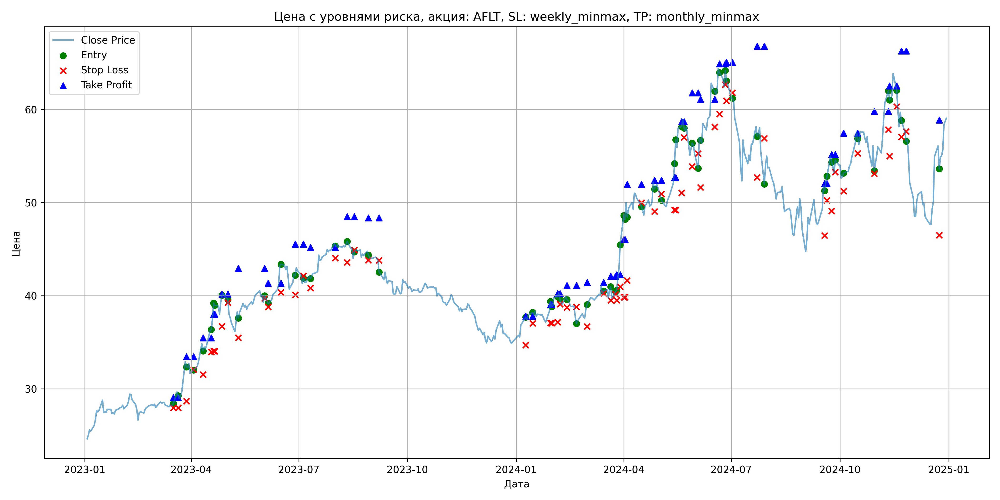
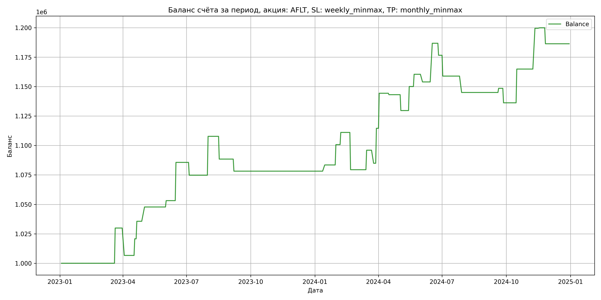

# Результаты торговой стратегии для AFLT

**Дата:** 2025-05-17 12:22:57  
**Стратегия:** AFLT,_SL_weekly_minmax,_TP_monthly_minmax

## Конфигурация

```json
{
    "TICKER": "AFLT",
    "EXCHANGE": "MOEX",
    "START_DATE": "2023-01-01",
    "END_DATE": "2024-12-31",
    "INTERVAL": "1d",
    "CAPITAL": 1000000,
    "RISK_PERCENT": 0.02,
    "PROFIT_TO_RISK": 3,
    "ATR_MULTIPLIER": 1.5,
    "ATR_WINDOW": 14,
    "STOP_LOSS_METHOD": "weekly_minmax",
    "TAKE_PROFIT_METHOD": "monthly_minmax",
    "POSITION": "long"
}
```

## Метрики эффективности

- **Начальный баланс:** 1000000.00
- **Конечный баланс:** 1186353.04
- **Прибыль/Убыток:** 186353.04 (18.64% за период тестирования)
- **Количество сделок:** 34
- **Процент выигрышных сделок:** 58.82% (20 выигрышных, 14 убыточных)
- **Средняя прибыль:** 19080.72
- **Средний убыток:** -13947.24
- **Максимальная прибыль:** 34643.00
- **Максимальный убыток:** -31652.76
- **Коэффициент прибыли:** 1.95
- **Максимальная просадка:** -4.26%

## Графики

### График цены с уровнями риска



### График баланса счёта



## Завершённые сделки

**Всего сделок:** 69

| Сделка № | Дата | Тип | Покупка / продажа | Количество акций | Цена | Stop Loss в момент сделки | Take Profit в момент сделки | Прибыль / убыток | Прибыль / убыток с учётом комиссии |
|:--------:|:----:|:---:|:-----------------:|:----------------:|:----:|:-------------------------:|:---------------------------:|:----------------:|:----------------------------------:|
| 1 | 2023-03-17 00:00:00 | LONG | BUY | 19045 | 28.29 | 27.96 | 29.07 | 0.00 | -269.39 |
| 2 | 2023-03-21 00:00:00 | LONG | SELL | -19045 | 29.86 | 27.96 | 29.07 | 29900.65 | 29346.92 |
| 3 | 2023-03-28 00:00:00 | LONG | BUY | 13295 | 33.25 | 28.67 | 33.46 | 0.00 | -221.03 |
| 4 | 2023-04-03 00:00:00 | LONG | SELL | -13295 | 31.50 | 32.09 | 33.46 | -23266.25 | -23696.68 |
| 5 | 2023-04-11 00:00:00 | LONG | BUY | 10701 | 34.96 | 31.55 | 35.47 | 0.00 | -187.05 |
| 6 | 2023-04-18 00:00:00 | LONG | SELL | -10701 | 36.28 | 33.96 | 35.47 | 14125.32 | 13744.15 |
| 7 | 2023-04-20 00:00:00 | LONG | BUY | 9989 | 37.71 | 34.05 | 38.01 | 0.00 | -188.34 |
| 8 | 2023-04-21 00:00:00 | LONG | SELL | -9989 | 39.20 | 34.05 | 38.01 | 14883.61 | 14499.48 |
| 9 | 2023-04-27 00:00:00 | LONG | BUY | 8662 | 39.07 | 36.72 | 40.18 | 0.00 | -169.21 |
| 10 | 2023-05-02 00:00:00 | LONG | SELL | -8662 | 40.47 | 39.25 | 40.18 | 12126.80 | 11782.31 |
| 11 | 2023-05-11 00:00:00 | LONG | BUY | 7384 | 38.49 | 35.51 | 42.94 | 0.00 | -142.11 |
| 12 | 2023-06-02 00:00:00 | LONG | SELL | -7384 | 39.22 | 39.72 | 42.94 | 5390.32 | 5103.41 |
| 13 | 2023-06-05 00:00:00 | LONG | BUY | 9468 | 40.07 | 38.80 | 41.36 | 0.00 | -189.69 |
| 14 | 2023-06-16 00:00:00 | LONG | SELL | -9468 | 43.50 | 40.36 | 41.36 | 32475.24 | 32079.62 |
| 15 | 2023-06-28 00:00:00 | LONG | BUY | 9790 | 42.51 | 40.10 | 45.54 | 0.00 | -208.09 |
| 16 | 2023-07-05 00:00:00 | LONG | SELL | -9790 | 41.40 | 42.15 | 45.54 | -10866.90 | -11277.64 |
| 17 | 2023-07-11 00:00:00 | LONG | BUY | 8916 | 42.12 | 40.81 | 45.20 | 0.00 | -187.77 |
| 18 | 2023-08-01 00:00:00 | LONG | SELL | -8916 | 45.82 | 44.03 | 45.20 | 32989.20 | 32597.16 |
| 19 | 2023-08-11 00:00:00 | LONG | BUY | 10914 | 45.66 | 43.57 | 48.49 | 0.00 | -249.17 |
| 20 | 2023-08-17 00:00:00 | LONG | SELL | -10914 | 43.89 | 44.92 | 48.49 | -19317.78 | -19806.45 |
| 21 | 2023-08-29 00:00:00 | LONG | BUY | 9312 | 44.80 | 43.80 | 48.36 | 0.00 | -208.59 |
| 22 | 2023-09-07 00:00:00 | LONG | SELL | -9312 | 43.70 | 43.80 | 48.36 | -10243.20 | -10655.26 |
| 23 | 2024-01-09 00:00:00 | LONG | BUY | 11702 | 37.60 | 34.70 | 37.81 | 0.00 | -220.00 |
| 24 | 2024-01-15 00:00:00 | LONG | SELL | -11702 | 38.05 | 37.04 | 37.81 | 5265.90 | 4823.27 |
| 25 | 2024-01-30 00:00:00 | LONG | BUY | 15690 | 38.32 | 37.06 | 39.06 | 0.00 | -300.62 |
| 26 | 2024-01-31 00:00:00 | LONG | SELL | -15690 | 39.42 | 37.06 | 39.06 | 17259.00 | 16649.13 |
| 27 | 2024-02-05 00:00:00 | LONG | BUY | 15008 | 39.81 | 37.17 | 40.22 | 0.00 | -298.73 |
| 28 | 2024-02-07 00:00:00 | LONG | SELL | -15008 | 40.50 | 39.11 | 40.22 | 10355.52 | 9752.87 |
| 29 | 2024-02-13 00:00:00 | LONG | BUY | 14258 | 39.96 | 38.75 | 41.09 | 0.00 | -284.87 |
| 30 | 2024-02-21 00:00:00 | LONG | SELL | -14258 | 37.74 | 38.81 | 41.09 | -31652.76 | -32206.68 |
| 31 | 2024-03-01 00:00:00 | LONG | BUY | 10617 | 38.56 | 36.71 | 41.44 | 0.00 | -204.70 |
| 32 | 2024-03-15 00:00:00 | LONG | SELL | -10617 | 40.12 | 40.26 | 41.44 | 16562.52 | 16144.85 |
| 33 | 2024-03-21 00:00:00 | LONG | BUY | 12449 | 40.79 | 39.52 | 42.11 | 0.00 | -253.90 |
| 34 | 2024-03-25 00:00:00 | LONG | SELL | -12449 | 39.90 | 40.16 | 42.11 | -11079.61 | -11581.86 |
| 35 | 2024-03-26 00:00:00 | LONG | BUY | 12066 | 40.50 | 39.52 | 42.26 | 0.00 | -244.34 |
| 36 | 2024-03-29 00:00:00 | LONG | SELL | -12066 | 42.96 | 40.97 | 42.26 | 29682.36 | 29178.85 |
| 37 | 2024-04-01 00:00:00 | LONG | BUY | 10367 | 45.78 | 39.86 | 46.05 | 0.00 | -237.30 |
| 38 | 2024-04-02 00:00:00 | LONG | SELL | -10367 | 48.65 | 39.86 | 46.05 | 29753.29 | 29263.81 |
| 39 | 2024-04-04 00:00:00 | LONG | BUY | 8093 | 50.01 | 41.64 | 51.98 | 0.00 | -202.37 |
| 40 | 2024-04-16 00:00:00 | LONG | SELL | -8093 | 49.86 | 49.99 | 51.98 | -1213.95 | -1618.07 |
| 41 | 2024-04-27 00:00:00 | LONG | BUY | 8529 | 52.18 | 49.05 | 52.40 | 0.00 | -222.52 |
| 42 | 2024-05-03 00:00:00 | LONG | SELL | -8529 | 50.60 | 50.92 | 52.40 | -13475.82 | -13914.13 |
| 43 | 2024-05-14 00:00:00 | LONG | BUY | 9758 | 52.20 | 49.20 | 52.70 | 0.00 | -254.68 |
| 44 | 2024-05-15 00:00:00 | LONG | SELL | -9758 | 54.29 | 49.20 | 52.70 | 20394.22 | 19874.66 |
| 45 | 2024-05-20 00:00:00 | LONG | BUY | 7706 | 58.00 | 51.05 | 58.68 | 0.00 | -223.47 |
| 46 | 2024-05-22 00:00:00 | LONG | SELL | -7706 | 59.35 | 57.01 | 58.68 | 10403.10 | 9950.95 |
| 47 | 2024-05-29 00:00:00 | LONG | BUY | 6498 | 56.00 | 53.90 | 61.78 | 0.00 | -181.94 |
| 48 | 2024-06-03 00:00:00 | LONG | SELL | -6498 | 55.00 | 55.27 | 61.78 | -6498.00 | -6858.64 |
| 49 | 2024-06-05 00:00:00 | LONG | BUY | 5575 | 57.00 | 51.64 | 61.10 | 0.00 | -158.89 |
| 50 | 2024-06-17 00:00:00 | LONG | SELL | -5575 | 62.89 | 58.13 | 61.10 | 32836.75 | 32502.56 |
| 51 | 2024-06-21 00:00:00 | LONG | BUY | 4999 | 64.69 | 59.52 | 64.90 | 0.00 | -161.69 |
| 52 | 2024-06-26 00:00:00 | LONG | SELL | -4999 | 62.65 | 62.69 | 64.90 | -10197.96 | -10516.25 |
| 53 | 2024-06-27 00:00:00 | LONG | BUY | 5508 | 64.35 | 60.95 | 65.07 | 0.00 | -177.22 |
| 54 | 2024-07-02 00:00:00 | LONG | SELL | -5508 | 61.14 | 61.81 | 65.07 | -17680.68 | -18026.28 |
| 55 | 2024-07-23 00:00:00 | LONG | BUY | 4562 | 58.22 | 52.71 | 66.79 | 0.00 | -132.80 |
| 56 | 2024-07-29 00:00:00 | LONG | SELL | -4562 | 55.17 | 56.90 | 66.79 | -13914.10 | -14172.74 |
| 57 | 2024-09-18 00:00:00 | LONG | BUY | 5781 | 51.70 | 46.46 | 52.05 | 0.00 | -149.44 |
| 58 | 2024-09-20 00:00:00 | LONG | SELL | -5781 | 52.31 | 50.24 | 52.05 | 3526.41 | 3225.77 |
| 59 | 2024-09-24 00:00:00 | LONG | BUY | 6181 | 55.20 | 49.10 | 55.17 | 0.00 | -170.60 |
| 60 | 2024-09-27 00:00:00 | LONG | SELL | -6181 | 53.21 | 53.26 | 55.17 | -12300.19 | -12635.23 |
| 61 | 2024-10-04 00:00:00 | LONG | BUY | 6588 | 53.20 | 51.22 | 57.47 | 0.00 | -175.24 |
| 62 | 2024-10-16 00:00:00 | LONG | SELL | -6588 | 57.55 | 55.30 | 57.47 | 28657.80 | 28292.99 |
| 63 | 2024-10-30 00:00:00 | LONG | BUY | 7070 | 56.35 | 53.12 | 59.81 | 0.00 | -199.20 |
| 64 | 2024-11-11 00:00:00 | LONG | SELL | -7070 | 61.25 | 57.84 | 59.81 | 34643.00 | 34227.28 |
| 65 | 2024-11-12 00:00:00 | LONG | BUY | 6390 | 61.99 | 55.00 | 62.54 | 0.00 | -198.06 |
| 66 | 2024-11-18 00:00:00 | LONG | SELL | -6390 | 62.05 | 60.30 | 62.54 | 383.40 | -12.91 |
| 67 | 2024-11-22 00:00:00 | LONG | BUY | 5971 | 59.60 | 57.06 | 66.28 | 0.00 | -177.94 |
| 68 | 2024-11-26 00:00:00 | LONG | SELL | -5971 | 57.33 | 57.64 | 66.28 | -13554.17 | -13903.26 |
| 69 | 2024-12-24 00:00:00 | LONG | BUY | 4774 | 56.10 | 46.50 | 58.86 | 0.00 | -133.91 |
