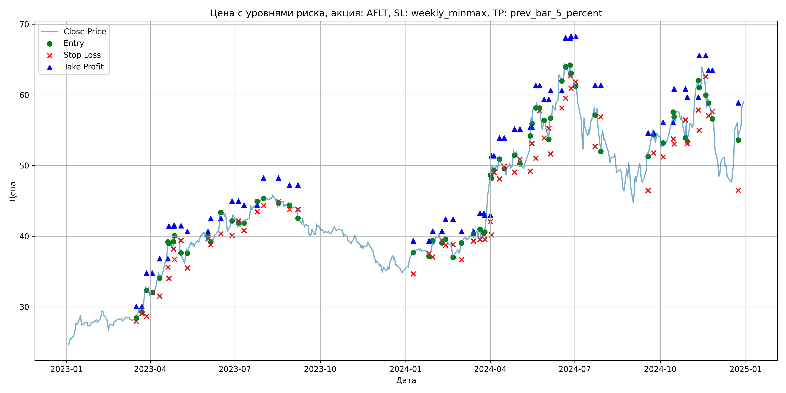
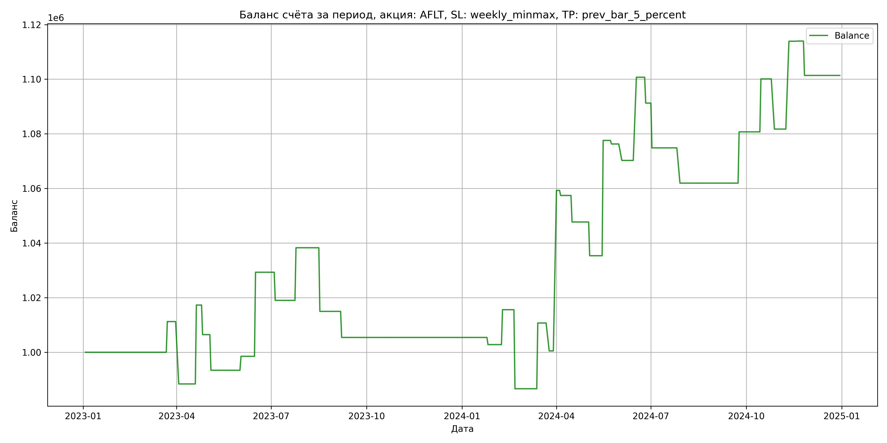

# Результаты торговой стратегии для AFLT

**Дата:** 2025-05-17 12:22:55  
**Стратегия:** AFLT,_SL_weekly_minmax,_TP_prev_bar_5_percent

## Конфигурация

```json
{
    "TICKER": "AFLT",
    "EXCHANGE": "MOEX",
    "START_DATE": "2023-01-01",
    "END_DATE": "2024-12-31",
    "INTERVAL": "1d",
    "CAPITAL": 1000000,
    "RISK_PERCENT": 0.02,
    "PROFIT_TO_RISK": 3,
    "ATR_MULTIPLIER": 1.5,
    "ATR_WINDOW": 14,
    "STOP_LOSS_METHOD": "weekly_minmax",
    "TAKE_PROFIT_METHOD": "prev_bar_5_percent",
    "POSITION": "long"
}
```

## Метрики эффективности

- **Начальный баланс:** 1000000.00
- **Конечный баланс:** 1101384.00
- **Прибыль/Убыток:** 101384.00 (10.14% за период тестирования)
- **Количество сделок:** 33
- **Процент выигрышных сделок:** 42.42% (14 выигрышных, 19 убыточных)
- **Средняя прибыль:** 23857.97
- **Средний убыток:** -12243.56
- **Максимальная прибыль:** 58771.68
- **Максимальный убыток:** -28939.92
- **Коэффициент прибыли:** 1.44
- **Максимальная просадка:** -4.97%

## Графики

### График цены с уровнями риска



### График баланса счёта



## Завершённые сделки

**Всего сделок:** 67

| Сделка № | Дата | Тип | Покупка / продажа | Количество акций | Цена | Stop Loss в момент сделки | Take Profit в момент сделки | Прибыль / убыток | Прибыль / убыток с учётом комиссии |
|:--------:|:----:|:---:|:-----------------:|:----------------:|:----:|:-------------------------:|:---------------------------:|:----------------:|:----------------------------------:|
| 1 | 2023-03-17 00:00:00 | LONG | BUY | 19045 | 28.29 | 27.96 | 30.05 | 0.00 | -269.39 |
| 2 | 2023-03-23 00:00:00 | LONG | SELL | -19045 | 28.88 | 29.07 | 30.05 | 11236.55 | 10692.15 |
| 3 | 2023-03-28 00:00:00 | LONG | BUY | 13054 | 33.25 | 28.67 | 34.79 | 0.00 | -217.02 |
| 4 | 2023-04-03 00:00:00 | LONG | SELL | -13054 | 31.50 | 32.09 | 34.79 | -22844.50 | -23267.12 |
| 5 | 2023-04-11 00:00:00 | LONG | BUY | 10507 | 34.96 | 31.55 | 36.82 | 0.00 | -183.66 |
| 6 | 2023-04-20 00:00:00 | LONG | SELL | -10507 | 37.71 | 35.63 | 36.82 | 28894.25 | 28512.48 |
| 7 | 2023-04-21 00:00:00 | LONG | BUY | 8880 | 39.20 | 34.05 | 41.44 | 0.00 | -174.05 |
| 8 | 2023-04-26 00:00:00 | LONG | SELL | -8880 | 37.98 | 38.19 | 41.44 | -10833.60 | -11176.28 |
| 9 | 2023-04-27 00:00:00 | LONG | BUY | 8418 | 39.07 | 36.72 | 41.48 | 0.00 | -164.45 |
| 10 | 2023-05-04 00:00:00 | LONG | SELL | -8418 | 37.52 | 39.44 | 41.48 | -13047.90 | -13370.27 |
| 11 | 2023-05-11 00:00:00 | LONG | BUY | 7000 | 38.49 | 35.51 | 40.68 | 0.00 | -134.72 |
| 12 | 2023-06-02 00:00:00 | LONG | SELL | -7000 | 39.22 | 39.72 | 40.68 | 5110.00 | 4838.01 |
| 13 | 2023-06-05 00:00:00 | LONG | BUY | 8976 | 40.07 | 38.80 | 42.53 | 0.00 | -179.83 |
| 14 | 2023-06-16 00:00:00 | LONG | SELL | -8976 | 43.50 | 40.36 | 42.53 | 30787.68 | 30412.62 |
| 15 | 2023-06-28 00:00:00 | LONG | BUY | 9282 | 42.51 | 40.10 | 44.98 | 0.00 | -197.29 |
| 16 | 2023-07-05 00:00:00 | LONG | SELL | -9282 | 41.40 | 42.15 | 44.98 | -10303.02 | -10692.45 |
| 17 | 2023-07-11 00:00:00 | LONG | BUY | 8454 | 42.12 | 40.81 | 44.40 | 0.00 | -178.04 |
| 18 | 2023-07-25 00:00:00 | LONG | SELL | -8454 | 44.40 | 43.47 | 44.40 | 19275.12 | 18909.40 |
| 19 | 2023-08-01 00:00:00 | LONG | BUY | 12074 | 45.82 | 44.34 | 48.23 | 0.00 | -276.62 |
| 20 | 2023-08-17 00:00:00 | LONG | SELL | -12074 | 43.89 | 44.92 | 48.23 | -23302.82 | -23844.40 |
| 21 | 2023-08-29 00:00:00 | LONG | BUY | 8682 | 44.80 | 43.80 | 47.24 | 0.00 | -194.48 |
| 22 | 2023-09-07 00:00:00 | LONG | SELL | -8682 | 43.70 | 43.80 | 47.24 | -9550.20 | -9934.38 |
| 23 | 2024-01-09 00:00:00 | LONG | BUY | 10910 | 37.60 | 34.70 | 39.36 | 0.00 | -205.11 |
| 24 | 2024-01-26 00:00:00 | LONG | SELL | -10910 | 37.36 | 37.55 | 39.36 | -2618.40 | -3027.31 |
| 25 | 2024-01-30 00:00:00 | LONG | BUY | 14519 | 38.32 | 37.06 | 40.72 | 0.00 | -278.18 |
| 26 | 2024-02-09 00:00:00 | LONG | SELL | -14519 | 39.20 | 39.47 | 40.72 | 12776.72 | 12213.96 |
| 27 | 2024-02-13 00:00:00 | LONG | BUY | 13036 | 39.96 | 38.75 | 42.41 | 0.00 | -260.46 |
| 28 | 2024-02-21 00:00:00 | LONG | SELL | -13036 | 37.74 | 38.81 | 42.41 | -28939.92 | -29446.37 |
| 29 | 2024-03-01 00:00:00 | LONG | BUY | 9707 | 38.56 | 36.71 | 40.66 | 0.00 | -187.15 |
| 30 | 2024-03-14 00:00:00 | LONG | SELL | -9707 | 41.04 | 39.33 | 40.66 | 24073.36 | 23687.02 |
| 31 | 2024-03-21 00:00:00 | LONG | BUY | 11484 | 40.79 | 39.52 | 43.27 | 0.00 | -234.22 |
| 32 | 2024-03-25 00:00:00 | LONG | SELL | -11484 | 39.90 | 40.16 | 43.27 | -10220.76 | -10684.08 |
| 33 | 2024-03-26 00:00:00 | LONG | BUY | 11131 | 40.50 | 39.52 | 42.99 | 0.00 | -225.40 |
| 34 | 2024-04-01 00:00:00 | LONG | SELL | -11131 | 45.78 | 42.07 | 42.99 | 58771.68 | 58291.49 |
| 35 | 2024-04-02 00:00:00 | LONG | BUY | 8391 | 48.65 | 40.19 | 51.40 | 0.00 | -204.11 |
| 36 | 2024-04-05 00:00:00 | LONG | SELL | -8391 | 48.43 | 49.00 | 51.40 | -1846.02 | -2253.32 |
| 37 | 2024-04-11 00:00:00 | LONG | BUY | 7088 | 51.23 | 48.12 | 53.91 | 0.00 | -181.56 |
| 38 | 2024-04-16 00:00:00 | LONG | SELL | -7088 | 49.86 | 49.90 | 53.91 | -9710.56 | -10068.82 |
| 39 | 2024-04-27 00:00:00 | LONG | BUY | 7820 | 52.18 | 49.05 | 55.17 | 0.00 | -204.02 |
| 40 | 2024-05-03 00:00:00 | LONG | SELL | -7820 | 50.60 | 50.92 | 55.17 | -12355.60 | -12757.47 |
| 41 | 2024-05-14 00:00:00 | LONG | BUY | 8946 | 52.20 | 49.20 | 55.41 | 0.00 | -233.49 |
| 42 | 2024-05-16 00:00:00 | LONG | SELL | -8946 | 56.92 | 53.11 | 55.41 | 42225.12 | 41737.03 |
| 43 | 2024-05-20 00:00:00 | LONG | BUY | 7224 | 58.00 | 51.05 | 61.30 | 0.00 | -209.50 |
| 44 | 2024-05-24 00:00:00 | LONG | SELL | -7224 | 57.82 | 57.76 | 61.30 | -1300.32 | -1718.66 |
| 45 | 2024-05-29 00:00:00 | LONG | BUY | 6029 | 56.00 | 53.90 | 59.35 | 0.00 | -168.81 |
| 46 | 2024-06-03 00:00:00 | LONG | SELL | -6029 | 55.00 | 55.27 | 59.35 | -6029.00 | -6363.61 |
| 47 | 2024-06-05 00:00:00 | LONG | BUY | 5173 | 57.00 | 51.64 | 60.61 | 0.00 | -147.43 |
| 48 | 2024-06-17 00:00:00 | LONG | SELL | -5173 | 62.89 | 58.13 | 60.61 | 30468.97 | 30158.87 |
| 49 | 2024-06-21 00:00:00 | LONG | BUY | 4638 | 64.69 | 59.52 | 68.07 | 0.00 | -150.02 |
| 50 | 2024-06-26 00:00:00 | LONG | SELL | -4638 | 62.65 | 62.69 | 68.07 | -9461.52 | -9756.82 |
| 51 | 2024-06-27 00:00:00 | LONG | BUY | 5110 | 64.35 | 60.95 | 68.26 | 0.00 | -164.41 |
| 52 | 2024-07-02 00:00:00 | LONG | SELL | -5110 | 61.14 | 61.81 | 68.26 | -16403.10 | -16723.73 |
| 53 | 2024-07-23 00:00:00 | LONG | BUY | 4233 | 58.22 | 52.71 | 61.37 | 0.00 | -123.22 |
| 54 | 2024-07-29 00:00:00 | LONG | SELL | -4233 | 55.17 | 56.90 | 61.37 | -12910.65 | -13150.64 |
| 55 | 2024-09-18 00:00:00 | LONG | BUY | 5364 | 51.70 | 46.46 | 54.63 | 0.00 | -138.66 |
| 56 | 2024-09-24 00:00:00 | LONG | SELL | -5364 | 55.20 | 51.77 | 54.63 | 18774.00 | 18487.29 |
| 57 | 2024-10-04 00:00:00 | LONG | BUY | 6272 | 53.20 | 51.22 | 56.11 | 0.00 | -166.84 |
| 58 | 2024-10-15 00:00:00 | LONG | SELL | -6272 | 56.29 | 53.78 | 56.11 | 19380.48 | 19037.12 |
| 59 | 2024-10-16 00:00:00 | LONG | BUY | 7201 | 57.55 | 53.05 | 60.83 | 0.00 | -207.21 |
| 60 | 2024-10-28 00:00:00 | LONG | SELL | -7201 | 55.00 | 56.45 | 60.83 | -18362.55 | -18767.79 |
| 61 | 2024-10-30 00:00:00 | LONG | BUY | 6567 | 56.35 | 53.12 | 59.66 | 0.00 | -185.03 |
| 62 | 2024-11-11 00:00:00 | LONG | SELL | -6567 | 61.25 | 57.84 | 59.66 | 32178.30 | 31792.16 |
| 63 | 2024-11-12 00:00:00 | LONG | BUY | 5936 | 61.99 | 55.00 | 65.56 | 0.00 | -183.99 |
| 64 | 2024-11-19 00:00:00 | LONG | SELL | -5936 | 62.00 | 62.58 | 65.56 | 59.36 | -308.64 |
| 65 | 2024-11-22 00:00:00 | LONG | BUY | 5545 | 59.60 | 57.06 | 63.48 | 0.00 | -165.24 |
| 66 | 2024-11-26 00:00:00 | LONG | SELL | -5545 | 57.33 | 57.64 | 63.48 | -12587.15 | -12911.34 |
| 67 | 2024-12-24 00:00:00 | LONG | BUY | 4433 | 56.10 | 46.50 | 58.87 | 0.00 | -124.35 |
