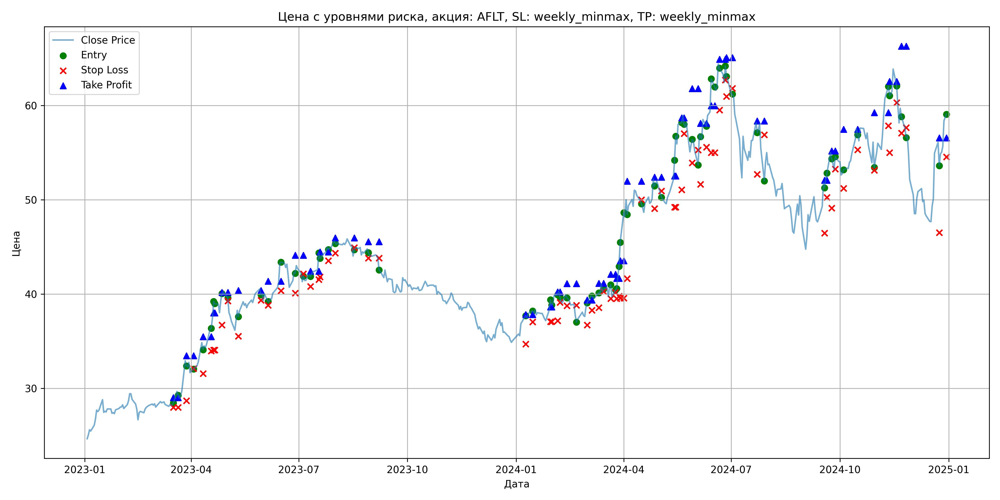
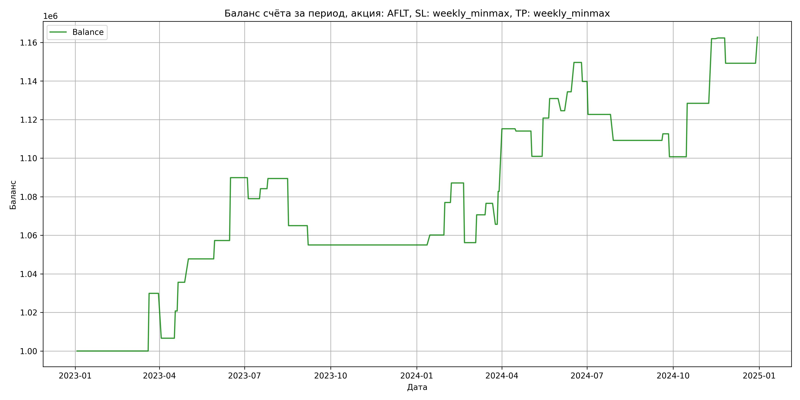

# Результаты торговой стратегии для AFLT

**Дата:** 2025-05-17 12:22:56  
**Стратегия:** AFLT,_SL_weekly_minmax,_TP_weekly_minmax

## Конфигурация

```json
{
    "TICKER": "AFLT",
    "EXCHANGE": "MOEX",
    "START_DATE": "2023-01-01",
    "END_DATE": "2024-12-31",
    "INTERVAL": "1d",
    "CAPITAL": 1000000,
    "RISK_PERCENT": 0.02,
    "PROFIT_TO_RISK": 3,
    "ATR_MULTIPLIER": 1.5,
    "ATR_WINDOW": 14,
    "STOP_LOSS_METHOD": "weekly_minmax",
    "TAKE_PROFIT_METHOD": "weekly_minmax",
    "POSITION": "long"
}
```

## Метрики эффективности

- **Начальный баланс:** 1000000.00
- **Конечный баланс:** 1162798.99
- **Прибыль/Убыток:** 162798.99 (16.28% за период тестирования)
- **Количество сделок:** 38
- **Процент выигрышных сделок:** 63.16% (24 выигрышных, 14 убыточных)
- **Средняя прибыль:** 14971.48
- **Средний убыток:** -14036.89
- **Максимальная прибыль:** 33511.10
- **Максимальный убыток:** -30951.24
- **Коэффициент прибыли:** 1.83
- **Максимальная просадка:** -4.25%

## Графики

### График цены с уровнями риска



### График баланса счёта



## Завершённые сделки

**Всего сделок:** 76

| Сделка № | Дата | Тип | Покупка / продажа | Количество акций | Цена | Stop Loss в момент сделки | Take Profit в момент сделки | Прибыль / убыток | Прибыль / убыток с учётом комиссии |
|:--------:|:----:|:---:|:-----------------:|:----------------:|:----:|:-------------------------:|:---------------------------:|:----------------:|:----------------------------------:|
| 1 | 2023-03-17 00:00:00 | LONG | BUY | 19045 | 28.29 | 27.96 | 29.00 | 0.00 | -269.39 |
| 2 | 2023-03-21 00:00:00 | LONG | SELL | -19045 | 29.86 | 27.96 | 29.00 | 29900.65 | 29346.92 |
| 3 | 2023-03-28 00:00:00 | LONG | BUY | 13295 | 33.25 | 28.67 | 33.46 | 0.00 | -221.03 |
| 4 | 2023-04-03 00:00:00 | LONG | SELL | -13295 | 31.50 | 32.09 | 33.46 | -23266.25 | -23696.68 |
| 5 | 2023-04-11 00:00:00 | LONG | BUY | 10701 | 34.96 | 31.55 | 35.47 | 0.00 | -187.05 |
| 6 | 2023-04-18 00:00:00 | LONG | SELL | -10701 | 36.28 | 33.96 | 35.47 | 14125.32 | 13744.15 |
| 7 | 2023-04-20 00:00:00 | LONG | BUY | 9989 | 37.71 | 34.05 | 38.01 | 0.00 | -188.34 |
| 8 | 2023-04-21 00:00:00 | LONG | SELL | -9989 | 39.20 | 34.05 | 38.01 | 14883.61 | 14499.48 |
| 9 | 2023-04-27 00:00:00 | LONG | BUY | 8662 | 39.07 | 36.72 | 40.18 | 0.00 | -169.21 |
| 10 | 2023-05-02 00:00:00 | LONG | SELL | -8662 | 40.47 | 39.25 | 40.18 | 12126.80 | 11782.31 |
| 11 | 2023-05-11 00:00:00 | LONG | BUY | 7384 | 38.49 | 35.51 | 40.38 | 0.00 | -142.11 |
| 12 | 2023-05-30 00:00:00 | LONG | SELL | -7384 | 39.78 | 39.35 | 40.38 | 9525.36 | 9236.39 |
| 13 | 2023-06-05 00:00:00 | LONG | BUY | 9505 | 40.07 | 38.80 | 41.36 | 0.00 | -190.43 |
| 14 | 2023-06-16 00:00:00 | LONG | SELL | -9505 | 43.50 | 40.36 | 41.36 | 32602.15 | 32204.98 |
| 15 | 2023-06-28 00:00:00 | LONG | BUY | 9829 | 42.51 | 40.10 | 44.12 | 0.00 | -208.92 |
| 16 | 2023-07-05 00:00:00 | LONG | SELL | -9829 | 41.40 | 42.15 | 44.12 | -10910.19 | -11322.57 |
| 17 | 2023-07-11 00:00:00 | LONG | BUY | 8952 | 42.12 | 40.81 | 42.42 | 0.00 | -188.53 |
| 18 | 2023-07-18 00:00:00 | LONG | SELL | -8952 | 42.70 | 41.54 | 42.42 | 5192.16 | 4812.51 |
| 19 | 2023-07-19 00:00:00 | LONG | BUY | 11455 | 44.48 | 41.80 | 44.46 | 0.00 | -254.76 |
| 20 | 2023-07-26 00:00:00 | LONG | SELL | -11455 | 44.94 | 43.53 | 44.46 | 5269.30 | 4757.15 |
| 21 | 2023-08-01 00:00:00 | LONG | BUY | 12663 | 45.82 | 44.34 | 45.94 | 0.00 | -290.11 |
| 22 | 2023-08-17 00:00:00 | LONG | SELL | -12663 | 43.89 | 44.92 | 45.94 | -24439.59 | -25007.59 |
| 23 | 2023-08-29 00:00:00 | LONG | BUY | 9106 | 44.80 | 43.80 | 45.55 | 0.00 | -203.97 |
| 24 | 2023-09-07 00:00:00 | LONG | SELL | -9106 | 43.70 | 43.80 | 45.55 | -10016.60 | -10419.54 |
| 25 | 2024-01-09 00:00:00 | LONG | BUY | 11443 | 37.60 | 34.70 | 37.81 | 0.00 | -215.13 |
| 26 | 2024-01-15 00:00:00 | LONG | SELL | -11443 | 38.05 | 37.04 | 37.81 | 5149.35 | 4716.52 |
| 27 | 2024-01-30 00:00:00 | LONG | BUY | 15342 | 38.32 | 37.06 | 38.62 | 0.00 | -293.95 |
| 28 | 2024-01-31 00:00:00 | LONG | SELL | -15342 | 39.42 | 37.06 | 38.62 | 16876.20 | 16279.86 |
| 29 | 2024-02-05 00:00:00 | LONG | BUY | 14675 | 39.81 | 37.17 | 40.22 | 0.00 | -292.11 |
| 30 | 2024-02-07 00:00:00 | LONG | SELL | -14675 | 40.50 | 39.11 | 40.22 | 10125.75 | 9536.48 |
| 31 | 2024-02-13 00:00:00 | LONG | BUY | 13942 | 39.96 | 38.75 | 41.09 | 0.00 | -278.56 |
| 32 | 2024-02-21 00:00:00 | LONG | SELL | -13942 | 37.74 | 38.81 | 41.09 | -30951.24 | -31492.89 |
| 33 | 2024-03-01 00:00:00 | LONG | BUY | 10382 | 38.56 | 36.71 | 39.37 | 0.00 | -200.16 |
| 34 | 2024-03-05 00:00:00 | LONG | SELL | -10382 | 39.95 | 38.28 | 39.37 | 14430.98 | 14023.43 |
| 35 | 2024-03-11 00:00:00 | LONG | BUY | 13221 | 39.67 | 38.54 | 41.14 | 0.00 | -262.24 |
| 36 | 2024-03-15 00:00:00 | LONG | SELL | -13221 | 40.12 | 40.26 | 41.14 | 5949.45 | 5422.00 |
| 37 | 2024-03-21 00:00:00 | LONG | BUY | 12215 | 40.79 | 39.52 | 42.09 | 0.00 | -249.12 |
| 38 | 2024-03-25 00:00:00 | LONG | SELL | -12215 | 39.90 | 40.16 | 42.09 | -10871.35 | -11364.16 |
| 39 | 2024-03-26 00:00:00 | LONG | BUY | 11839 | 40.50 | 39.52 | 41.65 | 0.00 | -239.74 |
| 40 | 2024-03-28 00:00:00 | LONG | SELL | -11839 | 41.94 | 39.77 | 41.65 | 17048.16 | 16560.16 |
| 41 | 2024-03-29 00:00:00 | LONG | BUY | 11524 | 42.96 | 39.57 | 43.53 | 0.00 | -247.54 |
| 42 | 2024-04-01 00:00:00 | LONG | SELL | -11524 | 45.78 | 39.57 | 43.53 | 32497.68 | 31986.36 |
| 43 | 2024-04-04 00:00:00 | LONG | BUY | 7879 | 50.01 | 41.64 | 51.98 | 0.00 | -197.01 |
| 44 | 2024-04-16 00:00:00 | LONG | SELL | -7879 | 49.86 | 49.99 | 51.98 | -1181.85 | -1575.29 |
| 45 | 2024-04-27 00:00:00 | LONG | BUY | 8303 | 52.18 | 49.05 | 52.40 | 0.00 | -216.63 |
| 46 | 2024-05-03 00:00:00 | LONG | SELL | -8303 | 50.60 | 50.92 | 52.40 | -13118.74 | -13545.43 |
| 47 | 2024-05-14 00:00:00 | LONG | BUY | 9499 | 52.20 | 49.20 | 52.52 | 0.00 | -247.92 |
| 48 | 2024-05-15 00:00:00 | LONG | SELL | -9499 | 54.29 | 49.20 | 52.52 | 19852.91 | 19347.14 |
| 49 | 2024-05-20 00:00:00 | LONG | BUY | 7502 | 58.00 | 51.05 | 58.68 | 0.00 | -217.56 |
| 50 | 2024-05-22 00:00:00 | LONG | SELL | -7502 | 59.35 | 57.01 | 58.68 | 10127.70 | 9687.52 |
| 51 | 2024-05-29 00:00:00 | LONG | BUY | 6325 | 56.00 | 53.90 | 61.78 | 0.00 | -177.10 |
| 52 | 2024-06-03 00:00:00 | LONG | SELL | -6325 | 55.00 | 55.27 | 61.78 | -6325.00 | -6676.04 |
| 53 | 2024-06-05 00:00:00 | LONG | BUY | 5427 | 57.00 | 51.64 | 58.11 | 0.00 | -154.67 |
| 54 | 2024-06-10 00:00:00 | LONG | SELL | -5427 | 58.81 | 55.57 | 58.11 | 9822.87 | 9508.62 |
| 55 | 2024-06-14 00:00:00 | LONG | BUY | 5040 | 59.87 | 55.00 | 59.97 | 0.00 | -150.87 |
| 56 | 2024-06-17 00:00:00 | LONG | SELL | -5040 | 62.89 | 55.00 | 59.97 | 15220.80 | 14911.44 |
| 57 | 2024-06-21 00:00:00 | LONG | BUY | 4835 | 64.69 | 59.52 | 64.90 | 0.00 | -156.39 |
| 58 | 2024-06-26 00:00:00 | LONG | SELL | -4835 | 62.65 | 62.69 | 64.90 | -9863.40 | -10171.24 |
| 59 | 2024-06-27 00:00:00 | LONG | BUY | 5328 | 64.35 | 60.95 | 65.07 | 0.00 | -171.43 |
| 60 | 2024-07-02 00:00:00 | LONG | SELL | -5328 | 61.14 | 61.81 | 65.07 | -17102.88 | -17437.19 |
| 61 | 2024-07-23 00:00:00 | LONG | BUY | 4413 | 58.22 | 52.71 | 58.35 | 0.00 | -128.46 |
| 62 | 2024-07-29 00:00:00 | LONG | SELL | -4413 | 55.17 | 56.90 | 58.35 | -13459.65 | -13709.85 |
| 63 | 2024-09-18 00:00:00 | LONG | BUY | 5592 | 51.70 | 46.46 | 52.05 | 0.00 | -144.55 |
| 64 | 2024-09-20 00:00:00 | LONG | SELL | -5592 | 52.31 | 50.24 | 52.05 | 3411.12 | 3120.31 |
| 65 | 2024-09-24 00:00:00 | LONG | BUY | 5979 | 55.20 | 49.10 | 55.17 | 0.00 | -165.02 |
| 66 | 2024-09-27 00:00:00 | LONG | SELL | -5979 | 53.21 | 53.26 | 55.17 | -11898.21 | -12222.30 |
| 67 | 2024-10-04 00:00:00 | LONG | BUY | 6372 | 53.20 | 51.22 | 57.47 | 0.00 | -169.50 |
| 68 | 2024-10-16 00:00:00 | LONG | SELL | -6372 | 57.55 | 55.30 | 57.47 | 27718.20 | 27365.35 |
| 69 | 2024-10-30 00:00:00 | LONG | BUY | 6839 | 56.35 | 53.12 | 59.24 | 0.00 | -192.69 |
| 70 | 2024-11-11 00:00:00 | LONG | SELL | -6839 | 61.25 | 57.84 | 59.24 | 33511.10 | 33108.97 |
| 71 | 2024-11-12 00:00:00 | LONG | BUY | 6182 | 61.99 | 55.00 | 62.54 | 0.00 | -191.61 |
| 72 | 2024-11-18 00:00:00 | LONG | SELL | -6182 | 62.05 | 60.30 | 62.54 | 370.92 | -12.49 |
| 73 | 2024-11-22 00:00:00 | LONG | BUY | 5776 | 59.60 | 57.06 | 66.28 | 0.00 | -172.12 |
| 74 | 2024-11-26 00:00:00 | LONG | SELL | -5776 | 57.33 | 57.64 | 66.28 | -13111.52 | -13449.21 |
| 75 | 2024-12-24 00:00:00 | LONG | BUY | 4618 | 56.10 | 46.50 | 56.56 | 0.00 | -129.53 |
| 76 | 2024-12-30 00:00:00 | LONG | SELL | -4618 | 59.04 | 54.54 | 56.56 | 13576.92 | 13311.06 |
