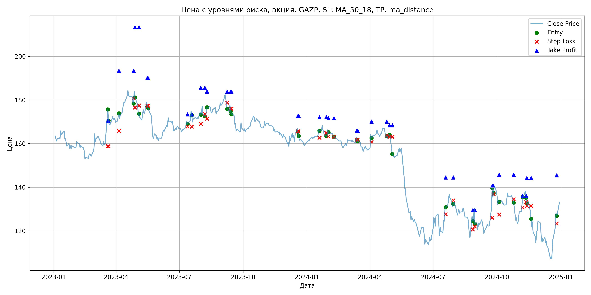
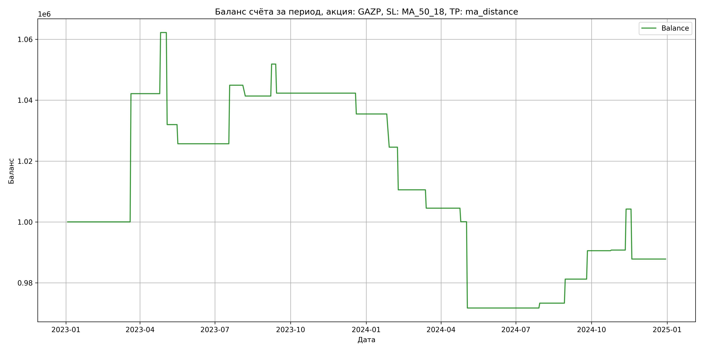

# Результаты торговой стратегии для GAZP

**Дата:** 2025-05-17 12:23:24  
**Стратегия:** GAZP,_SL_MA_50_18,_TP_ma_distance

## Конфигурация

```json
{
    "TICKER": "GAZP",
    "EXCHANGE": "MOEX",
    "START_DATE": "2023-01-01",
    "END_DATE": "2024-12-31",
    "INTERVAL": "1d",
    "CAPITAL": 1000000,
    "RISK_PERCENT": 0.02,
    "PROFIT_TO_RISK": 3,
    "ATR_MULTIPLIER": 1.5,
    "ATR_WINDOW": 14,
    "STOP_LOSS_METHOD": "MA_50_18",
    "TAKE_PROFIT_METHOD": "ma_distance",
    "POSITION": "long"
}
```

## Метрики эффективности

- **Начальный баланс:** 1000000.00
- **Конечный баланс:** 987794.37
- **Прибыль/Убыток:** -12205.63 (-1.22% за период тестирования)
- **Количество сделок:** 20
- **Процент выигрышных сделок:** 45.00% (9 выигрышных, 11 убыточных)
- **Средняя прибыль:** 13834.13
- **Средний убыток:** -12428.43
- **Максимальная прибыль:** 42154.40
- **Максимальный убыток:** -30259.53
- **Коэффициент прибыли:** 0.91
- **Максимальная просадка:** -8.52%

## Графики

### График цены с уровнями риска



### График баланса счёта



## Завершённые сделки

**Всего сделок:** 41

| Сделка № | Дата | Тип | Покупка / продажа | Количество акций | Цена | Stop Loss в момент сделки | Take Profit в момент сделки | Прибыль / убыток | Прибыль / убыток с учётом комиссии |
|:--------:|:----:|:---:|:-----------------:|:----------------:|:----:|:-------------------------:|:---------------------------:|:----------------:|:----------------------------------:|
| 1 | 2023-03-20 00:00:00 | LONG | BUY | 3634 | 164.40 | 158.80 | 170.40 | 0.00 | -298.71 |
| 2 | 2023-03-21 00:00:00 | LONG | SELL | -3634 | 176.00 | 158.80 | 170.40 | 42154.40 | 41535.89 |
| 3 | 2023-04-05 00:00:00 | LONG | BUY | 3090 | 172.55 | 165.91 | 193.37 | 0.00 | -266.59 |
| 4 | 2023-04-26 00:00:00 | LONG | SELL | -3090 | 179.05 | 180.70 | 193.37 | 20085.00 | 19541.78 |
| 5 | 2023-04-28 00:00:00 | LONG | BUY | 2709 | 184.40 | 176.56 | 213.34 | 0.00 | -249.77 |
| 6 | 2023-05-04 00:00:00 | LONG | SELL | -2709 | 173.23 | 177.51 | 213.34 | -30259.53 | -30743.94 |
| 7 | 2023-05-16 00:00:00 | LONG | BUY | 2100 | 179.90 | 177.40 | 190.07 | 0.00 | -188.90 |
| 8 | 2023-05-17 00:00:00 | LONG | SELL | -2100 | 176.90 | 177.40 | 190.07 | -6300.00 | -6674.64 |
| 9 | 2023-07-13 00:00:00 | LONG | BUY | 3857 | 170.51 | 167.81 | 173.44 | 0.00 | -328.83 |
| 10 | 2023-07-19 00:00:00 | LONG | SELL | -3857 | 175.50 | 167.81 | 173.44 | 19246.43 | 18579.15 |
| 11 | 2023-08-01 00:00:00 | LONG | BUY | 4184 | 175.10 | 169.09 | 185.57 | 0.00 | -366.31 |
| 12 | 2023-08-07 00:00:00 | LONG | SELL | -4184 | 174.25 | 173.56 | 185.57 | -3556.40 | -4287.24 |
| 13 | 2023-08-10 00:00:00 | LONG | BUY | 3861 | 175.22 | 171.48 | 183.88 | 0.00 | -338.26 |
| 14 | 2023-09-08 00:00:00 | LONG | SELL | -3861 | 177.94 | 178.83 | 183.88 | 10501.92 | 9820.14 |
| 15 | 2023-09-13 00:00:00 | LONG | BUY | 3747 | 177.80 | 176.02 | 183.89 | 0.00 | -333.11 |
| 16 | 2023-09-14 00:00:00 | LONG | SELL | -3747 | 175.25 | 176.02 | 183.89 | -9554.85 | -10216.29 |
| 17 | 2023-12-19 00:00:00 | LONG | BUY | 3719 | 167.17 | 165.62 | 172.62 | 0.00 | -310.85 |
| 18 | 2023-12-20 00:00:00 | LONG | SELL | -3719 | 165.33 | 165.62 | 172.62 | -6842.96 | -7461.24 |
| 19 | 2024-01-19 00:00:00 | LONG | BUY | 4330 | 166.52 | 162.65 | 172.16 | 0.00 | -360.52 |
| 20 | 2024-01-29 00:00:00 | LONG | SELL | -4330 | 164.00 | 164.94 | 172.16 | -10911.60 | -11627.18 |
| 21 | 2024-02-01 00:00:00 | LONG | BUY | 4286 | 166.75 | 163.23 | 171.69 | 0.00 | -357.35 |
| 22 | 2024-02-09 00:00:00 | LONG | SELL | -4286 | 163.48 | 163.23 | 171.69 | -14015.22 | -14722.90 |
| 23 | 2024-03-13 00:00:00 | LONG | BUY | 4310 | 163.20 | 161.83 | 165.94 | 0.00 | -351.70 |
| 24 | 2024-03-14 00:00:00 | LONG | SELL | -4310 | 161.80 | 161.83 | 165.94 | -6034.00 | -6734.37 |
| 25 | 2024-04-03 00:00:00 | LONG | BUY | 4250 | 164.05 | 160.77 | 170.12 | 0.00 | -348.61 |
| 26 | 2024-04-25 00:00:00 | LONG | SELL | -4250 | 163.00 | 163.69 | 170.12 | -4462.50 | -5157.48 |
| 27 | 2024-04-29 00:00:00 | LONG | BUY | 4231 | 164.10 | 163.13 | 168.38 | 0.00 | -347.15 |
| 28 | 2024-05-03 00:00:00 | LONG | SELL | -4231 | 157.40 | 163.13 | 168.38 | -28347.70 | -29027.83 |
| 29 | 2024-07-19 00:00:00 | LONG | BUY | 2282 | 130.10 | 127.60 | 144.48 | 0.00 | -148.44 |
| 30 | 2024-07-30 00:00:00 | LONG | SELL | -2282 | 130.80 | 134.00 | 144.48 | 1597.40 | 1299.71 |
| 31 | 2024-08-27 00:00:00 | LONG | BUY | 2200 | 127.30 | 120.67 | 129.51 | 0.00 | -140.03 |
| 32 | 2024-08-30 00:00:00 | LONG | SELL | -2200 | 130.89 | 122.02 | 129.51 | 7898.00 | 7613.99 |
| 33 | 2024-09-24 00:00:00 | LONG | BUY | 2328 | 130.90 | 126.02 | 140.52 | 0.00 | -152.37 |
| 34 | 2024-09-26 00:00:00 | LONG | SELL | -2328 | 134.91 | 136.92 | 140.52 | 9335.28 | 9025.88 |
| 35 | 2024-10-04 00:00:00 | LONG | BUY | 2316 | 134.06 | 127.50 | 145.82 | 0.00 | -155.24 |
| 36 | 2024-10-25 00:00:00 | LONG | SELL | -2316 | 134.15 | 134.50 | 145.82 | 208.44 | -102.15 |
| 37 | 2024-11-07 00:00:00 | LONG | BUY | 2258 | 131.85 | 130.73 | 136.05 | 0.00 | -148.86 |
| 38 | 2024-11-12 00:00:00 | LONG | SELL | -2258 | 137.82 | 133.18 | 136.05 | 13480.26 | 13175.80 |
| 39 | 2024-11-13 00:00:00 | LONG | BUY | 2775 | 134.90 | 131.47 | 144.28 | 0.00 | -187.17 |
| 40 | 2024-11-19 00:00:00 | LONG | SELL | -2775 | 128.98 | 131.47 | 144.28 | -16428.00 | -16794.13 |
| 41 | 2024-12-26 00:00:00 | LONG | BUY | 1933 | 128.40 | 123.35 | 145.45 | 0.00 | -124.10 |
