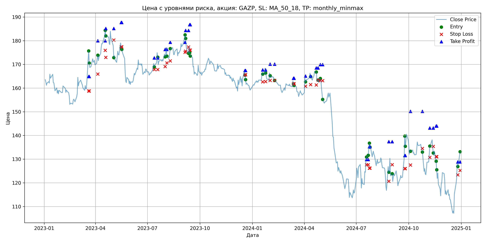
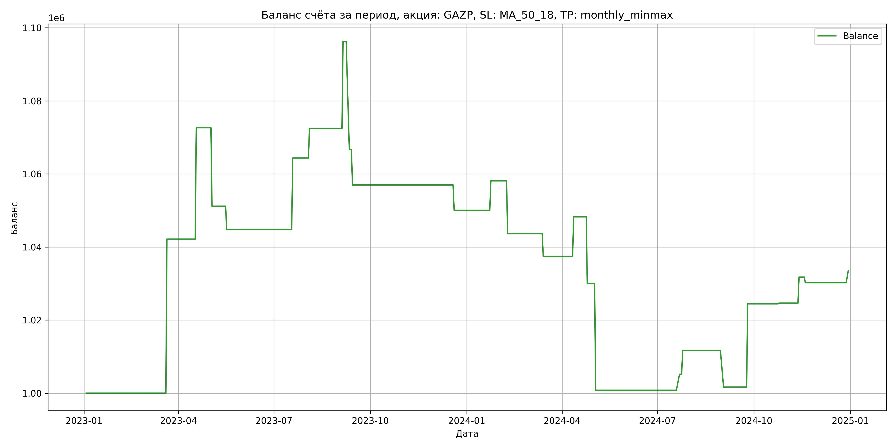

# Результаты торговой стратегии для GAZP

**Дата:** 2025-05-17 12:23:24  
**Стратегия:** GAZP,_SL_MA_50_18,_TP_monthly_minmax

## Конфигурация

```json
{
    "TICKER": "GAZP",
    "EXCHANGE": "MOEX",
    "START_DATE": "2023-01-01",
    "END_DATE": "2024-12-31",
    "INTERVAL": "1d",
    "CAPITAL": 1000000,
    "RISK_PERCENT": 0.02,
    "PROFIT_TO_RISK": 3,
    "ATR_MULTIPLIER": 1.5,
    "ATR_WINDOW": 14,
    "STOP_LOSS_METHOD": "MA_50_18",
    "TAKE_PROFIT_METHOD": "monthly_minmax",
    "POSITION": "long"
}
```

## Метрики эффективности

- **Начальный баланс:** 1000000.00
- **Конечный баланс:** 1033538.93
- **Прибыль/Убыток:** 33538.93 (3.35% за период тестирования)
- **Количество сделок:** 24
- **Процент выигрышных сделок:** 54.17% (13 выигрышных, 11 убыточных)
- **Средняя прибыль:** 14409.61
- **Средний убыток:** -13980.55
- **Максимальная прибыль:** 42154.40
- **Максимальный убыток:** -29576.25
- **Коэффициент прибыли:** 1.22
- **Максимальная просадка:** -8.70%

## Графики

### График цены с уровнями риска



### График баланса счёта



## Завершённые сделки

**Всего сделок:** 48

| Сделка № | Дата | Тип | Покупка / продажа | Количество акций | Цена | Stop Loss в момент сделки | Take Profit в момент сделки | Прибыль / убыток | Прибыль / убыток с учётом комиссии |
|:--------:|:----:|:---:|:-----------------:|:----------------:|:----:|:-------------------------:|:---------------------------:|:----------------:|:----------------------------------:|
| 1 | 2023-03-20 00:00:00 | LONG | BUY | 3634 | 164.40 | 158.80 | 164.88 | 0.00 | -298.71 |
| 2 | 2023-03-21 00:00:00 | LONG | SELL | -3634 | 176.00 | 158.80 | 164.88 | 42154.40 | 41535.89 |
| 3 | 2023-04-05 00:00:00 | LONG | BUY | 3090 | 172.55 | 165.91 | 179.98 | 0.00 | -266.59 |
| 4 | 2023-04-18 00:00:00 | LONG | SELL | -3090 | 182.41 | 175.91 | 179.98 | 30467.40 | 29918.99 |
| 5 | 2023-04-19 00:00:00 | LONG | BUY | 3267 | 184.33 | 172.92 | 185.14 | 0.00 | -301.10 |
| 6 | 2023-05-03 00:00:00 | LONG | SELL | -3267 | 177.76 | 180.27 | 185.14 | -21464.19 | -22055.66 |
| 7 | 2023-05-16 00:00:00 | LONG | BUY | 2138 | 179.90 | 177.40 | 187.67 | 0.00 | -192.31 |
| 8 | 2023-05-17 00:00:00 | LONG | SELL | -2138 | 176.90 | 177.40 | 187.67 | -6414.00 | -6795.42 |
| 9 | 2023-07-13 00:00:00 | LONG | BUY | 3929 | 170.51 | 167.81 | 172.73 | 0.00 | -334.97 |
| 10 | 2023-07-19 00:00:00 | LONG | SELL | -3929 | 175.50 | 167.81 | 172.73 | 19605.71 | 18925.97 |
| 11 | 2023-08-01 00:00:00 | LONG | BUY | 4262 | 175.10 | 169.09 | 176.30 | 0.00 | -373.14 |
| 12 | 2023-08-04 00:00:00 | LONG | SELL | -4262 | 177.00 | 170.59 | 176.30 | 8097.80 | 7347.47 |
| 13 | 2023-08-10 00:00:00 | LONG | BUY | 3976 | 175.22 | 171.48 | 179.35 | 0.00 | -348.34 |
| 14 | 2023-09-05 00:00:00 | LONG | SELL | -3976 | 181.20 | 175.12 | 179.35 | 23776.48 | 23067.92 |
| 15 | 2023-09-06 00:00:00 | LONG | BUY | 4125 | 183.19 | 175.57 | 184.30 | 0.00 | -377.83 |
| 16 | 2023-09-11 00:00:00 | LONG | SELL | -4125 | 176.02 | 177.34 | 184.30 | -29576.25 | -30317.12 |
| 17 | 2023-09-13 00:00:00 | LONG | BUY | 3797 | 177.80 | 176.02 | 186.79 | 0.00 | -337.55 |
| 18 | 2023-09-14 00:00:00 | LONG | SELL | -3797 | 175.25 | 176.02 | 186.79 | -9682.35 | -10352.62 |
| 19 | 2023-12-19 00:00:00 | LONG | BUY | 3769 | 167.17 | 165.62 | 167.40 | 0.00 | -315.03 |
| 20 | 2023-12-20 00:00:00 | LONG | SELL | -3769 | 165.33 | 165.62 | 167.40 | -6934.96 | -7561.56 |
| 21 | 2024-01-19 00:00:00 | LONG | BUY | 4387 | 166.52 | 162.65 | 167.68 | 0.00 | -365.26 |
| 22 | 2024-01-24 00:00:00 | LONG | SELL | -4387 | 168.36 | 162.74 | 167.68 | 8072.08 | 7337.52 |
| 23 | 2024-02-01 00:00:00 | LONG | BUY | 4423 | 166.75 | 163.23 | 170.11 | 0.00 | -368.77 |
| 24 | 2024-02-09 00:00:00 | LONG | SELL | -4423 | 163.48 | 163.23 | 170.11 | -14463.21 | -15193.51 |
| 25 | 2024-03-13 00:00:00 | LONG | BUY | 4448 | 163.20 | 161.83 | 164.13 | 0.00 | -362.96 |
| 26 | 2024-03-14 00:00:00 | LONG | SELL | -4448 | 161.80 | 161.83 | 164.13 | -6227.20 | -6950.00 |
| 27 | 2024-04-03 00:00:00 | LONG | BUY | 4386 | 164.05 | 160.77 | 165.08 | 0.00 | -359.76 |
| 28 | 2024-04-12 00:00:00 | LONG | SELL | -4386 | 166.52 | 161.45 | 165.08 | 10833.42 | 10108.48 |
| 29 | 2024-04-22 00:00:00 | LONG | BUY | 4354 | 167.20 | 161.33 | 168.48 | 0.00 | -363.99 |
| 30 | 2024-04-25 00:00:00 | LONG | SELL | -4354 | 163.00 | 163.43 | 168.48 | -18286.80 | -19005.65 |
| 31 | 2024-04-29 00:00:00 | LONG | BUY | 4352 | 164.10 | 163.13 | 169.94 | 0.00 | -357.08 |
| 32 | 2024-05-03 00:00:00 | LONG | SELL | -4352 | 157.40 | 163.13 | 169.94 | -29158.40 | -29857.98 |
| 33 | 2024-07-19 00:00:00 | LONG | BUY | 2347 | 130.10 | 127.60 | 129.86 | 0.00 | -152.67 |
| 34 | 2024-07-22 00:00:00 | LONG | SELL | -2347 | 131.96 | 127.60 | 129.86 | 4365.42 | 4057.89 |
| 35 | 2024-07-24 00:00:00 | LONG | BUY | 2439 | 134.07 | 126.20 | 135.22 | 0.00 | -163.50 |
| 36 | 2024-07-25 00:00:00 | LONG | SELL | -2439 | 136.75 | 126.20 | 135.22 | 6536.52 | 6206.26 |
| 37 | 2024-08-27 00:00:00 | LONG | BUY | 2283 | 127.30 | 120.67 | 137.37 | 0.00 | -145.31 |
| 38 | 2024-09-02 00:00:00 | LONG | SELL | -2283 | 122.90 | 127.66 | 137.37 | -10045.20 | -10330.80 |
| 39 | 2024-09-24 00:00:00 | LONG | BUY | 2372 | 130.90 | 126.02 | 131.53 | 0.00 | -155.25 |
| 40 | 2024-09-25 00:00:00 | LONG | SELL | -2372 | 140.50 | 126.02 | 131.53 | 22771.20 | 22449.32 |
| 41 | 2024-10-04 00:00:00 | LONG | BUY | 2391 | 134.06 | 127.50 | 150.20 | 0.00 | -160.27 |
| 42 | 2024-10-25 00:00:00 | LONG | SELL | -2391 | 134.15 | 134.50 | 150.20 | 215.19 | -105.46 |
| 43 | 2024-11-07 00:00:00 | LONG | BUY | 2331 | 131.85 | 130.73 | 143.14 | 0.00 | -153.67 |
| 44 | 2024-11-13 00:00:00 | LONG | SELL | -2331 | 134.90 | 135.36 | 143.14 | 7109.55 | 6798.65 |
| 45 | 2024-11-18 00:00:00 | LONG | BUY | 2949 | 129.50 | 131.01 | 143.98 | 0.00 | -190.95 |
| 46 | 2024-11-19 00:00:00 | LONG | SELL | -2949 | 128.98 | 131.01 | 143.98 | -1533.48 | -1914.61 |
| 47 | 2024-12-26 00:00:00 | LONG | BUY | 2012 | 128.40 | 123.35 | 128.85 | 0.00 | -129.17 |
| 48 | 2024-12-30 00:00:00 | LONG | SELL | -2012 | 130.05 | 125.23 | 128.85 | 3319.80 | 3059.80 |
