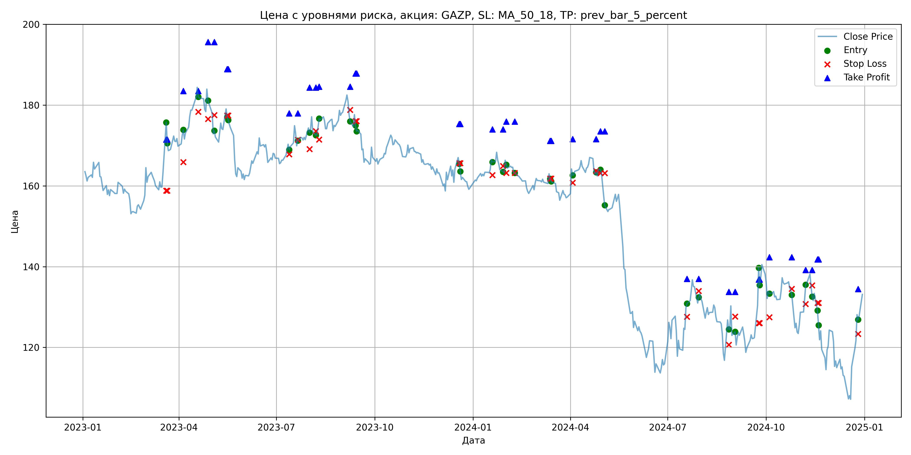
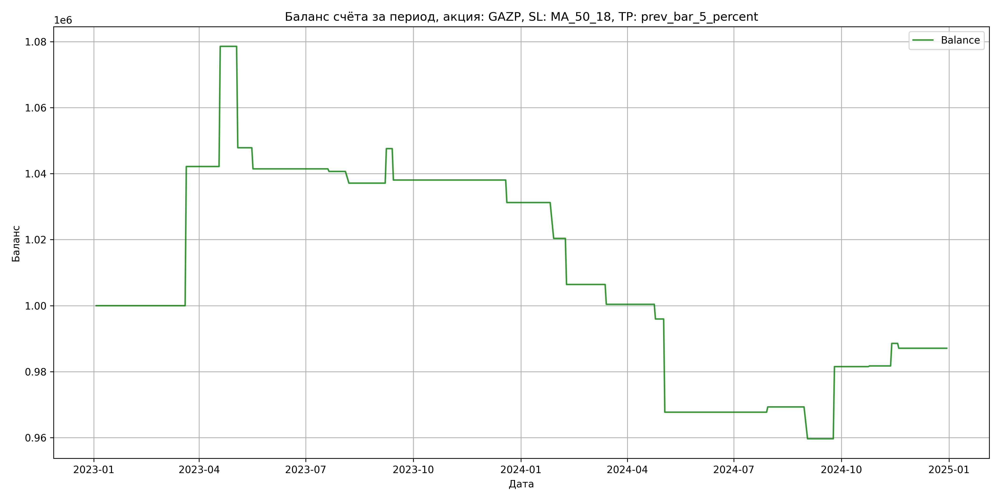

# Результаты торговой стратегии для GAZP

**Дата:** 2025-05-17 12:23:22  
**Стратегия:** GAZP,_SL_MA_50_18,_TP_prev_bar_5_percent

## Конфигурация

```json
{
    "TICKER": "GAZP",
    "EXCHANGE": "MOEX",
    "START_DATE": "2023-01-01",
    "END_DATE": "2024-12-31",
    "INTERVAL": "1d",
    "CAPITAL": 1000000,
    "RISK_PERCENT": 0.02,
    "PROFIT_TO_RISK": 3,
    "ATR_MULTIPLIER": 1.5,
    "ATR_WINDOW": 14,
    "STOP_LOSS_METHOD": "MA_50_18",
    "TAKE_PROFIT_METHOD": "prev_bar_5_percent",
    "POSITION": "long"
}
```

## Метрики эффективности

- **Начальный баланс:** 1000000.00
- **Конечный баланс:** 987097.94
- **Прибыль/Убыток:** -12902.06 (-1.29% за период тестирования)
- **Количество сделок:** 20
- **Процент выигрышных сделок:** 35.00% (7 выигрышных, 13 убыточных)
- **Средняя прибыль:** 17070.29
- **Средний убыток:** -10184.16
- **Максимальная прибыль:** 42154.40
- **Максимальный убыток:** -30717.50
- **Коэффициент прибыли:** 0.90
- **Максимальная просадка:** -11.02%

## Графики

### График цены с уровнями риска



### График баланса счёта



## Завершённые сделки

**Всего сделок:** 41

| Сделка № | Дата | Тип | Покупка / продажа | Количество акций | Цена | Stop Loss в момент сделки | Take Profit в момент сделки | Прибыль / убыток | Прибыль / убыток с учётом комиссии |
|:--------:|:----:|:---:|:-----------------:|:----------------:|:----:|:-------------------------:|:---------------------------:|:----------------:|:----------------------------------:|
| 1 | 2023-03-20 00:00:00 | LONG | BUY | 3634 | 164.40 | 158.80 | 171.45 | 0.00 | -298.71 |
| 2 | 2023-03-21 00:00:00 | LONG | SELL | -3634 | 176.00 | 158.80 | 171.45 | 42154.40 | 41535.89 |
| 3 | 2023-04-05 00:00:00 | LONG | BUY | 3090 | 172.55 | 165.91 | 183.46 | 0.00 | -266.59 |
| 4 | 2023-04-19 00:00:00 | LONG | SELL | -3090 | 184.33 | 178.35 | 183.46 | 36400.20 | 35848.82 |
| 5 | 2023-04-28 00:00:00 | LONG | BUY | 2750 | 184.40 | 176.56 | 195.58 | 0.00 | -253.55 |
| 6 | 2023-05-04 00:00:00 | LONG | SELL | -2750 | 173.23 | 177.51 | 195.58 | -30717.50 | -31209.24 |
| 7 | 2023-05-16 00:00:00 | LONG | BUY | 2132 | 179.90 | 177.40 | 188.89 | 0.00 | -191.77 |
| 8 | 2023-05-17 00:00:00 | LONG | SELL | -2132 | 176.90 | 177.40 | 188.89 | -6396.00 | -6776.35 |
| 9 | 2023-07-13 00:00:00 | LONG | BUY | 3917 | 170.51 | 167.81 | 177.96 | 0.00 | -333.94 |
| 10 | 2023-07-21 00:00:00 | LONG | SELL | -3917 | 170.31 | 171.39 | 177.96 | -783.40 | -1450.90 |
| 11 | 2023-08-01 00:00:00 | LONG | BUY | 4167 | 175.10 | 169.09 | 184.35 | 0.00 | -364.82 |
| 12 | 2023-08-07 00:00:00 | LONG | SELL | -4167 | 174.25 | 173.56 | 184.35 | -3541.95 | -4269.82 |
| 13 | 2023-08-10 00:00:00 | LONG | BUY | 3845 | 175.22 | 171.48 | 184.54 | 0.00 | -336.86 |
| 14 | 2023-09-08 00:00:00 | LONG | SELL | -3845 | 177.94 | 178.83 | 184.54 | 10458.40 | 9779.45 |
| 15 | 2023-09-13 00:00:00 | LONG | BUY | 3732 | 177.80 | 176.02 | 187.83 | 0.00 | -331.77 |
| 16 | 2023-09-14 00:00:00 | LONG | SELL | -3732 | 175.25 | 176.02 | 187.83 | -9516.60 | -10175.39 |
| 17 | 2023-12-19 00:00:00 | LONG | BUY | 3704 | 167.17 | 165.62 | 175.35 | 0.00 | -309.60 |
| 18 | 2023-12-20 00:00:00 | LONG | SELL | -3704 | 165.33 | 165.62 | 175.35 | -6815.36 | -7431.15 |
| 19 | 2024-01-19 00:00:00 | LONG | BUY | 4312 | 166.52 | 162.65 | 174.01 | 0.00 | -359.02 |
| 20 | 2024-01-29 00:00:00 | LONG | SELL | -4312 | 164.00 | 164.94 | 174.01 | -10866.24 | -11578.84 |
| 21 | 2024-02-01 00:00:00 | LONG | BUY | 4268 | 166.75 | 163.23 | 175.89 | 0.00 | -355.84 |
| 22 | 2024-02-09 00:00:00 | LONG | SELL | -4268 | 163.48 | 163.23 | 175.89 | -13956.36 | -14661.07 |
| 23 | 2024-03-13 00:00:00 | LONG | BUY | 4293 | 163.20 | 161.83 | 171.14 | 0.00 | -350.31 |
| 24 | 2024-03-14 00:00:00 | LONG | SELL | -4293 | 161.80 | 161.83 | 171.14 | -6010.20 | -6707.81 |
| 25 | 2024-04-03 00:00:00 | LONG | BUY | 4233 | 164.05 | 160.77 | 171.57 | 0.00 | -347.21 |
| 26 | 2024-04-25 00:00:00 | LONG | SELL | -4233 | 163.00 | 163.69 | 171.57 | -4444.65 | -5136.85 |
| 27 | 2024-04-29 00:00:00 | LONG | BUY | 4214 | 164.10 | 163.13 | 173.49 | 0.00 | -345.76 |
| 28 | 2024-05-03 00:00:00 | LONG | SELL | -4214 | 157.40 | 163.13 | 173.49 | -28233.80 | -28911.20 |
| 29 | 2024-07-19 00:00:00 | LONG | BUY | 2272 | 130.10 | 127.60 | 136.95 | 0.00 | -147.79 |
| 30 | 2024-07-30 00:00:00 | LONG | SELL | -2272 | 130.80 | 134.00 | 136.95 | 1590.40 | 1294.02 |
| 31 | 2024-08-27 00:00:00 | LONG | BUY | 2191 | 127.30 | 120.67 | 133.77 | 0.00 | -139.46 |
| 32 | 2024-09-02 00:00:00 | LONG | SELL | -2191 | 122.90 | 127.66 | 133.77 | -9640.40 | -9914.49 |
| 33 | 2024-09-24 00:00:00 | LONG | BUY | 2277 | 130.90 | 126.02 | 136.80 | 0.00 | -149.03 |
| 34 | 2024-09-25 00:00:00 | LONG | SELL | -2277 | 140.50 | 126.02 | 136.80 | 21859.20 | 21550.21 |
| 35 | 2024-10-04 00:00:00 | LONG | BUY | 2295 | 134.06 | 127.50 | 142.34 | 0.00 | -153.83 |
| 36 | 2024-10-25 00:00:00 | LONG | SELL | -2295 | 134.15 | 134.50 | 142.34 | 206.55 | -101.22 |
| 37 | 2024-11-07 00:00:00 | LONG | BUY | 2237 | 131.85 | 130.73 | 139.18 | 0.00 | -147.47 |
| 38 | 2024-11-13 00:00:00 | LONG | SELL | -2237 | 134.90 | 135.36 | 139.18 | 6822.85 | 6524.49 |
| 39 | 2024-11-18 00:00:00 | LONG | BUY | 2830 | 129.50 | 131.01 | 141.81 | 0.00 | -183.24 |
| 40 | 2024-11-19 00:00:00 | LONG | SELL | -2830 | 128.98 | 131.01 | 141.81 | -1471.60 | -1837.35 |
| 41 | 2024-12-26 00:00:00 | LONG | BUY | 1931 | 128.40 | 123.35 | 134.45 | 0.00 | -123.97 |
