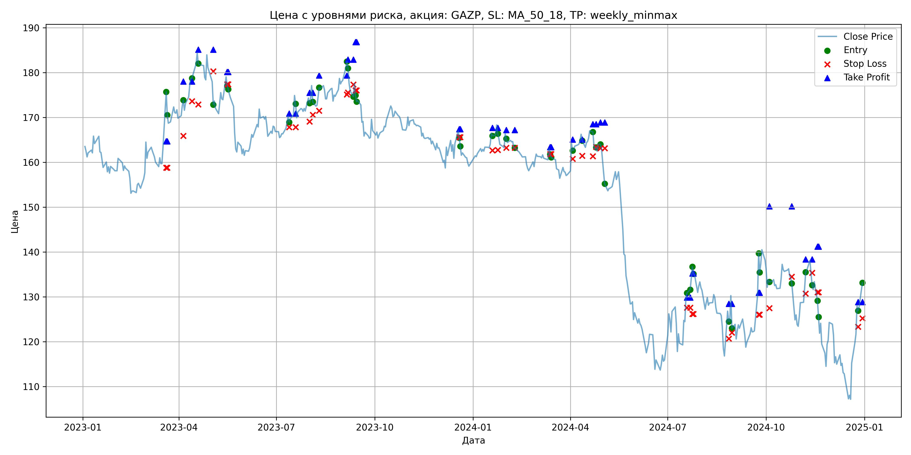
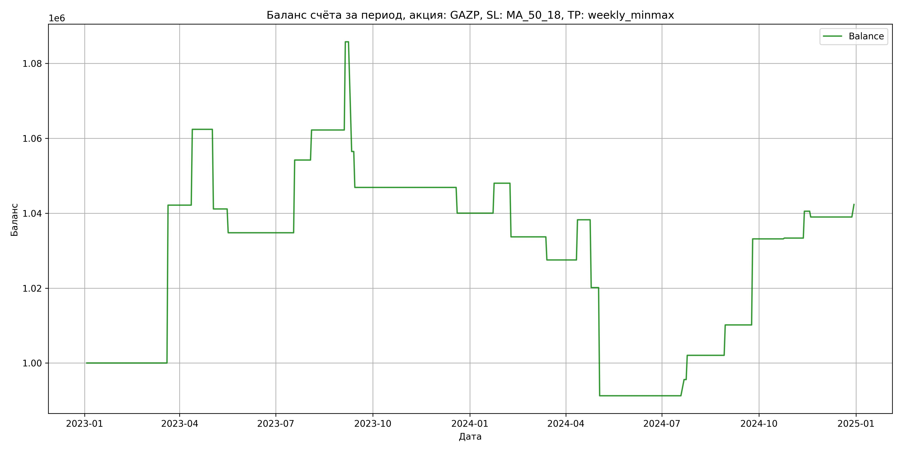

# Результаты торговой стратегии для GAZP

**Дата:** 2025-05-17 12:23:23  
**Стратегия:** GAZP,_SL_MA_50_18,_TP_weekly_minmax

## Конфигурация

```json
{
    "TICKER": "GAZP",
    "EXCHANGE": "MOEX",
    "START_DATE": "2023-01-01",
    "END_DATE": "2024-12-31",
    "INTERVAL": "1d",
    "CAPITAL": 1000000,
    "RISK_PERCENT": 0.02,
    "PROFIT_TO_RISK": 3,
    "ATR_MULTIPLIER": 1.5,
    "ATR_WINDOW": 14,
    "STOP_LOSS_METHOD": "MA_50_18",
    "TAKE_PROFIT_METHOD": "weekly_minmax",
    "POSITION": "long"
}
```

## Метрики эффективности

- **Начальный баланс:** 1000000.00
- **Конечный баланс:** 1042333.98
- **Прибыль/Убыток:** 42333.98 (4.23% за период тестирования)
- **Количество сделок:** 24
- **Процент выигрышных сделок:** 58.33% (14 выигрышных, 10 убыточных)
- **Средняя прибыль:** 13194.67
- **Средний убыток:** -14239.14
- **Максимальная прибыль:** 42154.40
- **Максимальный убыток:** -29289.45
- **Коэффициент прибыли:** 1.30
- **Максимальная просадка:** -8.70%

## Графики

### График цены с уровнями риска



### График баланса счёта



## Завершённые сделки

**Всего сделок:** 48

| Сделка № | Дата | Тип | Покупка / продажа | Количество акций | Цена | Stop Loss в момент сделки | Take Profit в момент сделки | Прибыль / убыток | Прибыль / убыток с учётом комиссии |
|:--------:|:----:|:---:|:-----------------:|:----------------:|:----:|:-------------------------:|:---------------------------:|:----------------:|:----------------------------------:|
| 1 | 2023-03-20 00:00:00 | LONG | BUY | 3634 | 164.40 | 158.80 | 164.69 | 0.00 | -298.71 |
| 2 | 2023-03-21 00:00:00 | LONG | SELL | -3634 | 176.00 | 158.80 | 164.69 | 42154.40 | 41535.89 |
| 3 | 2023-04-05 00:00:00 | LONG | BUY | 3090 | 172.55 | 165.91 | 178.01 | 0.00 | -266.59 |
| 4 | 2023-04-13 00:00:00 | LONG | SELL | -3090 | 179.10 | 173.64 | 178.01 | 20239.50 | 19696.20 |
| 5 | 2023-04-19 00:00:00 | LONG | BUY | 3236 | 184.33 | 172.92 | 185.14 | 0.00 | -298.25 |
| 6 | 2023-05-03 00:00:00 | LONG | SELL | -3236 | 177.76 | 180.27 | 185.14 | -21260.52 | -21846.38 |
| 7 | 2023-05-16 00:00:00 | LONG | BUY | 2118 | 179.90 | 177.40 | 180.13 | 0.00 | -190.51 |
| 8 | 2023-05-17 00:00:00 | LONG | SELL | -2118 | 176.90 | 177.40 | 180.13 | -6354.00 | -6731.85 |
| 9 | 2023-07-13 00:00:00 | LONG | BUY | 3891 | 170.51 | 167.81 | 170.85 | 0.00 | -331.73 |
| 10 | 2023-07-19 00:00:00 | LONG | SELL | -3891 | 175.50 | 167.81 | 170.85 | 19416.09 | 18742.93 |
| 11 | 2023-08-01 00:00:00 | LONG | BUY | 4221 | 175.10 | 169.09 | 175.49 | 0.00 | -369.55 |
| 12 | 2023-08-04 00:00:00 | LONG | SELL | -4221 | 177.00 | 170.59 | 175.49 | 8019.90 | 7276.79 |
| 13 | 2023-08-10 00:00:00 | LONG | BUY | 3938 | 175.22 | 171.48 | 179.35 | 0.00 | -345.01 |
| 14 | 2023-09-05 00:00:00 | LONG | SELL | -3938 | 181.20 | 175.12 | 179.35 | 23549.24 | 22847.45 |
| 15 | 2023-09-06 00:00:00 | LONG | BUY | 4085 | 183.19 | 175.57 | 182.89 | 0.00 | -374.17 |
| 16 | 2023-09-11 00:00:00 | LONG | SELL | -4085 | 176.02 | 177.34 | 182.89 | -29289.45 | -30023.14 |
| 17 | 2023-09-13 00:00:00 | LONG | BUY | 3761 | 177.80 | 176.02 | 186.79 | 0.00 | -334.35 |
| 18 | 2023-09-14 00:00:00 | LONG | SELL | -3761 | 175.25 | 176.02 | 186.79 | -9590.55 | -10254.46 |
| 19 | 2023-12-19 00:00:00 | LONG | BUY | 3733 | 167.17 | 165.62 | 167.40 | 0.00 | -312.02 |
| 20 | 2023-12-20 00:00:00 | LONG | SELL | -3733 | 165.33 | 165.62 | 167.40 | -6868.72 | -7489.33 |
| 21 | 2024-01-19 00:00:00 | LONG | BUY | 4345 | 166.52 | 162.65 | 167.68 | 0.00 | -361.76 |
| 22 | 2024-01-24 00:00:00 | LONG | SELL | -4345 | 168.36 | 162.74 | 167.68 | 7994.80 | 7267.27 |
| 23 | 2024-02-01 00:00:00 | LONG | BUY | 4381 | 166.75 | 163.23 | 167.21 | 0.00 | -365.27 |
| 24 | 2024-02-09 00:00:00 | LONG | SELL | -4381 | 163.48 | 163.23 | 167.21 | -14325.87 | -15049.24 |
| 25 | 2024-03-13 00:00:00 | LONG | BUY | 4406 | 163.20 | 161.83 | 163.39 | 0.00 | -359.53 |
| 26 | 2024-03-14 00:00:00 | LONG | SELL | -4406 | 161.80 | 161.83 | 163.39 | -6168.40 | -6884.37 |
| 27 | 2024-04-03 00:00:00 | LONG | BUY | 4344 | 164.05 | 160.77 | 165.08 | 0.00 | -356.32 |
| 28 | 2024-04-12 00:00:00 | LONG | SELL | -4344 | 166.52 | 161.45 | 165.08 | 10729.68 | 10011.68 |
| 29 | 2024-04-22 00:00:00 | LONG | BUY | 4312 | 167.20 | 161.33 | 168.48 | 0.00 | -360.48 |
| 30 | 2024-04-25 00:00:00 | LONG | SELL | -4312 | 163.00 | 163.43 | 168.48 | -18110.40 | -18822.31 |
| 31 | 2024-04-29 00:00:00 | LONG | BUY | 4310 | 164.10 | 163.13 | 168.90 | 0.00 | -353.64 |
| 32 | 2024-05-03 00:00:00 | LONG | SELL | -4310 | 157.40 | 163.13 | 168.90 | -28877.00 | -29569.83 |
| 33 | 2024-07-19 00:00:00 | LONG | BUY | 2324 | 130.10 | 127.60 | 129.86 | 0.00 | -151.18 |
| 34 | 2024-07-22 00:00:00 | LONG | SELL | -2324 | 131.96 | 127.60 | 129.86 | 4322.64 | 4018.13 |
| 35 | 2024-07-24 00:00:00 | LONG | BUY | 2415 | 134.07 | 126.20 | 135.22 | 0.00 | -161.89 |
| 36 | 2024-07-25 00:00:00 | LONG | SELL | -2415 | 136.75 | 126.20 | 135.22 | 6472.20 | 6145.18 |
| 37 | 2024-08-27 00:00:00 | LONG | BUY | 2261 | 127.30 | 120.67 | 128.46 | 0.00 | -143.91 |
| 38 | 2024-08-30 00:00:00 | LONG | SELL | -2261 | 130.89 | 122.02 | 128.46 | 8116.99 | 7825.11 |
| 39 | 2024-09-24 00:00:00 | LONG | BUY | 2393 | 130.90 | 126.02 | 130.91 | 0.00 | -156.62 |
| 40 | 2024-09-25 00:00:00 | LONG | SELL | -2393 | 140.50 | 126.02 | 130.91 | 22972.80 | 22648.07 |
| 41 | 2024-10-04 00:00:00 | LONG | BUY | 2412 | 134.06 | 127.50 | 150.20 | 0.00 | -161.68 |
| 42 | 2024-10-25 00:00:00 | LONG | SELL | -2412 | 134.15 | 134.50 | 150.20 | 217.08 | -106.38 |
| 43 | 2024-11-07 00:00:00 | LONG | BUY | 2351 | 131.85 | 130.73 | 138.34 | 0.00 | -154.99 |
| 44 | 2024-11-13 00:00:00 | LONG | SELL | -2351 | 134.90 | 135.36 | 138.34 | 7170.55 | 6856.99 |
| 45 | 2024-11-18 00:00:00 | LONG | BUY | 2974 | 129.50 | 131.01 | 141.21 | 0.00 | -192.57 |
| 46 | 2024-11-19 00:00:00 | LONG | SELL | -2974 | 128.98 | 131.01 | 141.21 | -1546.48 | -1930.84 |
| 47 | 2024-12-26 00:00:00 | LONG | BUY | 2030 | 128.40 | 123.35 | 128.85 | 0.00 | -130.33 |
| 48 | 2024-12-30 00:00:00 | LONG | SELL | -2030 | 130.05 | 125.23 | 128.85 | 3349.50 | 3087.17 |
