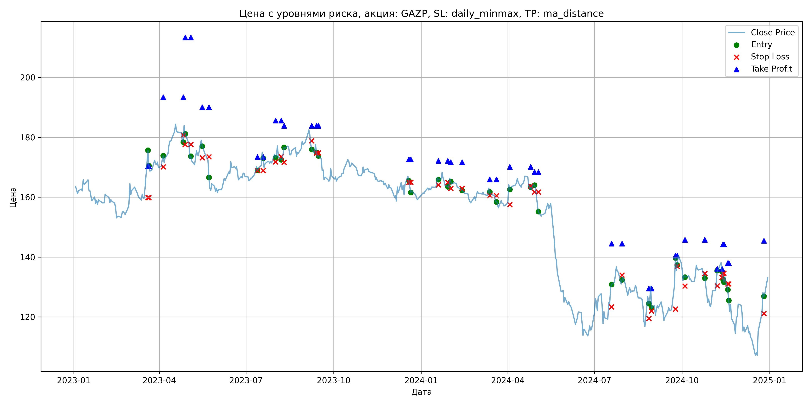
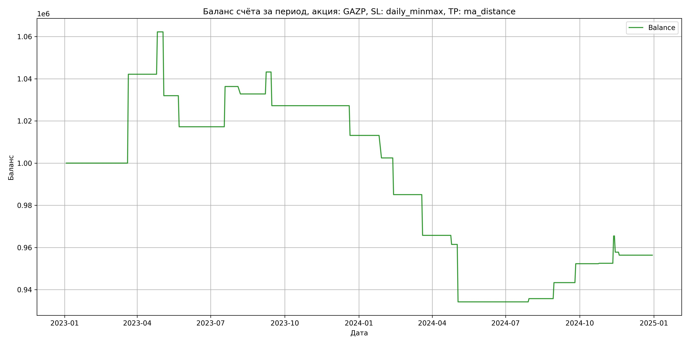

# Результаты торговой стратегии для GAZP

**Дата:** 2025-05-17 12:23:10  
**Стратегия:** GAZP,_SL_daily_minmax,_TP_ma_distance

## Конфигурация

```json
{
    "TICKER": "GAZP",
    "EXCHANGE": "MOEX",
    "START_DATE": "2023-01-01",
    "END_DATE": "2024-12-31",
    "INTERVAL": "1d",
    "CAPITAL": 1000000,
    "RISK_PERCENT": 0.02,
    "PROFIT_TO_RISK": 3,
    "ATR_MULTIPLIER": 1.5,
    "ATR_WINDOW": 14,
    "STOP_LOSS_METHOD": "daily_minmax",
    "TAKE_PROFIT_METHOD": "ma_distance",
    "POSITION": "long"
}
```

## Метрики эффективности

- **Начальный баланс:** 1000000.00
- **Конечный баланс:** 956337.74
- **Прибыль/Убыток:** -43662.26 (-4.37% за период тестирования)
- **Количество сделок:** 21
- **Процент выигрышных сделок:** 42.86% (9 выигрышных, 12 убыточных)
- **Средняя прибыль:** 13666.67
- **Средний убыток:** -13888.52
- **Максимальная прибыль:** 42154.40
- **Максимальный убыток:** -30259.53
- **Коэффициент прибыли:** 0.74
- **Максимальная просадка:** -12.05%

## Графики

### График цены с уровнями риска



### График баланса счёта



## Завершённые сделки

**Всего сделок:** 43

| Сделка № | Дата | Тип | Покупка / продажа | Количество акций | Цена | Stop Loss в момент сделки | Take Profit в момент сделки | Прибыль / убыток | Прибыль / убыток с учётом комиссии |
|:--------:|:----:|:---:|:-----------------:|:----------------:|:----:|:-------------------------:|:---------------------------:|:----------------:|:----------------------------------:|
| 1 | 2023-03-20 00:00:00 | LONG | BUY | 3634 | 164.40 | 159.85 | 170.40 | 0.00 | -298.71 |
| 2 | 2023-03-21 00:00:00 | LONG | SELL | -3634 | 176.00 | 159.85 | 170.40 | 42154.40 | 41535.89 |
| 3 | 2023-04-05 00:00:00 | LONG | BUY | 3090 | 172.55 | 170.14 | 193.37 | 0.00 | -266.59 |
| 4 | 2023-04-26 00:00:00 | LONG | SELL | -3090 | 179.05 | 180.70 | 193.37 | 20085.00 | 19541.78 |
| 5 | 2023-04-28 00:00:00 | LONG | BUY | 2709 | 184.40 | 177.62 | 213.34 | 0.00 | -249.77 |
| 6 | 2023-05-04 00:00:00 | LONG | SELL | -2709 | 173.23 | 177.62 | 213.34 | -30259.53 | -30743.94 |
| 7 | 2023-05-16 00:00:00 | LONG | BUY | 2100 | 179.90 | 173.20 | 190.07 | 0.00 | -188.90 |
| 8 | 2023-05-23 00:00:00 | LONG | SELL | -2100 | 172.88 | 173.52 | 190.07 | -14742.00 | -15112.42 |
| 9 | 2023-07-13 00:00:00 | LONG | BUY | 3826 | 170.51 | 168.93 | 173.44 | 0.00 | -326.19 |
| 10 | 2023-07-19 00:00:00 | LONG | SELL | -3826 | 175.50 | 168.93 | 173.44 | 19091.74 | 18429.82 |
| 11 | 2023-08-01 00:00:00 | LONG | BUY | 4150 | 175.10 | 171.80 | 185.57 | 0.00 | -363.33 |
| 12 | 2023-08-07 00:00:00 | LONG | SELL | -4150 | 174.25 | 173.56 | 185.57 | -3527.50 | -4252.40 |
| 13 | 2023-08-10 00:00:00 | LONG | BUY | 3829 | 175.22 | 171.69 | 183.88 | 0.00 | -335.46 |
| 14 | 2023-09-08 00:00:00 | LONG | SELL | -3829 | 177.94 | 178.83 | 183.88 | 10414.88 | 9738.76 |
| 15 | 2023-09-13 00:00:00 | LONG | BUY | 3716 | 177.80 | 174.80 | 183.89 | 0.00 | -330.35 |
| 16 | 2023-09-15 00:00:00 | LONG | SELL | -3716 | 173.50 | 174.80 | 183.89 | -15978.80 | -16631.52 |
| 17 | 2023-12-19 00:00:00 | LONG | BUY | 3665 | 167.17 | 164.99 | 172.62 | 0.00 | -306.34 |
| 18 | 2023-12-21 00:00:00 | LONG | SELL | -3665 | 163.32 | 164.99 | 172.62 | -14110.25 | -14715.87 |
| 19 | 2024-01-19 00:00:00 | LONG | BUY | 4236 | 166.52 | 164.12 | 172.16 | 0.00 | -352.69 |
| 20 | 2024-01-29 00:00:00 | LONG | SELL | -4236 | 164.00 | 164.94 | 172.16 | -10674.72 | -11374.76 |
| 21 | 2024-02-01 00:00:00 | LONG | BUY | 4193 | 166.75 | 162.90 | 171.69 | 0.00 | -349.59 |
| 22 | 2024-02-13 00:00:00 | LONG | SELL | -4193 | 162.60 | 162.90 | 171.69 | -17400.95 | -18091.43 |
| 23 | 2024-03-13 00:00:00 | LONG | BUY | 4201 | 163.20 | 160.56 | 165.94 | 0.00 | -342.80 |
| 24 | 2024-03-20 00:00:00 | LONG | SELL | -4201 | 158.60 | 160.56 | 165.94 | -19324.60 | -20000.54 |
| 25 | 2024-04-03 00:00:00 | LONG | BUY | 4085 | 164.05 | 157.51 | 170.12 | 0.00 | -335.07 |
| 26 | 2024-04-25 00:00:00 | LONG | SELL | -4085 | 163.00 | 163.69 | 170.12 | -4289.25 | -4957.25 |
| 27 | 2024-04-29 00:00:00 | LONG | BUY | 4067 | 164.10 | 161.70 | 168.38 | 0.00 | -333.70 |
| 28 | 2024-05-03 00:00:00 | LONG | SELL | -4067 | 157.40 | 161.70 | 168.38 | -27248.90 | -27902.67 |
| 29 | 2024-07-19 00:00:00 | LONG | BUY | 2193 | 130.10 | 123.38 | 144.48 | 0.00 | -142.65 |
| 30 | 2024-07-30 00:00:00 | LONG | SELL | -2193 | 130.80 | 134.00 | 144.48 | 1535.10 | 1249.02 |
| 31 | 2024-08-27 00:00:00 | LONG | BUY | 2114 | 127.30 | 119.49 | 129.51 | 0.00 | -134.56 |
| 32 | 2024-08-30 00:00:00 | LONG | SELL | -2114 | 130.89 | 122.02 | 129.51 | 7589.26 | 7316.35 |
| 33 | 2024-09-24 00:00:00 | LONG | BUY | 2238 | 130.90 | 122.62 | 140.52 | 0.00 | -146.48 |
| 34 | 2024-09-26 00:00:00 | LONG | SELL | -2238 | 134.91 | 136.92 | 140.52 | 8974.38 | 8676.94 |
| 35 | 2024-10-04 00:00:00 | LONG | BUY | 2226 | 134.06 | 130.32 | 145.82 | 0.00 | -149.21 |
| 36 | 2024-10-25 00:00:00 | LONG | SELL | -2226 | 134.15 | 134.50 | 145.82 | 200.34 | -98.18 |
| 37 | 2024-11-07 00:00:00 | LONG | BUY | 2170 | 131.85 | 130.40 | 136.05 | 0.00 | -143.06 |
| 38 | 2024-11-12 00:00:00 | LONG | SELL | -2170 | 137.82 | 133.18 | 136.05 | 12954.90 | 12662.31 |
| 39 | 2024-11-13 00:00:00 | LONG | BUY | 2667 | 134.90 | 134.64 | 144.28 | 0.00 | -179.89 |
| 40 | 2024-11-14 00:00:00 | LONG | SELL | -2667 | 132.02 | 134.64 | 144.28 | -7680.96 | -8036.90 |
| 41 | 2024-11-18 00:00:00 | LONG | BUY | 2740 | 129.50 | 131.02 | 138.01 | 0.00 | -177.42 |
| 42 | 2024-11-19 00:00:00 | LONG | SELL | -2740 | 128.98 | 131.02 | 138.01 | -1424.80 | -1778.92 |
| 43 | 2024-12-26 00:00:00 | LONG | BUY | 1870 | 128.40 | 121.12 | 145.45 | 0.00 | -120.05 |
