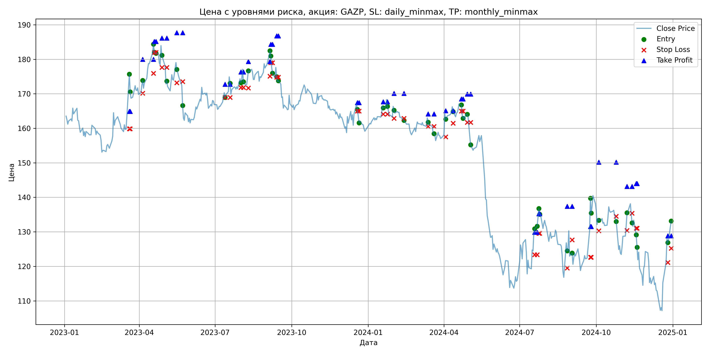
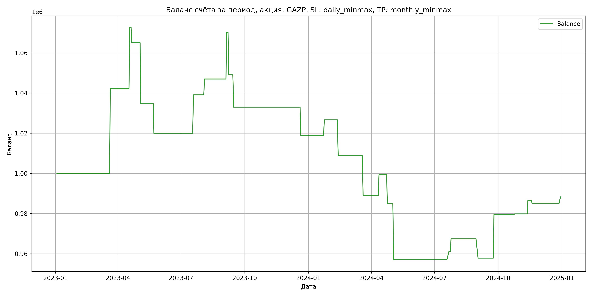

# Результаты торговой стратегии для GAZP

**Дата:** 2025-05-17 12:23:09  
**Стратегия:** GAZP,_SL_daily_minmax,_TP_monthly_minmax

## Конфигурация

```json
{
    "TICKER": "GAZP",
    "EXCHANGE": "MOEX",
    "START_DATE": "2023-01-01",
    "END_DATE": "2024-12-31",
    "INTERVAL": "1d",
    "CAPITAL": 1000000,
    "RISK_PERCENT": 0.02,
    "PROFIT_TO_RISK": 3,
    "ATR_MULTIPLIER": 1.5,
    "ATR_WINDOW": 14,
    "STOP_LOSS_METHOD": "daily_minmax",
    "TAKE_PROFIT_METHOD": "monthly_minmax",
    "POSITION": "long"
}
```

## Метрики эффективности

- **Начальный баланс:** 1000000.00
- **Конечный баланс:** 988294.12
- **Прибыль/Убыток:** -11705.88 (-1.17% за период тестирования)
- **Количество сделок:** 25
- **Процент выигрышных сделок:** 52.00% (13 выигрышных, 12 убыточных)
- **Средняя прибыль:** 14103.56
- **Средний убыток:** -16254.35
- **Максимальная прибыль:** 42154.40
- **Максимальный убыток:** -30315.38
- **Коэффициент прибыли:** 0.94
- **Максимальная просадка:** -10.78%

## Графики

### График цены с уровнями риска



### График баланса счёта



## Завершённые сделки

**Всего сделок:** 50

| Сделка № | Дата | Тип | Покупка / продажа | Количество акций | Цена | Stop Loss в момент сделки | Take Profit в момент сделки | Прибыль / убыток | Прибыль / убыток с учётом комиссии |
|:--------:|:----:|:---:|:-----------------:|:----------------:|:----:|:-------------------------:|:---------------------------:|:----------------:|:----------------------------------:|
| 1 | 2023-03-20 00:00:00 | LONG | BUY | 3634 | 164.40 | 159.85 | 164.88 | 0.00 | -298.71 |
| 2 | 2023-03-21 00:00:00 | LONG | SELL | -3634 | 176.00 | 159.85 | 164.88 | 42154.40 | 41535.89 |
| 3 | 2023-04-05 00:00:00 | LONG | BUY | 3090 | 172.55 | 170.14 | 179.98 | 0.00 | -266.59 |
| 4 | 2023-04-18 00:00:00 | LONG | SELL | -3090 | 182.41 | 175.91 | 179.98 | 30467.40 | 29918.99 |
| 5 | 2023-04-19 00:00:00 | LONG | BUY | 3267 | 184.33 | 182.00 | 185.14 | 0.00 | -301.10 |
| 6 | 2023-04-21 00:00:00 | LONG | SELL | -3267 | 182.00 | 182.00 | 185.14 | -7612.11 | -8210.51 |
| 7 | 2023-04-28 00:00:00 | LONG | BUY | 2714 | 184.40 | 177.62 | 186.12 | 0.00 | -250.23 |
| 8 | 2023-05-04 00:00:00 | LONG | SELL | -2714 | 173.23 | 177.62 | 186.12 | -30315.38 | -30800.68 |
| 9 | 2023-05-16 00:00:00 | LONG | BUY | 2104 | 179.90 | 173.20 | 187.67 | 0.00 | -189.25 |
| 10 | 2023-05-23 00:00:00 | LONG | SELL | -2104 | 172.88 | 173.52 | 187.67 | -14770.08 | -15141.20 |
| 11 | 2023-07-13 00:00:00 | LONG | BUY | 3833 | 170.51 | 168.93 | 172.73 | 0.00 | -326.78 |
| 12 | 2023-07-19 00:00:00 | LONG | SELL | -3833 | 175.50 | 168.93 | 172.73 | 19126.67 | 18463.54 |
| 13 | 2023-08-01 00:00:00 | LONG | BUY | 4158 | 175.10 | 171.80 | 176.30 | 0.00 | -364.03 |
| 14 | 2023-08-04 00:00:00 | LONG | SELL | -4158 | 177.00 | 171.80 | 176.30 | 7900.20 | 7168.18 |
| 15 | 2023-08-10 00:00:00 | LONG | BUY | 3879 | 175.22 | 171.69 | 179.35 | 0.00 | -339.84 |
| 16 | 2023-09-05 00:00:00 | LONG | SELL | -3879 | 181.20 | 175.12 | 179.35 | 23196.42 | 22505.14 |
| 17 | 2023-09-06 00:00:00 | LONG | BUY | 4025 | 183.19 | 179.00 | 184.30 | 0.00 | -368.67 |
| 18 | 2023-09-08 00:00:00 | LONG | SELL | -4025 | 177.94 | 179.00 | 184.30 | -21131.25 | -21858.02 |
| 19 | 2023-09-13 00:00:00 | LONG | BUY | 3732 | 177.80 | 174.80 | 186.79 | 0.00 | -331.77 |
| 20 | 2023-09-15 00:00:00 | LONG | SELL | -3732 | 173.50 | 174.80 | 186.79 | -16047.60 | -16703.13 |
| 21 | 2023-12-19 00:00:00 | LONG | BUY | 3681 | 167.17 | 164.99 | 167.40 | 0.00 | -307.68 |
| 22 | 2023-12-21 00:00:00 | LONG | SELL | -3681 | 163.32 | 164.99 | 167.40 | -14171.85 | -14780.12 |
| 23 | 2024-01-19 00:00:00 | LONG | BUY | 4254 | 166.52 | 164.12 | 167.68 | 0.00 | -354.19 |
| 24 | 2024-01-24 00:00:00 | LONG | SELL | -4254 | 168.36 | 164.12 | 167.68 | 7827.36 | 7115.07 |
| 25 | 2024-02-01 00:00:00 | LONG | BUY | 4289 | 166.75 | 162.90 | 170.11 | 0.00 | -357.60 |
| 26 | 2024-02-13 00:00:00 | LONG | SELL | -4289 | 162.60 | 162.90 | 170.11 | -17799.35 | -18505.64 |
| 27 | 2024-03-13 00:00:00 | LONG | BUY | 4297 | 163.20 | 160.56 | 164.13 | 0.00 | -350.64 |
| 28 | 2024-03-20 00:00:00 | LONG | SELL | -4297 | 158.60 | 160.56 | 164.13 | -19766.20 | -20457.59 |
| 29 | 2024-04-03 00:00:00 | LONG | BUY | 4179 | 164.05 | 157.51 | 165.08 | 0.00 | -342.78 |
| 30 | 2024-04-12 00:00:00 | LONG | SELL | -4179 | 166.52 | 161.45 | 165.08 | 10322.13 | 9631.40 |
| 31 | 2024-04-22 00:00:00 | LONG | BUY | 4148 | 167.20 | 165.00 | 168.48 | 0.00 | -346.77 |
| 32 | 2024-04-24 00:00:00 | LONG | SELL | -4148 | 163.70 | 165.00 | 168.48 | -14518.00 | -15204.29 |
| 33 | 2024-04-29 00:00:00 | LONG | BUY | 4158 | 164.10 | 161.70 | 169.94 | 0.00 | -341.16 |
| 34 | 2024-05-03 00:00:00 | LONG | SELL | -4158 | 157.40 | 161.70 | 169.94 | -27858.60 | -28527.00 |
| 35 | 2024-07-19 00:00:00 | LONG | BUY | 2242 | 130.10 | 123.38 | 129.86 | 0.00 | -145.84 |
| 36 | 2024-07-22 00:00:00 | LONG | SELL | -2242 | 131.96 | 123.38 | 129.86 | 4170.12 | 3876.35 |
| 37 | 2024-07-24 00:00:00 | LONG | BUY | 2330 | 134.07 | 129.57 | 135.22 | 0.00 | -156.19 |
| 38 | 2024-07-25 00:00:00 | LONG | SELL | -2330 | 136.75 | 129.57 | 135.22 | 6244.40 | 5928.89 |
| 39 | 2024-08-27 00:00:00 | LONG | BUY | 2181 | 127.30 | 119.49 | 137.37 | 0.00 | -138.82 |
| 40 | 2024-09-02 00:00:00 | LONG | SELL | -2181 | 122.90 | 127.66 | 137.37 | -9596.40 | -9869.24 |
| 41 | 2024-09-24 00:00:00 | LONG | BUY | 2267 | 130.90 | 122.62 | 131.53 | 0.00 | -148.38 |
| 42 | 2024-09-25 00:00:00 | LONG | SELL | -2267 | 140.50 | 122.62 | 131.53 | 21763.20 | 21455.57 |
| 43 | 2024-10-04 00:00:00 | LONG | BUY | 2285 | 134.06 | 130.32 | 150.20 | 0.00 | -153.16 |
| 44 | 2024-10-25 00:00:00 | LONG | SELL | -2285 | 134.15 | 134.50 | 150.20 | 205.65 | -100.78 |
| 45 | 2024-11-07 00:00:00 | LONG | BUY | 2228 | 131.85 | 130.40 | 143.14 | 0.00 | -146.88 |
| 46 | 2024-11-13 00:00:00 | LONG | SELL | -2228 | 134.90 | 135.36 | 143.14 | 6795.40 | 6498.24 |
| 47 | 2024-11-18 00:00:00 | LONG | BUY | 2818 | 129.50 | 131.02 | 143.98 | 0.00 | -182.47 |
| 48 | 2024-11-19 00:00:00 | LONG | SELL | -2818 | 128.98 | 131.02 | 143.98 | -1465.36 | -1829.56 |
| 49 | 2024-12-26 00:00:00 | LONG | BUY | 1923 | 128.40 | 121.12 | 128.85 | 0.00 | -123.46 |
| 50 | 2024-12-30 00:00:00 | LONG | SELL | -1923 | 130.05 | 125.23 | 128.85 | 3172.95 | 2924.45 |
