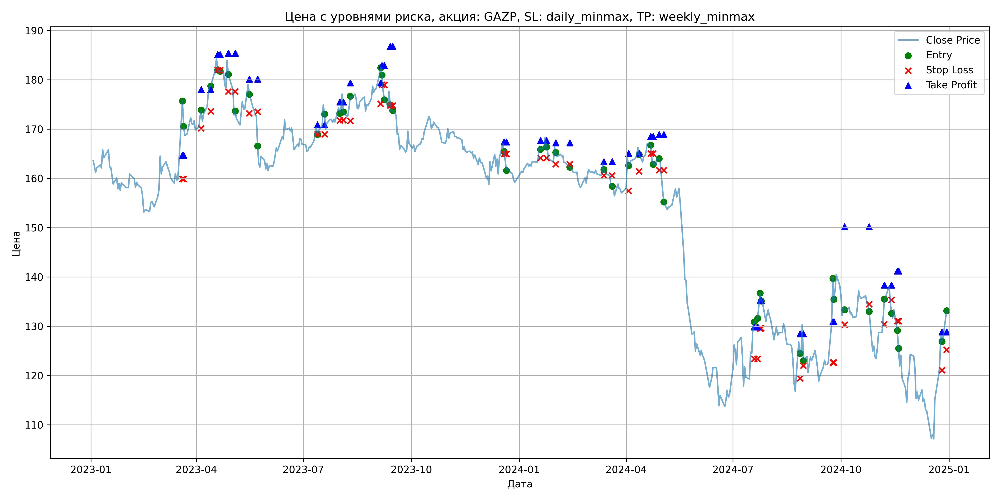
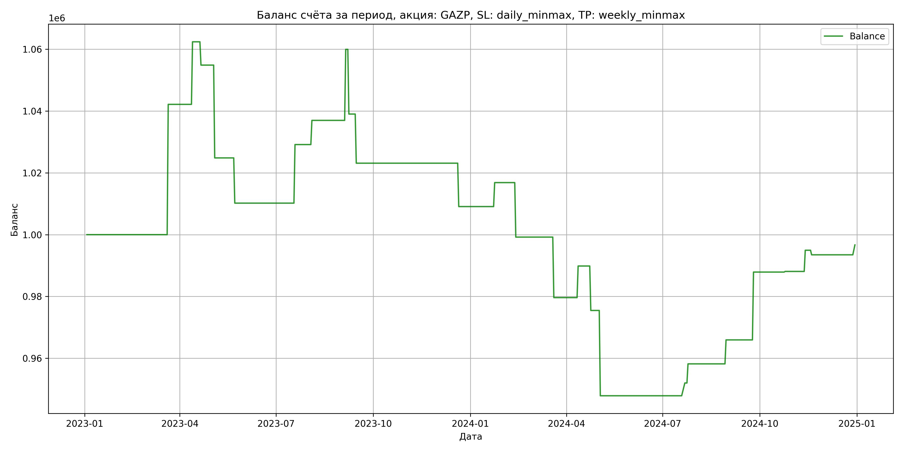

# Результаты торговой стратегии для GAZP

**Дата:** 2025-05-17 12:23:09  
**Стратегия:** GAZP,_SL_daily_minmax,_TP_weekly_minmax

## Конфигурация

```json
{
    "TICKER": "GAZP",
    "EXCHANGE": "MOEX",
    "START_DATE": "2023-01-01",
    "END_DATE": "2024-12-31",
    "INTERVAL": "1d",
    "CAPITAL": 1000000,
    "RISK_PERCENT": 0.02,
    "PROFIT_TO_RISK": 3,
    "ATR_MULTIPLIER": 1.5,
    "ATR_WINDOW": 14,
    "STOP_LOSS_METHOD": "daily_minmax",
    "TAKE_PROFIT_METHOD": "weekly_minmax",
    "POSITION": "long"
}
```

## Метрики эффективности

- **Начальный баланс:** 1000000.00
- **Конечный баланс:** 996680.58
- **Прибыль/Убыток:** -3319.42 (-0.33% за период тестирования)
- **Количество сделок:** 25
- **Процент выигрышных сделок:** 56.00% (14 выигрышных, 11 убыточных)
- **Средняя прибыль:** 12885.41
- **Средний убыток:** -16701.38
- **Максимальная прибыль:** 42154.40
- **Максимальный убыток:** -30024.96
- **Коэффициент прибыли:** 0.98
- **Максимальная просадка:** -10.78%

## Графики

### График цены с уровнями риска



### График баланса счёта



## Завершённые сделки

**Всего сделок:** 50

| Сделка № | Дата | Тип | Покупка / продажа | Количество акций | Цена | Stop Loss в момент сделки | Take Profit в момент сделки | Прибыль / убыток | Прибыль / убыток с учётом комиссии |
|:--------:|:----:|:---:|:-----------------:|:----------------:|:----:|:-------------------------:|:---------------------------:|:----------------:|:----------------------------------:|
| 1 | 2023-03-20 00:00:00 | LONG | BUY | 3634 | 164.40 | 159.85 | 164.69 | 0.00 | -298.71 |
| 2 | 2023-03-21 00:00:00 | LONG | SELL | -3634 | 176.00 | 159.85 | 164.69 | 42154.40 | 41535.89 |
| 3 | 2023-04-05 00:00:00 | LONG | BUY | 3090 | 172.55 | 170.14 | 178.01 | 0.00 | -266.59 |
| 4 | 2023-04-13 00:00:00 | LONG | SELL | -3090 | 179.10 | 173.64 | 178.01 | 20239.50 | 19696.20 |
| 5 | 2023-04-19 00:00:00 | LONG | BUY | 3236 | 184.33 | 182.00 | 185.14 | 0.00 | -298.25 |
| 6 | 2023-04-21 00:00:00 | LONG | SELL | -3236 | 182.00 | 182.00 | 185.14 | -7539.88 | -8132.60 |
| 7 | 2023-04-28 00:00:00 | LONG | BUY | 2688 | 184.40 | 177.62 | 185.40 | 0.00 | -247.83 |
| 8 | 2023-05-04 00:00:00 | LONG | SELL | -2688 | 173.23 | 177.62 | 185.40 | -30024.96 | -30505.61 |
| 9 | 2023-05-16 00:00:00 | LONG | BUY | 2084 | 179.90 | 173.20 | 180.13 | 0.00 | -187.46 |
| 10 | 2023-05-23 00:00:00 | LONG | SELL | -2084 | 172.88 | 173.52 | 180.13 | -14629.68 | -14997.28 |
| 11 | 2023-07-13 00:00:00 | LONG | BUY | 3797 | 170.51 | 168.93 | 170.85 | 0.00 | -323.71 |
| 12 | 2023-07-19 00:00:00 | LONG | SELL | -3797 | 175.50 | 168.93 | 170.85 | 18947.03 | 18290.13 |
| 13 | 2023-08-01 00:00:00 | LONG | BUY | 4119 | 175.10 | 171.80 | 175.49 | 0.00 | -360.62 |
| 14 | 2023-08-04 00:00:00 | LONG | SELL | -4119 | 177.00 | 171.80 | 175.49 | 7826.10 | 7100.95 |
| 15 | 2023-08-10 00:00:00 | LONG | BUY | 3842 | 175.22 | 171.69 | 179.35 | 0.00 | -336.60 |
| 16 | 2023-09-05 00:00:00 | LONG | SELL | -3842 | 181.20 | 175.12 | 179.35 | 22975.16 | 22290.48 |
| 17 | 2023-09-06 00:00:00 | LONG | BUY | 3986 | 183.19 | 179.00 | 182.89 | 0.00 | -365.10 |
| 18 | 2023-09-08 00:00:00 | LONG | SELL | -3986 | 177.94 | 179.00 | 182.89 | -20926.50 | -21646.23 |
| 19 | 2023-09-13 00:00:00 | LONG | BUY | 3697 | 177.80 | 174.80 | 186.79 | 0.00 | -328.66 |
| 20 | 2023-09-15 00:00:00 | LONG | SELL | -3697 | 173.50 | 174.80 | 186.79 | -15897.10 | -16546.48 |
| 21 | 2023-12-19 00:00:00 | LONG | BUY | 3646 | 167.17 | 164.99 | 167.40 | 0.00 | -304.75 |
| 22 | 2023-12-21 00:00:00 | LONG | SELL | -3646 | 163.32 | 164.99 | 167.40 | -14037.10 | -14639.58 |
| 23 | 2024-01-19 00:00:00 | LONG | BUY | 4213 | 166.52 | 164.12 | 167.68 | 0.00 | -350.77 |
| 24 | 2024-01-24 00:00:00 | LONG | SELL | -4213 | 168.36 | 164.12 | 167.68 | 7751.92 | 7046.50 |
| 25 | 2024-02-01 00:00:00 | LONG | BUY | 4248 | 166.75 | 162.90 | 167.21 | 0.00 | -354.18 |
| 26 | 2024-02-13 00:00:00 | LONG | SELL | -4248 | 162.60 | 162.90 | 167.21 | -17629.20 | -18328.74 |
| 27 | 2024-03-13 00:00:00 | LONG | BUY | 4256 | 163.20 | 160.56 | 163.39 | 0.00 | -347.29 |
| 28 | 2024-03-20 00:00:00 | LONG | SELL | -4256 | 158.60 | 160.56 | 163.39 | -19577.60 | -20262.39 |
| 29 | 2024-04-03 00:00:00 | LONG | BUY | 4139 | 164.05 | 157.51 | 165.08 | 0.00 | -339.50 |
| 30 | 2024-04-12 00:00:00 | LONG | SELL | -4139 | 166.52 | 161.45 | 165.08 | 10223.33 | 9539.22 |
| 31 | 2024-04-22 00:00:00 | LONG | BUY | 4108 | 167.20 | 165.00 | 168.48 | 0.00 | -343.43 |
| 32 | 2024-04-24 00:00:00 | LONG | SELL | -4108 | 163.70 | 165.00 | 168.48 | -14378.00 | -15057.67 |
| 33 | 2024-04-29 00:00:00 | LONG | BUY | 4119 | 164.10 | 161.70 | 168.90 | 0.00 | -337.96 |
| 34 | 2024-05-03 00:00:00 | LONG | SELL | -4119 | 157.40 | 161.70 | 168.90 | -27597.30 | -28259.43 |
| 35 | 2024-07-19 00:00:00 | LONG | BUY | 2221 | 130.10 | 123.38 | 129.86 | 0.00 | -144.48 |
| 36 | 2024-07-22 00:00:00 | LONG | SELL | -2221 | 131.96 | 123.38 | 129.86 | 4131.06 | 3840.04 |
| 37 | 2024-07-24 00:00:00 | LONG | BUY | 2308 | 134.07 | 129.57 | 135.22 | 0.00 | -154.72 |
| 38 | 2024-07-25 00:00:00 | LONG | SELL | -2308 | 136.75 | 129.57 | 135.22 | 6185.44 | 5872.91 |
| 39 | 2024-08-27 00:00:00 | LONG | BUY | 2160 | 127.30 | 119.49 | 128.46 | 0.00 | -137.48 |
| 40 | 2024-08-30 00:00:00 | LONG | SELL | -2160 | 130.89 | 122.02 | 128.46 | 7754.40 | 7475.55 |
| 41 | 2024-09-24 00:00:00 | LONG | BUY | 2286 | 130.90 | 122.62 | 130.91 | 0.00 | -149.62 |
| 42 | 2024-09-25 00:00:00 | LONG | SELL | -2286 | 140.50 | 122.62 | 130.91 | 21945.60 | 21635.39 |
| 43 | 2024-10-04 00:00:00 | LONG | BUY | 2305 | 134.06 | 130.32 | 150.20 | 0.00 | -154.50 |
| 44 | 2024-10-25 00:00:00 | LONG | SELL | -2305 | 134.15 | 134.50 | 150.20 | 207.45 | -101.66 |
| 45 | 2024-11-07 00:00:00 | LONG | BUY | 2247 | 131.85 | 130.40 | 138.34 | 0.00 | -148.13 |
| 46 | 2024-11-13 00:00:00 | LONG | SELL | -2247 | 134.90 | 135.36 | 138.34 | 6853.35 | 6553.66 |
| 47 | 2024-11-18 00:00:00 | LONG | BUY | 2842 | 129.50 | 131.02 | 141.21 | 0.00 | -184.02 |
| 48 | 2024-11-19 00:00:00 | LONG | SELL | -2842 | 128.98 | 131.02 | 141.21 | -1477.84 | -1845.14 |
| 49 | 2024-12-26 00:00:00 | LONG | BUY | 1940 | 128.40 | 121.12 | 128.85 | 0.00 | -124.55 |
| 50 | 2024-12-30 00:00:00 | LONG | SELL | -1940 | 130.05 | 125.23 | 128.85 | 3201.00 | 2950.30 |
