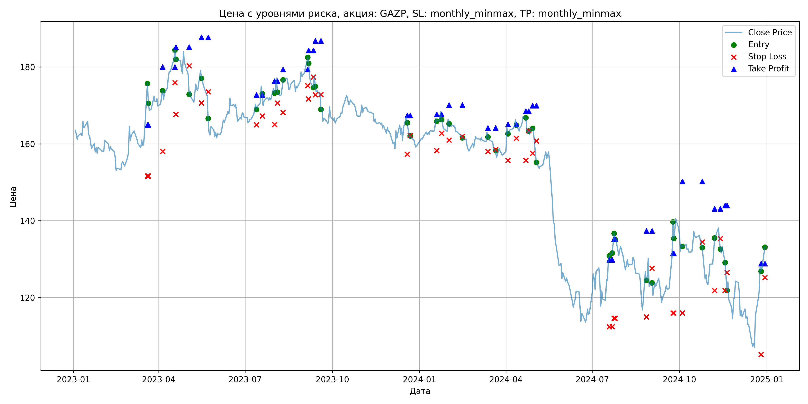
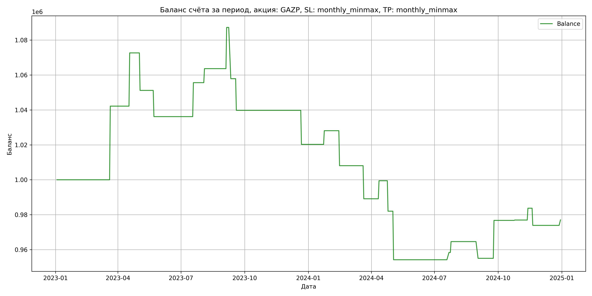

# Результаты торговой стратегии для GAZP

**Дата:** 2025-05-17 12:23:20  
**Стратегия:** GAZP,_SL_monthly_minmax,_TP_monthly_minmax

## Конфигурация

```json
{
    "TICKER": "GAZP",
    "EXCHANGE": "MOEX",
    "START_DATE": "2023-01-01",
    "END_DATE": "2024-12-31",
    "INTERVAL": "1d",
    "CAPITAL": 1000000,
    "RISK_PERCENT": 0.02,
    "PROFIT_TO_RISK": 3,
    "ATR_MULTIPLIER": 1.5,
    "ATR_WINDOW": 14,
    "STOP_LOSS_METHOD": "monthly_minmax",
    "TAKE_PROFIT_METHOD": "monthly_minmax",
    "POSITION": "long"
}
```

## Метрики эффективности

- **Начальный баланс:** 1000000.00
- **Конечный баланс:** 977035.10
- **Прибыль/Убыток:** -22964.90 (-2.30% за период тестирования)
- **Количество сделок:** 24
- **Процент выигрышных сделок:** 54.17% (13 выигрышных, 11 убыточных)
- **Средняя прибыль:** 14158.28
- **Средний убыток:** -18820.23
- **Максимальная прибыль:** 42154.40
- **Максимальный убыток:** -29332.47
- **Коэффициент прибыли:** 0.89
- **Максимальная просадка:** -12.23%

## Графики

### График цены с уровнями риска



### График баланса счёта



## Завершённые сделки

**Всего сделок:** 48

| Сделка № | Дата | Тип | Покупка / продажа | Количество акций | Цена | Stop Loss в момент сделки | Take Profit в момент сделки | Прибыль / убыток | Прибыль / убыток с учётом комиссии |
|:--------:|:----:|:---:|:-----------------:|:----------------:|:----:|:-------------------------:|:---------------------------:|:----------------:|:----------------------------------:|
| 1 | 2023-03-20 00:00:00 | LONG | BUY | 3634 | 164.40 | 151.62 | 164.88 | 0.00 | -298.71 |
| 2 | 2023-03-21 00:00:00 | LONG | SELL | -3634 | 176.00 | 151.62 | 164.88 | 42154.40 | 41535.89 |
| 3 | 2023-04-05 00:00:00 | LONG | BUY | 3090 | 172.55 | 158.05 | 179.98 | 0.00 | -266.59 |
| 4 | 2023-04-18 00:00:00 | LONG | SELL | -3090 | 182.41 | 175.91 | 179.98 | 30467.40 | 29918.99 |
| 5 | 2023-04-19 00:00:00 | LONG | BUY | 3267 | 184.33 | 167.70 | 185.14 | 0.00 | -301.10 |
| 6 | 2023-05-03 00:00:00 | LONG | SELL | -3267 | 177.76 | 180.27 | 185.14 | -21464.19 | -22055.66 |
| 7 | 2023-05-16 00:00:00 | LONG | BUY | 2138 | 179.90 | 170.63 | 187.67 | 0.00 | -192.31 |
| 8 | 2023-05-23 00:00:00 | LONG | SELL | -2138 | 172.88 | 173.52 | 187.67 | -15008.76 | -15385.88 |
| 9 | 2023-07-13 00:00:00 | LONG | BUY | 3896 | 170.51 | 165.00 | 172.73 | 0.00 | -332.15 |
| 10 | 2023-07-19 00:00:00 | LONG | SELL | -3896 | 175.50 | 167.22 | 172.73 | 19441.04 | 18767.01 |
| 11 | 2023-08-01 00:00:00 | LONG | BUY | 4227 | 175.10 | 165.02 | 176.30 | 0.00 | -370.07 |
| 12 | 2023-08-04 00:00:00 | LONG | SELL | -4227 | 177.00 | 170.59 | 176.30 | 8031.30 | 7287.14 |
| 13 | 2023-08-10 00:00:00 | LONG | BUY | 3943 | 175.22 | 168.12 | 179.35 | 0.00 | -345.45 |
| 14 | 2023-09-05 00:00:00 | LONG | SELL | -3943 | 181.20 | 175.12 | 179.35 | 23579.14 | 22876.46 |
| 15 | 2023-09-06 00:00:00 | LONG | BUY | 4091 | 183.19 | 171.69 | 184.30 | 0.00 | -374.72 |
| 16 | 2023-09-11 00:00:00 | LONG | SELL | -4091 | 176.02 | 177.34 | 184.30 | -29332.47 | -30067.23 |
| 17 | 2023-09-13 00:00:00 | LONG | BUY | 3766 | 177.80 | 172.80 | 186.79 | 0.00 | -334.80 |
| 18 | 2023-09-19 00:00:00 | LONG | SELL | -3766 | 172.99 | 172.80 | 186.79 | -18114.46 | -18775.00 |
| 19 | 2023-12-19 00:00:00 | LONG | BUY | 3707 | 167.17 | 157.26 | 167.40 | 0.00 | -309.85 |
| 20 | 2023-12-22 00:00:00 | LONG | SELL | -3707 | 161.91 | 162.17 | 167.40 | -19498.82 | -20108.77 |
| 21 | 2024-01-19 00:00:00 | LONG | BUY | 4262 | 166.52 | 158.22 | 167.68 | 0.00 | -354.85 |
| 22 | 2024-01-24 00:00:00 | LONG | SELL | -4262 | 168.36 | 162.74 | 167.68 | 7842.08 | 7128.45 |
| 23 | 2024-02-01 00:00:00 | LONG | BUY | 4297 | 166.75 | 161.00 | 170.11 | 0.00 | -358.26 |
| 24 | 2024-02-15 00:00:00 | LONG | SELL | -4297 | 162.09 | 161.94 | 170.11 | -20024.02 | -20730.53 |
| 25 | 2024-03-13 00:00:00 | LONG | BUY | 4296 | 163.20 | 158.00 | 164.13 | 0.00 | -350.55 |
| 26 | 2024-03-21 00:00:00 | LONG | SELL | -4296 | 158.79 | 158.53 | 164.13 | -18945.36 | -19636.99 |
| 27 | 2024-04-03 00:00:00 | LONG | BUY | 4181 | 164.05 | 155.75 | 165.08 | 0.00 | -342.95 |
| 28 | 2024-04-12 00:00:00 | LONG | SELL | -4181 | 166.52 | 161.45 | 165.08 | 10327.07 | 9636.01 |
| 29 | 2024-04-22 00:00:00 | LONG | BUY | 4150 | 167.20 | 155.75 | 168.48 | 0.00 | -346.94 |
| 30 | 2024-04-25 00:00:00 | LONG | SELL | -4150 | 163.00 | 163.43 | 168.48 | -17430.00 | -18115.16 |
| 31 | 2024-04-29 00:00:00 | LONG | BUY | 4148 | 164.10 | 157.51 | 169.94 | 0.00 | -340.34 |
| 32 | 2024-05-03 00:00:00 | LONG | SELL | -4148 | 157.40 | 160.75 | 169.94 | -27791.60 | -28458.39 |
| 33 | 2024-07-19 00:00:00 | LONG | BUY | 2237 | 130.10 | 112.46 | 129.86 | 0.00 | -145.52 |
| 34 | 2024-07-22 00:00:00 | LONG | SELL | -2237 | 131.96 | 112.46 | 129.86 | 4160.82 | 3867.71 |
| 35 | 2024-07-24 00:00:00 | LONG | BUY | 2324 | 134.07 | 114.65 | 135.22 | 0.00 | -155.79 |
| 36 | 2024-07-25 00:00:00 | LONG | SELL | -2324 | 136.75 | 114.65 | 135.22 | 6228.32 | 5913.63 |
| 37 | 2024-08-27 00:00:00 | LONG | BUY | 2176 | 127.30 | 115.00 | 137.37 | 0.00 | -138.50 |
| 38 | 2024-09-02 00:00:00 | LONG | SELL | -2176 | 122.90 | 127.66 | 137.37 | -9574.40 | -9846.62 |
| 39 | 2024-09-24 00:00:00 | LONG | BUY | 2261 | 130.90 | 116.01 | 131.53 | 0.00 | -147.98 |
| 40 | 2024-09-25 00:00:00 | LONG | SELL | -2261 | 140.50 | 116.01 | 131.53 | 21705.60 | 21398.78 |
| 41 | 2024-10-04 00:00:00 | LONG | BUY | 2279 | 134.06 | 116.01 | 150.20 | 0.00 | -152.76 |
| 42 | 2024-10-25 00:00:00 | LONG | SELL | -2279 | 134.15 | 134.50 | 150.20 | 205.11 | -100.52 |
| 43 | 2024-11-07 00:00:00 | LONG | BUY | 2222 | 131.85 | 121.85 | 143.14 | 0.00 | -146.49 |
| 44 | 2024-11-13 00:00:00 | LONG | SELL | -2222 | 134.90 | 135.36 | 143.14 | 6777.10 | 6480.74 |
| 45 | 2024-11-18 00:00:00 | LONG | BUY | 2811 | 129.50 | 121.85 | 143.98 | 0.00 | -182.01 |
| 46 | 2024-11-20 00:00:00 | LONG | SELL | -2811 | 126.00 | 126.54 | 143.98 | -9838.50 | -10197.61 |
| 47 | 2024-12-26 00:00:00 | LONG | BUY | 1902 | 128.40 | 105.22 | 128.85 | 0.00 | -122.11 |
| 48 | 2024-12-30 00:00:00 | LONG | SELL | -1902 | 130.05 | 125.23 | 128.85 | 3138.30 | 2892.51 |
