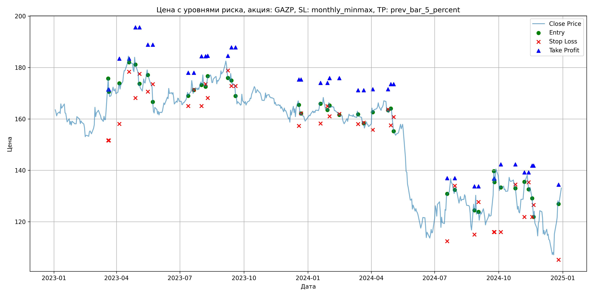
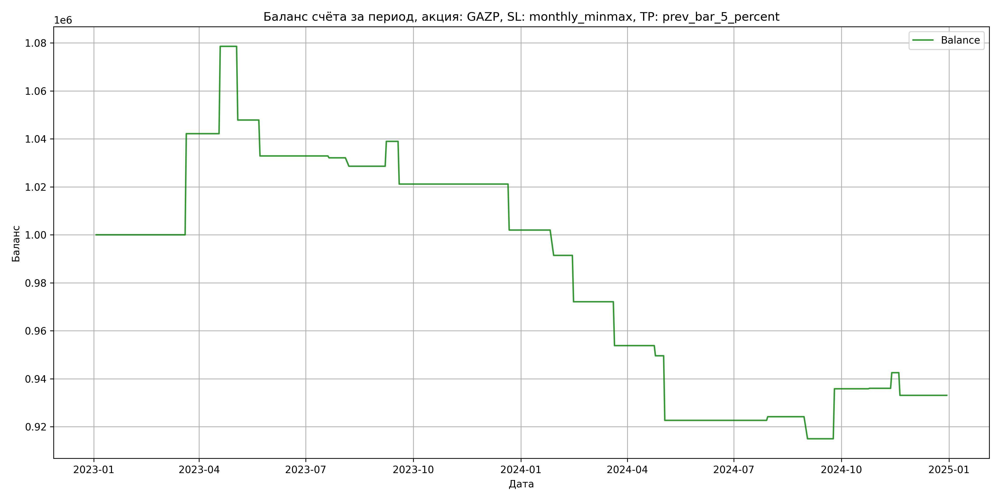

# Результаты торговой стратегии для GAZP

**Дата:** 2025-05-17 12:23:18  
**Стратегия:** GAZP,_SL_monthly_minmax,_TP_prev_bar_5_percent

## Конфигурация

```json
{
    "TICKER": "GAZP",
    "EXCHANGE": "MOEX",
    "START_DATE": "2023-01-01",
    "END_DATE": "2024-12-31",
    "INTERVAL": "1d",
    "CAPITAL": 1000000,
    "RISK_PERCENT": 0.02,
    "PROFIT_TO_RISK": 3,
    "ATR_MULTIPLIER": 1.5,
    "ATR_WINDOW": 14,
    "STOP_LOSS_METHOD": "monthly_minmax",
    "TAKE_PROFIT_METHOD": "prev_bar_5_percent",
    "POSITION": "long"
}
```

## Метрики эффективности

- **Начальный баланс:** 1000000.00
- **Конечный баланс:** 933087.48
- **Прибыль/Убыток:** -66912.52 (-6.69% за период тестирования)
- **Количество сделок:** 20
- **Процент выигрышных сделок:** 35.00% (7 выигрышных, 13 убыточных)
- **Средняя прибыль:** 16853.82
- **Средний убыток:** -14222.25
- **Максимальная прибыль:** 42154.40
- **Максимальный убыток:** -30717.50
- **Коэффициент прибыли:** 0.64
- **Максимальная просадка:** -15.16%

## Графики

### График цены с уровнями риска



### График баланса счёта



## Завершённые сделки

**Всего сделок:** 41

| Сделка № | Дата | Тип | Покупка / продажа | Количество акций | Цена | Stop Loss в момент сделки | Take Profit в момент сделки | Прибыль / убыток | Прибыль / убыток с учётом комиссии |
|:--------:|:----:|:---:|:-----------------:|:----------------:|:----:|:-------------------------:|:---------------------------:|:----------------:|:----------------------------------:|
| 1 | 2023-03-20 00:00:00 | LONG | BUY | 3634 | 164.40 | 151.62 | 171.45 | 0.00 | -298.71 |
| 2 | 2023-03-21 00:00:00 | LONG | SELL | -3634 | 176.00 | 151.62 | 171.45 | 42154.40 | 41535.89 |
| 3 | 2023-04-05 00:00:00 | LONG | BUY | 3090 | 172.55 | 158.05 | 183.46 | 0.00 | -266.59 |
| 4 | 2023-04-19 00:00:00 | LONG | SELL | -3090 | 184.33 | 178.35 | 183.46 | 36400.20 | 35848.82 |
| 5 | 2023-04-28 00:00:00 | LONG | BUY | 2750 | 184.40 | 168.14 | 195.58 | 0.00 | -253.55 |
| 6 | 2023-05-04 00:00:00 | LONG | SELL | -2750 | 173.23 | 177.51 | 195.58 | -30717.50 | -31209.24 |
| 7 | 2023-05-16 00:00:00 | LONG | BUY | 2132 | 179.90 | 170.63 | 188.89 | 0.00 | -191.77 |
| 8 | 2023-05-23 00:00:00 | LONG | SELL | -2132 | 172.88 | 173.52 | 188.89 | -14966.64 | -15342.70 |
| 9 | 2023-07-13 00:00:00 | LONG | BUY | 3884 | 170.51 | 165.00 | 177.96 | 0.00 | -331.13 |
| 10 | 2023-07-21 00:00:00 | LONG | SELL | -3884 | 170.31 | 171.39 | 177.96 | -776.80 | -1438.67 |
| 11 | 2023-08-01 00:00:00 | LONG | BUY | 4133 | 175.10 | 165.02 | 184.35 | 0.00 | -361.84 |
| 12 | 2023-08-07 00:00:00 | LONG | SELL | -4133 | 174.25 | 173.56 | 184.35 | -3513.05 | -4234.98 |
| 13 | 2023-08-10 00:00:00 | LONG | BUY | 3813 | 175.22 | 168.12 | 184.54 | 0.00 | -334.06 |
| 14 | 2023-09-08 00:00:00 | LONG | SELL | -3813 | 177.94 | 178.83 | 184.54 | 10371.36 | 9698.06 |
| 15 | 2023-09-13 00:00:00 | LONG | BUY | 3701 | 177.80 | 172.80 | 187.83 | 0.00 | -329.02 |
| 16 | 2023-09-19 00:00:00 | LONG | SELL | -3701 | 172.99 | 172.80 | 187.83 | -17801.81 | -18450.95 |
| 17 | 2023-12-19 00:00:00 | LONG | BUY | 3644 | 167.17 | 157.26 | 175.35 | 0.00 | -304.58 |
| 18 | 2023-12-22 00:00:00 | LONG | SELL | -3644 | 161.91 | 162.17 | 175.35 | -19167.44 | -19767.02 |
| 19 | 2024-01-19 00:00:00 | LONG | BUY | 4189 | 166.52 | 158.22 | 174.01 | 0.00 | -348.78 |
| 20 | 2024-01-29 00:00:00 | LONG | SELL | -4189 | 164.00 | 164.94 | 174.01 | -10556.28 | -11248.55 |
| 21 | 2024-02-01 00:00:00 | LONG | BUY | 4147 | 166.75 | 161.00 | 175.89 | 0.00 | -345.76 |
| 22 | 2024-02-15 00:00:00 | LONG | SELL | -4147 | 162.09 | 161.94 | 175.89 | -19325.02 | -20006.87 |
| 23 | 2024-03-13 00:00:00 | LONG | BUY | 4146 | 163.20 | 158.00 | 171.14 | 0.00 | -338.31 |
| 24 | 2024-03-21 00:00:00 | LONG | SELL | -4146 | 158.79 | 158.53 | 171.14 | -18283.86 | -18951.35 |
| 25 | 2024-04-03 00:00:00 | LONG | BUY | 4035 | 164.05 | 155.75 | 171.57 | 0.00 | -330.97 |
| 26 | 2024-04-25 00:00:00 | LONG | SELL | -4035 | 163.00 | 163.69 | 171.57 | -4236.75 | -4896.57 |
| 27 | 2024-04-29 00:00:00 | LONG | BUY | 4017 | 164.10 | 157.51 | 173.49 | 0.00 | -329.59 |
| 28 | 2024-05-03 00:00:00 | LONG | SELL | -4017 | 157.40 | 160.75 | 173.49 | -26913.90 | -27559.63 |
| 29 | 2024-07-19 00:00:00 | LONG | BUY | 2166 | 130.10 | 112.46 | 136.95 | 0.00 | -140.90 |
| 30 | 2024-07-30 00:00:00 | LONG | SELL | -2166 | 130.80 | 134.00 | 136.95 | 1516.20 | 1233.65 |
| 31 | 2024-08-27 00:00:00 | LONG | BUY | 2088 | 127.30 | 115.00 | 133.77 | 0.00 | -132.90 |
| 32 | 2024-09-02 00:00:00 | LONG | SELL | -2088 | 122.90 | 127.66 | 133.77 | -9187.20 | -9448.41 |
| 33 | 2024-09-24 00:00:00 | LONG | BUY | 2170 | 130.90 | 116.01 | 136.80 | 0.00 | -142.03 |
| 34 | 2024-09-25 00:00:00 | LONG | SELL | -2170 | 140.50 | 116.01 | 136.80 | 20832.00 | 20537.53 |
| 35 | 2024-10-04 00:00:00 | LONG | BUY | 2188 | 134.06 | 116.01 | 142.34 | 0.00 | -146.66 |
| 36 | 2024-10-25 00:00:00 | LONG | SELL | -2188 | 134.15 | 134.50 | 142.34 | 196.92 | -96.50 |
| 37 | 2024-11-07 00:00:00 | LONG | BUY | 2133 | 131.85 | 121.85 | 139.18 | 0.00 | -140.62 |
| 38 | 2024-11-13 00:00:00 | LONG | SELL | -2133 | 134.90 | 135.36 | 139.18 | 6505.65 | 6221.16 |
| 39 | 2024-11-18 00:00:00 | LONG | BUY | 2698 | 129.50 | 121.85 | 141.81 | 0.00 | -174.70 |
| 40 | 2024-11-20 00:00:00 | LONG | SELL | -2698 | 126.00 | 126.54 | 141.81 | -9443.00 | -9787.67 |
| 41 | 2024-12-26 00:00:00 | LONG | BUY | 1825 | 128.40 | 105.22 | 134.45 | 0.00 | -117.17 |
