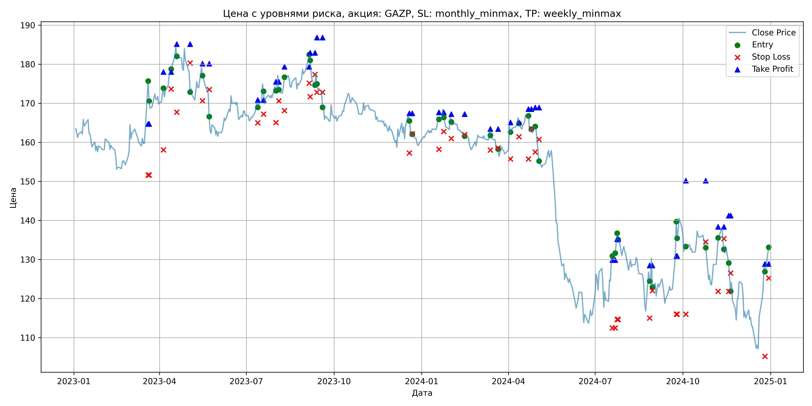
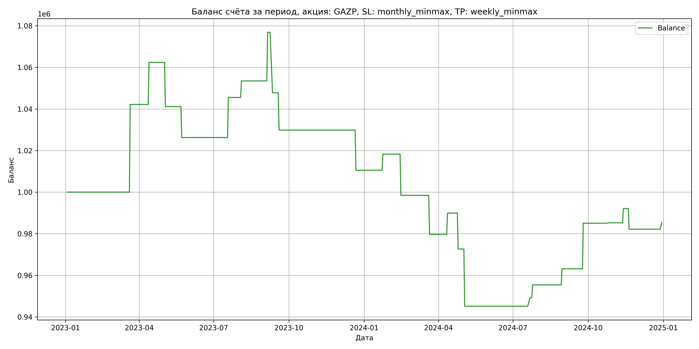

# Результаты торговой стратегии для GAZP

**Дата:** 2025-05-17 12:23:19  
**Стратегия:** GAZP,_SL_monthly_minmax,_TP_weekly_minmax

## Конфигурация

```json
{
    "TICKER": "GAZP",
    "EXCHANGE": "MOEX",
    "START_DATE": "2023-01-01",
    "END_DATE": "2024-12-31",
    "INTERVAL": "1d",
    "CAPITAL": 1000000,
    "RISK_PERCENT": 0.02,
    "PROFIT_TO_RISK": 3,
    "ATR_MULTIPLIER": 1.5,
    "ATR_WINDOW": 14,
    "STOP_LOSS_METHOD": "monthly_minmax",
    "TAKE_PROFIT_METHOD": "weekly_minmax",
    "POSITION": "long"
}
```

## Метрики эффективности

- **Начальный баланс:** 1000000.00
- **Конечный баланс:** 985343.12
- **Прибыль/Убыток:** -14656.88 (-1.47% за период тестирования)
- **Количество сделок:** 24
- **Процент выигрышных сделок:** 58.33% (14 выигрышных, 10 убыточных)
- **Средняя прибыль:** 12934.75
- **Средний убыток:** -19574.33
- **Максимальная прибыль:** 42154.40
- **Максимальный убыток:** -29052.84
- **Коэффициент прибыли:** 0.93
- **Максимальная просадка:** -12.23%

## Графики

### График цены с уровнями риска



### График баланса счёта



## Завершённые сделки

**Всего сделок:** 48

| Сделка № | Дата | Тип | Покупка / продажа | Количество акций | Цена | Stop Loss в момент сделки | Take Profit в момент сделки | Прибыль / убыток | Прибыль / убыток с учётом комиссии |
|:--------:|:----:|:---:|:-----------------:|:----------------:|:----:|:-------------------------:|:---------------------------:|:----------------:|:----------------------------------:|
| 1 | 2023-03-20 00:00:00 | LONG | BUY | 3634 | 164.40 | 151.62 | 164.69 | 0.00 | -298.71 |
| 2 | 2023-03-21 00:00:00 | LONG | SELL | -3634 | 176.00 | 151.62 | 164.69 | 42154.40 | 41535.89 |
| 3 | 2023-04-05 00:00:00 | LONG | BUY | 3090 | 172.55 | 158.05 | 178.01 | 0.00 | -266.59 |
| 4 | 2023-04-13 00:00:00 | LONG | SELL | -3090 | 179.10 | 173.64 | 178.01 | 20239.50 | 19696.20 |
| 5 | 2023-04-19 00:00:00 | LONG | BUY | 3236 | 184.33 | 167.70 | 185.14 | 0.00 | -298.25 |
| 6 | 2023-05-03 00:00:00 | LONG | SELL | -3236 | 177.76 | 180.27 | 185.14 | -21260.52 | -21846.38 |
| 7 | 2023-05-16 00:00:00 | LONG | BUY | 2118 | 179.90 | 170.63 | 180.13 | 0.00 | -190.51 |
| 8 | 2023-05-23 00:00:00 | LONG | SELL | -2118 | 172.88 | 173.52 | 180.13 | -14868.36 | -15241.95 |
| 9 | 2023-07-13 00:00:00 | LONG | BUY | 3859 | 170.51 | 165.00 | 170.85 | 0.00 | -329.00 |
| 10 | 2023-07-19 00:00:00 | LONG | SELL | -3859 | 175.50 | 167.22 | 170.85 | 19256.41 | 18588.78 |
| 11 | 2023-08-01 00:00:00 | LONG | BUY | 4186 | 175.10 | 165.02 | 175.49 | 0.00 | -366.48 |
| 12 | 2023-08-04 00:00:00 | LONG | SELL | -4186 | 177.00 | 170.59 | 175.49 | 7953.40 | 7216.45 |
| 13 | 2023-08-10 00:00:00 | LONG | BUY | 3906 | 175.22 | 168.12 | 179.35 | 0.00 | -342.20 |
| 14 | 2023-09-05 00:00:00 | LONG | SELL | -3906 | 181.20 | 175.12 | 179.35 | 23357.88 | 22661.79 |
| 15 | 2023-09-06 00:00:00 | LONG | BUY | 4052 | 183.19 | 171.69 | 182.89 | 0.00 | -371.14 |
| 16 | 2023-09-11 00:00:00 | LONG | SELL | -4052 | 176.02 | 177.34 | 182.89 | -29052.84 | -29780.60 |
| 17 | 2023-09-13 00:00:00 | LONG | BUY | 3730 | 177.80 | 172.80 | 186.79 | 0.00 | -331.60 |
| 18 | 2023-09-19 00:00:00 | LONG | SELL | -3730 | 172.99 | 172.80 | 186.79 | -17941.30 | -18595.52 |
| 19 | 2023-12-19 00:00:00 | LONG | BUY | 3672 | 167.17 | 157.26 | 167.40 | 0.00 | -306.92 |
| 20 | 2023-12-22 00:00:00 | LONG | SELL | -3672 | 161.91 | 162.17 | 167.40 | -19314.72 | -19918.91 |
| 21 | 2024-01-19 00:00:00 | LONG | BUY | 4221 | 166.52 | 158.22 | 167.68 | 0.00 | -351.44 |
| 22 | 2024-01-24 00:00:00 | LONG | SELL | -4221 | 168.36 | 162.74 | 167.68 | 7766.64 | 7059.88 |
| 23 | 2024-02-01 00:00:00 | LONG | BUY | 4256 | 166.75 | 161.00 | 167.21 | 0.00 | -354.84 |
| 24 | 2024-02-15 00:00:00 | LONG | SELL | -4256 | 162.09 | 161.94 | 167.21 | -19832.96 | -20532.73 |
| 25 | 2024-03-13 00:00:00 | LONG | BUY | 4255 | 163.20 | 158.00 | 163.39 | 0.00 | -347.21 |
| 26 | 2024-03-21 00:00:00 | LONG | SELL | -4255 | 158.79 | 158.53 | 163.39 | -18764.55 | -19449.58 |
| 27 | 2024-04-03 00:00:00 | LONG | BUY | 4141 | 164.05 | 155.75 | 165.08 | 0.00 | -339.67 |
| 28 | 2024-04-12 00:00:00 | LONG | SELL | -4141 | 166.52 | 161.45 | 165.08 | 10228.27 | 9543.82 |
| 29 | 2024-04-22 00:00:00 | LONG | BUY | 4110 | 167.20 | 155.75 | 168.48 | 0.00 | -343.60 |
| 30 | 2024-04-25 00:00:00 | LONG | SELL | -4110 | 163.00 | 163.43 | 168.48 | -17262.00 | -17940.56 |
| 31 | 2024-04-29 00:00:00 | LONG | BUY | 4108 | 164.10 | 157.51 | 168.90 | 0.00 | -337.06 |
| 32 | 2024-05-03 00:00:00 | LONG | SELL | -4108 | 157.40 | 160.75 | 168.90 | -27523.60 | -28183.96 |
| 33 | 2024-07-19 00:00:00 | LONG | BUY | 2215 | 130.10 | 112.46 | 129.86 | 0.00 | -144.09 |
| 34 | 2024-07-22 00:00:00 | LONG | SELL | -2215 | 131.96 | 112.46 | 129.86 | 4119.90 | 3829.67 |
| 35 | 2024-07-24 00:00:00 | LONG | BUY | 2302 | 134.07 | 114.65 | 135.22 | 0.00 | -154.31 |
| 36 | 2024-07-25 00:00:00 | LONG | SELL | -2302 | 136.75 | 114.65 | 135.22 | 6169.36 | 5857.65 |
| 37 | 2024-08-27 00:00:00 | LONG | BUY | 2155 | 127.30 | 115.00 | 128.46 | 0.00 | -137.17 |
| 38 | 2024-08-30 00:00:00 | LONG | SELL | -2155 | 130.89 | 122.02 | 128.46 | 7736.45 | 7458.25 |
| 39 | 2024-09-24 00:00:00 | LONG | BUY | 2281 | 130.90 | 116.01 | 130.91 | 0.00 | -149.29 |
| 40 | 2024-09-25 00:00:00 | LONG | SELL | -2281 | 140.50 | 116.01 | 130.91 | 21897.60 | 21588.07 |
| 41 | 2024-10-04 00:00:00 | LONG | BUY | 2299 | 134.06 | 116.01 | 150.20 | 0.00 | -154.10 |
| 42 | 2024-10-25 00:00:00 | LONG | SELL | -2299 | 134.15 | 134.50 | 150.20 | 206.91 | -101.40 |
| 43 | 2024-11-07 00:00:00 | LONG | BUY | 2241 | 131.85 | 121.85 | 138.34 | 0.00 | -147.74 |
| 44 | 2024-11-13 00:00:00 | LONG | SELL | -2241 | 134.90 | 135.36 | 138.34 | 6835.05 | 6536.16 |
| 45 | 2024-11-18 00:00:00 | LONG | BUY | 2835 | 129.50 | 121.85 | 141.21 | 0.00 | -183.57 |
| 46 | 2024-11-20 00:00:00 | LONG | SELL | -2835 | 126.00 | 126.54 | 141.21 | -9922.50 | -10284.67 |
| 47 | 2024-12-26 00:00:00 | LONG | BUY | 1918 | 128.40 | 105.22 | 128.85 | 0.00 | -123.14 |
| 48 | 2024-12-30 00:00:00 | LONG | SELL | -1918 | 130.05 | 125.23 | 128.85 | 3164.70 | 2916.85 |
