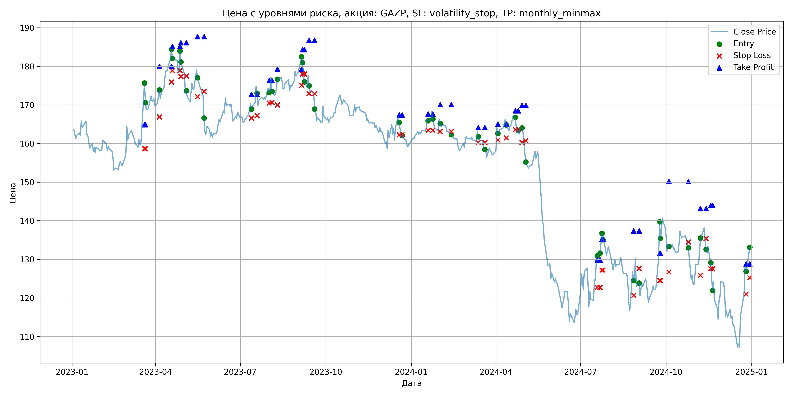
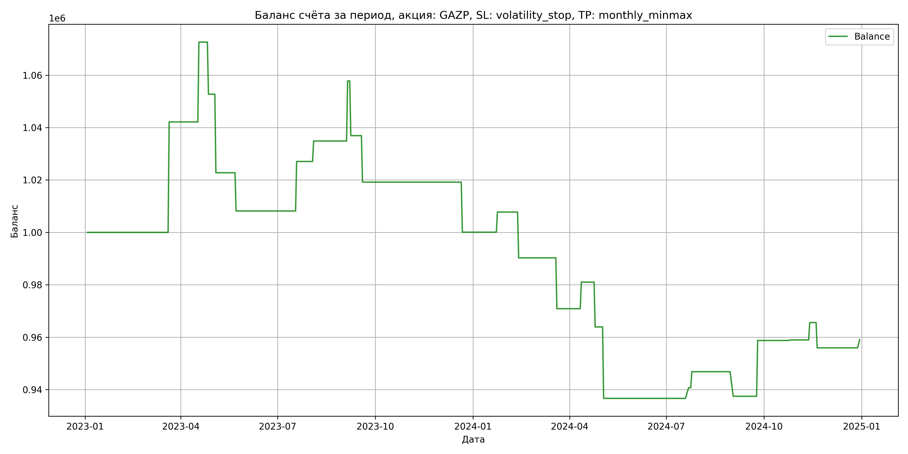

# Результаты торговой стратегии для GAZP

**Дата:** 2025-05-17 12:23:13  
**Стратегия:** GAZP,_SL_volatility_stop,_TP_monthly_minmax

## Конфигурация

```json
{
    "TICKER": "GAZP",
    "EXCHANGE": "MOEX",
    "START_DATE": "2023-01-01",
    "END_DATE": "2024-12-31",
    "INTERVAL": "1d",
    "CAPITAL": 1000000,
    "RISK_PERCENT": 0.02,
    "PROFIT_TO_RISK": 3,
    "ATR_MULTIPLIER": 1.5,
    "ATR_WINDOW": 14,
    "STOP_LOSS_METHOD": "volatility_stop",
    "TAKE_PROFIT_METHOD": "monthly_minmax",
    "POSITION": "long"
}
```

## Метрики эффективности

- **Начальный баланс:** 1000000.00
- **Конечный баланс:** 959018.72
- **Прибыль/Убыток:** -40981.28 (-4.10% за период тестирования)
- **Количество сделок:** 25
- **Процент выигрышных сделок:** 52.00% (13 выигрышных, 12 убыточных)
- **Средняя прибыль:** 13961.55
- **Средний убыток:** -18540.12
- **Максимальная прибыль:** 42154.40
- **Максимальный убыток:** -29969.11
- **Коэффициент прибыли:** 0.82
- **Максимальная просадка:** -12.68%

## Графики

### График цены с уровнями риска



### График баланса счёта



## Завершённые сделки

**Всего сделок:** 50

| Сделка № | Дата | Тип | Покупка / продажа | Количество акций | Цена | Stop Loss в момент сделки | Take Profit в момент сделки | Прибыль / убыток | Прибыль / убыток с учётом комиссии |
|:--------:|:----:|:---:|:-----------------:|:----------------:|:----:|:-------------------------:|:---------------------------:|:----------------:|:----------------------------------:|
| 1 | 2023-03-20 00:00:00 | LONG | BUY | 3634 | 164.40 | 158.67 | 164.88 | 0.00 | -298.71 |
| 2 | 2023-03-21 00:00:00 | LONG | SELL | -3634 | 176.00 | 158.67 | 164.88 | 42154.40 | 41535.89 |
| 3 | 2023-04-05 00:00:00 | LONG | BUY | 3090 | 172.55 | 166.89 | 179.98 | 0.00 | -266.59 |
| 4 | 2023-04-18 00:00:00 | LONG | SELL | -3090 | 182.41 | 175.91 | 179.98 | 30467.40 | 29918.99 |
| 5 | 2023-04-19 00:00:00 | LONG | BUY | 3267 | 184.33 | 178.88 | 185.14 | 0.00 | -301.10 |
| 6 | 2023-04-27 00:00:00 | LONG | SELL | -3267 | 178.24 | 178.88 | 185.14 | -19896.03 | -20488.29 |
| 7 | 2023-04-28 00:00:00 | LONG | BUY | 2683 | 184.40 | 177.37 | 186.12 | 0.00 | -247.37 |
| 8 | 2023-05-04 00:00:00 | LONG | SELL | -2683 | 173.23 | 177.51 | 186.12 | -29969.11 | -30448.87 |
| 9 | 2023-05-16 00:00:00 | LONG | BUY | 2080 | 179.90 | 172.17 | 187.67 | 0.00 | -187.10 |
| 10 | 2023-05-23 00:00:00 | LONG | SELL | -2080 | 172.88 | 173.52 | 187.67 | -14601.60 | -14968.49 |
| 11 | 2023-07-13 00:00:00 | LONG | BUY | 3789 | 170.51 | 166.59 | 172.73 | 0.00 | -323.03 |
| 12 | 2023-07-19 00:00:00 | LONG | SELL | -3789 | 175.50 | 167.22 | 172.73 | 18907.11 | 18251.59 |
| 13 | 2023-08-01 00:00:00 | LONG | BUY | 4110 | 175.10 | 170.49 | 176.30 | 0.00 | -359.83 |
| 14 | 2023-08-04 00:00:00 | LONG | SELL | -4110 | 177.00 | 170.59 | 176.30 | 7809.00 | 7085.43 |
| 15 | 2023-08-10 00:00:00 | LONG | BUY | 3835 | 175.22 | 169.99 | 179.35 | 0.00 | -335.98 |
| 16 | 2023-09-05 00:00:00 | LONG | SELL | -3835 | 181.20 | 175.12 | 179.35 | 22933.30 | 22249.86 |
| 17 | 2023-09-06 00:00:00 | LONG | BUY | 3978 | 183.19 | 178.03 | 184.30 | 0.00 | -364.36 |
| 18 | 2023-09-08 00:00:00 | LONG | SELL | -3978 | 177.94 | 178.03 | 184.30 | -20884.50 | -21602.79 |
| 19 | 2023-09-13 00:00:00 | LONG | BUY | 3689 | 177.80 | 172.92 | 186.79 | 0.00 | -327.95 |
| 20 | 2023-09-19 00:00:00 | LONG | SELL | -3689 | 172.99 | 172.92 | 186.79 | -17744.09 | -18391.12 |
| 21 | 2023-12-19 00:00:00 | LONG | BUY | 3632 | 167.17 | 162.31 | 167.40 | 0.00 | -303.58 |
| 22 | 2023-12-22 00:00:00 | LONG | SELL | -3632 | 161.91 | 162.31 | 167.40 | -19104.32 | -19701.93 |
| 23 | 2024-01-19 00:00:00 | LONG | BUY | 4176 | 166.52 | 163.47 | 167.68 | 0.00 | -347.69 |
| 24 | 2024-01-24 00:00:00 | LONG | SELL | -4176 | 168.36 | 163.47 | 167.68 | 7683.84 | 6984.61 |
| 25 | 2024-02-01 00:00:00 | LONG | BUY | 4210 | 166.75 | 163.14 | 170.11 | 0.00 | -351.01 |
| 26 | 2024-02-13 00:00:00 | LONG | SELL | -4210 | 162.60 | 163.14 | 170.11 | -17471.50 | -18164.78 |
| 27 | 2024-03-13 00:00:00 | LONG | BUY | 4218 | 163.20 | 160.30 | 164.13 | 0.00 | -344.19 |
| 28 | 2024-03-20 00:00:00 | LONG | SELL | -4218 | 158.60 | 160.30 | 164.13 | -19402.80 | -20081.48 |
| 29 | 2024-04-03 00:00:00 | LONG | BUY | 4102 | 164.05 | 160.94 | 165.08 | 0.00 | -336.47 |
| 30 | 2024-04-12 00:00:00 | LONG | SELL | -4102 | 166.52 | 161.45 | 165.08 | 10131.94 | 9453.94 |
| 31 | 2024-04-22 00:00:00 | LONG | BUY | 4071 | 167.20 | 163.61 | 168.48 | 0.00 | -340.34 |
| 32 | 2024-04-25 00:00:00 | LONG | SELL | -4071 | 163.00 | 163.61 | 168.48 | -17098.20 | -17770.32 |
| 33 | 2024-04-29 00:00:00 | LONG | BUY | 4069 | 164.10 | 160.30 | 169.94 | 0.00 | -333.86 |
| 34 | 2024-05-03 00:00:00 | LONG | SELL | -4069 | 157.40 | 160.75 | 169.94 | -27262.30 | -27916.39 |
| 35 | 2024-07-19 00:00:00 | LONG | BUY | 2194 | 130.10 | 122.72 | 129.86 | 0.00 | -142.72 |
| 36 | 2024-07-22 00:00:00 | LONG | SELL | -2194 | 131.96 | 122.72 | 129.86 | 4080.84 | 3793.36 |
| 37 | 2024-07-24 00:00:00 | LONG | BUY | 2280 | 134.07 | 127.22 | 135.22 | 0.00 | -152.84 |
| 38 | 2024-07-25 00:00:00 | LONG | SELL | -2280 | 136.75 | 127.22 | 135.22 | 6110.40 | 5801.67 |
| 39 | 2024-08-27 00:00:00 | LONG | BUY | 2135 | 127.30 | 120.67 | 137.37 | 0.00 | -135.89 |
| 40 | 2024-09-02 00:00:00 | LONG | SELL | -2135 | 122.90 | 127.66 | 137.37 | -9394.00 | -9661.09 |
| 41 | 2024-09-24 00:00:00 | LONG | BUY | 2218 | 130.90 | 124.51 | 131.53 | 0.00 | -145.17 |
| 42 | 2024-09-25 00:00:00 | LONG | SELL | -2218 | 140.50 | 124.51 | 131.53 | 21292.80 | 20991.82 |
| 43 | 2024-10-04 00:00:00 | LONG | BUY | 2236 | 134.06 | 126.76 | 150.20 | 0.00 | -149.88 |
| 44 | 2024-10-25 00:00:00 | LONG | SELL | -2236 | 134.15 | 134.50 | 150.20 | 201.24 | -98.62 |
| 45 | 2024-11-07 00:00:00 | LONG | BUY | 2180 | 131.85 | 125.84 | 143.14 | 0.00 | -143.72 |
| 46 | 2024-11-13 00:00:00 | LONG | SELL | -2180 | 134.90 | 135.36 | 143.14 | 6649.00 | 6358.24 |
| 47 | 2024-11-18 00:00:00 | LONG | BUY | 2758 | 129.50 | 127.56 | 143.98 | 0.00 | -178.58 |
| 48 | 2024-11-20 00:00:00 | LONG | SELL | -2758 | 126.00 | 127.56 | 143.98 | -9653.00 | -10005.33 |
| 49 | 2024-12-26 00:00:00 | LONG | BUY | 1866 | 128.40 | 121.03 | 128.85 | 0.00 | -119.80 |
| 50 | 2024-12-30 00:00:00 | LONG | SELL | -1866 | 130.05 | 125.23 | 128.85 | 3078.90 | 2837.77 |
