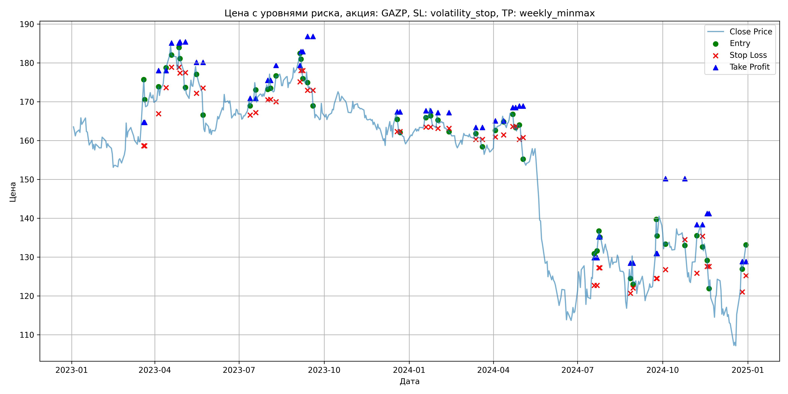
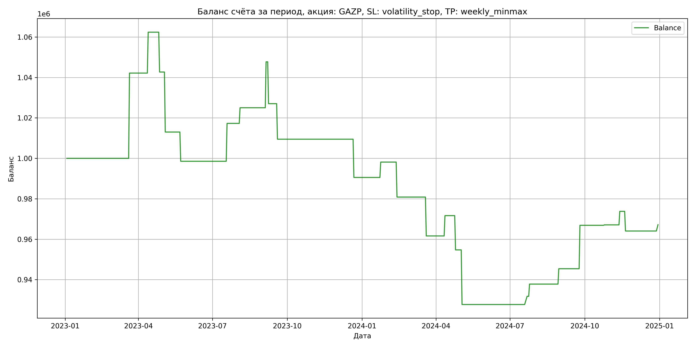

# Результаты торговой стратегии для GAZP

**Дата:** 2025-05-17 12:23:12  
**Стратегия:** GAZP,_SL_volatility_stop,_TP_weekly_minmax

## Конфигурация

```json
{
    "TICKER": "GAZP",
    "EXCHANGE": "MOEX",
    "START_DATE": "2023-01-01",
    "END_DATE": "2024-12-31",
    "INTERVAL": "1d",
    "CAPITAL": 1000000,
    "RISK_PERCENT": 0.02,
    "PROFIT_TO_RISK": 3,
    "ATR_MULTIPLIER": 1.5,
    "ATR_WINDOW": 14,
    "STOP_LOSS_METHOD": "volatility_stop",
    "TAKE_PROFIT_METHOD": "weekly_minmax",
    "POSITION": "long"
}
```

## Метрики эффективности

- **Начальный баланс:** 1000000.00
- **Конечный баланс:** 967167.22
- **Прибыль/Убыток:** -32832.78 (-3.28% за период тестирования)
- **Количество сделок:** 25
- **Процент выигрышных сделок:** 56.00% (14 выигрышных, 11 убыточных)
- **Средняя прибыль:** 12742.82
- **Средний убыток:** -19202.93
- **Максимальная прибыль:** 42154.40
- **Максимальный убыток:** -29678.69
- **Коэффициент прибыли:** 0.84
- **Максимальная просадка:** -12.68%

## Графики

### График цены с уровнями риска



### График баланса счёта



## Завершённые сделки

**Всего сделок:** 50

| Сделка № | Дата | Тип | Покупка / продажа | Количество акций | Цена | Stop Loss в момент сделки | Take Profit в момент сделки | Прибыль / убыток | Прибыль / убыток с учётом комиссии |
|:--------:|:----:|:---:|:-----------------:|:----------------:|:----:|:-------------------------:|:---------------------------:|:----------------:|:----------------------------------:|
| 1 | 2023-03-20 00:00:00 | LONG | BUY | 3634 | 164.40 | 158.67 | 164.69 | 0.00 | -298.71 |
| 2 | 2023-03-21 00:00:00 | LONG | SELL | -3634 | 176.00 | 158.67 | 164.69 | 42154.40 | 41535.89 |
| 3 | 2023-04-05 00:00:00 | LONG | BUY | 3090 | 172.55 | 166.89 | 178.01 | 0.00 | -266.59 |
| 4 | 2023-04-13 00:00:00 | LONG | SELL | -3090 | 179.10 | 173.64 | 178.01 | 20239.50 | 19696.20 |
| 5 | 2023-04-19 00:00:00 | LONG | BUY | 3236 | 184.33 | 178.88 | 185.14 | 0.00 | -298.25 |
| 6 | 2023-04-27 00:00:00 | LONG | SELL | -3236 | 178.24 | 178.88 | 185.14 | -19707.24 | -20293.88 |
| 7 | 2023-04-28 00:00:00 | LONG | BUY | 2657 | 184.40 | 177.37 | 185.40 | 0.00 | -244.98 |
| 8 | 2023-05-04 00:00:00 | LONG | SELL | -2657 | 173.23 | 177.51 | 185.40 | -29678.69 | -30153.80 |
| 9 | 2023-05-16 00:00:00 | LONG | BUY | 2060 | 179.90 | 172.17 | 180.13 | 0.00 | -185.30 |
| 10 | 2023-05-23 00:00:00 | LONG | SELL | -2060 | 172.88 | 173.52 | 180.13 | -14461.20 | -14824.56 |
| 11 | 2023-07-13 00:00:00 | LONG | BUY | 3753 | 170.51 | 166.59 | 170.85 | 0.00 | -319.96 |
| 12 | 2023-07-19 00:00:00 | LONG | SELL | -3753 | 175.50 | 167.22 | 170.85 | 18727.47 | 18078.18 |
| 13 | 2023-08-01 00:00:00 | LONG | BUY | 4071 | 175.10 | 170.49 | 175.49 | 0.00 | -356.42 |
| 14 | 2023-08-04 00:00:00 | LONG | SELL | -4071 | 177.00 | 170.59 | 175.49 | 7734.90 | 7018.20 |
| 15 | 2023-08-10 00:00:00 | LONG | BUY | 3798 | 175.22 | 169.99 | 179.35 | 0.00 | -332.74 |
| 16 | 2023-09-05 00:00:00 | LONG | SELL | -3798 | 181.20 | 175.12 | 179.35 | 22712.04 | 22035.20 |
| 17 | 2023-09-06 00:00:00 | LONG | BUY | 3940 | 183.19 | 178.03 | 182.89 | 0.00 | -360.88 |
| 18 | 2023-09-08 00:00:00 | LONG | SELL | -3940 | 177.94 | 178.03 | 182.89 | -20685.00 | -21396.43 |
| 19 | 2023-09-13 00:00:00 | LONG | BUY | 3654 | 177.80 | 172.92 | 186.79 | 0.00 | -324.84 |
| 20 | 2023-09-19 00:00:00 | LONG | SELL | -3654 | 172.99 | 172.92 | 186.79 | -17575.74 | -18216.63 |
| 21 | 2023-12-19 00:00:00 | LONG | BUY | 3597 | 167.17 | 162.31 | 167.40 | 0.00 | -300.66 |
| 22 | 2023-12-22 00:00:00 | LONG | SELL | -3597 | 161.91 | 162.31 | 167.40 | -18920.22 | -19512.07 |
| 23 | 2024-01-19 00:00:00 | LONG | BUY | 4136 | 166.52 | 163.47 | 167.68 | 0.00 | -344.36 |
| 24 | 2024-01-24 00:00:00 | LONG | SELL | -4136 | 168.36 | 163.47 | 167.68 | 7610.24 | 6917.71 |
| 25 | 2024-02-01 00:00:00 | LONG | BUY | 4170 | 166.75 | 163.14 | 167.21 | 0.00 | -347.67 |
| 26 | 2024-02-13 00:00:00 | LONG | SELL | -4170 | 162.60 | 163.14 | 167.21 | -17305.50 | -17992.19 |
| 27 | 2024-03-13 00:00:00 | LONG | BUY | 4178 | 163.20 | 160.30 | 163.39 | 0.00 | -340.92 |
| 28 | 2024-03-20 00:00:00 | LONG | SELL | -4178 | 158.60 | 160.30 | 163.39 | -19218.80 | -19891.04 |
| 29 | 2024-04-03 00:00:00 | LONG | BUY | 4063 | 164.05 | 160.94 | 165.08 | 0.00 | -333.27 |
| 30 | 2024-04-12 00:00:00 | LONG | SELL | -4063 | 166.52 | 161.45 | 165.08 | 10035.61 | 9364.06 |
| 31 | 2024-04-22 00:00:00 | LONG | BUY | 4033 | 167.20 | 163.61 | 168.48 | 0.00 | -337.16 |
| 32 | 2024-04-25 00:00:00 | LONG | SELL | -4033 | 163.00 | 163.61 | 168.48 | -16938.60 | -17604.45 |
| 33 | 2024-04-29 00:00:00 | LONG | BUY | 4031 | 164.10 | 160.30 | 168.90 | 0.00 | -330.74 |
| 34 | 2024-05-03 00:00:00 | LONG | SELL | -4031 | 157.40 | 160.75 | 168.90 | -27007.70 | -27655.68 |
| 35 | 2024-07-19 00:00:00 | LONG | BUY | 2173 | 130.10 | 122.72 | 129.86 | 0.00 | -141.35 |
| 36 | 2024-07-22 00:00:00 | LONG | SELL | -2173 | 131.96 | 122.72 | 129.86 | 4041.78 | 3757.05 |
| 37 | 2024-07-24 00:00:00 | LONG | BUY | 2259 | 134.07 | 127.22 | 135.22 | 0.00 | -151.43 |
| 38 | 2024-07-25 00:00:00 | LONG | SELL | -2259 | 136.75 | 127.22 | 135.22 | 6054.12 | 5748.23 |
| 39 | 2024-08-27 00:00:00 | LONG | BUY | 2114 | 127.30 | 120.67 | 128.46 | 0.00 | -134.56 |
| 40 | 2024-08-30 00:00:00 | LONG | SELL | -2114 | 130.89 | 122.02 | 128.46 | 7589.26 | 7316.35 |
| 41 | 2024-09-24 00:00:00 | LONG | BUY | 2238 | 130.90 | 124.51 | 130.91 | 0.00 | -146.48 |
| 42 | 2024-09-25 00:00:00 | LONG | SELL | -2238 | 140.50 | 124.51 | 130.91 | 21484.80 | 21181.10 |
| 43 | 2024-10-04 00:00:00 | LONG | BUY | 2256 | 134.06 | 126.76 | 150.20 | 0.00 | -151.22 |
| 44 | 2024-10-25 00:00:00 | LONG | SELL | -2256 | 134.15 | 134.50 | 150.20 | 203.04 | -99.50 |
| 45 | 2024-11-07 00:00:00 | LONG | BUY | 2199 | 131.85 | 125.84 | 138.34 | 0.00 | -144.97 |
| 46 | 2024-11-13 00:00:00 | LONG | SELL | -2199 | 134.90 | 135.36 | 138.34 | 6706.95 | 6413.66 |
| 47 | 2024-11-18 00:00:00 | LONG | BUY | 2781 | 129.50 | 127.56 | 141.21 | 0.00 | -180.07 |
| 48 | 2024-11-20 00:00:00 | LONG | SELL | -2781 | 126.00 | 127.56 | 141.21 | -9733.50 | -10088.77 |
| 49 | 2024-12-26 00:00:00 | LONG | BUY | 1882 | 128.40 | 121.03 | 128.85 | 0.00 | -120.82 |
| 50 | 2024-12-30 00:00:00 | LONG | SELL | -1882 | 130.05 | 125.23 | 128.85 | 3105.30 | 2862.10 |
