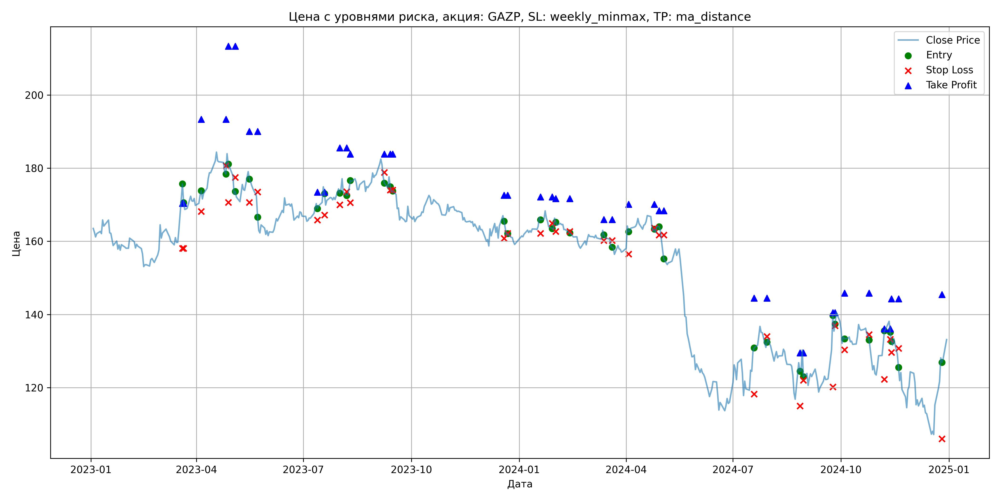

# Результаты торговой стратегии для GAZP

**Дата:** 2025-05-17 12:23:17  
**Стратегия:** GAZP,_SL_weekly_minmax,_TP_ma_distance

## Конфигурация

```json
{
    "TICKER": "GAZP",
    "EXCHANGE": "MOEX",
    "START_DATE": "2023-01-01",
    "END_DATE": "2024-12-31",
    "INTERVAL": "1d",
    "CAPITAL": 1000000,
    "RISK_PERCENT": 0.02,
    "PROFIT_TO_RISK": 3,
    "ATR_MULTIPLIER": 1.5,
    "ATR_WINDOW": 14,
    "STOP_LOSS_METHOD": "weekly_minmax",
    "TAKE_PROFIT_METHOD": "ma_distance",
    "POSITION": "long"
}
```

## Метрики эффективности

- **Начальный баланс:** 1000000.00
- **Конечный баланс:** 944811.88
- **Прибыль/Убыток:** -55188.12 (-5.52% за период тестирования)
- **Количество сделок:** 20
- **Процент выигрышных сделок:** 45.00% (9 выигрышных, 11 убыточных)
- **Средняя прибыль:** 13649.07
- **Средний убыток:** -16184.52
- **Максимальная прибыль:** 42154.40
- **Максимальный убыток:** -30259.53
- **Коэффициент прибыли:** 0.69
- **Максимальная просадка:** -12.50%

## Графики

### График цены с уровнями риска



### График баланса счёта


## Завершённые сделки

**Всего сделок:** 41

| Сделка № | Дата | Тип | Покупка / продажа | Количество акций | Цена | Stop Loss в момент сделки | Take Profit в момент сделки | Прибыль / убыток | Прибыль / убыток с учётом комиссии |
|:--------:|:----:|:---:|:-----------------:|:----------------:|:----:|:-------------------------:|:---------------------------:|:----------------:|:----------------------------------:|
| 1 | 2023-03-20 00:00:00 | LONG | BUY | 3634 | 164.40 | 158.05 | 170.40 | 0.00 | -298.71 |
| 2 | 2023-03-21 00:00:00 | LONG | SELL | -3634 | 176.00 | 158.05 | 170.40 | 42154.40 | 41535.89 |
| 3 | 2023-04-05 00:00:00 | LONG | BUY | 3090 | 172.55 | 168.14 | 193.37 | 0.00 | -266.59 |
| 4 | 2023-04-26 00:00:00 | LONG | SELL | -3090 | 179.05 | 180.70 | 193.37 | 20085.00 | 19541.78 |
| 5 | 2023-04-28 00:00:00 | LONG | BUY | 2709 | 184.40 | 170.63 | 213.34 | 0.00 | -249.77 |
| 6 | 2023-05-04 00:00:00 | LONG | SELL | -2709 | 173.23 | 177.51 | 213.34 | -30259.53 | -30743.94 |
| 7 | 2023-05-16 00:00:00 | LONG | BUY | 2100 | 179.90 | 170.65 | 190.07 | 0.00 | -188.90 |
| 8 | 2023-05-23 00:00:00 | LONG | SELL | -2100 | 172.88 | 173.52 | 190.07 | -14742.00 | -15112.42 |
| 9 | 2023-07-13 00:00:00 | LONG | BUY | 3826 | 170.51 | 165.80 | 173.44 | 0.00 | -326.19 |
| 10 | 2023-07-19 00:00:00 | LONG | SELL | -3826 | 175.50 | 167.22 | 173.44 | 19091.74 | 18429.82 |
| 11 | 2023-08-01 00:00:00 | LONG | BUY | 4150 | 175.10 | 170.00 | 185.57 | 0.00 | -363.33 |
| 12 | 2023-08-07 00:00:00 | LONG | SELL | -4150 | 174.25 | 173.56 | 185.57 | -3527.50 | -4252.40 |
| 13 | 2023-08-10 00:00:00 | LONG | BUY | 3829 | 175.22 | 170.60 | 183.88 | 0.00 | -335.46 |
| 14 | 2023-09-08 00:00:00 | LONG | SELL | -3829 | 177.94 | 178.83 | 183.88 | 10414.88 | 9738.76 |
| 15 | 2023-09-13 00:00:00 | LONG | BUY | 3716 | 177.80 | 174.02 | 183.89 | 0.00 | -330.35 |
| 16 | 2023-09-15 00:00:00 | LONG | SELL | -3716 | 173.50 | 174.02 | 183.89 | -15978.80 | -16631.52 |
| 17 | 2023-12-19 00:00:00 | LONG | BUY | 3665 | 167.17 | 160.81 | 172.62 | 0.00 | -306.34 |
| 18 | 2023-12-22 00:00:00 | LONG | SELL | -3665 | 161.91 | 162.17 | 172.62 | -19277.90 | -19880.94 |
| 19 | 2024-01-19 00:00:00 | LONG | BUY | 4214 | 166.52 | 162.20 | 172.16 | 0.00 | -350.86 |
| 20 | 2024-01-29 00:00:00 | LONG | SELL | -4214 | 164.00 | 164.94 | 172.16 | -10619.28 | -11315.69 |
| 21 | 2024-02-01 00:00:00 | LONG | BUY | 4171 | 166.75 | 162.71 | 171.69 | 0.00 | -347.76 |
| 22 | 2024-02-13 00:00:00 | LONG | SELL | -4171 | 162.60 | 162.71 | 171.69 | -17309.65 | -17996.51 |
| 23 | 2024-03-13 00:00:00 | LONG | BUY | 4180 | 163.20 | 160.23 | 165.94 | 0.00 | -341.09 |
| 24 | 2024-03-20 00:00:00 | LONG | SELL | -4180 | 158.60 | 160.23 | 165.94 | -19228.00 | -19900.56 |
| 25 | 2024-04-03 00:00:00 | LONG | BUY | 4064 | 164.05 | 156.51 | 170.12 | 0.00 | -333.35 |
| 26 | 2024-04-25 00:00:00 | LONG | SELL | -4064 | 163.00 | 163.69 | 170.12 | -4267.20 | -4931.77 |
| 27 | 2024-04-29 00:00:00 | LONG | BUY | 4046 | 164.10 | 161.70 | 168.38 | 0.00 | -331.97 |
| 28 | 2024-05-03 00:00:00 | LONG | SELL | -4046 | 157.40 | 161.70 | 168.38 | -27108.20 | -27758.59 |
| 29 | 2024-07-19 00:00:00 | LONG | BUY | 2182 | 130.10 | 118.23 | 144.48 | 0.00 | -141.94 |
| 30 | 2024-07-30 00:00:00 | LONG | SELL | -2182 | 130.80 | 134.00 | 144.48 | 1527.40 | 1242.76 |
| 31 | 2024-08-27 00:00:00 | LONG | BUY | 2104 | 127.30 | 115.00 | 129.51 | 0.00 | -133.92 |
| 32 | 2024-08-30 00:00:00 | LONG | SELL | -2104 | 130.89 | 122.02 | 129.51 | 7553.36 | 7281.74 |
| 33 | 2024-09-24 00:00:00 | LONG | BUY | 2226 | 130.90 | 120.17 | 140.52 | 0.00 | -145.69 |
| 34 | 2024-09-26 00:00:00 | LONG | SELL | -2226 | 134.91 | 136.92 | 140.52 | 8926.26 | 8630.41 |
| 35 | 2024-10-04 00:00:00 | LONG | BUY | 2215 | 134.06 | 130.32 | 145.82 | 0.00 | -148.47 |
| 36 | 2024-10-25 00:00:00 | LONG | SELL | -2215 | 134.15 | 134.50 | 145.82 | 199.35 | -97.69 |
| 37 | 2024-11-07 00:00:00 | LONG | BUY | 2159 | 131.85 | 122.25 | 136.05 | 0.00 | -142.33 |
| 38 | 2024-11-12 00:00:00 | LONG | SELL | -2159 | 137.82 | 133.18 | 136.05 | 12889.23 | 12598.12 |
| 39 | 2024-11-13 00:00:00 | LONG | BUY | 2654 | 134.90 | 129.65 | 144.28 | 0.00 | -179.01 |
| 40 | 2024-11-19 00:00:00 | LONG | SELL | -2654 | 128.98 | 130.70 | 144.28 | -15711.68 | -16061.85 |
| 41 | 2024-12-26 00:00:00 | LONG | BUY | 1848 | 128.40 | 106.00 | 145.45 | 0.00 | -118.64 |
