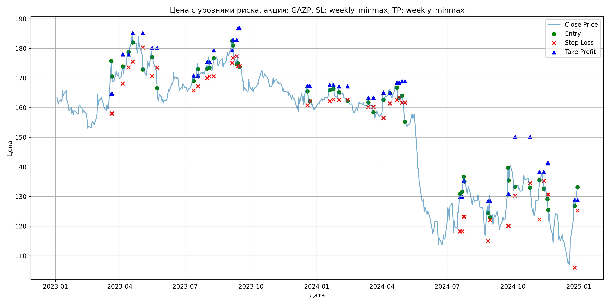
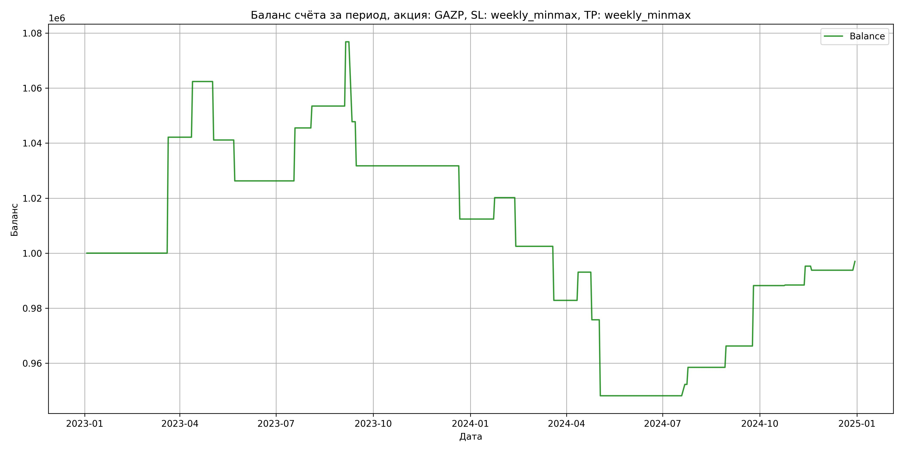

# Результаты торговой стратегии для GAZP

**Дата:** 2025-05-17 12:23:16  
**Стратегия:** GAZP,_SL_weekly_minmax,_TP_weekly_minmax

## Конфигурация

```json
{
    "TICKER": "GAZP",
    "EXCHANGE": "MOEX",
    "START_DATE": "2023-01-01",
    "END_DATE": "2024-12-31",
    "INTERVAL": "1d",
    "CAPITAL": 1000000,
    "RISK_PERCENT": 0.02,
    "PROFIT_TO_RISK": 3,
    "ATR_MULTIPLIER": 1.5,
    "ATR_WINDOW": 14,
    "STOP_LOSS_METHOD": "weekly_minmax",
    "TAKE_PROFIT_METHOD": "weekly_minmax",
    "POSITION": "long"
}
```

## Метрики эффективности

- **Начальный баланс:** 1000000.00
- **Конечный баланс:** 996994.14
- **Прибыль/Убыток:** -3005.86 (-0.30% за период тестирования)
- **Количество сделок:** 24
- **Процент выигрышных сделок:** 58.33% (14 выигрышных, 10 убыточных)
- **Средняя прибыль:** 12951.79
- **Средний убыток:** -18433.09
- **Максимальная прибыль:** 42154.40
- **Максимальный убыток:** -29052.84
- **Коэффициент прибыли:** 0.98
- **Максимальная просадка:** -11.95%

## Графики

### График цены с уровнями риска



### График баланса счёта



## Завершённые сделки

**Всего сделок:** 48

| Сделка № | Дата | Тип | Покупка / продажа | Количество акций | Цена | Stop Loss в момент сделки | Take Profit в момент сделки | Прибыль / убыток | Прибыль / убыток с учётом комиссии |
|:--------:|:----:|:---:|:-----------------:|:----------------:|:----:|:-------------------------:|:---------------------------:|:----------------:|:----------------------------------:|
| 1 | 2023-03-20 00:00:00 | LONG | BUY | 3634 | 164.40 | 158.05 | 164.69 | 0.00 | -298.71 |
| 2 | 2023-03-21 00:00:00 | LONG | SELL | -3634 | 176.00 | 158.05 | 164.69 | 42154.40 | 41535.89 |
| 3 | 2023-04-05 00:00:00 | LONG | BUY | 3090 | 172.55 | 168.14 | 178.01 | 0.00 | -266.59 |
| 4 | 2023-04-13 00:00:00 | LONG | SELL | -3090 | 179.10 | 173.64 | 178.01 | 20239.50 | 19696.20 |
| 5 | 2023-04-19 00:00:00 | LONG | BUY | 3236 | 184.33 | 175.55 | 185.14 | 0.00 | -298.25 |
| 6 | 2023-05-03 00:00:00 | LONG | SELL | -3236 | 177.76 | 180.27 | 185.14 | -21260.52 | -21846.38 |
| 7 | 2023-05-16 00:00:00 | LONG | BUY | 2118 | 179.90 | 170.65 | 180.13 | 0.00 | -190.51 |
| 8 | 2023-05-23 00:00:00 | LONG | SELL | -2118 | 172.88 | 173.52 | 180.13 | -14868.36 | -15241.95 |
| 9 | 2023-07-13 00:00:00 | LONG | BUY | 3859 | 170.51 | 165.80 | 170.85 | 0.00 | -329.00 |
| 10 | 2023-07-19 00:00:00 | LONG | SELL | -3859 | 175.50 | 167.22 | 170.85 | 19256.41 | 18588.78 |
| 11 | 2023-08-01 00:00:00 | LONG | BUY | 4186 | 175.10 | 170.00 | 175.49 | 0.00 | -366.48 |
| 12 | 2023-08-04 00:00:00 | LONG | SELL | -4186 | 177.00 | 170.59 | 175.49 | 7953.40 | 7216.45 |
| 13 | 2023-08-10 00:00:00 | LONG | BUY | 3906 | 175.22 | 170.60 | 179.35 | 0.00 | -342.20 |
| 14 | 2023-09-05 00:00:00 | LONG | SELL | -3906 | 181.20 | 175.12 | 179.35 | 23357.88 | 22661.79 |
| 15 | 2023-09-06 00:00:00 | LONG | BUY | 4052 | 183.19 | 176.77 | 182.89 | 0.00 | -371.14 |
| 16 | 2023-09-11 00:00:00 | LONG | SELL | -4052 | 176.02 | 177.34 | 182.89 | -29052.84 | -29780.60 |
| 17 | 2023-09-13 00:00:00 | LONG | BUY | 3730 | 177.80 | 174.02 | 186.79 | 0.00 | -331.60 |
| 18 | 2023-09-15 00:00:00 | LONG | SELL | -3730 | 173.50 | 174.02 | 186.79 | -16039.00 | -16694.17 |
| 19 | 2023-12-19 00:00:00 | LONG | BUY | 3678 | 167.17 | 160.81 | 167.40 | 0.00 | -307.43 |
| 20 | 2023-12-22 00:00:00 | LONG | SELL | -3678 | 161.91 | 162.17 | 167.40 | -19346.28 | -19951.46 |
| 21 | 2024-01-19 00:00:00 | LONG | BUY | 4229 | 166.52 | 162.20 | 167.68 | 0.00 | -352.11 |
| 22 | 2024-01-24 00:00:00 | LONG | SELL | -4229 | 168.36 | 162.74 | 167.68 | 7781.36 | 7073.26 |
| 23 | 2024-02-01 00:00:00 | LONG | BUY | 4264 | 166.75 | 162.71 | 167.21 | 0.00 | -355.51 |
| 24 | 2024-02-13 00:00:00 | LONG | SELL | -4264 | 162.60 | 162.71 | 167.21 | -17695.60 | -18397.77 |
| 25 | 2024-03-13 00:00:00 | LONG | BUY | 4272 | 163.20 | 160.23 | 163.39 | 0.00 | -348.60 |
| 26 | 2024-03-20 00:00:00 | LONG | SELL | -4272 | 158.60 | 160.23 | 163.39 | -19651.20 | -20338.56 |
| 27 | 2024-04-03 00:00:00 | LONG | BUY | 4154 | 164.05 | 156.51 | 165.08 | 0.00 | -340.73 |
| 28 | 2024-04-12 00:00:00 | LONG | SELL | -4154 | 166.52 | 161.45 | 165.08 | 10260.38 | 9573.79 |
| 29 | 2024-04-22 00:00:00 | LONG | BUY | 4124 | 167.20 | 162.65 | 168.48 | 0.00 | -344.77 |
| 30 | 2024-04-25 00:00:00 | LONG | SELL | -4124 | 163.00 | 163.43 | 168.48 | -17320.80 | -18001.67 |
| 31 | 2024-04-29 00:00:00 | LONG | BUY | 4122 | 164.10 | 161.70 | 168.90 | 0.00 | -338.21 |
| 32 | 2024-05-03 00:00:00 | LONG | SELL | -4122 | 157.40 | 161.70 | 168.90 | -27617.40 | -28280.01 |
| 33 | 2024-07-19 00:00:00 | LONG | BUY | 2223 | 130.10 | 118.23 | 129.86 | 0.00 | -144.61 |
| 34 | 2024-07-22 00:00:00 | LONG | SELL | -2223 | 131.96 | 118.23 | 129.86 | 4134.78 | 3843.50 |
| 35 | 2024-07-24 00:00:00 | LONG | BUY | 2310 | 134.07 | 123.21 | 135.22 | 0.00 | -154.85 |
| 36 | 2024-07-25 00:00:00 | LONG | SELL | -2310 | 136.75 | 123.21 | 135.22 | 6190.80 | 5878.00 |
| 37 | 2024-08-27 00:00:00 | LONG | BUY | 2162 | 127.30 | 115.00 | 128.46 | 0.00 | -137.61 |
| 38 | 2024-08-30 00:00:00 | LONG | SELL | -2162 | 130.89 | 122.02 | 128.46 | 7761.58 | 7482.48 |
| 39 | 2024-09-24 00:00:00 | LONG | BUY | 2288 | 130.90 | 120.17 | 130.91 | 0.00 | -149.75 |
| 40 | 2024-09-25 00:00:00 | LONG | SELL | -2288 | 140.50 | 120.17 | 130.91 | 21964.80 | 21654.32 |
| 41 | 2024-10-04 00:00:00 | LONG | BUY | 2307 | 134.06 | 130.32 | 150.20 | 0.00 | -154.64 |
| 42 | 2024-10-25 00:00:00 | LONG | SELL | -2307 | 134.15 | 134.50 | 150.20 | 207.63 | -101.75 |
| 43 | 2024-11-07 00:00:00 | LONG | BUY | 2249 | 131.85 | 122.25 | 138.34 | 0.00 | -148.27 |
| 44 | 2024-11-13 00:00:00 | LONG | SELL | -2249 | 134.90 | 135.36 | 138.34 | 6859.45 | 6559.49 |
| 45 | 2024-11-18 00:00:00 | LONG | BUY | 2844 | 129.50 | 130.67 | 141.21 | 0.00 | -184.15 |
| 46 | 2024-11-19 00:00:00 | LONG | SELL | -2844 | 128.98 | 130.67 | 141.21 | -1478.88 | -1846.44 |
| 47 | 2024-12-26 00:00:00 | LONG | BUY | 1941 | 128.40 | 106.00 | 128.85 | 0.00 | -124.61 |
| 48 | 2024-12-30 00:00:00 | LONG | SELL | -1941 | 130.05 | 125.23 | 128.85 | 3202.65 | 2951.82 |
