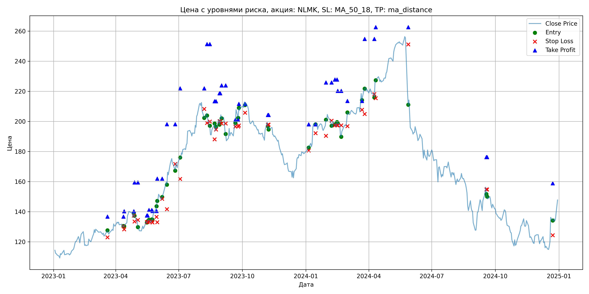
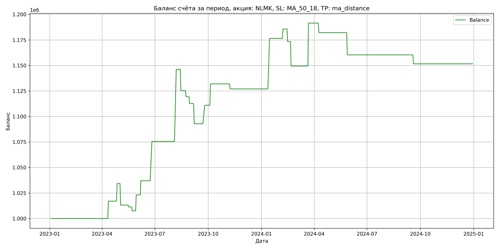

# Результаты торговой стратегии для NLMK

**Дата:** 2025-05-17 12:24:05  
**Стратегия:** NLMK,_SL_MA_50_18,_TP_ma_distance

## Конфигурация

```json
{
    "TICKER": "NLMK",
    "EXCHANGE": "MOEX",
    "START_DATE": "2023-01-01",
    "END_DATE": "2024-12-31",
    "INTERVAL": "1d",
    "CAPITAL": 1000000,
    "RISK_PERCENT": 0.02,
    "PROFIT_TO_RISK": 3,
    "ATR_MULTIPLIER": 1.5,
    "ATR_WINDOW": 14,
    "STOP_LOSS_METHOD": "MA_50_18",
    "TAKE_PROFIT_METHOD": "ma_distance",
    "POSITION": "long"
}
```

## Метрики эффективности

- **Начальный баланс:** 1000000.00
- **Конечный баланс:** 1151577.22
- **Прибыль/Убыток:** 151577.22 (15.16% за период тестирования)
- **Количество сделок:** 24
- **Процент выигрышных сделок:** 45.83% (11 выигрышных, 13 убыточных)
- **Средняя прибыль:** 28438.22
- **Средний убыток:** -12403.32
- **Максимальная прибыль:** 70700.00
- **Максимальный убыток:** -24022.18
- **Коэффициент прибыли:** 1.94
- **Максимальная просадка:** -4.65%

## Графики

### График цены с уровнями риска



### График баланса счёта



## Завершённые сделки

**Всего сделок:** 49

| Сделка № | Дата | Тип | Покупка / продажа | Количество акций | Цена | Stop Loss в момент сделки | Take Profit в момент сделки | Прибыль / убыток | Прибыль / убыток с учётом комиссии |
|:--------:|:----:|:---:|:-----------------:|:----------------:|:----:|:-------------------------:|:---------------------------:|:----------------:|:----------------------------------:|
| 1 | 2023-03-20 00:00:00 | LONG | BUY | 3651 | 125.40 | 122.97 | 136.71 | 0.00 | -228.92 |
| 2 | 2023-04-12 00:00:00 | LONG | SELL | -3651 | 130.06 | 130.38 | 136.71 | 17013.66 | 16547.32 |
| 3 | 2023-04-13 00:00:00 | LONG | BUY | 3605 | 130.82 | 128.23 | 140.25 | 0.00 | -235.80 |
| 4 | 2023-04-27 00:00:00 | LONG | SELL | -3605 | 135.60 | 137.36 | 140.25 | 17231.90 | 16751.68 |
| 5 | 2023-04-28 00:00:00 | LONG | BUY | 3480 | 139.42 | 133.50 | 159.46 | 0.00 | -242.59 |
| 6 | 2023-05-03 00:00:00 | LONG | SELL | -3480 | 133.34 | 134.53 | 159.46 | -21158.40 | -21633.00 |
| 7 | 2023-05-16 00:00:00 | LONG | BUY | 2481 | 133.52 | 133.13 | 137.46 | 0.00 | -165.63 |
| 8 | 2023-05-17 00:00:00 | LONG | SELL | -2481 | 132.80 | 133.13 | 137.46 | -1786.32 | -2116.69 |
| 9 | 2023-05-19 00:00:00 | LONG | BUY | 2674 | 134.42 | 133.47 | 141.10 | 0.00 | -179.72 |
| 10 | 2023-05-23 00:00:00 | LONG | SELL | -2674 | 133.00 | 133.47 | 141.10 | -3797.08 | -4154.62 |
| 11 | 2023-05-24 00:00:00 | LONG | BUY | 2666 | 135.38 | 132.82 | 140.50 | 0.00 | -180.46 |
| 12 | 2023-05-30 00:00:00 | LONG | SELL | -2666 | 141.24 | 136.57 | 140.50 | 15622.76 | 15254.03 |
| 13 | 2023-05-31 00:00:00 | LONG | BUY | 3027 | 143.62 | 133.01 | 161.91 | 0.00 | -217.37 |
| 14 | 2023-06-07 00:00:00 | LONG | SELL | -3027 | 148.20 | 148.51 | 161.91 | 13863.66 | 13421.99 |
| 15 | 2023-06-14 00:00:00 | LONG | BUY | 2897 | 159.52 | 141.69 | 198.12 | 0.00 | -231.06 |
| 16 | 2023-06-26 00:00:00 | LONG | SELL | -2897 | 172.80 | 171.75 | 198.12 | 38472.16 | 37990.79 |
| 17 | 2023-07-03 00:00:00 | LONG | BUY | 2020 | 173.00 | 161.77 | 221.94 | 0.00 | -174.73 |
| 18 | 2023-08-07 00:00:00 | LONG | SELL | -2020 | 208.00 | 208.27 | 221.94 | 70700.00 | 70315.19 |
| 19 | 2023-08-11 00:00:00 | LONG | BUY | 2323 | 205.50 | 198.97 | 251.37 | 0.00 | -238.69 |
| 20 | 2023-08-15 00:00:00 | LONG | SELL | -2323 | 196.50 | 199.86 | 251.37 | -20907.00 | -21373.92 |
| 21 | 2023-08-22 00:00:00 | LONG | BUY | 1722 | 197.82 | 188.13 | 213.36 | 0.00 | -170.32 |
| 22 | 2023-08-24 00:00:00 | LONG | SELL | -1722 | 194.38 | 194.63 | 213.36 | -5923.68 | -6261.36 |
| 23 | 2023-08-29 00:00:00 | LONG | BUY | 1765 | 201.70 | 200.10 | 218.67 | 0.00 | -178.00 |
| 24 | 2023-08-30 00:00:00 | LONG | SELL | -1765 | 197.90 | 200.10 | 218.67 | -6707.00 | -7059.65 |
| 25 | 2023-09-01 00:00:00 | LONG | BUY | 1746 | 204.58 | 198.57 | 223.95 | 0.00 | -178.60 |
| 26 | 2023-09-07 00:00:00 | LONG | SELL | -1746 | 193.26 | 198.59 | 223.95 | -19764.72 | -20112.03 |
| 27 | 2023-09-21 00:00:00 | LONG | BUY | 1638 | 196.96 | 196.54 | 201.05 | 0.00 | -161.31 |
| 28 | 2023-09-25 00:00:00 | LONG | SELL | -1638 | 208.00 | 196.54 | 201.05 | 18083.52 | 17751.86 |
| 29 | 2023-09-26 00:00:00 | LONG | BUY | 1917 | 201.90 | 197.26 | 211.67 | 0.00 | -193.52 |
| 30 | 2023-10-05 00:00:00 | LONG | SELL | -1917 | 212.84 | 205.76 | 211.67 | 20971.98 | 20574.45 |
| 31 | 2023-11-07 00:00:00 | LONG | BUY | 2210 | 199.10 | 197.86 | 204.28 | 0.00 | -220.01 |
| 32 | 2023-11-08 00:00:00 | LONG | SELL | -2210 | 196.86 | 197.86 | 204.28 | -4950.40 | -5387.94 |
| 33 | 2024-01-05 00:00:00 | LONG | BUY | 3119 | 183.12 | 180.62 | 198.04 | 0.00 | -285.58 |
| 34 | 2024-01-15 00:00:00 | LONG | SELL | -3119 | 199.00 | 192.18 | 198.04 | 49529.72 | 48933.80 |
| 35 | 2024-01-30 00:00:00 | LONG | BUY | 3244 | 197.30 | 190.38 | 225.83 | 0.00 | -320.02 |
| 36 | 2024-02-07 00:00:00 | LONG | SELL | -3244 | 200.14 | 200.49 | 225.83 | 9212.96 | 8568.31 |
| 37 | 2024-02-12 00:00:00 | LONG | BUY | 3017 | 201.00 | 197.39 | 227.80 | 0.00 | -303.21 |
| 38 | 2024-02-15 00:00:00 | LONG | SELL | -3017 | 196.92 | 197.39 | 227.80 | -12309.36 | -12909.62 |
| 39 | 2024-02-16 00:00:00 | LONG | BUY | 2561 | 199.70 | 197.35 | 220.31 | 0.00 | -255.72 |
| 40 | 2024-02-21 00:00:00 | LONG | SELL | -2561 | 190.32 | 197.35 | 220.31 | -24022.18 | -24521.60 |
| 41 | 2024-03-01 00:00:00 | LONG | BUY | 2404 | 200.46 | 196.88 | 213.60 | 0.00 | -240.95 |
| 42 | 2024-03-22 00:00:00 | LONG | SELL | -2404 | 217.98 | 207.76 | 213.60 | 42118.08 | 41615.12 |
| 43 | 2024-03-26 00:00:00 | LONG | BUY | 2564 | 221.90 | 204.97 | 254.84 | 0.00 | -284.48 |
| 44 | 2024-04-09 00:00:00 | LONG | SELL | -2564 | 218.24 | 218.15 | 254.84 | -9384.24 | -9948.50 |
| 45 | 2024-04-11 00:00:00 | LONG | BUY | 2416 | 227.80 | 215.41 | 262.57 | 0.00 | -275.18 |
| 46 | 2024-05-28 00:00:00 | LONG | SELL | -2416 | 218.78 | 251.17 | 262.57 | -21792.32 | -22331.79 |
| 47 | 2024-09-18 00:00:00 | LONG | BUY | 1951 | 156.24 | 154.75 | 176.25 | 0.00 | -152.41 |
| 48 | 2024-09-19 00:00:00 | LONG | SELL | -1951 | 151.76 | 154.75 | 176.25 | -8740.48 | -9040.93 |
| 49 | 2024-12-23 00:00:00 | LONG | BUY | 2044 | 137.10 | 124.39 | 158.92 | 0.00 | -140.12 |
