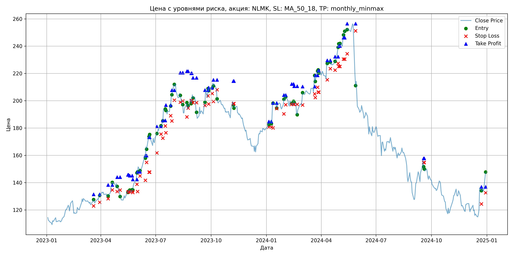
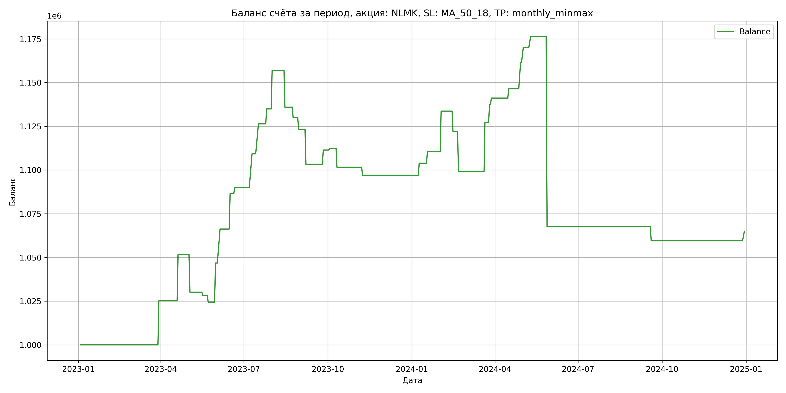

# Результаты торговой стратегии для NLMK

**Дата:** 2025-05-17 12:24:04  
**Стратегия:** NLMK,_SL_MA_50_18,_TP_monthly_minmax

## Конфигурация

```json
{
    "TICKER": "NLMK",
    "EXCHANGE": "MOEX",
    "START_DATE": "2023-01-01",
    "END_DATE": "2024-12-31",
    "INTERVAL": "1d",
    "CAPITAL": 1000000,
    "RISK_PERCENT": 0.02,
    "PROFIT_TO_RISK": 3,
    "ATR_MULTIPLIER": 1.5,
    "ATR_WINDOW": 14,
    "STOP_LOSS_METHOD": "MA_50_18",
    "TAKE_PROFIT_METHOD": "monthly_minmax",
    "POSITION": "long"
}
```

## Метрики эффективности

- **Начальный баланс:** 1000000.00
- **Конечный баланс:** 1064982.02
- **Прибыль/Убыток:** 64982.02 (6.50% за период тестирования)
- **Количество сделок:** 36
- **Процент выигрышных сделок:** 63.89% (23 выигрышных, 13 убыточных)
- **Средняя прибыль:** 13607.42
- **Средний убыток:** -19076.04
- **Максимальная прибыль:** 28237.44
- **Максимальный убыток:** -108847.20
- **Коэффициент прибыли:** 1.26
- **Максимальная просадка:** -9.93%

## Графики

### График цены с уровнями риска



### График баланса счёта



## Завершённые сделки

**Всего сделок:** 72

| Сделка № | Дата | Тип | Покупка / продажа | Количество акций | Цена | Stop Loss в момент сделки | Take Profit в момент сделки | Прибыль / убыток | Прибыль / убыток с учётом комиссии |
|:--------:|:----:|:---:|:-----------------:|:----------------:|:----:|:-------------------------:|:---------------------------:|:----------------:|:----------------------------------:|
| 1 | 2023-03-20 00:00:00 | LONG | BUY | 3651 | 125.40 | 122.97 | 131.42 | 0.00 | -228.92 |
| 2 | 2023-03-30 00:00:00 | LONG | SELL | -3651 | 132.30 | 125.62 | 131.42 | 25191.90 | 24721.47 |
| 3 | 2023-04-13 00:00:00 | LONG | BUY | 3634 | 130.82 | 128.23 | 138.35 | 0.00 | -237.70 |
| 4 | 2023-04-20 00:00:00 | LONG | SELL | -3634 | 138.10 | 134.69 | 138.35 | 26455.52 | 25966.89 |
| 5 | 2023-04-28 00:00:00 | LONG | BUY | 3538 | 139.42 | 133.50 | 144.06 | 0.00 | -246.63 |
| 6 | 2023-05-03 00:00:00 | LONG | SELL | -3538 | 133.34 | 134.53 | 144.06 | -21511.04 | -21993.55 |
| 7 | 2023-05-16 00:00:00 | LONG | BUY | 2523 | 133.52 | 133.13 | 145.73 | 0.00 | -168.44 |
| 8 | 2023-05-17 00:00:00 | LONG | SELL | -2523 | 132.80 | 133.13 | 145.73 | -1816.56 | -2152.52 |
| 9 | 2023-05-19 00:00:00 | LONG | BUY | 2719 | 134.42 | 133.47 | 145.12 | 0.00 | -182.74 |
| 10 | 2023-05-23 00:00:00 | LONG | SELL | -2719 | 133.00 | 133.47 | 145.12 | -3860.98 | -4224.54 |
| 11 | 2023-05-24 00:00:00 | LONG | BUY | 2711 | 135.38 | 132.82 | 142.35 | 0.00 | -183.51 |
| 12 | 2023-05-31 00:00:00 | LONG | SELL | -2711 | 143.62 | 138.89 | 142.35 | 22338.64 | 21960.46 |
| 13 | 2023-06-01 00:00:00 | LONG | BUY | 3077 | 146.68 | 133.48 | 147.96 | 0.00 | -225.67 |
| 14 | 2023-06-05 00:00:00 | LONG | SELL | -3077 | 153.00 | 144.92 | 147.96 | 19446.64 | 18985.58 |
| 15 | 2023-06-14 00:00:00 | LONG | BUY | 2979 | 159.52 | 141.69 | 159.86 | 0.00 | -237.61 |
| 16 | 2023-06-16 00:00:00 | LONG | SELL | -2979 | 166.30 | 154.82 | 159.86 | 20197.62 | 19712.31 |
| 17 | 2023-06-20 00:00:00 | LONG | BUY | 2514 | 172.30 | 147.69 | 173.27 | 0.00 | -216.58 |
| 18 | 2023-06-21 00:00:00 | LONG | SELL | -2514 | 173.72 | 147.69 | 173.27 | 3569.88 | 3134.93 |
| 19 | 2023-07-03 00:00:00 | LONG | BUY | 2046 | 173.00 | 161.77 | 181.06 | 0.00 | -176.98 |
| 20 | 2023-07-10 00:00:00 | LONG | SELL | -2046 | 182.40 | 175.54 | 181.06 | 19232.40 | 18868.83 |
| 21 | 2023-07-13 00:00:00 | LONG | BUY | 2449 | 184.98 | 172.59 | 185.60 | 0.00 | -226.51 |
| 22 | 2023-07-17 00:00:00 | LONG | SELL | -2449 | 191.98 | 181.55 | 185.60 | 17143.00 | 16681.41 |
| 23 | 2023-07-18 00:00:00 | LONG | BUY | 2354 | 193.86 | 176.57 | 196.85 | 0.00 | -228.17 |
| 24 | 2023-07-26 00:00:00 | LONG | SELL | -2354 | 197.50 | 189.06 | 196.85 | 8568.56 | 8107.93 |
| 25 | 2023-07-28 00:00:00 | LONG | BUY | 2380 | 202.78 | 185.21 | 207.71 | 0.00 | -241.31 |
| 26 | 2023-08-01 00:00:00 | LONG | SELL | -2380 | 212.04 | 200.35 | 207.71 | 22038.80 | 21545.16 |
| 27 | 2023-08-11 00:00:00 | LONG | BUY | 2341 | 205.50 | 198.97 | 220.61 | 0.00 | -240.54 |
| 28 | 2023-08-15 00:00:00 | LONG | SELL | -2341 | 196.50 | 199.86 | 220.61 | -21069.00 | -21539.54 |
| 29 | 2023-08-22 00:00:00 | LONG | BUY | 1735 | 197.82 | 188.13 | 221.63 | 0.00 | -171.61 |
| 30 | 2023-08-24 00:00:00 | LONG | SELL | -1735 | 194.38 | 194.63 | 221.63 | -5968.40 | -6308.63 |
| 31 | 2023-08-29 00:00:00 | LONG | BUY | 1779 | 201.70 | 200.10 | 220.11 | 0.00 | -179.41 |
| 32 | 2023-08-30 00:00:00 | LONG | SELL | -1779 | 197.90 | 200.10 | 220.11 | -6760.20 | -7115.64 |
| 33 | 2023-09-01 00:00:00 | LONG | BUY | 1760 | 204.58 | 198.57 | 216.84 | 0.00 | -180.03 |
| 34 | 2023-09-07 00:00:00 | LONG | SELL | -1760 | 193.26 | 198.59 | 216.84 | -19923.20 | -20273.30 |
| 35 | 2023-09-21 00:00:00 | LONG | BUY | 1651 | 196.96 | 196.54 | 207.77 | 0.00 | -162.59 |
| 36 | 2023-09-26 00:00:00 | LONG | SELL | -1651 | 201.90 | 203.59 | 207.77 | 8155.94 | 7826.68 |
| 37 | 2023-09-27 00:00:00 | LONG | BUY | 1859 | 209.46 | 197.58 | 209.55 | 0.00 | -194.69 |
| 38 | 2023-10-03 00:00:00 | LONG | SELL | -1859 | 209.96 | 205.31 | 209.55 | 929.50 | 539.65 |
| 39 | 2023-10-05 00:00:00 | LONG | BUY | 2108 | 212.84 | 199.53 | 215.31 | 0.00 | -224.33 |
| 40 | 2023-10-11 00:00:00 | LONG | SELL | -2108 | 207.72 | 208.03 | 215.31 | -10792.96 | -11236.23 |
| 41 | 2023-11-07 00:00:00 | LONG | BUY | 2146 | 199.10 | 197.86 | 214.40 | 0.00 | -213.63 |
| 42 | 2023-11-08 00:00:00 | LONG | SELL | -2146 | 196.86 | 197.86 | 214.40 | -4807.04 | -5231.91 |
| 43 | 2024-01-05 00:00:00 | LONG | BUY | 3029 | 183.12 | 180.62 | 184.75 | 0.00 | -277.34 |
| 44 | 2024-01-09 00:00:00 | LONG | SELL | -3029 | 185.48 | 180.62 | 184.75 | 7148.44 | 6590.20 |
| 45 | 2024-01-12 00:00:00 | LONG | BUY | 2694 | 196.50 | 180.12 | 198.38 | 0.00 | -264.69 |
| 46 | 2024-01-18 00:00:00 | LONG | SELL | -2694 | 198.94 | 194.29 | 198.38 | 6573.36 | 6040.70 |
| 47 | 2024-01-30 00:00:00 | LONG | BUY | 3053 | 197.30 | 190.38 | 204.18 | 0.00 | -301.18 |
| 48 | 2024-02-02 00:00:00 | LONG | SELL | -3053 | 204.90 | 197.06 | 204.18 | 23202.80 | 22588.84 |
| 49 | 2024-02-12 00:00:00 | LONG | BUY | 2877 | 201.00 | 197.39 | 212.28 | 0.00 | -289.14 |
| 50 | 2024-02-15 00:00:00 | LONG | SELL | -2877 | 196.92 | 197.39 | 212.28 | -11738.16 | -12310.57 |
| 51 | 2024-02-16 00:00:00 | LONG | BUY | 2442 | 199.70 | 197.35 | 210.70 | 0.00 | -243.83 |
| 52 | 2024-02-21 00:00:00 | LONG | SELL | -2442 | 190.32 | 197.35 | 210.70 | -22905.96 | -23382.17 |
| 53 | 2024-03-01 00:00:00 | LONG | BUY | 2292 | 200.46 | 196.88 | 210.41 | 0.00 | -229.73 |
| 54 | 2024-03-21 00:00:00 | LONG | SELL | -2292 | 212.78 | 205.00 | 210.41 | 28237.44 | 27763.87 |
| 55 | 2024-03-22 00:00:00 | LONG | BUY | 2567 | 217.98 | 202.38 | 218.59 | 0.00 | -279.78 |
| 56 | 2024-03-26 00:00:00 | LONG | SELL | -2567 | 221.90 | 209.86 | 218.59 | 10062.64 | 9498.05 |
| 57 | 2024-03-27 00:00:00 | LONG | BUY | 2527 | 222.00 | 206.32 | 222.08 | 0.00 | -280.50 |
| 58 | 2024-03-28 00:00:00 | LONG | SELL | -2527 | 223.50 | 206.32 | 222.08 | 3790.50 | 3227.61 |
| 59 | 2024-04-11 00:00:00 | LONG | BUY | 2325 | 227.80 | 215.41 | 229.62 | 0.00 | -264.82 |
| 60 | 2024-04-16 00:00:00 | LONG | SELL | -2325 | 230.12 | 223.56 | 229.62 | 5394.00 | 4861.67 |
| 61 | 2024-04-24 00:00:00 | LONG | BUY | 3050 | 228.24 | 222.46 | 232.32 | 0.00 | -348.07 |
| 62 | 2024-04-29 00:00:00 | LONG | SELL | -3050 | 233.16 | 227.38 | 232.32 | 15006.00 | 14302.36 |
| 63 | 2024-04-30 00:00:00 | LONG | BUY | 3178 | 239.60 | 225.14 | 240.13 | 0.00 | -380.72 |
| 64 | 2024-05-02 00:00:00 | LONG | SELL | -3178 | 242.30 | 225.14 | 240.13 | 8580.60 | 7814.86 |
| 65 | 2024-05-08 00:00:00 | LONG | BUY | 3053 | 246.94 | 230.50 | 246.22 | 0.00 | -376.95 |
| 66 | 2024-05-10 00:00:00 | LONG | SELL | -3053 | 249.00 | 230.50 | 246.22 | 6289.18 | 5532.13 |
| 67 | 2024-05-14 00:00:00 | LONG | BUY | 3192 | 252.88 | 234.40 | 256.44 | 0.00 | -403.60 |
| 68 | 2024-05-28 00:00:00 | LONG | SELL | -3192 | 218.78 | 251.17 | 256.44 | -108847.20 | -109599.97 |
| 69 | 2024-09-18 00:00:00 | LONG | BUY | 1783 | 156.24 | 154.75 | 157.77 | 0.00 | -139.29 |
| 70 | 2024-09-19 00:00:00 | LONG | SELL | -1783 | 151.76 | 154.75 | 157.77 | -7987.84 | -8262.42 |
| 71 | 2024-12-23 00:00:00 | LONG | BUY | 1868 | 137.10 | 124.39 | 136.87 | 0.00 | -128.05 |
| 72 | 2024-12-30 00:00:00 | LONG | SELL | -1868 | 140.00 | 132.59 | 136.87 | 5417.20 | 5158.39 |
