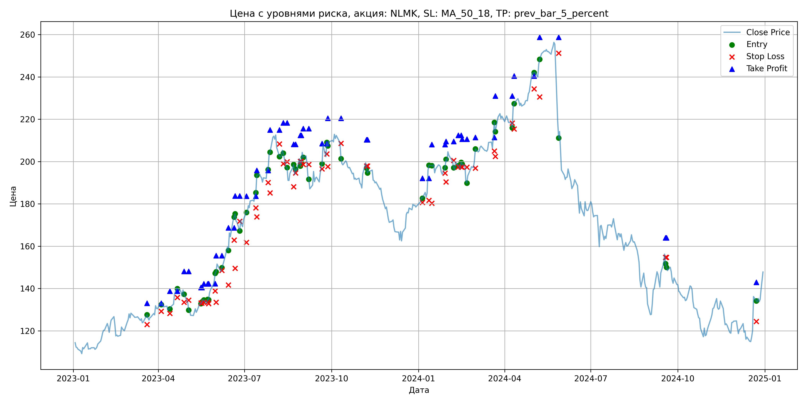
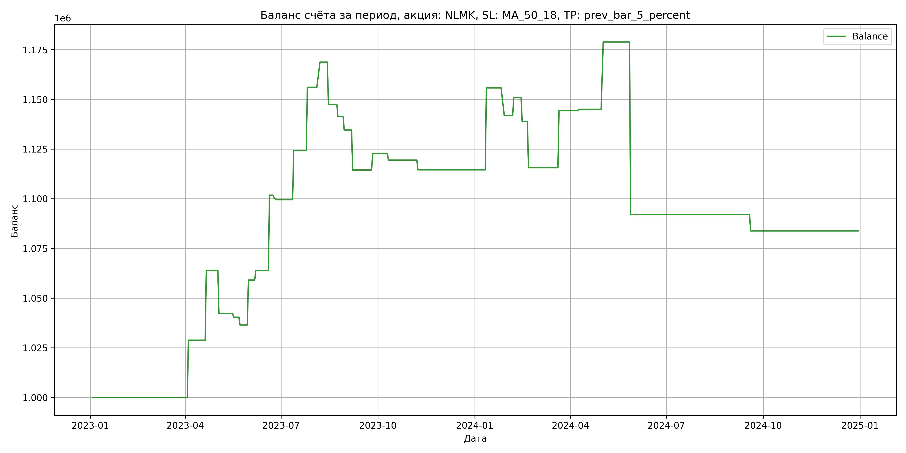

# Результаты торговой стратегии для NLMK

**Дата:** 2025-05-17 12:24:02  
**Стратегия:** NLMK,_SL_MA_50_18,_TP_prev_bar_5_percent

## Конфигурация

```json
{
    "TICKER": "NLMK",
    "EXCHANGE": "MOEX",
    "START_DATE": "2023-01-01",
    "END_DATE": "2024-12-31",
    "INTERVAL": "1d",
    "CAPITAL": 1000000,
    "RISK_PERCENT": 0.02,
    "PROFIT_TO_RISK": 3,
    "ATR_MULTIPLIER": 1.5,
    "ATR_WINDOW": 14,
    "STOP_LOSS_METHOD": "MA_50_18",
    "TAKE_PROFIT_METHOD": "prev_bar_5_percent",
    "POSITION": "long"
}
```

## Метрики эффективности

- **Начальный баланс:** 1000000.00
- **Конечный баланс:** 1083807.52
- **Прибыль/Убыток:** 83807.52 (8.38% за период тестирования)
- **Количество сделок:** 29
- **Процент выигрышных сделок:** 48.28% (14 выигрышных, 15 убыточных)
- **Средняя прибыль:** 22869.22
- **Средний убыток:** -15757.43
- **Максимальная прибыль:** 41223.78
- **Максимальный убыток:** -86845.44
- **Коэффициент прибыли:** 1.35
- **Максимальная просадка:** -8.06%

## Графики

### График цены с уровнями риска



### График баланса счёта



## Завершённые сделки

**Всего сделок:** 59

| Сделка № | Дата | Тип | Покупка / продажа | Количество акций | Цена | Stop Loss в момент сделки | Take Profit в момент сделки | Прибыль / убыток | Прибыль / убыток с учётом комиссии |
|:--------:|:----:|:---:|:-----------------:|:----------------:|:----:|:-------------------------:|:---------------------------:|:----------------:|:----------------------------------:|
| 1 | 2023-03-20 00:00:00 | LONG | BUY | 3651 | 125.40 | 122.97 | 133.01 | 0.00 | -228.92 |
| 2 | 2023-04-04 00:00:00 | LONG | SELL | -3651 | 133.30 | 129.20 | 133.01 | 28842.90 | 28370.64 |
| 3 | 2023-04-13 00:00:00 | LONG | BUY | 3647 | 130.82 | 128.23 | 138.73 | 0.00 | -238.55 |
| 4 | 2023-04-21 00:00:00 | LONG | SELL | -3647 | 140.46 | 135.73 | 138.73 | 35157.08 | 34662.40 |
| 5 | 2023-04-28 00:00:00 | LONG | BUY | 3580 | 139.42 | 133.50 | 148.09 | 0.00 | -249.56 |
| 6 | 2023-05-03 00:00:00 | LONG | SELL | -3580 | 133.34 | 134.53 | 148.09 | -21766.40 | -22254.64 |
| 7 | 2023-05-16 00:00:00 | LONG | BUY | 2553 | 133.52 | 133.13 | 140.48 | 0.00 | -170.44 |
| 8 | 2023-05-17 00:00:00 | LONG | SELL | -2553 | 132.80 | 133.13 | 140.48 | -1838.16 | -2178.12 |
| 9 | 2023-05-19 00:00:00 | LONG | BUY | 2751 | 134.42 | 133.47 | 142.19 | 0.00 | -184.89 |
| 10 | 2023-05-23 00:00:00 | LONG | SELL | -2751 | 133.00 | 133.47 | 142.19 | -3906.42 | -4274.26 |
| 11 | 2023-05-24 00:00:00 | LONG | BUY | 2742 | 135.38 | 132.82 | 142.26 | 0.00 | -185.61 |
| 12 | 2023-05-31 00:00:00 | LONG | SELL | -2742 | 143.62 | 138.89 | 142.26 | 22594.08 | 22211.57 |
| 13 | 2023-06-01 00:00:00 | LONG | BUY | 3113 | 146.68 | 133.48 | 155.54 | 0.00 | -228.31 |
| 14 | 2023-06-07 00:00:00 | LONG | SELL | -3113 | 148.20 | 148.51 | 155.54 | 4731.76 | 4272.78 |
| 15 | 2023-06-14 00:00:00 | LONG | BUY | 2972 | 159.52 | 141.69 | 168.66 | 0.00 | -237.05 |
| 16 | 2023-06-20 00:00:00 | LONG | SELL | -2972 | 172.30 | 162.90 | 168.66 | 37982.16 | 37489.08 |
| 17 | 2023-06-21 00:00:00 | LONG | BUY | 2515 | 173.72 | 149.54 | 183.69 | 0.00 | -218.45 |
| 18 | 2023-06-26 00:00:00 | LONG | SELL | -2515 | 172.80 | 171.75 | 183.69 | -2313.80 | -2749.55 |
| 19 | 2023-07-03 00:00:00 | LONG | BUY | 2064 | 173.00 | 161.77 | 183.67 | 0.00 | -178.54 |
| 20 | 2023-07-13 00:00:00 | LONG | SELL | -2064 | 184.98 | 178.12 | 183.67 | 24726.72 | 24357.28 |
| 21 | 2023-07-14 00:00:00 | LONG | BUY | 2524 | 184.88 | 173.88 | 195.81 | 0.00 | -233.32 |
| 22 | 2023-07-26 00:00:00 | LONG | SELL | -2524 | 197.50 | 190.12 | 195.81 | 31852.88 | 31370.32 |
| 23 | 2023-07-28 00:00:00 | LONG | BUY | 2425 | 202.78 | 185.21 | 214.94 | 0.00 | -245.87 |
| 24 | 2023-08-07 00:00:00 | LONG | SELL | -2425 | 208.00 | 208.27 | 214.94 | 12658.50 | 12160.43 |
| 25 | 2023-08-11 00:00:00 | LONG | BUY | 2366 | 205.50 | 198.97 | 218.29 | 0.00 | -243.11 |
| 26 | 2023-08-15 00:00:00 | LONG | SELL | -2366 | 196.50 | 199.86 | 218.29 | -21294.00 | -21769.57 |
| 27 | 2023-08-22 00:00:00 | LONG | BUY | 1753 | 197.82 | 188.13 | 208.09 | 0.00 | -173.39 |
| 28 | 2023-08-24 00:00:00 | LONG | SELL | -1753 | 194.38 | 194.63 | 208.09 | -6030.32 | -6374.08 |
| 29 | 2023-08-29 00:00:00 | LONG | BUY | 1797 | 201.70 | 200.10 | 212.37 | 0.00 | -181.23 |
| 30 | 2023-08-30 00:00:00 | LONG | SELL | -1797 | 197.90 | 200.10 | 212.37 | -6828.60 | -7187.64 |
| 31 | 2023-09-01 00:00:00 | LONG | BUY | 1778 | 204.58 | 198.57 | 215.54 | 0.00 | -181.87 |
| 32 | 2023-09-07 00:00:00 | LONG | SELL | -1778 | 193.26 | 198.59 | 215.54 | -20126.96 | -20480.64 |
| 33 | 2023-09-21 00:00:00 | LONG | BUY | 1669 | 196.96 | 196.54 | 208.49 | 0.00 | -164.36 |
| 34 | 2023-09-26 00:00:00 | LONG | SELL | -1669 | 201.90 | 203.59 | 208.49 | 8244.86 | 7912.01 |
| 35 | 2023-09-27 00:00:00 | LONG | BUY | 1878 | 209.46 | 197.58 | 220.50 | 0.00 | -196.68 |
| 36 | 2023-10-11 00:00:00 | LONG | SELL | -1878 | 207.72 | 208.58 | 220.50 | -3267.72 | -3659.45 |
| 37 | 2023-11-07 00:00:00 | LONG | BUY | 2182 | 199.10 | 197.86 | 210.32 | 0.00 | -217.22 |
| 38 | 2023-11-08 00:00:00 | LONG | SELL | -2182 | 196.86 | 197.86 | 210.32 | -4887.68 | -5319.67 |
| 39 | 2024-01-05 00:00:00 | LONG | BUY | 3081 | 183.12 | 180.62 | 192.10 | 0.00 | -282.10 |
| 40 | 2024-01-12 00:00:00 | LONG | SELL | -3081 | 196.50 | 181.69 | 192.10 | 41223.78 | 40638.98 |
| 41 | 2024-01-15 00:00:00 | LONG | BUY | 2772 | 199.00 | 180.30 | 208.07 | 0.00 | -275.81 |
| 42 | 2024-01-29 00:00:00 | LONG | SELL | -2772 | 194.00 | 194.57 | 208.07 | -13860.00 | -14404.70 |
| 43 | 2024-01-30 00:00:00 | LONG | BUY | 3142 | 197.30 | 190.38 | 209.52 | 0.00 | -309.96 |
| 44 | 2024-02-07 00:00:00 | LONG | SELL | -3142 | 200.14 | 200.49 | 209.52 | 8923.28 | 8298.90 |
| 45 | 2024-02-12 00:00:00 | LONG | BUY | 2923 | 201.00 | 197.39 | 212.35 | 0.00 | -293.76 |
| 46 | 2024-02-15 00:00:00 | LONG | SELL | -2923 | 196.92 | 197.39 | 212.35 | -11925.84 | -12507.40 |
| 47 | 2024-02-16 00:00:00 | LONG | BUY | 2481 | 199.70 | 197.35 | 210.54 | 0.00 | -247.73 |
| 48 | 2024-02-21 00:00:00 | LONG | SELL | -2481 | 190.32 | 197.35 | 210.54 | -23271.78 | -23755.60 |
| 49 | 2024-03-01 00:00:00 | LONG | BUY | 2328 | 200.46 | 196.88 | 211.36 | 0.00 | -233.34 |
| 50 | 2024-03-21 00:00:00 | LONG | SELL | -2328 | 212.78 | 205.00 | 211.36 | 28680.96 | 28199.95 |
| 51 | 2024-03-22 00:00:00 | LONG | BUY | 2608 | 217.98 | 202.38 | 230.94 | 0.00 | -284.25 |
| 52 | 2024-04-09 00:00:00 | LONG | SELL | -2608 | 218.24 | 218.15 | 230.94 | 678.08 | 109.25 |
| 53 | 2024-04-11 00:00:00 | LONG | BUY | 2336 | 227.80 | 215.41 | 240.38 | 0.00 | -266.07 |
| 54 | 2024-05-02 00:00:00 | LONG | SELL | -2336 | 242.30 | 234.34 | 240.38 | 33872.00 | 33322.92 |
| 55 | 2024-05-08 00:00:00 | LONG | BUY | 3084 | 246.94 | 230.50 | 258.69 | 0.00 | -380.78 |
| 56 | 2024-05-28 00:00:00 | LONG | SELL | -3084 | 218.78 | 251.17 | 258.69 | -86845.44 | -87563.58 |
| 57 | 2024-09-18 00:00:00 | LONG | BUY | 1830 | 156.24 | 154.75 | 163.97 | 0.00 | -142.96 |
| 58 | 2024-09-19 00:00:00 | LONG | SELL | -1830 | 151.76 | 154.75 | 163.97 | -8198.40 | -8480.22 |
| 59 | 2024-12-23 00:00:00 | LONG | BUY | 1918 | 137.10 | 124.39 | 142.92 | 0.00 | -131.48 |
