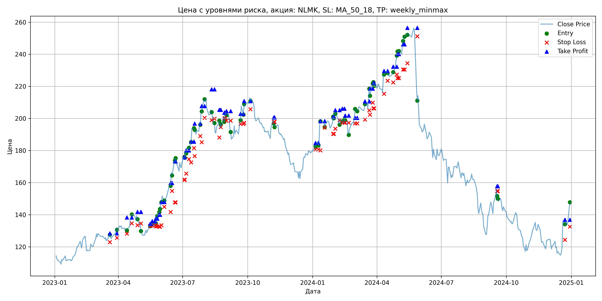

# Результаты торговой стратегии для NLMK

**Дата:** 2025-05-17 12:24:03  
**Стратегия:** NLMK,_SL_MA_50_18,_TP_weekly_minmax

## Конфигурация

```json
{
    "TICKER": "NLMK",
    "EXCHANGE": "MOEX",
    "START_DATE": "2023-01-01",
    "END_DATE": "2024-12-31",
    "INTERVAL": "1d",
    "CAPITAL": 1000000,
    "RISK_PERCENT": 0.02,
    "PROFIT_TO_RISK": 3,
    "ATR_MULTIPLIER": 1.5,
    "ATR_WINDOW": 14,
    "STOP_LOSS_METHOD": "MA_50_18",
    "TAKE_PROFIT_METHOD": "weekly_minmax",
    "POSITION": "long"
}
```

## Метрики эффективности

- **Начальный баланс:** 1000000.00
- **Конечный баланс:** 1058751.98
- **Прибыль/Убыток:** 58751.98 (5.88% за период тестирования)
- **Количество сделок:** 39
- **Процент выигрышных сделок:** 66.67% (26 выигрышных, 13 убыточных)
- **Средняя прибыль:** 12187.75
- **Средний убыток:** -19856.13
- **Максимальная прибыль:** 26455.52
- **Максимальный убыток:** -108062.90
- **Коэффициент прибыли:** 1.23
- **Максимальная просадка:** -9.92%

## Графики

### График цены с уровнями риска



### График баланса счёта


## Завершённые сделки

**Всего сделок:** 78

| Сделка № | Дата | Тип | Покупка / продажа | Количество акций | Цена | Stop Loss в момент сделки | Take Profit в момент сделки | Прибыль / убыток | Прибыль / убыток с учётом комиссии |
|:--------:|:----:|:---:|:-----------------:|:----------------:|:----:|:-------------------------:|:---------------------------:|:----------------:|:----------------------------------:|
| 1 | 2023-03-20 00:00:00 | LONG | BUY | 3651 | 125.40 | 122.97 | 128.42 | 0.00 | -228.92 |
| 2 | 2023-03-30 00:00:00 | LONG | SELL | -3651 | 132.30 | 125.62 | 128.42 | 25191.90 | 24721.47 |
| 3 | 2023-04-13 00:00:00 | LONG | BUY | 3634 | 130.82 | 128.23 | 138.35 | 0.00 | -237.70 |
| 4 | 2023-04-20 00:00:00 | LONG | SELL | -3634 | 138.10 | 134.69 | 138.35 | 26455.52 | 25966.89 |
| 5 | 2023-04-28 00:00:00 | LONG | BUY | 3538 | 139.42 | 133.50 | 141.81 | 0.00 | -246.63 |
| 6 | 2023-05-03 00:00:00 | LONG | SELL | -3538 | 133.34 | 134.53 | 141.81 | -21511.04 | -21993.55 |
| 7 | 2023-05-16 00:00:00 | LONG | BUY | 2523 | 133.52 | 133.13 | 134.31 | 0.00 | -168.44 |
| 8 | 2023-05-17 00:00:00 | LONG | SELL | -2523 | 132.80 | 133.13 | 134.31 | -1816.56 | -2152.52 |
| 9 | 2023-05-19 00:00:00 | LONG | BUY | 2719 | 134.42 | 133.47 | 136.02 | 0.00 | -182.74 |
| 10 | 2023-05-23 00:00:00 | LONG | SELL | -2719 | 133.00 | 133.47 | 136.02 | -3860.98 | -4224.54 |
| 11 | 2023-05-24 00:00:00 | LONG | BUY | 2711 | 135.38 | 132.82 | 137.56 | 0.00 | -183.51 |
| 12 | 2023-05-26 00:00:00 | LONG | SELL | -2711 | 138.34 | 132.82 | 137.56 | 8024.56 | 7653.53 |
| 13 | 2023-05-29 00:00:00 | LONG | BUY | 3277 | 141.00 | 132.56 | 140.04 | 0.00 | -231.03 |
| 14 | 2023-05-30 00:00:00 | LONG | SELL | -3277 | 141.24 | 132.56 | 140.04 | 786.48 | 324.03 |
| 15 | 2023-06-01 00:00:00 | LONG | BUY | 3035 | 146.68 | 133.48 | 147.96 | 0.00 | -222.59 |
| 16 | 2023-06-05 00:00:00 | LONG | SELL | -3035 | 153.00 | 144.92 | 147.96 | 19181.20 | 18726.44 |
| 17 | 2023-06-14 00:00:00 | LONG | BUY | 2939 | 159.52 | 141.69 | 159.86 | 0.00 | -234.41 |
| 18 | 2023-06-16 00:00:00 | LONG | SELL | -2939 | 166.30 | 154.82 | 159.86 | 19926.42 | 19447.63 |
| 19 | 2023-06-20 00:00:00 | LONG | BUY | 2480 | 172.30 | 147.69 | 173.27 | 0.00 | -213.65 |
| 20 | 2023-06-21 00:00:00 | LONG | SELL | -2480 | 173.72 | 147.69 | 173.27 | 3521.60 | 3092.54 |
| 21 | 2023-07-03 00:00:00 | LONG | BUY | 2019 | 173.00 | 161.77 | 175.84 | 0.00 | -174.64 |
| 22 | 2023-07-04 00:00:00 | LONG | SELL | -2019 | 176.10 | 161.77 | 175.84 | 6258.90 | 5906.48 |
| 23 | 2023-07-06 00:00:00 | LONG | BUY | 2156 | 179.52 | 165.67 | 180.14 | 0.00 | -193.52 |
| 24 | 2023-07-10 00:00:00 | LONG | SELL | -2156 | 182.40 | 174.64 | 180.14 | 6209.28 | 5819.13 |
| 25 | 2023-07-13 00:00:00 | LONG | BUY | 2400 | 184.98 | 172.59 | 185.60 | 0.00 | -221.98 |
| 26 | 2023-07-17 00:00:00 | LONG | SELL | -2400 | 191.98 | 181.55 | 185.60 | 16800.00 | 16347.65 |
| 27 | 2023-07-18 00:00:00 | LONG | BUY | 2308 | 193.86 | 176.57 | 196.85 | 0.00 | -223.71 |
| 28 | 2023-07-26 00:00:00 | LONG | SELL | -2308 | 197.50 | 189.06 | 196.85 | 8401.12 | 7949.49 |
| 29 | 2023-07-28 00:00:00 | LONG | BUY | 2333 | 202.78 | 185.21 | 207.71 | 0.00 | -236.54 |
| 30 | 2023-08-01 00:00:00 | LONG | SELL | -2333 | 212.04 | 200.35 | 207.71 | 21603.58 | 21119.69 |
| 31 | 2023-08-11 00:00:00 | LONG | BUY | 2295 | 205.50 | 198.97 | 218.14 | 0.00 | -235.81 |
| 32 | 2023-08-15 00:00:00 | LONG | SELL | -2295 | 196.50 | 199.86 | 218.14 | -20655.00 | -21116.29 |
| 33 | 2023-08-22 00:00:00 | LONG | BUY | 1701 | 197.82 | 188.13 | 205.41 | 0.00 | -168.25 |
| 34 | 2023-08-24 00:00:00 | LONG | SELL | -1701 | 194.38 | 194.63 | 205.41 | -5851.44 | -6185.01 |
| 35 | 2023-08-29 00:00:00 | LONG | BUY | 1744 | 201.70 | 200.10 | 203.64 | 0.00 | -175.88 |
| 36 | 2023-08-30 00:00:00 | LONG | SELL | -1744 | 197.90 | 200.10 | 203.64 | -6627.20 | -6975.65 |
| 37 | 2023-09-01 00:00:00 | LONG | BUY | 1725 | 204.58 | 198.57 | 204.55 | 0.00 | -176.45 |
| 38 | 2023-09-07 00:00:00 | LONG | SELL | -1725 | 193.26 | 198.59 | 204.55 | -19527.00 | -19870.14 |
| 39 | 2023-09-21 00:00:00 | LONG | BUY | 1619 | 196.96 | 196.54 | 202.90 | 0.00 | -159.44 |
| 40 | 2023-09-25 00:00:00 | LONG | SELL | -1619 | 208.00 | 196.54 | 202.90 | 17873.76 | 17545.94 |
| 41 | 2023-09-26 00:00:00 | LONG | BUY | 1894 | 201.90 | 197.26 | 210.82 | 0.00 | -191.20 |
| 42 | 2023-10-05 00:00:00 | LONG | SELL | -1894 | 212.84 | 205.76 | 210.82 | 20720.36 | 20327.60 |
| 43 | 2023-11-07 00:00:00 | LONG | BUY | 2183 | 199.10 | 197.86 | 200.68 | 0.00 | -217.32 |
| 44 | 2023-11-08 00:00:00 | LONG | SELL | -2183 | 196.86 | 197.86 | 200.68 | -4889.92 | -5322.11 |
| 45 | 2024-01-05 00:00:00 | LONG | BUY | 3082 | 183.12 | 180.62 | 184.75 | 0.00 | -282.19 |
| 46 | 2024-01-09 00:00:00 | LONG | SELL | -3082 | 185.48 | 180.62 | 184.75 | 7273.52 | 6705.51 |
| 47 | 2024-01-12 00:00:00 | LONG | BUY | 2741 | 196.50 | 180.12 | 198.38 | 0.00 | -269.30 |
| 48 | 2024-01-18 00:00:00 | LONG | SELL | -2741 | 198.94 | 194.29 | 198.38 | 6688.04 | 6146.09 |
| 49 | 2024-01-30 00:00:00 | LONG | BUY | 3107 | 197.30 | 190.38 | 200.92 | 0.00 | -306.51 |
| 50 | 2024-01-31 00:00:00 | LONG | SELL | -3107 | 201.50 | 190.38 | 200.92 | 13049.40 | 12429.86 |
| 51 | 2024-02-02 00:00:00 | LONG | BUY | 2975 | 204.90 | 193.56 | 205.23 | 0.00 | -304.79 |
| 52 | 2024-02-08 00:00:00 | LONG | SELL | -2975 | 197.10 | 198.84 | 205.23 | -23205.00 | -23802.98 |
| 53 | 2024-02-12 00:00:00 | LONG | BUY | 2840 | 201.00 | 197.39 | 206.08 | 0.00 | -285.42 |
| 54 | 2024-02-15 00:00:00 | LONG | SELL | -2840 | 196.92 | 197.39 | 206.08 | -11587.20 | -12152.25 |
| 55 | 2024-02-16 00:00:00 | LONG | BUY | 2410 | 199.70 | 197.35 | 201.81 | 0.00 | -240.64 |
| 56 | 2024-02-21 00:00:00 | LONG | SELL | -2410 | 190.32 | 197.35 | 201.81 | -22605.80 | -23075.77 |
| 57 | 2024-03-01 00:00:00 | LONG | BUY | 2262 | 200.46 | 196.88 | 200.42 | 0.00 | -226.72 |
| 58 | 2024-03-04 00:00:00 | LONG | SELL | -2262 | 206.60 | 196.88 | 200.42 | 13888.68 | 13428.30 |
| 59 | 2024-03-15 00:00:00 | LONG | BUY | 2792 | 205.30 | 199.31 | 210.66 | 0.00 | -286.60 |
| 60 | 2024-03-21 00:00:00 | LONG | SELL | -2792 | 212.78 | 205.00 | 210.66 | 20884.16 | 20300.52 |
| 61 | 2024-03-22 00:00:00 | LONG | BUY | 2548 | 217.98 | 202.38 | 218.59 | 0.00 | -277.71 |
| 62 | 2024-03-26 00:00:00 | LONG | SELL | -2548 | 221.90 | 209.86 | 218.59 | 9988.16 | 9427.75 |
| 63 | 2024-03-27 00:00:00 | LONG | BUY | 2509 | 222.00 | 206.32 | 222.08 | 0.00 | -278.50 |
| 64 | 2024-03-28 00:00:00 | LONG | SELL | -2509 | 223.50 | 206.32 | 222.08 | 3763.50 | 3204.62 |
| 65 | 2024-04-11 00:00:00 | LONG | BUY | 2308 | 227.80 | 215.41 | 229.62 | 0.00 | -262.88 |
| 66 | 2024-04-16 00:00:00 | LONG | SELL | -2308 | 230.12 | 223.56 | 229.62 | 5354.56 | 4826.12 |
| 67 | 2024-04-24 00:00:00 | LONG | BUY | 3028 | 228.24 | 222.46 | 232.32 | 0.00 | -345.56 |
| 68 | 2024-04-29 00:00:00 | LONG | SELL | -3028 | 233.16 | 227.38 | 232.32 | 14897.76 | 14199.20 |
| 69 | 2024-04-30 00:00:00 | LONG | BUY | 3154 | 239.60 | 225.14 | 240.13 | 0.00 | -377.85 |
| 70 | 2024-05-02 00:00:00 | LONG | SELL | -3154 | 242.30 | 225.14 | 240.13 | 8515.80 | 7755.84 |
| 71 | 2024-05-08 00:00:00 | LONG | BUY | 3031 | 246.94 | 230.50 | 246.22 | 0.00 | -374.24 |
| 72 | 2024-05-10 00:00:00 | LONG | SELL | -3031 | 249.00 | 230.50 | 246.22 | 6243.86 | 5492.26 |
| 73 | 2024-05-14 00:00:00 | LONG | BUY | 3169 | 252.88 | 234.40 | 256.44 | 0.00 | -400.69 |
| 74 | 2024-05-28 00:00:00 | LONG | SELL | -3169 | 218.78 | 251.17 | 256.44 | -108062.90 | -108810.25 |
| 75 | 2024-09-18 00:00:00 | LONG | BUY | 1770 | 156.24 | 154.75 | 157.77 | 0.00 | -138.27 |
| 76 | 2024-09-19 00:00:00 | LONG | SELL | -1770 | 151.76 | 154.75 | 157.77 | -7929.60 | -8202.18 |
| 77 | 2024-12-23 00:00:00 | LONG | BUY | 1855 | 137.10 | 124.39 | 136.87 | 0.00 | -127.16 |
| 78 | 2024-12-30 00:00:00 | LONG | SELL | -1855 | 140.00 | 132.59 | 136.87 | 5379.50 | 5122.49 |
