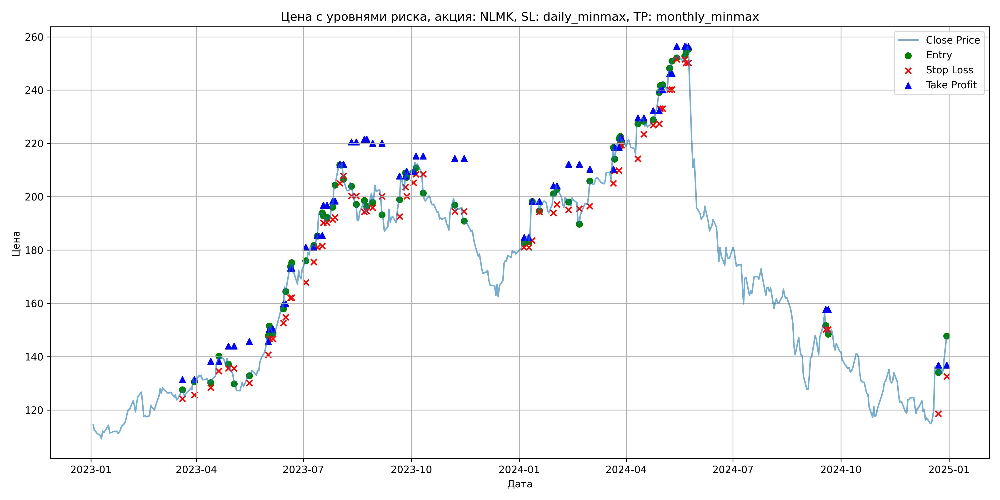
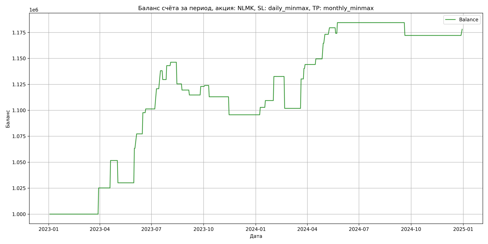

# Результаты торговой стратегии для NLMK

**Дата:** 2025-05-17 12:23:48  
**Стратегия:** NLMK,_SL_daily_minmax,_TP_monthly_minmax

## Конфигурация

```json
{
    "TICKER": "NLMK",
    "EXCHANGE": "MOEX",
    "START_DATE": "2023-01-01",
    "END_DATE": "2024-12-31",
    "INTERVAL": "1d",
    "CAPITAL": 1000000,
    "RISK_PERCENT": 0.02,
    "PROFIT_TO_RISK": 3,
    "ATR_MULTIPLIER": 1.5,
    "ATR_WINDOW": 14,
    "STOP_LOSS_METHOD": "daily_minmax",
    "TAKE_PROFIT_METHOD": "monthly_minmax",
    "POSITION": "long"
}
```

## Метрики эффективности

- **Начальный баланс:** 1000000.00
- **Конечный баланс:** 1178056.90
- **Прибыль/Убыток:** 178056.90 (17.81% за период тестирования)
- **Количество сделок:** 34
- **Процент выигрышных сделок:** 70.59% (24 выигрышных, 10 убыточных)
- **Средняя прибыль:** 13181.29
- **Средний убыток:** -13829.41
- **Максимальная прибыль:** 33202.68
- **Максимальный убыток:** -30705.00
- **Коэффициент прибыли:** 2.29
- **Максимальная просадка:** -4.42%

## Графики

### График цены с уровнями риска



### График баланса счёта



## Завершённые сделки

**Всего сделок:** 68

| Сделка № | Дата | Тип | Покупка / продажа | Количество акций | Цена | Stop Loss в момент сделки | Take Profit в момент сделки | Прибыль / убыток | Прибыль / убыток с учётом комиссии |
|:--------:|:----:|:---:|:-----------------:|:----------------:|:----:|:-------------------------:|:---------------------------:|:----------------:|:----------------------------------:|
| 1 | 2023-03-20 00:00:00 | LONG | BUY | 3651 | 125.40 | 124.32 | 131.42 | 0.00 | -228.92 |
| 2 | 2023-03-30 00:00:00 | LONG | SELL | -3651 | 132.30 | 125.62 | 131.42 | 25191.90 | 24721.47 |
| 3 | 2023-04-13 00:00:00 | LONG | BUY | 3634 | 130.82 | 128.40 | 138.35 | 0.00 | -237.70 |
| 4 | 2023-04-20 00:00:00 | LONG | SELL | -3634 | 138.10 | 134.69 | 138.35 | 26455.52 | 25966.89 |
| 5 | 2023-04-28 00:00:00 | LONG | BUY | 3538 | 139.42 | 135.60 | 144.06 | 0.00 | -246.63 |
| 6 | 2023-05-03 00:00:00 | LONG | SELL | -3538 | 133.34 | 135.60 | 144.06 | -21511.04 | -21993.55 |
| 7 | 2023-05-16 00:00:00 | LONG | BUY | 2523 | 133.52 | 130.14 | 145.73 | 0.00 | -168.44 |
| 8 | 2023-06-01 00:00:00 | LONG | SELL | -2523 | 146.68 | 140.73 | 145.73 | 33202.68 | 32849.21 |
| 9 | 2023-06-02 00:00:00 | LONG | BUY | 3180 | 148.62 | 146.68 | 150.33 | 0.00 | -236.31 |
| 10 | 2023-06-05 00:00:00 | LONG | SELL | -3180 | 153.00 | 146.68 | 150.33 | 13928.40 | 13448.82 |
| 11 | 2023-06-14 00:00:00 | LONG | BUY | 3012 | 159.52 | 152.60 | 159.86 | 0.00 | -240.24 |
| 12 | 2023-06-16 00:00:00 | LONG | SELL | -3012 | 166.30 | 154.82 | 159.86 | 20421.36 | 19930.68 |
| 13 | 2023-06-20 00:00:00 | LONG | BUY | 2542 | 172.30 | 162.12 | 173.27 | 0.00 | -218.99 |
| 14 | 2023-06-21 00:00:00 | LONG | SELL | -2542 | 173.72 | 162.12 | 173.27 | 3609.64 | 3169.85 |
| 15 | 2023-07-03 00:00:00 | LONG | BUY | 2069 | 173.00 | 167.84 | 181.06 | 0.00 | -178.97 |
| 16 | 2023-07-10 00:00:00 | LONG | SELL | -2069 | 182.40 | 175.54 | 181.06 | 19448.60 | 19080.94 |
| 17 | 2023-07-13 00:00:00 | LONG | BUY | 2476 | 184.98 | 181.00 | 185.60 | 0.00 | -229.01 |
| 18 | 2023-07-17 00:00:00 | LONG | SELL | -2476 | 191.98 | 181.55 | 185.60 | 17332.00 | 16865.32 |
| 19 | 2023-07-18 00:00:00 | LONG | BUY | 2380 | 193.86 | 190.30 | 196.85 | 0.00 | -230.69 |
| 20 | 2023-07-21 00:00:00 | LONG | SELL | -2380 | 190.28 | 190.30 | 196.85 | -8520.40 | -8977.53 |
| 21 | 2023-07-26 00:00:00 | LONG | BUY | 2542 | 197.50 | 191.42 | 198.40 | 0.00 | -251.02 |
| 22 | 2023-07-28 00:00:00 | LONG | SELL | -2542 | 202.78 | 192.22 | 198.40 | 13421.76 | 12913.00 |
| 23 | 2023-08-01 00:00:00 | LONG | BUY | 2386 | 212.04 | 205.10 | 212.24 | 0.00 | -252.96 |
| 24 | 2023-08-04 00:00:00 | LONG | SELL | -2386 | 213.42 | 207.76 | 212.24 | 3292.68 | 2785.11 |
| 25 | 2023-08-11 00:00:00 | LONG | BUY | 2320 | 205.50 | 200.26 | 220.61 | 0.00 | -238.38 |
| 26 | 2023-08-15 00:00:00 | LONG | SELL | -2320 | 196.50 | 200.26 | 220.61 | -20880.00 | -21346.32 |
| 27 | 2023-08-22 00:00:00 | LONG | BUY | 1719 | 197.82 | 194.44 | 221.63 | 0.00 | -170.03 |
| 28 | 2023-08-24 00:00:00 | LONG | SELL | -1719 | 194.38 | 194.63 | 221.63 | -5913.36 | -6250.46 |
| 29 | 2023-08-29 00:00:00 | LONG | BUY | 1762 | 201.70 | 195.96 | 220.11 | 0.00 | -177.70 |
| 30 | 2023-09-06 00:00:00 | LONG | SELL | -1762 | 199.00 | 200.21 | 220.11 | -4757.40 | -5110.42 |
| 31 | 2023-09-21 00:00:00 | LONG | BUY | 1669 | 196.96 | 192.64 | 207.77 | 0.00 | -164.36 |
| 32 | 2023-09-26 00:00:00 | LONG | SELL | -1669 | 201.90 | 203.59 | 207.77 | 8244.86 | 7912.01 |
| 33 | 2023-09-27 00:00:00 | LONG | BUY | 1879 | 209.46 | 200.24 | 209.55 | 0.00 | -196.79 |
| 34 | 2023-10-03 00:00:00 | LONG | SELL | -1879 | 209.96 | 205.31 | 209.55 | 939.50 | 545.45 |
| 35 | 2023-10-05 00:00:00 | LONG | BUY | 2131 | 212.84 | 208.50 | 215.31 | 0.00 | -226.78 |
| 36 | 2023-10-11 00:00:00 | LONG | SELL | -2131 | 207.72 | 208.50 | 215.31 | -10910.72 | -11358.83 |
| 37 | 2023-11-07 00:00:00 | LONG | BUY | 2169 | 199.10 | 194.50 | 214.40 | 0.00 | -215.92 |
| 38 | 2023-11-15 00:00:00 | LONG | SELL | -2169 | 191.10 | 194.50 | 214.40 | -17352.00 | -17775.17 |
| 39 | 2024-01-05 00:00:00 | LONG | BUY | 3027 | 183.12 | 181.00 | 184.75 | 0.00 | -277.15 |
| 40 | 2024-01-09 00:00:00 | LONG | SELL | -3027 | 185.48 | 181.00 | 184.75 | 7143.72 | 6585.84 |
| 41 | 2024-01-12 00:00:00 | LONG | BUY | 2692 | 196.50 | 183.64 | 198.38 | 0.00 | -264.49 |
| 42 | 2024-01-18 00:00:00 | LONG | SELL | -2692 | 198.94 | 194.29 | 198.38 | 6568.48 | 6036.22 |
| 43 | 2024-01-30 00:00:00 | LONG | BUY | 3051 | 197.30 | 194.00 | 204.18 | 0.00 | -300.98 |
| 44 | 2024-02-02 00:00:00 | LONG | SELL | -3051 | 204.90 | 197.06 | 204.18 | 23187.60 | 22574.04 |
| 45 | 2024-02-12 00:00:00 | LONG | BUY | 2875 | 201.00 | 195.16 | 212.28 | 0.00 | -288.94 |
| 46 | 2024-02-21 00:00:00 | LONG | SELL | -2875 | 190.32 | 195.57 | 212.28 | -30705.00 | -31267.52 |
| 47 | 2024-03-01 00:00:00 | LONG | BUY | 2300 | 200.46 | 196.52 | 210.41 | 0.00 | -230.53 |
| 48 | 2024-03-21 00:00:00 | LONG | SELL | -2300 | 212.78 | 205.00 | 210.41 | 28336.00 | 27860.77 |
| 49 | 2024-03-22 00:00:00 | LONG | BUY | 2576 | 217.98 | 209.70 | 218.59 | 0.00 | -280.76 |
| 50 | 2024-03-26 00:00:00 | LONG | SELL | -2576 | 221.90 | 209.86 | 218.59 | 10097.92 | 9531.35 |
| 51 | 2024-03-27 00:00:00 | LONG | BUY | 2536 | 222.00 | 219.36 | 222.08 | 0.00 | -281.50 |
| 52 | 2024-03-28 00:00:00 | LONG | SELL | -2536 | 223.50 | 219.36 | 222.08 | 3804.00 | 3239.11 |
| 53 | 2024-04-11 00:00:00 | LONG | BUY | 2333 | 227.80 | 214.26 | 229.62 | 0.00 | -265.73 |
| 54 | 2024-04-16 00:00:00 | LONG | SELL | -2333 | 230.12 | 223.56 | 229.62 | 5412.56 | 4878.40 |
| 55 | 2024-04-24 00:00:00 | LONG | BUY | 3061 | 228.24 | 226.90 | 232.32 | 0.00 | -349.32 |
| 56 | 2024-04-29 00:00:00 | LONG | SELL | -3061 | 233.16 | 227.38 | 232.32 | 15060.12 | 14353.95 |
| 57 | 2024-04-30 00:00:00 | LONG | BUY | 3189 | 239.60 | 233.10 | 240.13 | 0.00 | -382.04 |
| 58 | 2024-05-02 00:00:00 | LONG | SELL | -3189 | 242.30 | 233.10 | 240.13 | 8610.30 | 7841.91 |
| 59 | 2024-05-08 00:00:00 | LONG | BUY | 3064 | 246.94 | 240.22 | 246.22 | 0.00 | -378.31 |
| 60 | 2024-05-10 00:00:00 | LONG | SELL | -3064 | 249.00 | 240.22 | 246.22 | 6311.84 | 5552.06 |
| 61 | 2024-05-14 00:00:00 | LONG | BUY | 3204 | 252.88 | 251.60 | 256.44 | 0.00 | -405.11 |
| 62 | 2024-05-21 00:00:00 | LONG | SELL | -3204 | 251.20 | 251.60 | 256.44 | -5382.72 | -6190.26 |
| 63 | 2024-05-22 00:00:00 | LONG | BUY | 3207 | 253.10 | 250.20 | 256.29 | 0.00 | -405.85 |
| 64 | 2024-05-24 00:00:00 | LONG | SELL | -3207 | 256.32 | 250.20 | 256.29 | 10326.54 | 9509.69 |
| 65 | 2024-09-18 00:00:00 | LONG | BUY | 1981 | 156.24 | 150.20 | 157.77 | 0.00 | -154.76 |
| 66 | 2024-09-20 00:00:00 | LONG | SELL | -1981 | 150.00 | 150.20 | 157.77 | -12361.44 | -12664.77 |
| 67 | 2024-12-23 00:00:00 | LONG | BUY | 2070 | 137.10 | 118.66 | 136.87 | 0.00 | -141.90 |
| 68 | 2024-12-30 00:00:00 | LONG | SELL | -2070 | 140.00 | 132.59 | 136.87 | 6003.00 | 5716.20 |
