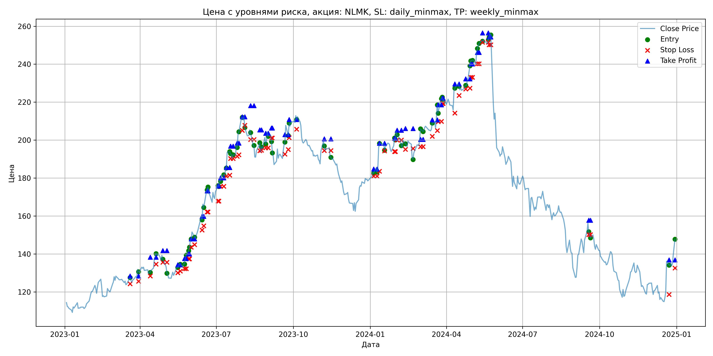
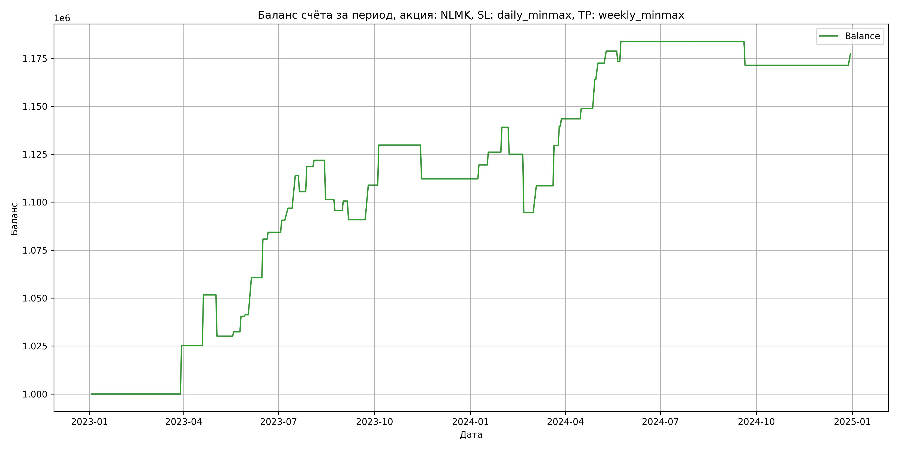

# Результаты торговой стратегии для NLMK

**Дата:** 2025-05-17 12:23:47  
**Стратегия:** NLMK,_SL_daily_minmax,_TP_weekly_minmax

## Конфигурация

```json
{
    "TICKER": "NLMK",
    "EXCHANGE": "MOEX",
    "START_DATE": "2023-01-01",
    "END_DATE": "2024-12-31",
    "INTERVAL": "1d",
    "CAPITAL": 1000000,
    "RISK_PERCENT": 0.02,
    "PROFIT_TO_RISK": 3,
    "ATR_MULTIPLIER": 1.5,
    "ATR_WINDOW": 14,
    "STOP_LOSS_METHOD": "daily_minmax",
    "TAKE_PROFIT_METHOD": "weekly_minmax",
    "POSITION": "long"
}
```

## Метрики эффективности

- **Начальный баланс:** 1000000.00
- **Конечный баланс:** 1177299.34
- **Прибыль/Убыток:** 177299.34 (17.73% за период тестирования)
- **Количество сделок:** 39
- **Процент выигрышных сделок:** 74.36% (29 выигрышных, 10 убыточных)
- **Средняя прибыль:** 11134.21
- **Средний убыток:** -14559.27
- **Максимальная прибыль:** 26455.52
- **Максимальный убыток:** -30448.68
- **Коэффициент прибыли:** 2.22
- **Максимальная просадка:** -3.91%

## Графики

### График цены с уровнями риска



### График баланса счёта



## Завершённые сделки

**Всего сделок:** 78

| Сделка № | Дата | Тип | Покупка / продажа | Количество акций | Цена | Stop Loss в момент сделки | Take Profit в момент сделки | Прибыль / убыток | Прибыль / убыток с учётом комиссии |
|:--------:|:----:|:---:|:-----------------:|:----------------:|:----:|:-------------------------:|:---------------------------:|:----------------:|:----------------------------------:|
| 1 | 2023-03-20 00:00:00 | LONG | BUY | 3651 | 125.40 | 124.32 | 128.42 | 0.00 | -228.92 |
| 2 | 2023-03-30 00:00:00 | LONG | SELL | -3651 | 132.30 | 125.62 | 128.42 | 25191.90 | 24721.47 |
| 3 | 2023-04-13 00:00:00 | LONG | BUY | 3634 | 130.82 | 128.40 | 138.35 | 0.00 | -237.70 |
| 4 | 2023-04-20 00:00:00 | LONG | SELL | -3634 | 138.10 | 134.69 | 138.35 | 26455.52 | 25966.89 |
| 5 | 2023-04-28 00:00:00 | LONG | BUY | 3538 | 139.42 | 135.60 | 141.81 | 0.00 | -246.63 |
| 6 | 2023-05-03 00:00:00 | LONG | SELL | -3538 | 133.34 | 135.60 | 141.81 | -21511.04 | -21993.55 |
| 7 | 2023-05-16 00:00:00 | LONG | BUY | 2523 | 133.52 | 130.14 | 134.31 | 0.00 | -168.44 |
| 8 | 2023-05-19 00:00:00 | LONG | SELL | -2523 | 134.42 | 130.97 | 134.31 | 2270.70 | 1932.69 |
| 9 | 2023-05-24 00:00:00 | LONG | BUY | 2733 | 135.38 | 132.20 | 137.56 | 0.00 | -185.00 |
| 10 | 2023-05-26 00:00:00 | LONG | SELL | -2733 | 138.34 | 132.20 | 137.56 | 8089.68 | 7715.64 |
| 11 | 2023-05-29 00:00:00 | LONG | BUY | 3304 | 141.00 | 137.38 | 140.04 | 0.00 | -232.93 |
| 12 | 2023-05-30 00:00:00 | LONG | SELL | -3304 | 141.24 | 137.38 | 140.04 | 792.96 | 326.70 |
| 13 | 2023-06-01 00:00:00 | LONG | BUY | 3060 | 146.68 | 143.62 | 147.96 | 0.00 | -224.42 |
| 14 | 2023-06-05 00:00:00 | LONG | SELL | -3060 | 153.00 | 144.92 | 147.96 | 19339.20 | 18880.69 |
| 15 | 2023-06-14 00:00:00 | LONG | BUY | 2963 | 159.52 | 152.60 | 159.86 | 0.00 | -236.33 |
| 16 | 2023-06-16 00:00:00 | LONG | SELL | -2963 | 166.30 | 154.82 | 159.86 | 20089.14 | 19606.44 |
| 17 | 2023-06-20 00:00:00 | LONG | BUY | 2501 | 172.30 | 162.12 | 173.27 | 0.00 | -215.46 |
| 18 | 2023-06-21 00:00:00 | LONG | SELL | -2501 | 173.72 | 162.12 | 173.27 | 3551.42 | 3118.72 |
| 19 | 2023-07-03 00:00:00 | LONG | BUY | 2035 | 173.00 | 167.84 | 175.84 | 0.00 | -176.03 |
| 20 | 2023-07-04 00:00:00 | LONG | SELL | -2035 | 176.10 | 167.84 | 175.84 | 6308.50 | 5953.29 |
| 21 | 2023-07-06 00:00:00 | LONG | BUY | 2174 | 179.52 | 175.68 | 180.14 | 0.00 | -195.14 |
| 22 | 2023-07-10 00:00:00 | LONG | SELL | -2174 | 182.40 | 175.68 | 180.14 | 6261.12 | 5867.71 |
| 23 | 2023-07-13 00:00:00 | LONG | BUY | 2420 | 184.98 | 181.00 | 185.60 | 0.00 | -223.83 |
| 24 | 2023-07-17 00:00:00 | LONG | SELL | -2420 | 191.98 | 181.55 | 185.60 | 16940.00 | 16483.88 |
| 25 | 2023-07-18 00:00:00 | LONG | BUY | 2327 | 193.86 | 190.30 | 196.85 | 0.00 | -225.56 |
| 26 | 2023-07-21 00:00:00 | LONG | SELL | -2327 | 190.28 | 190.30 | 196.85 | -8330.66 | -8777.61 |
| 27 | 2023-07-26 00:00:00 | LONG | BUY | 2485 | 197.50 | 191.42 | 198.40 | 0.00 | -245.39 |
| 28 | 2023-07-28 00:00:00 | LONG | SELL | -2485 | 202.78 | 192.22 | 198.40 | 13120.80 | 12623.45 |
| 29 | 2023-08-01 00:00:00 | LONG | BUY | 2332 | 212.04 | 205.10 | 212.24 | 0.00 | -247.24 |
| 30 | 2023-08-04 00:00:00 | LONG | SELL | -2332 | 213.42 | 207.76 | 212.24 | 3218.16 | 2722.07 |
| 31 | 2023-08-11 00:00:00 | LONG | BUY | 2268 | 205.50 | 200.26 | 218.14 | 0.00 | -233.04 |
| 32 | 2023-08-15 00:00:00 | LONG | SELL | -2268 | 196.50 | 200.26 | 218.14 | -20412.00 | -20867.87 |
| 33 | 2023-08-22 00:00:00 | LONG | BUY | 1680 | 197.82 | 194.44 | 205.41 | 0.00 | -166.17 |
| 34 | 2023-08-24 00:00:00 | LONG | SELL | -1680 | 194.38 | 194.63 | 205.41 | -5779.20 | -6108.65 |
| 35 | 2023-08-29 00:00:00 | LONG | BUY | 1723 | 201.70 | 195.96 | 203.64 | 0.00 | -173.76 |
| 36 | 2023-09-01 00:00:00 | LONG | SELL | -1723 | 204.58 | 195.96 | 203.64 | 4962.24 | 4612.23 |
| 37 | 2023-09-05 00:00:00 | LONG | BUY | 2177 | 203.46 | 201.12 | 206.37 | 0.00 | -221.47 |
| 38 | 2023-09-06 00:00:00 | LONG | SELL | -2177 | 199.00 | 201.12 | 206.37 | -9709.42 | -10147.50 |
| 39 | 2023-09-21 00:00:00 | LONG | BUY | 1631 | 196.96 | 192.64 | 202.90 | 0.00 | -160.62 |
| 40 | 2023-09-25 00:00:00 | LONG | SELL | -1631 | 208.00 | 195.02 | 202.90 | 18006.24 | 17676.00 |
| 41 | 2023-09-26 00:00:00 | LONG | BUY | 1908 | 201.90 | 201.24 | 210.82 | 0.00 | -192.61 |
| 42 | 2023-10-05 00:00:00 | LONG | SELL | -1908 | 212.84 | 205.76 | 210.82 | 20873.52 | 20477.86 |
| 43 | 2023-11-07 00:00:00 | LONG | BUY | 2200 | 199.10 | 194.50 | 200.68 | 0.00 | -219.01 |
| 44 | 2023-11-15 00:00:00 | LONG | SELL | -2200 | 191.10 | 194.50 | 200.68 | -17600.00 | -18029.22 |
| 45 | 2024-01-05 00:00:00 | LONG | BUY | 3070 | 183.12 | 181.00 | 184.75 | 0.00 | -281.09 |
| 46 | 2024-01-09 00:00:00 | LONG | SELL | -3070 | 185.48 | 181.00 | 184.75 | 7245.20 | 6679.40 |
| 47 | 2024-01-12 00:00:00 | LONG | BUY | 2730 | 196.50 | 183.64 | 198.38 | 0.00 | -268.22 |
| 48 | 2024-01-18 00:00:00 | LONG | SELL | -2730 | 198.94 | 194.29 | 198.38 | 6661.20 | 6121.42 |
| 49 | 2024-01-30 00:00:00 | LONG | BUY | 3095 | 197.30 | 194.00 | 200.92 | 0.00 | -305.32 |
| 50 | 2024-01-31 00:00:00 | LONG | SELL | -3095 | 201.50 | 194.00 | 200.92 | 12999.00 | 12381.86 |
| 51 | 2024-02-02 00:00:00 | LONG | BUY | 2963 | 204.90 | 200.02 | 205.23 | 0.00 | -303.56 |
| 52 | 2024-02-07 00:00:00 | LONG | SELL | -2963 | 200.14 | 200.02 | 205.23 | -14103.88 | -14703.95 |
| 53 | 2024-02-12 00:00:00 | LONG | BUY | 2851 | 201.00 | 195.16 | 206.08 | 0.00 | -286.53 |
| 54 | 2024-02-21 00:00:00 | LONG | SELL | -2851 | 190.32 | 195.57 | 206.08 | -30448.68 | -31006.51 |
| 55 | 2024-03-01 00:00:00 | LONG | BUY | 2281 | 200.46 | 196.52 | 200.42 | 0.00 | -228.62 |
| 56 | 2024-03-04 00:00:00 | LONG | SELL | -2281 | 206.60 | 196.52 | 200.42 | 14005.34 | 13541.09 |
| 57 | 2024-03-15 00:00:00 | LONG | BUY | 2815 | 205.30 | 202.02 | 210.66 | 0.00 | -288.96 |
| 58 | 2024-03-21 00:00:00 | LONG | SELL | -2815 | 212.78 | 205.00 | 210.66 | 21056.20 | 20467.75 |
| 59 | 2024-03-22 00:00:00 | LONG | BUY | 2569 | 217.98 | 209.70 | 218.59 | 0.00 | -280.00 |
| 60 | 2024-03-26 00:00:00 | LONG | SELL | -2569 | 221.90 | 209.86 | 218.59 | 10070.48 | 9505.45 |
| 61 | 2024-03-27 00:00:00 | LONG | BUY | 2529 | 222.00 | 219.36 | 222.08 | 0.00 | -280.72 |
| 62 | 2024-03-28 00:00:00 | LONG | SELL | -2529 | 223.50 | 219.36 | 222.08 | 3793.50 | 3230.17 |
| 63 | 2024-04-11 00:00:00 | LONG | BUY | 2327 | 227.80 | 214.26 | 229.62 | 0.00 | -265.05 |
| 64 | 2024-04-16 00:00:00 | LONG | SELL | -2327 | 230.12 | 223.56 | 229.62 | 5398.64 | 4865.85 |
| 65 | 2024-04-24 00:00:00 | LONG | BUY | 3053 | 228.24 | 226.90 | 232.32 | 0.00 | -348.41 |
| 66 | 2024-04-29 00:00:00 | LONG | SELL | -3053 | 233.16 | 227.38 | 232.32 | 15020.76 | 14316.43 |
| 67 | 2024-04-30 00:00:00 | LONG | BUY | 3180 | 239.60 | 233.10 | 240.13 | 0.00 | -380.96 |
| 68 | 2024-05-02 00:00:00 | LONG | SELL | -3180 | 242.30 | 233.10 | 240.13 | 8586.00 | 7819.78 |
| 69 | 2024-05-08 00:00:00 | LONG | BUY | 3056 | 246.94 | 240.22 | 246.22 | 0.00 | -377.32 |
| 70 | 2024-05-10 00:00:00 | LONG | SELL | -3056 | 249.00 | 240.22 | 246.22 | 6295.36 | 5537.56 |
| 71 | 2024-05-14 00:00:00 | LONG | BUY | 3195 | 252.88 | 251.60 | 256.44 | 0.00 | -403.98 |
| 72 | 2024-05-21 00:00:00 | LONG | SELL | -3195 | 251.20 | 251.60 | 256.44 | -5367.60 | -6172.87 |
| 73 | 2024-05-22 00:00:00 | LONG | BUY | 3199 | 253.10 | 250.20 | 254.35 | 0.00 | -404.83 |
| 74 | 2024-05-24 00:00:00 | LONG | SELL | -3199 | 256.32 | 250.20 | 254.35 | 10300.78 | 9485.96 |
| 75 | 2024-09-18 00:00:00 | LONG | BUY | 1976 | 156.24 | 150.20 | 157.77 | 0.00 | -154.37 |
| 76 | 2024-09-20 00:00:00 | LONG | SELL | -1976 | 150.00 | 150.20 | 157.77 | -12330.24 | -12632.81 |
| 77 | 2024-12-23 00:00:00 | LONG | BUY | 2065 | 137.10 | 118.66 | 136.87 | 0.00 | -141.56 |
| 78 | 2024-12-30 00:00:00 | LONG | SELL | -2065 | 140.00 | 132.59 | 136.87 | 5988.50 | 5702.39 |
