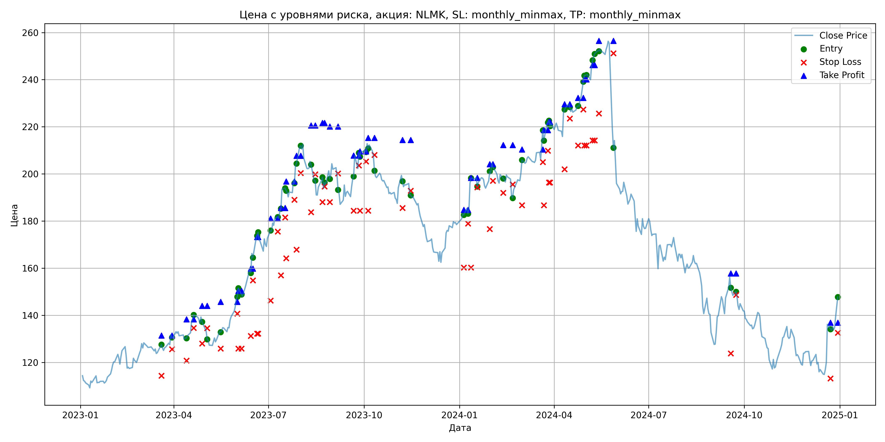
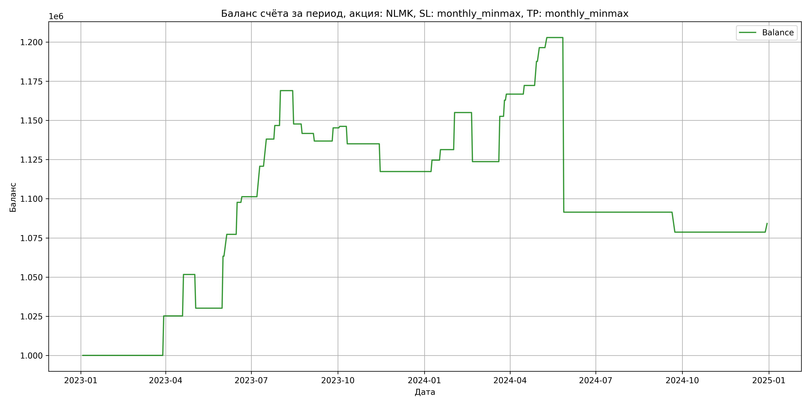

# Результаты торговой стратегии для NLMK

**Дата:** 2025-05-17 12:24:00  
**Стратегия:** NLMK,_SL_monthly_minmax,_TP_monthly_minmax

## Конфигурация

```json
{
    "TICKER": "NLMK",
    "EXCHANGE": "MOEX",
    "START_DATE": "2023-01-01",
    "END_DATE": "2024-12-31",
    "INTERVAL": "1d",
    "CAPITAL": 1000000,
    "RISK_PERCENT": 0.02,
    "PROFIT_TO_RISK": 3,
    "ATR_MULTIPLIER": 1.5,
    "ATR_WINDOW": 14,
    "STOP_LOSS_METHOD": "monthly_minmax",
    "TAKE_PROFIT_METHOD": "monthly_minmax",
    "POSITION": "long"
}
```

## Метрики эффективности

- **Начальный баланс:** 1000000.00
- **Конечный баланс:** 1084207.20
- **Прибыль/Убыток:** 84207.20 (8.42% за период тестирования)
- **Количество сделок:** 32
- **Процент выигрышных сделок:** 71.88% (23 выигрышных, 9 убыточных)
- **Средняя прибыль:** 14013.18
- **Средний убыток:** -26455.10
- **Максимальная прибыль:** 33202.68
- **Максимальный убыток:** -111472.90
- **Коэффициент прибыли:** 1.35
- **Максимальная просадка:** -10.33%

## Графики

### График цены с уровнями риска



### График баланса счёта



## Завершённые сделки

**Всего сделок:** 64

| Сделка № | Дата | Тип | Покупка / продажа | Количество акций | Цена | Stop Loss в момент сделки | Take Profit в момент сделки | Прибыль / убыток | Прибыль / убыток с учётом комиссии |
|:--------:|:----:|:---:|:-----------------:|:----------------:|:----:|:-------------------------:|:---------------------------:|:----------------:|:----------------------------------:|
| 1 | 2023-03-20 00:00:00 | LONG | BUY | 3651 | 125.40 | 114.40 | 131.42 | 0.00 | -228.92 |
| 2 | 2023-03-30 00:00:00 | LONG | SELL | -3651 | 132.30 | 125.62 | 131.42 | 25191.90 | 24721.47 |
| 3 | 2023-04-13 00:00:00 | LONG | BUY | 3634 | 130.82 | 120.80 | 138.35 | 0.00 | -237.70 |
| 4 | 2023-04-20 00:00:00 | LONG | SELL | -3634 | 138.10 | 134.69 | 138.35 | 26455.52 | 25966.89 |
| 5 | 2023-04-28 00:00:00 | LONG | BUY | 3538 | 139.42 | 128.00 | 144.06 | 0.00 | -246.63 |
| 6 | 2023-05-03 00:00:00 | LONG | SELL | -3538 | 133.34 | 134.53 | 144.06 | -21511.04 | -21993.55 |
| 7 | 2023-05-16 00:00:00 | LONG | BUY | 2523 | 133.52 | 125.88 | 145.73 | 0.00 | -168.44 |
| 8 | 2023-06-01 00:00:00 | LONG | SELL | -2523 | 146.68 | 140.73 | 145.73 | 33202.68 | 32849.21 |
| 9 | 2023-06-02 00:00:00 | LONG | BUY | 3180 | 148.62 | 125.88 | 150.33 | 0.00 | -236.31 |
| 10 | 2023-06-05 00:00:00 | LONG | SELL | -3180 | 153.00 | 125.88 | 150.33 | 13928.40 | 13448.82 |
| 11 | 2023-06-14 00:00:00 | LONG | BUY | 3012 | 159.52 | 131.30 | 159.86 | 0.00 | -240.24 |
| 12 | 2023-06-16 00:00:00 | LONG | SELL | -3012 | 166.30 | 154.82 | 159.86 | 20421.36 | 19930.68 |
| 13 | 2023-06-20 00:00:00 | LONG | BUY | 2542 | 172.30 | 132.20 | 173.27 | 0.00 | -218.99 |
| 14 | 2023-06-21 00:00:00 | LONG | SELL | -2542 | 173.72 | 132.20 | 173.27 | 3609.64 | 3169.85 |
| 15 | 2023-07-03 00:00:00 | LONG | BUY | 2069 | 173.00 | 146.22 | 181.06 | 0.00 | -178.97 |
| 16 | 2023-07-10 00:00:00 | LONG | SELL | -2069 | 182.40 | 175.54 | 181.06 | 19448.60 | 19080.94 |
| 17 | 2023-07-13 00:00:00 | LONG | BUY | 2476 | 184.98 | 157.00 | 185.60 | 0.00 | -229.01 |
| 18 | 2023-07-17 00:00:00 | LONG | SELL | -2476 | 191.98 | 181.55 | 185.60 | 17332.00 | 16865.32 |
| 19 | 2023-07-18 00:00:00 | LONG | BUY | 2380 | 193.86 | 164.24 | 196.85 | 0.00 | -230.69 |
| 20 | 2023-07-26 00:00:00 | LONG | SELL | -2380 | 197.50 | 189.06 | 196.85 | 8663.20 | 8197.48 |
| 21 | 2023-07-28 00:00:00 | LONG | BUY | 2406 | 202.78 | 167.84 | 207.71 | 0.00 | -243.94 |
| 22 | 2023-08-01 00:00:00 | LONG | SELL | -2406 | 212.04 | 200.35 | 207.71 | 22279.56 | 21780.53 |
| 23 | 2023-08-11 00:00:00 | LONG | BUY | 2367 | 205.50 | 183.80 | 220.61 | 0.00 | -243.21 |
| 24 | 2023-08-15 00:00:00 | LONG | SELL | -2367 | 196.50 | 199.86 | 220.61 | -21303.00 | -21778.77 |
| 25 | 2023-08-22 00:00:00 | LONG | BUY | 1754 | 197.82 | 188.02 | 221.63 | 0.00 | -173.49 |
| 26 | 2023-08-24 00:00:00 | LONG | SELL | -1754 | 194.38 | 194.63 | 221.63 | -6033.76 | -6377.72 |
| 27 | 2023-08-29 00:00:00 | LONG | BUY | 1798 | 201.70 | 188.02 | 220.11 | 0.00 | -181.33 |
| 28 | 2023-09-06 00:00:00 | LONG | SELL | -1798 | 199.00 | 200.21 | 220.11 | -4854.60 | -5214.83 |
| 29 | 2023-09-21 00:00:00 | LONG | BUY | 1703 | 196.96 | 184.44 | 207.77 | 0.00 | -167.71 |
| 30 | 2023-09-26 00:00:00 | LONG | SELL | -1703 | 201.90 | 203.59 | 207.77 | 8412.82 | 8073.19 |
| 31 | 2023-09-27 00:00:00 | LONG | BUY | 1917 | 209.46 | 184.44 | 209.55 | 0.00 | -200.77 |
| 32 | 2023-10-03 00:00:00 | LONG | SELL | -1917 | 209.96 | 205.31 | 209.55 | 958.50 | 556.49 |
| 33 | 2023-10-05 00:00:00 | LONG | BUY | 2175 | 212.84 | 184.44 | 215.31 | 0.00 | -231.46 |
| 34 | 2023-10-11 00:00:00 | LONG | SELL | -2175 | 207.72 | 208.03 | 215.31 | -11136.00 | -11593.36 |
| 35 | 2023-11-07 00:00:00 | LONG | BUY | 2213 | 199.10 | 185.54 | 214.40 | 0.00 | -220.30 |
| 36 | 2023-11-15 00:00:00 | LONG | SELL | -2213 | 191.10 | 192.92 | 214.40 | -17704.00 | -18135.76 |
| 37 | 2024-01-05 00:00:00 | LONG | BUY | 3089 | 183.12 | 160.32 | 184.75 | 0.00 | -282.83 |
| 38 | 2024-01-09 00:00:00 | LONG | SELL | -3089 | 185.48 | 178.97 | 184.75 | 7290.04 | 6720.74 |
| 39 | 2024-01-12 00:00:00 | LONG | BUY | 2747 | 196.50 | 160.32 | 198.38 | 0.00 | -269.89 |
| 40 | 2024-01-18 00:00:00 | LONG | SELL | -2747 | 198.94 | 194.29 | 198.38 | 6702.68 | 6159.54 |
| 41 | 2024-01-30 00:00:00 | LONG | BUY | 3114 | 197.30 | 176.62 | 204.18 | 0.00 | -307.20 |
| 42 | 2024-02-02 00:00:00 | LONG | SELL | -3114 | 204.90 | 197.06 | 204.18 | 23666.40 | 23040.17 |
| 43 | 2024-02-12 00:00:00 | LONG | BUY | 2934 | 201.00 | 192.00 | 212.28 | 0.00 | -294.87 |
| 44 | 2024-02-21 00:00:00 | LONG | SELL | -2934 | 190.32 | 195.57 | 212.28 | -31335.12 | -31909.19 |
| 45 | 2024-03-01 00:00:00 | LONG | BUY | 2347 | 200.46 | 186.72 | 210.41 | 0.00 | -235.24 |
| 46 | 2024-03-21 00:00:00 | LONG | SELL | -2347 | 212.78 | 205.00 | 210.41 | 28915.04 | 28430.10 |
| 47 | 2024-03-22 00:00:00 | LONG | BUY | 2628 | 217.98 | 186.72 | 218.59 | 0.00 | -286.43 |
| 48 | 2024-03-26 00:00:00 | LONG | SELL | -2628 | 221.90 | 209.86 | 218.59 | 10301.76 | 9723.76 |
| 49 | 2024-03-27 00:00:00 | LONG | BUY | 2588 | 222.00 | 196.40 | 222.08 | 0.00 | -287.27 |
| 50 | 2024-03-28 00:00:00 | LONG | SELL | -2588 | 223.50 | 196.40 | 222.08 | 3882.00 | 3305.52 |
| 51 | 2024-04-11 00:00:00 | LONG | BUY | 2381 | 227.80 | 202.02 | 229.62 | 0.00 | -271.20 |
| 52 | 2024-04-16 00:00:00 | LONG | SELL | -2381 | 230.12 | 223.56 | 229.62 | 5523.92 | 4978.77 |
| 53 | 2024-04-24 00:00:00 | LONG | BUY | 3123 | 228.24 | 212.12 | 232.32 | 0.00 | -356.40 |
| 54 | 2024-04-29 00:00:00 | LONG | SELL | -3123 | 233.16 | 227.38 | 232.32 | 15365.16 | 14644.68 |
| 55 | 2024-04-30 00:00:00 | LONG | BUY | 3254 | 239.60 | 212.12 | 240.13 | 0.00 | -389.83 |
| 56 | 2024-05-02 00:00:00 | LONG | SELL | -3254 | 242.30 | 212.12 | 240.13 | 8785.80 | 8001.75 |
| 57 | 2024-05-08 00:00:00 | LONG | BUY | 3127 | 246.94 | 214.26 | 246.22 | 0.00 | -386.09 |
| 58 | 2024-05-10 00:00:00 | LONG | SELL | -3127 | 249.00 | 214.26 | 246.22 | 6441.62 | 5666.22 |
| 59 | 2024-05-14 00:00:00 | LONG | BUY | 3269 | 252.88 | 225.64 | 256.44 | 0.00 | -413.33 |
| 60 | 2024-05-28 00:00:00 | LONG | SELL | -3269 | 218.78 | 251.17 | 256.44 | -111472.90 | -112243.83 |
| 61 | 2024-09-18 00:00:00 | LONG | BUY | 1826 | 156.24 | 123.82 | 157.77 | 0.00 | -142.65 |
| 62 | 2024-09-23 00:00:00 | LONG | SELL | -1826 | 149.26 | 148.71 | 157.77 | -12745.48 | -13024.40 |
| 63 | 2024-12-23 00:00:00 | LONG | BUY | 1905 | 137.10 | 113.20 | 136.87 | 0.00 | -130.59 |
| 64 | 2024-12-30 00:00:00 | LONG | SELL | -1905 | 140.00 | 132.59 | 136.87 | 5524.50 | 5260.56 |
