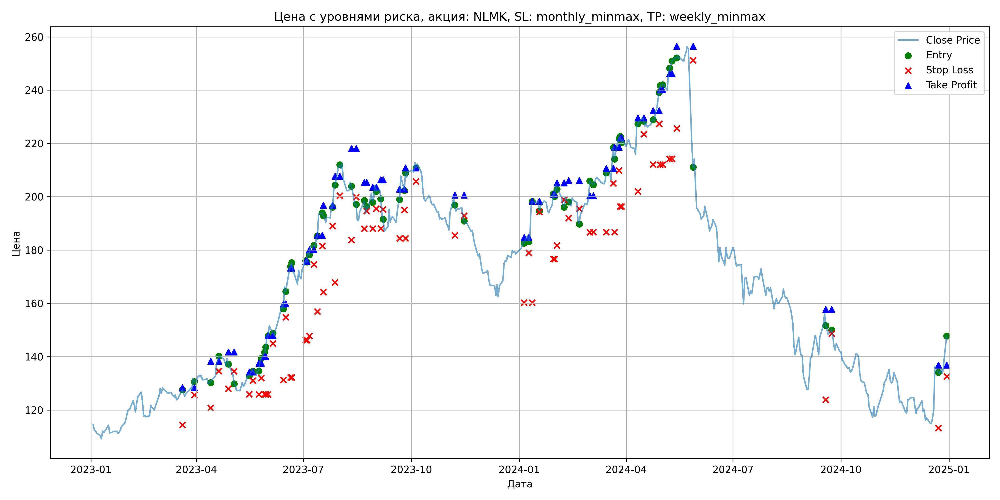
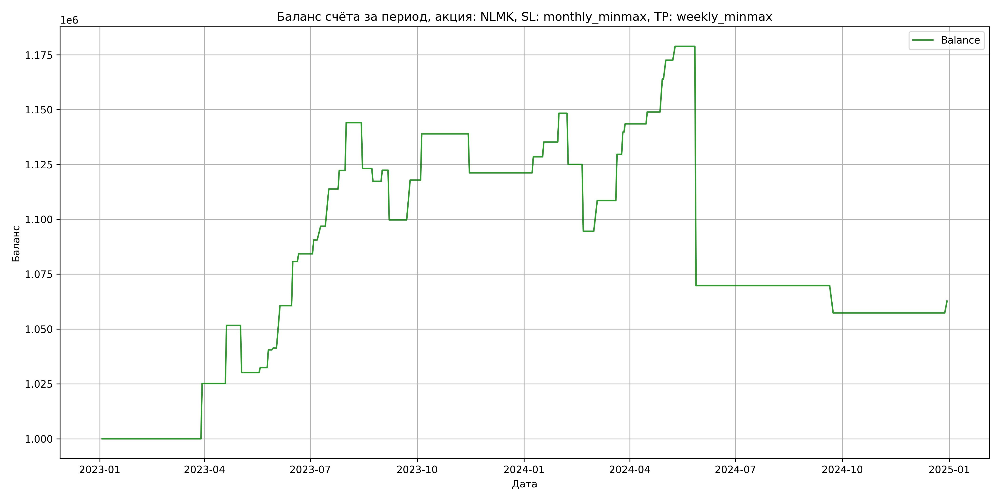

# Результаты торговой стратегии для NLMK

**Дата:** 2025-05-17 12:23:59  
**Стратегия:** NLMK,_SL_monthly_minmax,_TP_weekly_minmax

## Конфигурация

```json
{
    "TICKER": "NLMK",
    "EXCHANGE": "MOEX",
    "START_DATE": "2023-01-01",
    "END_DATE": "2024-12-31",
    "INTERVAL": "1d",
    "CAPITAL": 1000000,
    "RISK_PERCENT": 0.02,
    "PROFIT_TO_RISK": 3,
    "ATR_MULTIPLIER": 1.5,
    "ATR_WINDOW": 14,
    "STOP_LOSS_METHOD": "monthly_minmax",
    "TAKE_PROFIT_METHOD": "weekly_minmax",
    "POSITION": "long"
}
```

## Метрики эффективности

- **Начальный баланс:** 1000000.00
- **Конечный баланс:** 1062730.16
- **Прибыль/Убыток:** 62730.16 (6.27% за период тестирования)
- **Количество сделок:** 37
- **Процент выигрышных сделок:** 75.68% (28 выигрышных, 9 убыточных)
- **Средняя прибыль:** 11665.23
- **Средний убыток:** -29321.81
- **Максимальная прибыль:** 26455.52
- **Максимальный убыток:** -109017.70
- **Коэффициент прибыли:** 1.24
- **Максимальная просадка:** -10.31%

## Графики

### График цены с уровнями риска



### График баланса счёта



## Завершённые сделки

**Всего сделок:** 74

| Сделка № | Дата | Тип | Покупка / продажа | Количество акций | Цена | Stop Loss в момент сделки | Take Profit в момент сделки | Прибыль / убыток | Прибыль / убыток с учётом комиссии |
|:--------:|:----:|:---:|:-----------------:|:----------------:|:----:|:-------------------------:|:---------------------------:|:----------------:|:----------------------------------:|
| 1 | 2023-03-20 00:00:00 | LONG | BUY | 3651 | 125.40 | 114.40 | 128.42 | 0.00 | -228.92 |
| 2 | 2023-03-30 00:00:00 | LONG | SELL | -3651 | 132.30 | 125.62 | 128.42 | 25191.90 | 24721.47 |
| 3 | 2023-04-13 00:00:00 | LONG | BUY | 3634 | 130.82 | 120.80 | 138.35 | 0.00 | -237.70 |
| 4 | 2023-04-20 00:00:00 | LONG | SELL | -3634 | 138.10 | 134.69 | 138.35 | 26455.52 | 25966.89 |
| 5 | 2023-04-28 00:00:00 | LONG | BUY | 3538 | 139.42 | 128.00 | 141.81 | 0.00 | -246.63 |
| 6 | 2023-05-03 00:00:00 | LONG | SELL | -3538 | 133.34 | 134.53 | 141.81 | -21511.04 | -21993.55 |
| 7 | 2023-05-16 00:00:00 | LONG | BUY | 2523 | 133.52 | 125.88 | 134.31 | 0.00 | -168.44 |
| 8 | 2023-05-19 00:00:00 | LONG | SELL | -2523 | 134.42 | 130.97 | 134.31 | 2270.70 | 1932.69 |
| 9 | 2023-05-24 00:00:00 | LONG | BUY | 2733 | 135.38 | 125.88 | 137.56 | 0.00 | -185.00 |
| 10 | 2023-05-26 00:00:00 | LONG | SELL | -2733 | 138.34 | 131.99 | 137.56 | 8089.68 | 7715.64 |
| 11 | 2023-05-29 00:00:00 | LONG | BUY | 3304 | 141.00 | 125.88 | 140.04 | 0.00 | -232.93 |
| 12 | 2023-05-30 00:00:00 | LONG | SELL | -3304 | 141.24 | 125.88 | 140.04 | 792.96 | 326.70 |
| 13 | 2023-06-01 00:00:00 | LONG | BUY | 3060 | 146.68 | 125.88 | 147.96 | 0.00 | -224.42 |
| 14 | 2023-06-05 00:00:00 | LONG | SELL | -3060 | 153.00 | 144.92 | 147.96 | 19339.20 | 18880.69 |
| 15 | 2023-06-14 00:00:00 | LONG | BUY | 2963 | 159.52 | 131.30 | 159.86 | 0.00 | -236.33 |
| 16 | 2023-06-16 00:00:00 | LONG | SELL | -2963 | 166.30 | 154.82 | 159.86 | 20089.14 | 19606.44 |
| 17 | 2023-06-20 00:00:00 | LONG | BUY | 2501 | 172.30 | 132.20 | 173.27 | 0.00 | -215.46 |
| 18 | 2023-06-21 00:00:00 | LONG | SELL | -2501 | 173.72 | 132.20 | 173.27 | 3551.42 | 3118.72 |
| 19 | 2023-07-03 00:00:00 | LONG | BUY | 2035 | 173.00 | 146.22 | 175.84 | 0.00 | -176.03 |
| 20 | 2023-07-04 00:00:00 | LONG | SELL | -2035 | 176.10 | 146.22 | 175.84 | 6308.50 | 5953.29 |
| 21 | 2023-07-06 00:00:00 | LONG | BUY | 2174 | 179.52 | 147.74 | 180.14 | 0.00 | -195.14 |
| 22 | 2023-07-10 00:00:00 | LONG | SELL | -2174 | 182.40 | 174.64 | 180.14 | 6261.12 | 5867.71 |
| 23 | 2023-07-13 00:00:00 | LONG | BUY | 2420 | 184.98 | 157.00 | 185.60 | 0.00 | -223.83 |
| 24 | 2023-07-17 00:00:00 | LONG | SELL | -2420 | 191.98 | 181.55 | 185.60 | 16940.00 | 16483.88 |
| 25 | 2023-07-18 00:00:00 | LONG | BUY | 2327 | 193.86 | 164.24 | 196.85 | 0.00 | -225.56 |
| 26 | 2023-07-26 00:00:00 | LONG | SELL | -2327 | 197.50 | 189.06 | 196.85 | 8470.28 | 8014.93 |
| 27 | 2023-07-28 00:00:00 | LONG | BUY | 2352 | 202.78 | 167.84 | 207.71 | 0.00 | -238.47 |
| 28 | 2023-08-01 00:00:00 | LONG | SELL | -2352 | 212.04 | 200.35 | 207.71 | 21779.52 | 21291.69 |
| 29 | 2023-08-11 00:00:00 | LONG | BUY | 2314 | 205.50 | 183.80 | 218.14 | 0.00 | -237.76 |
| 30 | 2023-08-15 00:00:00 | LONG | SELL | -2314 | 196.50 | 199.86 | 218.14 | -20826.00 | -21291.11 |
| 31 | 2023-08-22 00:00:00 | LONG | BUY | 1715 | 197.82 | 188.02 | 205.41 | 0.00 | -169.63 |
| 32 | 2023-08-24 00:00:00 | LONG | SELL | -1715 | 194.38 | 194.63 | 205.41 | -5899.60 | -6235.91 |
| 33 | 2023-08-29 00:00:00 | LONG | BUY | 1758 | 201.70 | 188.02 | 203.64 | 0.00 | -177.29 |
| 34 | 2023-09-01 00:00:00 | LONG | SELL | -1758 | 204.58 | 195.61 | 203.64 | 5063.04 | 4705.92 |
| 35 | 2023-09-05 00:00:00 | LONG | BUY | 2221 | 203.46 | 188.02 | 206.37 | 0.00 | -225.94 |
| 36 | 2023-09-07 00:00:00 | LONG | SELL | -2221 | 193.26 | 195.27 | 206.37 | -22654.20 | -23094.76 |
| 37 | 2023-09-21 00:00:00 | LONG | BUY | 1645 | 196.96 | 184.44 | 202.90 | 0.00 | -162.00 |
| 38 | 2023-09-25 00:00:00 | LONG | SELL | -1645 | 208.00 | 195.02 | 202.90 | 18160.80 | 17827.72 |
| 39 | 2023-09-26 00:00:00 | LONG | BUY | 1925 | 201.90 | 184.44 | 210.82 | 0.00 | -194.33 |
| 40 | 2023-10-05 00:00:00 | LONG | SELL | -1925 | 212.84 | 205.76 | 210.82 | 21059.50 | 20660.31 |
| 41 | 2023-11-07 00:00:00 | LONG | BUY | 2219 | 199.10 | 185.54 | 200.68 | 0.00 | -220.90 |
| 42 | 2023-11-15 00:00:00 | LONG | SELL | -2219 | 191.10 | 192.92 | 200.68 | -17752.00 | -18184.93 |
| 43 | 2024-01-05 00:00:00 | LONG | BUY | 3097 | 183.12 | 160.32 | 184.75 | 0.00 | -283.56 |
| 44 | 2024-01-09 00:00:00 | LONG | SELL | -3097 | 185.48 | 178.97 | 184.75 | 7308.92 | 6738.14 |
| 45 | 2024-01-12 00:00:00 | LONG | BUY | 2754 | 196.50 | 160.32 | 198.38 | 0.00 | -270.58 |
| 46 | 2024-01-18 00:00:00 | LONG | SELL | -2754 | 198.94 | 194.29 | 198.38 | 6719.76 | 6175.24 |
| 47 | 2024-01-30 00:00:00 | LONG | BUY | 3121 | 197.30 | 176.62 | 200.92 | 0.00 | -307.89 |
| 48 | 2024-01-31 00:00:00 | LONG | SELL | -3121 | 201.50 | 176.62 | 200.92 | 13108.20 | 12485.87 |
| 49 | 2024-02-02 00:00:00 | LONG | BUY | 2988 | 204.90 | 181.72 | 205.23 | 0.00 | -306.12 |
| 50 | 2024-02-08 00:00:00 | LONG | SELL | -2988 | 197.10 | 198.84 | 205.23 | -23306.40 | -23906.99 |
| 51 | 2024-02-12 00:00:00 | LONG | BUY | 2853 | 201.00 | 192.00 | 206.08 | 0.00 | -286.73 |
| 52 | 2024-02-21 00:00:00 | LONG | SELL | -2853 | 190.32 | 195.57 | 206.08 | -30470.04 | -31028.26 |
| 53 | 2024-03-01 00:00:00 | LONG | BUY | 2282 | 200.46 | 186.72 | 200.42 | 0.00 | -228.72 |
| 54 | 2024-03-04 00:00:00 | LONG | SELL | -2282 | 206.60 | 186.72 | 200.42 | 14011.48 | 13547.02 |
| 55 | 2024-03-15 00:00:00 | LONG | BUY | 2816 | 205.30 | 186.72 | 210.66 | 0.00 | -289.06 |
| 56 | 2024-03-21 00:00:00 | LONG | SELL | -2816 | 212.78 | 205.00 | 210.66 | 21063.68 | 20475.02 |
| 57 | 2024-03-22 00:00:00 | LONG | BUY | 2570 | 217.98 | 186.72 | 218.59 | 0.00 | -280.10 |
| 58 | 2024-03-26 00:00:00 | LONG | SELL | -2570 | 221.90 | 209.86 | 218.59 | 10074.40 | 9509.15 |
| 59 | 2024-03-27 00:00:00 | LONG | BUY | 2531 | 222.00 | 196.40 | 222.08 | 0.00 | -280.94 |
| 60 | 2024-03-28 00:00:00 | LONG | SELL | -2531 | 223.50 | 196.40 | 222.08 | 3796.50 | 3232.72 |
| 61 | 2024-04-11 00:00:00 | LONG | BUY | 2328 | 227.80 | 202.02 | 229.62 | 0.00 | -265.16 |
| 62 | 2024-04-16 00:00:00 | LONG | SELL | -2328 | 230.12 | 223.56 | 229.62 | 5400.96 | 4867.94 |
| 63 | 2024-04-24 00:00:00 | LONG | BUY | 3054 | 228.24 | 212.12 | 232.32 | 0.00 | -348.52 |
| 64 | 2024-04-29 00:00:00 | LONG | SELL | -3054 | 233.16 | 227.38 | 232.32 | 15025.68 | 14321.12 |
| 65 | 2024-04-30 00:00:00 | LONG | BUY | 3182 | 239.60 | 212.12 | 240.13 | 0.00 | -381.20 |
| 66 | 2024-05-02 00:00:00 | LONG | SELL | -3182 | 242.30 | 212.12 | 240.13 | 8591.40 | 7824.70 |
| 67 | 2024-05-08 00:00:00 | LONG | BUY | 3058 | 246.94 | 214.26 | 246.22 | 0.00 | -377.57 |
| 68 | 2024-05-10 00:00:00 | LONG | SELL | -3058 | 249.00 | 214.26 | 246.22 | 6299.48 | 5541.19 |
| 69 | 2024-05-14 00:00:00 | LONG | BUY | 3197 | 252.88 | 225.64 | 256.44 | 0.00 | -404.23 |
| 70 | 2024-05-28 00:00:00 | LONG | SELL | -3197 | 218.78 | 251.17 | 256.44 | -109017.70 | -109771.65 |
| 71 | 2024-09-18 00:00:00 | LONG | BUY | 1785 | 156.24 | 123.82 | 157.77 | 0.00 | -139.44 |
| 72 | 2024-09-23 00:00:00 | LONG | SELL | -1785 | 149.26 | 148.71 | 157.77 | -12459.30 | -12731.96 |
| 73 | 2024-12-23 00:00:00 | LONG | BUY | 1863 | 137.10 | 113.20 | 136.87 | 0.00 | -127.71 |
| 74 | 2024-12-30 00:00:00 | LONG | SELL | -1863 | 140.00 | 132.59 | 136.87 | 5402.70 | 5144.58 |
