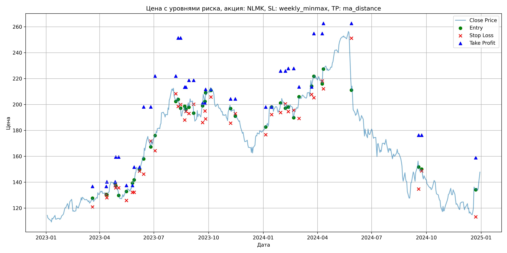
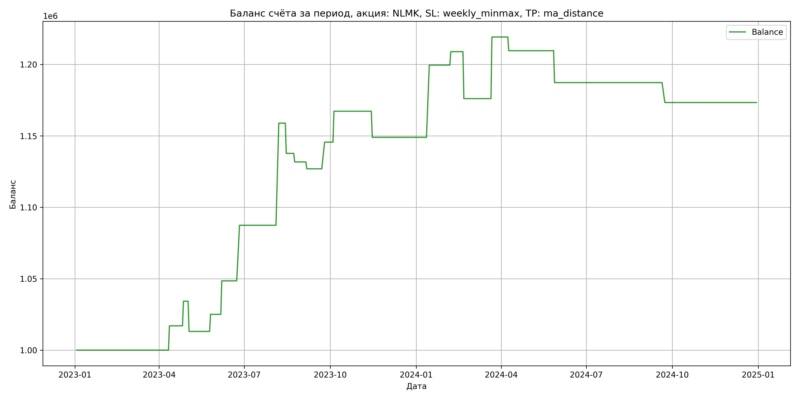

# Результаты торговой стратегии для NLMK

**Дата:** 2025-05-17 12:23:57  
**Стратегия:** NLMK,_SL_weekly_minmax,_TP_ma_distance

## Конфигурация

```json
{
    "TICKER": "NLMK",
    "EXCHANGE": "MOEX",
    "START_DATE": "2023-01-01",
    "END_DATE": "2024-12-31",
    "INTERVAL": "1d",
    "CAPITAL": 1000000,
    "RISK_PERCENT": 0.02,
    "PROFIT_TO_RISK": 3,
    "ATR_MULTIPLIER": 1.5,
    "ATR_WINDOW": 14,
    "STOP_LOSS_METHOD": "weekly_minmax",
    "TAKE_PROFIT_METHOD": "ma_distance",
    "POSITION": "long"
}
```

## Метрики эффективности

- **Начальный баланс:** 1000000.00
- **Конечный баланс:** 1173346.52
- **Прибыль/Убыток:** 173346.52 (17.33% за период тестирования)
- **Количество сделок:** 20
- **Процент выигрышных сделок:** 55.00% (11 выигрышных, 9 убыточных)
- **Средняя прибыль:** 29410.15
- **Средний убыток:** -16685.02
- **Максимальная прибыль:** 71505.00
- **Максимальный убыток:** -32883.72
- **Коэффициент прибыли:** 2.15
- **Максимальная просадка:** -3.76%

## Графики

### График цены с уровнями риска



### График баланса счёта



## Завершённые сделки

**Всего сделок:** 41

| Сделка № | Дата | Тип | Покупка / продажа | Количество акций | Цена | Stop Loss в момент сделки | Take Profit в момент сделки | Прибыль / убыток | Прибыль / убыток с учётом комиссии |
|:--------:|:----:|:---:|:-----------------:|:----------------:|:----:|:-------------------------:|:---------------------------:|:----------------:|:----------------------------------:|
| 1 | 2023-03-20 00:00:00 | LONG | BUY | 3651 | 125.40 | 120.80 | 136.71 | 0.00 | -228.92 |
| 2 | 2023-04-12 00:00:00 | LONG | SELL | -3651 | 130.06 | 130.38 | 136.71 | 17013.66 | 16547.32 |
| 3 | 2023-04-13 00:00:00 | LONG | BUY | 3605 | 130.82 | 128.00 | 140.25 | 0.00 | -235.80 |
| 4 | 2023-04-27 00:00:00 | LONG | SELL | -3605 | 135.60 | 137.36 | 140.25 | 17231.90 | 16751.68 |
| 5 | 2023-04-28 00:00:00 | LONG | BUY | 3480 | 139.42 | 135.60 | 159.46 | 0.00 | -242.59 |
| 6 | 2023-05-03 00:00:00 | LONG | SELL | -3480 | 133.34 | 135.60 | 159.46 | -21158.40 | -21633.00 |
| 7 | 2023-05-16 00:00:00 | LONG | BUY | 2481 | 133.52 | 125.88 | 137.46 | 0.00 | -165.63 |
| 8 | 2023-05-26 00:00:00 | LONG | SELL | -2481 | 138.34 | 132.14 | 137.46 | 11958.42 | 11621.18 |
| 9 | 2023-05-29 00:00:00 | LONG | BUY | 3256 | 141.00 | 132.20 | 151.66 | 0.00 | -229.55 |
| 10 | 2023-06-07 00:00:00 | LONG | SELL | -3256 | 148.20 | 148.51 | 151.66 | 23443.20 | 22972.38 |
| 11 | 2023-06-14 00:00:00 | LONG | BUY | 2931 | 159.52 | 146.22 | 198.12 | 0.00 | -233.78 |
| 12 | 2023-06-26 00:00:00 | LONG | SELL | -2931 | 172.80 | 171.75 | 198.12 | 38923.68 | 38436.67 |
| 13 | 2023-07-03 00:00:00 | LONG | BUY | 2043 | 173.00 | 164.24 | 221.94 | 0.00 | -176.72 |
| 14 | 2023-08-07 00:00:00 | LONG | SELL | -2043 | 208.00 | 208.27 | 221.94 | 71505.00 | 71115.81 |
| 15 | 2023-08-11 00:00:00 | LONG | BUY | 2351 | 205.50 | 198.52 | 251.37 | 0.00 | -241.57 |
| 16 | 2023-08-15 00:00:00 | LONG | SELL | -2351 | 196.50 | 199.86 | 251.37 | -21159.00 | -21631.55 |
| 17 | 2023-08-22 00:00:00 | LONG | BUY | 1742 | 197.82 | 188.02 | 213.36 | 0.00 | -172.30 |
| 18 | 2023-08-24 00:00:00 | LONG | SELL | -1742 | 194.38 | 194.63 | 213.36 | -5992.48 | -6334.09 |
| 19 | 2023-08-29 00:00:00 | LONG | BUY | 1786 | 201.70 | 193.04 | 218.67 | 0.00 | -180.12 |
| 20 | 2023-09-06 00:00:00 | LONG | SELL | -1786 | 199.00 | 200.21 | 218.67 | -4822.20 | -5180.03 |
| 21 | 2023-09-21 00:00:00 | LONG | BUY | 1691 | 196.96 | 186.02 | 201.05 | 0.00 | -166.53 |
| 22 | 2023-09-25 00:00:00 | LONG | SELL | -1691 | 208.00 | 195.02 | 201.05 | 18668.64 | 18326.25 |
| 23 | 2023-09-26 00:00:00 | LONG | BUY | 1979 | 201.90 | 188.88 | 211.67 | 0.00 | -199.78 |
| 24 | 2023-10-05 00:00:00 | LONG | SELL | -1979 | 212.84 | 205.76 | 211.67 | 21650.26 | 21239.87 |
| 25 | 2023-11-07 00:00:00 | LONG | BUY | 2281 | 199.10 | 185.54 | 204.28 | 0.00 | -227.07 |
| 26 | 2023-11-15 00:00:00 | LONG | SELL | -2281 | 191.10 | 192.92 | 204.28 | -18248.00 | -18693.02 |
| 27 | 2024-01-05 00:00:00 | LONG | BUY | 3184 | 183.12 | 176.62 | 198.04 | 0.00 | -291.53 |
| 28 | 2024-01-15 00:00:00 | LONG | SELL | -3184 | 199.00 | 192.18 | 198.04 | 50561.92 | 49953.58 |
| 29 | 2024-01-30 00:00:00 | LONG | BUY | 3311 | 197.30 | 193.80 | 225.83 | 0.00 | -326.63 |
| 30 | 2024-02-07 00:00:00 | LONG | SELL | -3311 | 200.14 | 200.49 | 225.83 | 9403.24 | 8745.28 |
| 31 | 2024-02-12 00:00:00 | LONG | BUY | 3079 | 201.00 | 194.54 | 227.80 | 0.00 | -309.44 |
| 32 | 2024-02-21 00:00:00 | LONG | SELL | -3079 | 190.32 | 195.57 | 227.80 | -32883.72 | -33486.16 |
| 33 | 2024-03-01 00:00:00 | LONG | BUY | 2463 | 200.46 | 189.22 | 213.60 | 0.00 | -246.87 |
| 34 | 2024-03-22 00:00:00 | LONG | SELL | -2463 | 217.98 | 207.76 | 213.60 | 43151.76 | 42636.45 |
| 35 | 2024-03-26 00:00:00 | LONG | BUY | 2627 | 221.90 | 205.20 | 254.84 | 0.00 | -291.47 |
| 36 | 2024-04-09 00:00:00 | LONG | SELL | -2627 | 218.24 | 218.15 | 254.84 | -9614.82 | -10192.94 |
| 37 | 2024-04-11 00:00:00 | LONG | BUY | 2476 | 227.80 | 212.12 | 262.57 | 0.00 | -282.02 |
| 38 | 2024-05-28 00:00:00 | LONG | SELL | -2476 | 218.78 | 251.17 | 262.57 | -22333.52 | -22886.39 |
| 39 | 2024-09-18 00:00:00 | LONG | BUY | 1999 | 156.24 | 134.70 | 176.25 | 0.00 | -156.16 |
| 40 | 2024-09-23 00:00:00 | LONG | SELL | -1999 | 149.26 | 148.71 | 176.25 | -13953.02 | -14258.37 |
| 41 | 2024-12-23 00:00:00 | LONG | BUY | 2086 | 137.10 | 113.20 | 158.92 | 0.00 | -143.00 |
