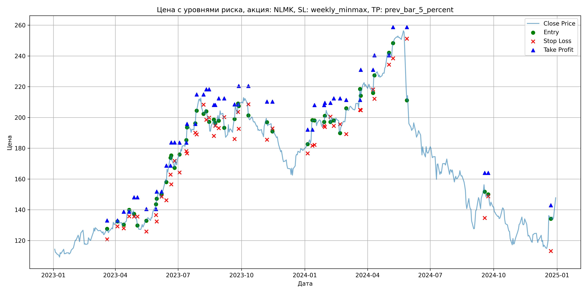
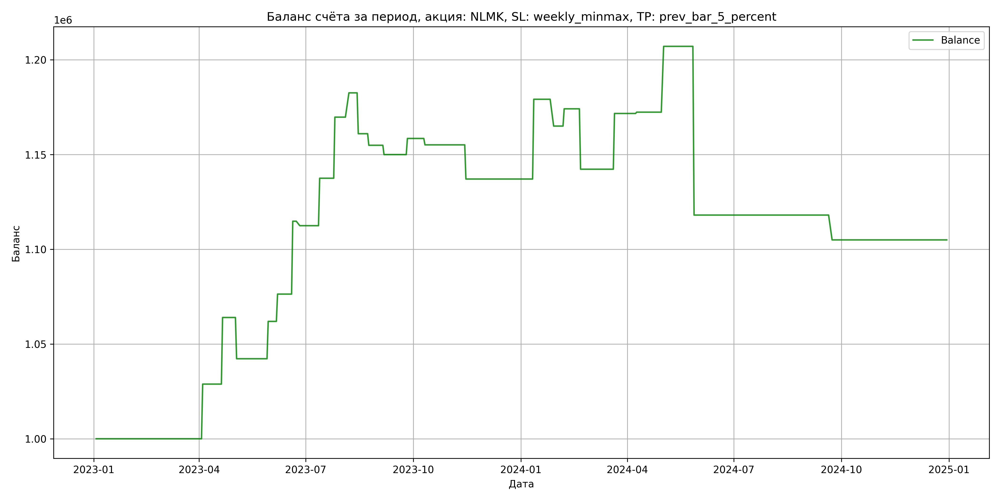

# Результаты торговой стратегии для NLMK

**Дата:** 2025-05-17 12:23:54  
**Стратегия:** NLMK,_SL_weekly_minmax,_TP_prev_bar_5_percent

## Конфигурация

```json
{
    "TICKER": "NLMK",
    "EXCHANGE": "MOEX",
    "START_DATE": "2023-01-01",
    "END_DATE": "2024-12-31",
    "INTERVAL": "1d",
    "CAPITAL": 1000000,
    "RISK_PERCENT": 0.02,
    "PROFIT_TO_RISK": 3,
    "ATR_MULTIPLIER": 1.5,
    "ATR_WINDOW": 14,
    "STOP_LOSS_METHOD": "weekly_minmax",
    "TAKE_PROFIT_METHOD": "prev_bar_5_percent",
    "POSITION": "long"
}
```

## Метрики эффективности

- **Начальный баланс:** 1000000.00
- **Конечный баланс:** 1104949.08
- **Прибыль/Убыток:** 104949.08 (10.49% за период тестирования)
- **Количество сделок:** 25
- **Процент выигрышных сделок:** 56.00% (14 выигрышных, 11 убыточных)
- **Средняя прибыль:** 23659.11
- **Средний убыток:** -20570.77
- **Максимальная прибыль:** 42093.48
- **Максимальный убыток:** -89041.92
- **Коэффициент прибыли:** 1.46
- **Максимальная просадка:** -8.46%

## Графики

### График цены с уровнями риска



### График баланса счёта



## Завершённые сделки

**Всего сделок:** 51

| Сделка № | Дата | Тип | Покупка / продажа | Количество акций | Цена | Stop Loss в момент сделки | Take Profit в момент сделки | Прибыль / убыток | Прибыль / убыток с учётом комиссии |
|:--------:|:----:|:---:|:-----------------:|:----------------:|:----:|:-------------------------:|:---------------------------:|:----------------:|:----------------------------------:|
| 1 | 2023-03-20 00:00:00 | LONG | BUY | 3651 | 125.40 | 120.80 | 133.01 | 0.00 | -228.92 |
| 2 | 2023-04-04 00:00:00 | LONG | SELL | -3651 | 133.30 | 129.20 | 133.01 | 28842.90 | 28370.64 |
| 3 | 2023-04-13 00:00:00 | LONG | BUY | 3647 | 130.82 | 128.00 | 138.73 | 0.00 | -238.55 |
| 4 | 2023-04-21 00:00:00 | LONG | SELL | -3647 | 140.46 | 135.73 | 138.73 | 35157.08 | 34662.40 |
| 5 | 2023-04-28 00:00:00 | LONG | BUY | 3580 | 139.42 | 135.60 | 148.09 | 0.00 | -249.56 |
| 6 | 2023-05-03 00:00:00 | LONG | SELL | -3580 | 133.34 | 135.60 | 148.09 | -21766.40 | -22254.64 |
| 7 | 2023-05-16 00:00:00 | LONG | BUY | 2553 | 133.52 | 125.88 | 140.48 | 0.00 | -170.44 |
| 8 | 2023-05-30 00:00:00 | LONG | SELL | -2553 | 141.24 | 136.57 | 140.48 | 19709.16 | 19358.43 |
| 9 | 2023-05-31 00:00:00 | LONG | BUY | 3144 | 143.62 | 132.42 | 151.77 | 0.00 | -225.77 |
| 10 | 2023-06-07 00:00:00 | LONG | SELL | -3144 | 148.20 | 148.51 | 151.77 | 14399.52 | 13940.78 |
| 11 | 2023-06-14 00:00:00 | LONG | BUY | 3009 | 159.52 | 146.22 | 168.66 | 0.00 | -240.00 |
| 12 | 2023-06-20 00:00:00 | LONG | SELL | -3009 | 172.30 | 162.90 | 168.66 | 38455.02 | 37955.80 |
| 13 | 2023-06-21 00:00:00 | LONG | BUY | 2546 | 173.72 | 156.52 | 183.69 | 0.00 | -221.15 |
| 14 | 2023-06-26 00:00:00 | LONG | SELL | -2546 | 172.80 | 171.75 | 183.69 | -2342.32 | -2783.44 |
| 15 | 2023-07-03 00:00:00 | LONG | BUY | 2090 | 173.00 | 164.24 | 183.67 | 0.00 | -180.78 |
| 16 | 2023-07-13 00:00:00 | LONG | SELL | -2090 | 184.98 | 178.12 | 183.67 | 25038.20 | 24664.11 |
| 17 | 2023-07-14 00:00:00 | LONG | BUY | 2555 | 184.88 | 176.66 | 195.81 | 0.00 | -236.18 |
| 18 | 2023-07-26 00:00:00 | LONG | SELL | -2555 | 197.50 | 190.12 | 195.81 | 32244.10 | 31755.61 |
| 19 | 2023-07-28 00:00:00 | LONG | BUY | 2455 | 202.78 | 189.00 | 214.94 | 0.00 | -248.91 |
| 20 | 2023-08-07 00:00:00 | LONG | SELL | -2455 | 208.00 | 208.27 | 214.94 | 12815.10 | 12310.87 |
| 21 | 2023-08-11 00:00:00 | LONG | BUY | 2396 | 205.50 | 198.52 | 218.29 | 0.00 | -246.19 |
| 22 | 2023-08-15 00:00:00 | LONG | SELL | -2396 | 196.50 | 199.86 | 218.29 | -21564.00 | -22045.60 |
| 23 | 2023-08-22 00:00:00 | LONG | BUY | 1775 | 197.82 | 188.02 | 208.09 | 0.00 | -175.57 |
| 24 | 2023-08-24 00:00:00 | LONG | SELL | -1775 | 194.38 | 194.63 | 208.09 | -6106.00 | -6454.08 |
| 25 | 2023-08-29 00:00:00 | LONG | BUY | 1820 | 201.70 | 193.04 | 212.37 | 0.00 | -183.55 |
| 26 | 2023-09-06 00:00:00 | LONG | SELL | -1820 | 199.00 | 200.21 | 212.37 | -4914.00 | -5278.64 |
| 27 | 2023-09-21 00:00:00 | LONG | BUY | 1724 | 196.96 | 186.02 | 208.49 | 0.00 | -169.78 |
| 28 | 2023-09-26 00:00:00 | LONG | SELL | -1724 | 201.90 | 203.59 | 208.49 | 8516.56 | 8172.74 |
| 29 | 2023-09-27 00:00:00 | LONG | BUY | 1940 | 209.46 | 192.64 | 220.50 | 0.00 | -203.18 |
| 30 | 2023-10-11 00:00:00 | LONG | SELL | -1940 | 207.72 | 208.58 | 220.50 | -3375.60 | -3780.26 |
| 31 | 2023-11-07 00:00:00 | LONG | BUY | 2254 | 199.10 | 185.54 | 210.32 | 0.00 | -224.39 |
| 32 | 2023-11-15 00:00:00 | LONG | SELL | -2254 | 191.10 | 192.92 | 210.32 | -18032.00 | -18471.76 |
| 33 | 2024-01-05 00:00:00 | LONG | BUY | 3146 | 183.12 | 176.62 | 192.10 | 0.00 | -288.05 |
| 34 | 2024-01-12 00:00:00 | LONG | SELL | -3146 | 196.50 | 181.69 | 192.10 | 42093.48 | 41496.34 |
| 35 | 2024-01-15 00:00:00 | LONG | BUY | 2831 | 199.00 | 182.20 | 208.07 | 0.00 | -281.68 |
| 36 | 2024-01-29 00:00:00 | LONG | SELL | -2831 | 194.00 | 194.57 | 208.07 | -14155.00 | -14711.29 |
| 37 | 2024-01-30 00:00:00 | LONG | BUY | 3209 | 197.30 | 193.80 | 209.52 | 0.00 | -316.57 |
| 38 | 2024-02-07 00:00:00 | LONG | SELL | -3209 | 200.14 | 200.49 | 209.52 | 9113.56 | 8475.87 |
| 39 | 2024-02-12 00:00:00 | LONG | BUY | 2985 | 201.00 | 194.54 | 212.35 | 0.00 | -299.99 |
| 40 | 2024-02-21 00:00:00 | LONG | SELL | -2985 | 190.32 | 195.57 | 212.35 | -31879.80 | -32463.85 |
| 41 | 2024-03-01 00:00:00 | LONG | BUY | 2388 | 200.46 | 189.22 | 211.36 | 0.00 | -239.35 |
| 42 | 2024-03-21 00:00:00 | LONG | SELL | -2388 | 212.78 | 205.00 | 211.36 | 29420.16 | 28926.75 |
| 43 | 2024-03-22 00:00:00 | LONG | BUY | 2674 | 217.98 | 204.72 | 230.94 | 0.00 | -291.44 |
| 44 | 2024-04-09 00:00:00 | LONG | SELL | -2674 | 218.24 | 218.15 | 230.94 | 695.24 | 112.01 |
| 45 | 2024-04-11 00:00:00 | LONG | BUY | 2395 | 227.80 | 212.12 | 240.38 | 0.00 | -272.79 |
| 46 | 2024-05-02 00:00:00 | LONG | SELL | -2395 | 242.30 | 234.34 | 240.38 | 34727.50 | 34164.56 |
| 47 | 2024-05-08 00:00:00 | LONG | BUY | 3162 | 246.94 | 238.44 | 258.69 | 0.00 | -390.41 |
| 48 | 2024-05-28 00:00:00 | LONG | SELL | -3162 | 218.78 | 251.17 | 258.69 | -89041.92 | -89778.22 |
| 49 | 2024-09-18 00:00:00 | LONG | BUY | 1877 | 156.24 | 134.70 | 163.97 | 0.00 | -146.63 |
| 50 | 2024-09-23 00:00:00 | LONG | SELL | -1877 | 149.26 | 148.71 | 163.97 | -13101.46 | -13388.17 |
| 51 | 2024-12-23 00:00:00 | LONG | BUY | 1959 | 137.10 | 113.20 | 142.92 | 0.00 | -134.29 |
