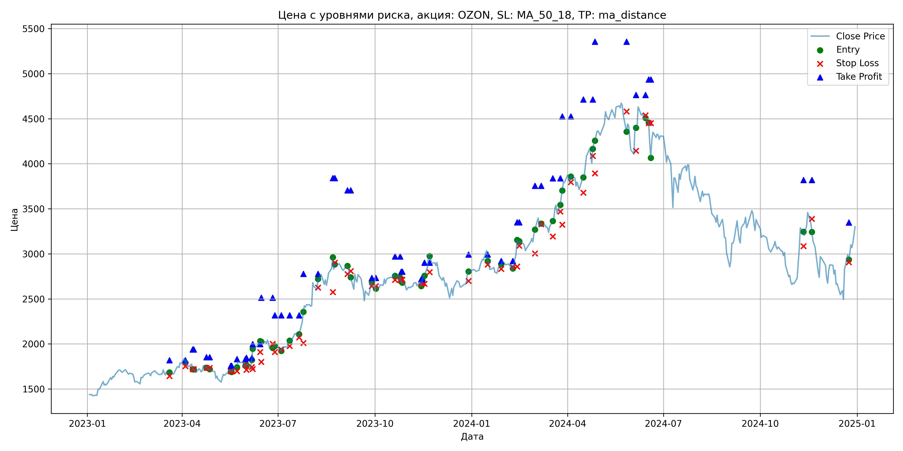
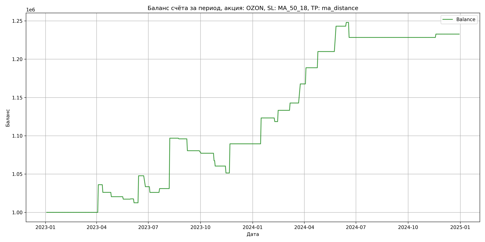

# Результаты торговой стратегии для OZON

**Дата:** 2025-05-17 12:22:46  
**Стратегия:** OZON,_SL_MA_50_18,_TP_ma_distance

## Конфигурация

```json
{
    "TICKER": "OZON",
    "EXCHANGE": "MOEX",
    "START_DATE": "2023-01-01",
    "END_DATE": "2024-12-31",
    "INTERVAL": "1d",
    "CAPITAL": 1000000,
    "RISK_PERCENT": 0.02,
    "PROFIT_TO_RISK": 3,
    "ATR_MULTIPLIER": 1.5,
    "ATR_WINDOW": 14,
    "STOP_LOSS_METHOD": "MA_50_18",
    "TAKE_PROFIT_METHOD": "ma_distance",
    "POSITION": "long"
}
```

## Метрики эффективности

- **Начальный баланс:** 1000000.00
- **Конечный баланс:** 1232726.00
- **Прибыль/Убыток:** 232726.00 (23.27% за период тестирования)
- **Количество сделок:** 29
- **Процент выигрышных сделок:** 51.72% (15 выигрышных, 14 убыточных)
- **Средняя прибыль:** 23211.00
- **Средний убыток:** -8245.64
- **Максимальная прибыль:** 65780.00
- **Максимальный убыток:** -19596.00
- **Коэффициент прибыли:** 3.02
- **Максимальная просадка:** -4.14%

## Графики

### График цены с уровнями риска



### График баланса счёта



## Завершённые сделки

**Всего сделок:** 59

| Сделка № | Дата | Тип | Покупка / продажа | Количество акций | Цена | Stop Loss в момент сделки | Take Profit в момент сделки | Прибыль / убыток | Прибыль / убыток с учётом комиссии |
|:--------:|:----:|:---:|:-----------------:|:----------------:|:----:|:-------------------------:|:---------------------------:|:----------------:|:----------------------------------:|
| 1 | 2023-03-20 00:00:00 | LONG | BUY | 236 | 1690.00 | 1642.53 | 1820.76 | 0.00 | -199.42 |
| 2 | 2023-04-04 00:00:00 | LONG | SELL | -236 | 1843.00 | 1753.22 | 1820.76 | 36108.00 | 35691.11 |
| 3 | 2023-04-11 00:00:00 | LONG | BUY | 206 | 1775.50 | 1719.53 | 1938.60 | 0.00 | -182.88 |
| 4 | 2023-04-12 00:00:00 | LONG | SELL | -206 | 1727.00 | 1719.53 | 1938.60 | -9991.00 | -10351.76 |
| 5 | 2023-04-24 00:00:00 | LONG | BUY | 172 | 1752.50 | 1733.65 | 1852.80 | 0.00 | -150.72 |
| 6 | 2023-04-27 00:00:00 | LONG | SELL | -172 | 1719.50 | 1733.65 | 1852.80 | -5676.00 | -5974.59 |
| 7 | 2023-05-17 00:00:00 | LONG | BUY | 177 | 1711.00 | 1695.56 | 1757.44 | 0.00 | -151.42 |
| 8 | 2023-05-18 00:00:00 | LONG | SELL | -177 | 1693.00 | 1695.56 | 1757.44 | -3186.00 | -3487.25 |
| 9 | 2023-05-23 00:00:00 | LONG | BUY | 233 | 1742.50 | 1697.65 | 1830.53 | 0.00 | -203.00 |
| 10 | 2023-05-31 00:00:00 | LONG | SELL | -233 | 1744.00 | 1767.43 | 1830.53 | 349.50 | -56.68 |
| 11 | 2023-06-01 00:00:00 | LONG | BUY | 217 | 1763.50 | 1711.47 | 1845.22 | 0.00 | -191.34 |
| 12 | 2023-06-06 00:00:00 | LONG | SELL | -217 | 1740.00 | 1744.40 | 1845.22 | -5099.50 | -5479.63 |
| 13 | 2023-06-07 00:00:00 | LONG | BUY | 197 | 1826.00 | 1721.68 | 1998.96 | 0.00 | -179.86 |
| 14 | 2023-06-14 00:00:00 | LONG | SELL | -197 | 2005.00 | 1910.51 | 1998.96 | 35263.00 | 34885.65 |
| 15 | 2023-06-15 00:00:00 | LONG | BUY | 190 | 2047.00 | 1799.69 | 2514.12 | 0.00 | -194.47 |
| 16 | 2023-06-26 00:00:00 | LONG | SELL | -190 | 1972.00 | 2001.16 | 2514.12 | -14250.00 | -14631.81 |
| 17 | 2023-06-28 00:00:00 | LONG | BUY | 172 | 1980.00 | 1909.29 | 2317.03 | 0.00 | -170.28 |
| 18 | 2023-07-04 00:00:00 | LONG | SELL | -172 | 1936.50 | 1938.44 | 2317.03 | -7482.00 | -7818.82 |
| 19 | 2023-07-12 00:00:00 | LONG | BUY | 176 | 2043.50 | 1976.31 | 2317.34 | 0.00 | -179.83 |
| 20 | 2023-07-21 00:00:00 | LONG | SELL | -176 | 2072.00 | 2072.70 | 2317.34 | 5016.00 | 4653.84 |
| 21 | 2023-07-25 00:00:00 | LONG | BUY | 184 | 2247.50 | 2010.97 | 2777.49 | 0.00 | -206.77 |
| 22 | 2023-08-08 00:00:00 | LONG | SELL | -184 | 2605.00 | 2625.42 | 2777.49 | 65780.00 | 65333.57 |
| 23 | 2023-08-22 00:00:00 | LONG | BUY | 103 | 2849.00 | 2576.01 | 3841.44 | 0.00 | -146.72 |
| 24 | 2023-08-24 00:00:00 | LONG | SELL | -103 | 2840.50 | 2901.29 | 3841.44 | -875.50 | -1168.51 |
| 25 | 2023-09-05 00:00:00 | LONG | BUY | 128 | 2867.00 | 2775.77 | 3704.50 | 0.00 | -183.49 |
| 26 | 2023-09-08 00:00:00 | LONG | SELL | -128 | 2746.00 | 2808.19 | 3704.50 | -15488.00 | -15847.23 |
| 27 | 2023-09-28 00:00:00 | LONG | BUY | 94 | 2675.00 | 2642.11 | 2733.54 | 0.00 | -125.72 |
| 28 | 2023-10-02 00:00:00 | LONG | SELL | -94 | 2640.00 | 2642.11 | 2733.54 | -3290.00 | -3539.80 |
| 29 | 2023-10-20 00:00:00 | LONG | BUY | 151 | 2784.00 | 2711.80 | 2970.99 | 0.00 | -210.19 |
| 30 | 2023-10-25 00:00:00 | LONG | SELL | -151 | 2719.50 | 2711.80 | 2970.99 | -9739.50 | -10155.01 |
| 31 | 2023-10-26 00:00:00 | LONG | BUY | 159 | 2734.00 | 2714.77 | 2802.63 | 0.00 | -217.35 |
| 32 | 2023-10-27 00:00:00 | LONG | SELL | -159 | 2690.00 | 2714.77 | 2802.63 | -6996.00 | -7427.21 |
| 33 | 2023-11-14 00:00:00 | LONG | BUY | 156 | 2700.00 | 2673.94 | 2718.33 | 0.00 | -210.60 |
| 34 | 2023-11-15 00:00:00 | LONG | SELL | -156 | 2642.00 | 2673.94 | 2718.33 | -9048.00 | -9464.68 |
| 35 | 2023-11-17 00:00:00 | LONG | BUY | 160 | 2760.00 | 2668.76 | 2901.79 | 0.00 | -220.80 |
| 36 | 2023-11-22 00:00:00 | LONG | SELL | -160 | 2998.00 | 2795.94 | 2901.79 | 38080.00 | 37619.36 |
| 37 | 2023-12-29 00:00:00 | LONG | BUY | 144 | 2800.50 | 2700.03 | 2991.84 | 0.00 | -201.64 |
| 38 | 2024-01-16 00:00:00 | LONG | SELL | -144 | 3035.00 | 2879.73 | 2991.84 | 33768.00 | 33347.84 |
| 39 | 2024-01-29 00:00:00 | LONG | BUY | 133 | 2849.50 | 2833.24 | 2921.87 | 0.00 | -189.49 |
| 40 | 2024-02-09 00:00:00 | LONG | SELL | -133 | 2814.00 | 2853.27 | 2921.87 | -4721.50 | -5098.12 |
| 41 | 2024-02-13 00:00:00 | LONG | BUY | 156 | 2996.00 | 2859.35 | 3350.69 | 0.00 | -233.69 |
| 42 | 2024-02-15 00:00:00 | LONG | SELL | -156 | 3090.00 | 3091.41 | 3350.69 | 14664.00 | 14189.29 |
| 43 | 2024-03-01 00:00:00 | LONG | BUY | 131 | 3233.00 | 3005.07 | 3756.35 | 0.00 | -211.76 |
| 44 | 2024-03-07 00:00:00 | LONG | SELL | -131 | 3306.00 | 3329.55 | 3756.35 | 9563.00 | 9134.70 |
| 45 | 2024-03-18 00:00:00 | LONG | BUY | 147 | 3300.00 | 3192.86 | 3837.70 | 0.00 | -242.55 |
| 46 | 2024-03-25 00:00:00 | LONG | SELL | -147 | 3469.50 | 3469.69 | 3837.70 | 24916.50 | 24418.94 |
| 47 | 2024-03-27 00:00:00 | LONG | BUY | 138 | 3633.00 | 3324.37 | 4525.65 | 0.00 | -250.68 |
| 48 | 2024-04-04 00:00:00 | LONG | SELL | -138 | 3786.00 | 3797.01 | 4525.65 | 21114.00 | 20602.09 |
| 49 | 2024-04-16 00:00:00 | LONG | BUY | 126 | 3850.00 | 3678.14 | 4713.74 | 0.00 | -242.55 |
| 50 | 2024-04-25 00:00:00 | LONG | SELL | -126 | 4018.00 | 4085.62 | 4713.74 | 21168.00 | 20672.32 |
| 51 | 2024-04-27 00:00:00 | LONG | BUY | 115 | 4228.00 | 3893.32 | 5353.93 | 0.00 | -243.11 |
| 52 | 2024-05-27 00:00:00 | LONG | SELL | -115 | 4516.00 | 4579.54 | 5353.93 | 33120.00 | 32617.22 |
| 53 | 2024-06-05 00:00:00 | LONG | BUY | 66 | 4443.50 | 4142.86 | 4763.06 | 0.00 | -146.64 |
| 54 | 2024-06-14 00:00:00 | LONG | SELL | -66 | 4517.50 | 4538.38 | 4763.06 | 4884.00 | 4588.29 |
| 55 | 2024-06-17 00:00:00 | LONG | BUY | 71 | 4506.00 | 4451.96 | 4935.91 | 0.00 | -159.96 |
| 56 | 2024-06-19 00:00:00 | LONG | SELL | -71 | 4230.00 | 4451.96 | 4935.91 | -19596.00 | -19906.13 |
| 57 | 2024-11-11 00:00:00 | LONG | BUY | 93 | 3306.00 | 3085.77 | 3818.57 | 0.00 | -153.73 |
| 58 | 2024-11-19 00:00:00 | LONG | SELL | -93 | 3353.00 | 3389.33 | 3818.57 | 4371.00 | 4061.36 |
| 59 | 2024-12-24 00:00:00 | LONG | BUY | 71 | 2991.00 | 2905.77 | 3346.56 | 0.00 | -106.18 |
