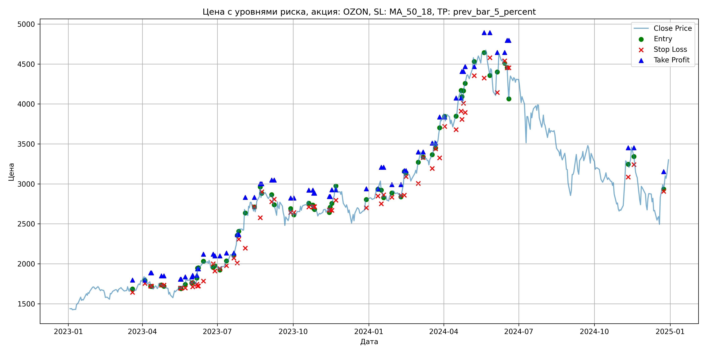
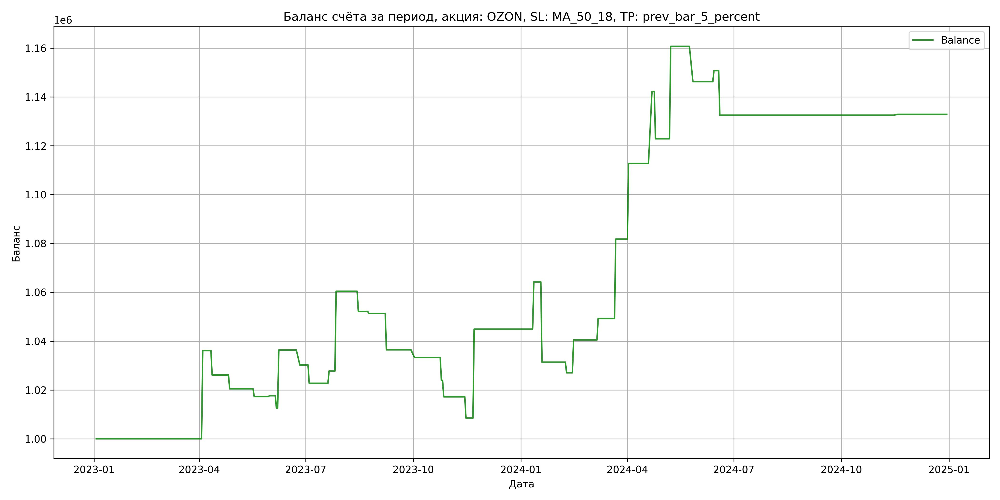

# Результаты торговой стратегии для OZON

**Дата:** 2025-05-17 12:22:43  
**Стратегия:** OZON,_SL_MA_50_18,_TP_prev_bar_5_percent

## Конфигурация

```json
{
    "TICKER": "OZON",
    "EXCHANGE": "MOEX",
    "START_DATE": "2023-01-01",
    "END_DATE": "2024-12-31",
    "INTERVAL": "1d",
    "CAPITAL": 1000000,
    "RISK_PERCENT": 0.02,
    "PROFIT_TO_RISK": 3,
    "ATR_MULTIPLIER": 1.5,
    "ATR_WINDOW": 14,
    "STOP_LOSS_METHOD": "MA_50_18",
    "TAKE_PROFIT_METHOD": "prev_bar_5_percent",
    "POSITION": "long"
}
```

## Метрики эффективности

- **Начальный баланс:** 1000000.00
- **Конечный баланс:** 1132871.00
- **Прибыль/Убыток:** 132871.00 (13.29% за период тестирования)
- **Количество сделок:** 33
- **Процент выигрышных сделок:** 45.45% (15 выигрышных, 18 убыточных)
- **Средняя прибыль:** 20774.50
- **Средний убыток:** -9930.36
- **Максимальная прибыль:** 37842.00
- **Максимальный убыток:** -32864.00
- **Коэффициент прибыли:** 1.74
- **Максимальная просадка:** -4.90%

## Графики

### График цены с уровнями риска



### График баланса счёта



## Завершённые сделки

**Всего сделок:** 67

| Сделка № | Дата | Тип | Покупка / продажа | Количество акций | Цена | Stop Loss в момент сделки | Take Profit в момент сделки | Прибыль / убыток | Прибыль / убыток с учётом комиссии |
|:--------:|:----:|:---:|:-----------------:|:----------------:|:----:|:-------------------------:|:---------------------------:|:----------------:|:----------------------------------:|
| 1 | 2023-03-20 00:00:00 | LONG | BUY | 236 | 1690.00 | 1642.53 | 1796.89 | 0.00 | -199.42 |
| 2 | 2023-04-04 00:00:00 | LONG | SELL | -236 | 1843.00 | 1753.22 | 1796.89 | 36108.00 | 35691.11 |
| 3 | 2023-04-11 00:00:00 | LONG | BUY | 206 | 1775.50 | 1719.53 | 1887.27 | 0.00 | -182.88 |
| 4 | 2023-04-12 00:00:00 | LONG | SELL | -206 | 1727.00 | 1719.53 | 1887.27 | -9991.00 | -10351.76 |
| 5 | 2023-04-24 00:00:00 | LONG | BUY | 172 | 1752.50 | 1733.65 | 1848.89 | 0.00 | -150.72 |
| 6 | 2023-04-27 00:00:00 | LONG | SELL | -172 | 1719.50 | 1733.65 | 1848.89 | -5676.00 | -5974.59 |
| 7 | 2023-05-17 00:00:00 | LONG | BUY | 177 | 1711.00 | 1695.56 | 1806.69 | 0.00 | -151.42 |
| 8 | 2023-05-18 00:00:00 | LONG | SELL | -177 | 1693.00 | 1695.56 | 1806.69 | -3186.00 | -3487.25 |
| 9 | 2023-05-23 00:00:00 | LONG | BUY | 233 | 1742.50 | 1697.65 | 1836.76 | 0.00 | -203.00 |
| 10 | 2023-05-31 00:00:00 | LONG | SELL | -233 | 1744.00 | 1767.43 | 1836.76 | 349.50 | -56.68 |
| 11 | 2023-06-01 00:00:00 | LONG | BUY | 217 | 1763.50 | 1711.47 | 1854.16 | 0.00 | -191.34 |
| 12 | 2023-06-06 00:00:00 | LONG | SELL | -217 | 1740.00 | 1744.40 | 1854.16 | -5099.50 | -5479.63 |
| 13 | 2023-06-07 00:00:00 | LONG | BUY | 197 | 1826.00 | 1721.68 | 1937.24 | 0.00 | -179.86 |
| 14 | 2023-06-08 00:00:00 | LONG | SELL | -197 | 1947.00 | 1721.68 | 1937.24 | 23837.00 | 23465.36 |
| 15 | 2023-06-14 00:00:00 | LONG | BUY | 186 | 2005.00 | 1783.35 | 2119.13 | 0.00 | -186.47 |
| 16 | 2023-06-26 00:00:00 | LONG | SELL | -186 | 1972.00 | 2001.16 | 2119.13 | -6138.00 | -6507.86 |
| 17 | 2023-06-28 00:00:00 | LONG | BUY | 172 | 1980.00 | 1909.29 | 2098.86 | 0.00 | -170.28 |
| 18 | 2023-07-04 00:00:00 | LONG | SELL | -172 | 1936.50 | 1938.44 | 2098.86 | -7482.00 | -7818.82 |
| 19 | 2023-07-12 00:00:00 | LONG | BUY | 176 | 2043.50 | 1976.31 | 2134.68 | 0.00 | -179.83 |
| 20 | 2023-07-21 00:00:00 | LONG | SELL | -176 | 2072.00 | 2072.70 | 2134.68 | 5016.00 | 4653.84 |
| 21 | 2023-07-25 00:00:00 | LONG | BUY | 184 | 2247.50 | 2010.97 | 2366.46 | 0.00 | -206.77 |
| 22 | 2023-07-27 00:00:00 | LONG | SELL | -184 | 2425.00 | 2308.39 | 2366.46 | 32660.00 | 32230.13 |
| 23 | 2023-08-04 00:00:00 | LONG | BUY | 140 | 2708.00 | 2195.94 | 2831.50 | 0.00 | -189.56 |
| 24 | 2023-08-15 00:00:00 | LONG | SELL | -140 | 2649.00 | 2714.11 | 2831.50 | -8260.00 | -8634.99 |
| 25 | 2023-08-22 00:00:00 | LONG | BUY | 99 | 2849.00 | 2576.01 | 3001.67 | 0.00 | -141.03 |
| 26 | 2023-08-24 00:00:00 | LONG | SELL | -99 | 2840.50 | 2901.29 | 3001.67 | -841.50 | -1123.13 |
| 27 | 2023-09-05 00:00:00 | LONG | BUY | 123 | 2867.00 | 2775.77 | 3048.34 | 0.00 | -176.32 |
| 28 | 2023-09-08 00:00:00 | LONG | SELL | -123 | 2746.00 | 2808.19 | 3048.34 | -14883.00 | -15228.20 |
| 29 | 2023-09-28 00:00:00 | LONG | BUY | 90 | 2675.00 | 2642.11 | 2822.12 | 0.00 | -120.38 |
| 30 | 2023-10-02 00:00:00 | LONG | SELL | -90 | 2640.00 | 2642.11 | 2822.12 | -3150.00 | -3389.18 |
| 31 | 2023-10-20 00:00:00 | LONG | BUY | 145 | 2784.00 | 2711.80 | 2920.76 | 0.00 | -201.84 |
| 32 | 2023-10-25 00:00:00 | LONG | SELL | -145 | 2719.50 | 2711.80 | 2920.76 | -9352.50 | -9751.50 |
| 33 | 2023-10-26 00:00:00 | LONG | BUY | 153 | 2734.00 | 2714.77 | 2884.37 | 0.00 | -209.15 |
| 34 | 2023-10-27 00:00:00 | LONG | SELL | -153 | 2690.00 | 2714.77 | 2884.37 | -6732.00 | -7146.94 |
| 35 | 2023-11-14 00:00:00 | LONG | BUY | 150 | 2700.00 | 2673.94 | 2841.64 | 0.00 | -202.50 |
| 36 | 2023-11-15 00:00:00 | LONG | SELL | -150 | 2642.00 | 2673.94 | 2841.64 | -8700.00 | -9100.65 |
| 37 | 2023-11-17 00:00:00 | LONG | BUY | 153 | 2760.00 | 2668.76 | 2925.00 | 0.00 | -211.14 |
| 38 | 2023-11-22 00:00:00 | LONG | SELL | -153 | 2998.00 | 2795.94 | 2925.00 | 36414.00 | 35973.51 |
| 39 | 2023-12-29 00:00:00 | LONG | BUY | 138 | 2800.50 | 2700.03 | 2937.55 | 0.00 | -193.23 |
| 40 | 2024-01-12 00:00:00 | LONG | SELL | -138 | 2940.50 | 2848.86 | 2937.55 | 19320.00 | 18923.87 |
| 41 | 2024-01-16 00:00:00 | LONG | BUY | 158 | 3035.00 | 2751.81 | 3207.77 | 0.00 | -239.77 |
| 42 | 2024-01-19 00:00:00 | LONG | SELL | -158 | 2827.00 | 2862.09 | 3207.77 | -32864.00 | -33327.10 |
| 43 | 2024-01-29 00:00:00 | LONG | BUY | 122 | 2849.50 | 2833.24 | 2991.98 | 0.00 | -173.82 |
| 44 | 2024-02-09 00:00:00 | LONG | SELL | -122 | 2814.00 | 2853.27 | 2991.98 | -4331.00 | -4676.47 |
| 45 | 2024-02-13 00:00:00 | LONG | BUY | 143 | 2996.00 | 2859.35 | 3164.96 | 0.00 | -214.21 |
| 46 | 2024-02-15 00:00:00 | LONG | SELL | -143 | 3090.00 | 3091.41 | 3164.96 | 13442.00 | 13006.85 |
| 47 | 2024-03-01 00:00:00 | LONG | BUY | 120 | 3233.00 | 3005.07 | 3399.07 | 0.00 | -193.98 |
| 48 | 2024-03-07 00:00:00 | LONG | SELL | -120 | 3306.00 | 3329.55 | 3399.07 | 8760.00 | 8367.66 |
| 49 | 2024-03-18 00:00:00 | LONG | BUY | 135 | 3300.00 | 3192.86 | 3510.85 | 0.00 | -222.75 |
| 50 | 2024-03-22 00:00:00 | LONG | SELL | -135 | 3541.00 | 3439.31 | 3510.85 | 32535.00 | 32073.23 |
| 51 | 2024-03-27 00:00:00 | LONG | BUY | 128 | 3633.00 | 3324.37 | 3837.17 | 0.00 | -232.51 |
| 52 | 2024-04-02 00:00:00 | LONG | SELL | -128 | 3875.00 | 3718.12 | 3837.17 | 30976.00 | 30495.49 |
| 53 | 2024-04-16 00:00:00 | LONG | BUY | 118 | 3850.00 | 3678.14 | 4073.84 | 0.00 | -227.15 |
| 54 | 2024-04-22 00:00:00 | LONG | SELL | -118 | 4100.00 | 3910.20 | 4073.84 | 29500.00 | 29030.95 |
| 55 | 2024-04-23 00:00:00 | LONG | BUY | 116 | 4185.00 | 3807.08 | 4406.32 | 0.00 | -242.73 |
| 56 | 2024-04-25 00:00:00 | LONG | SELL | -116 | 4018.00 | 4008.20 | 4406.32 | -19372.00 | -19847.77 |
| 57 | 2024-04-27 00:00:00 | LONG | BUY | 106 | 4228.00 | 3893.32 | 4468.15 | 0.00 | -224.08 |
| 58 | 2024-05-08 00:00:00 | LONG | SELL | -106 | 4585.00 | 4354.14 | 4468.15 | 37842.00 | 37374.91 |
| 59 | 2024-05-20 00:00:00 | LONG | BUY | 108 | 4650.00 | 4324.86 | 4891.45 | 0.00 | -251.10 |
| 60 | 2024-05-27 00:00:00 | LONG | SELL | -108 | 4516.00 | 4579.54 | 4891.45 | -14472.00 | -14966.96 |
| 61 | 2024-06-05 00:00:00 | LONG | BUY | 61 | 4443.50 | 4142.86 | 4643.58 | 0.00 | -135.53 |
| 62 | 2024-06-14 00:00:00 | LONG | SELL | -61 | 4517.50 | 4538.38 | 4643.58 | 4514.00 | 4240.69 |
| 63 | 2024-06-17 00:00:00 | LONG | BUY | 66 | 4506.00 | 4451.96 | 4794.73 | 0.00 | -148.70 |
| 64 | 2024-06-19 00:00:00 | LONG | SELL | -66 | 4230.00 | 4451.96 | 4794.73 | -18216.00 | -18504.29 |
| 65 | 2024-11-11 00:00:00 | LONG | BUY | 86 | 3306.00 | 3085.77 | 3450.76 | 0.00 | -142.16 |
| 66 | 2024-11-18 00:00:00 | LONG | SELL | -86 | 3310.00 | 3241.35 | 3450.76 | 344.00 | 59.51 |
| 67 | 2024-12-24 00:00:00 | LONG | BUY | 65 | 2991.00 | 2905.77 | 3152.34 | 0.00 | -97.21 |
