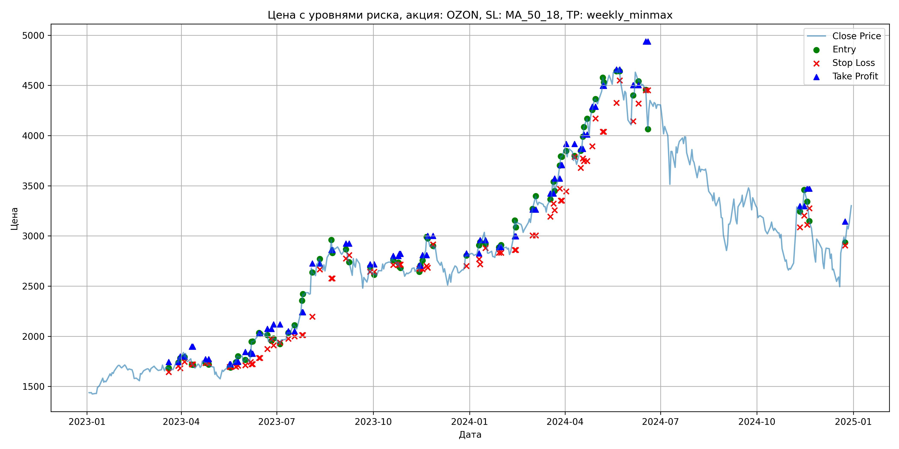

# Результаты торговой стратегии для OZON

**Дата:** 2025-05-17 12:22:44  
**Стратегия:** OZON,_SL_MA_50_18,_TP_weekly_minmax

## Конфигурация

```json
{
    "TICKER": "OZON",
    "EXCHANGE": "MOEX",
    "START_DATE": "2023-01-01",
    "END_DATE": "2024-12-31",
    "INTERVAL": "1d",
    "CAPITAL": 1000000,
    "RISK_PERCENT": 0.02,
    "PROFIT_TO_RISK": 3,
    "ATR_MULTIPLIER": 1.5,
    "ATR_WINDOW": 14,
    "STOP_LOSS_METHOD": "MA_50_18",
    "TAKE_PROFIT_METHOD": "weekly_minmax",
    "POSITION": "long"
}
```

## Метрики эффективности

- **Начальный баланс:** 1000000.00
- **Конечный баланс:** 1189936.00
- **Прибыль/Убыток:** 189936.00 (18.99% за период тестирования)
- **Количество сделок:** 40
- **Процент выигрышных сделок:** 62.50% (25 выигрышных, 15 убыточных)
- **Средняя прибыль:** 13407.40
- **Средний убыток:** -9683.27
- **Максимальная прибыль:** 28600.00
- **Максимальный убыток:** -19044.00
- **Коэффициент прибыли:** 2.31
- **Максимальная просадка:** -4.18%

## Графики

### График цены с уровнями риска



### График баланса счёта


## Завершённые сделки

**Всего сделок:** 81

| Сделка № | Дата | Тип | Покупка / продажа | Количество акций | Цена | Stop Loss в момент сделки | Take Profit в момент сделки | Прибыль / убыток | Прибыль / убыток с учётом комиссии |
|:--------:|:----:|:---:|:-----------------:|:----------------:|:----:|:-------------------------:|:---------------------------:|:----------------:|:----------------------------------:|
| 1 | 2023-03-20 00:00:00 | LONG | BUY | 236 | 1690.00 | 1642.53 | 1743.76 | 0.00 | -199.42 |
| 2 | 2023-03-29 00:00:00 | LONG | SELL | -236 | 1749.00 | 1705.20 | 1743.76 | 13924.00 | 13518.20 |
| 3 | 2023-03-31 00:00:00 | LONG | BUY | 250 | 1793.50 | 1681.34 | 1799.67 | 0.00 | -224.19 |
| 4 | 2023-04-04 00:00:00 | LONG | SELL | -250 | 1843.00 | 1745.38 | 1799.67 | 12375.00 | 11920.44 |
| 5 | 2023-04-11 00:00:00 | LONG | BUY | 204 | 1775.50 | 1719.53 | 1897.55 | 0.00 | -181.10 |
| 6 | 2023-04-12 00:00:00 | LONG | SELL | -204 | 1727.00 | 1719.53 | 1897.55 | -9894.00 | -10251.25 |
| 7 | 2023-04-24 00:00:00 | LONG | BUY | 171 | 1752.50 | 1733.65 | 1771.06 | 0.00 | -149.84 |
| 8 | 2023-04-27 00:00:00 | LONG | SELL | -171 | 1719.50 | 1733.65 | 1771.06 | -5643.00 | -5939.86 |
| 9 | 2023-05-17 00:00:00 | LONG | BUY | 176 | 1711.00 | 1695.56 | 1722.81 | 0.00 | -150.57 |
| 10 | 2023-05-18 00:00:00 | LONG | SELL | -176 | 1693.00 | 1695.56 | 1722.81 | -3168.00 | -3467.55 |
| 11 | 2023-05-23 00:00:00 | LONG | BUY | 231 | 1742.50 | 1697.65 | 1746.50 | 0.00 | -201.26 |
| 12 | 2023-05-25 00:00:00 | LONG | SELL | -231 | 1804.50 | 1707.16 | 1746.50 | 14322.00 | 13912.32 |
| 13 | 2023-06-01 00:00:00 | LONG | BUY | 217 | 1763.50 | 1711.47 | 1843.44 | 0.00 | -191.34 |
| 14 | 2023-06-06 00:00:00 | LONG | SELL | -217 | 1740.00 | 1744.40 | 1843.44 | -5099.50 | -5479.63 |
| 15 | 2023-06-07 00:00:00 | LONG | BUY | 198 | 1826.00 | 1721.68 | 1826.74 | 0.00 | -180.77 |
| 16 | 2023-06-08 00:00:00 | LONG | SELL | -198 | 1947.00 | 1721.68 | 1826.74 | 23958.00 | 23584.47 |
| 17 | 2023-06-14 00:00:00 | LONG | BUY | 187 | 2005.00 | 1783.35 | 2026.35 | 0.00 | -187.47 |
| 18 | 2023-06-15 00:00:00 | LONG | SELL | -187 | 2047.00 | 1783.35 | 2026.35 | 7854.00 | 7475.14 |
| 19 | 2023-06-22 00:00:00 | LONG | BUY | 191 | 2043.50 | 1873.49 | 2074.73 | 0.00 | -195.15 |
| 20 | 2023-06-26 00:00:00 | LONG | SELL | -191 | 1972.00 | 1971.76 | 2074.73 | -13656.50 | -14039.98 |
| 21 | 2023-06-28 00:00:00 | LONG | BUY | 173 | 1980.00 | 1909.29 | 2117.89 | 0.00 | -171.27 |
| 22 | 2023-07-04 00:00:00 | LONG | SELL | -173 | 1936.50 | 1938.44 | 2117.89 | -7525.50 | -7864.28 |
| 23 | 2023-07-12 00:00:00 | LONG | BUY | 176 | 2043.50 | 1976.31 | 2050.71 | 0.00 | -179.83 |
| 24 | 2023-07-18 00:00:00 | LONG | SELL | -176 | 2120.00 | 1998.22 | 2050.71 | 13464.00 | 13097.61 |
| 25 | 2023-07-25 00:00:00 | LONG | BUY | 186 | 2247.50 | 2010.97 | 2239.71 | 0.00 | -209.02 |
| 26 | 2023-07-26 00:00:00 | LONG | SELL | -186 | 2350.00 | 2010.97 | 2239.71 | 19065.00 | 18637.43 |
| 27 | 2023-08-04 00:00:00 | LONG | BUY | 140 | 2708.00 | 2195.94 | 2726.67 | 0.00 | -189.56 |
| 28 | 2023-08-11 00:00:00 | LONG | SELL | -140 | 2775.00 | 2665.60 | 2726.67 | 9380.00 | 8996.19 |
| 29 | 2023-08-22 00:00:00 | LONG | BUY | 101 | 2849.00 | 2576.01 | 2859.92 | 0.00 | -143.87 |
| 30 | 2023-08-23 00:00:00 | LONG | SELL | -101 | 2979.00 | 2576.01 | 2859.92 | 13130.00 | 12835.69 |
| 31 | 2023-09-05 00:00:00 | LONG | BUY | 127 | 2867.00 | 2775.77 | 2924.72 | 0.00 | -182.05 |
| 32 | 2023-09-08 00:00:00 | LONG | SELL | -127 | 2746.00 | 2808.19 | 2924.72 | -15367.00 | -15723.43 |
| 33 | 2023-09-28 00:00:00 | LONG | BUY | 92 | 2675.00 | 2642.11 | 2716.25 | 0.00 | -123.05 |
| 34 | 2023-10-02 00:00:00 | LONG | SELL | -92 | 2640.00 | 2642.11 | 2716.25 | -3220.00 | -3464.49 |
| 35 | 2023-10-20 00:00:00 | LONG | BUY | 149 | 2784.00 | 2711.80 | 2800.32 | 0.00 | -207.41 |
| 36 | 2023-10-25 00:00:00 | LONG | SELL | -149 | 2719.50 | 2711.80 | 2800.32 | -9610.50 | -10020.51 |
| 37 | 2023-10-26 00:00:00 | LONG | BUY | 157 | 2734.00 | 2714.77 | 2820.62 | 0.00 | -214.62 |
| 38 | 2023-10-27 00:00:00 | LONG | SELL | -157 | 2690.00 | 2714.77 | 2820.62 | -6908.00 | -7333.78 |
| 39 | 2023-11-14 00:00:00 | LONG | BUY | 154 | 2700.00 | 2673.94 | 2705.19 | 0.00 | -207.90 |
| 40 | 2023-11-15 00:00:00 | LONG | SELL | -154 | 2642.00 | 2673.94 | 2705.19 | -8932.00 | -9343.33 |
| 41 | 2023-11-17 00:00:00 | LONG | BUY | 158 | 2760.00 | 2668.76 | 2808.72 | 0.00 | -218.04 |
| 42 | 2023-11-21 00:00:00 | LONG | SELL | -158 | 2852.50 | 2700.88 | 2808.72 | 14615.00 | 14171.61 |
| 43 | 2023-11-22 00:00:00 | LONG | BUY | 147 | 2998.00 | 2683.89 | 3000.46 | 0.00 | -220.35 |
| 44 | 2023-11-27 00:00:00 | LONG | SELL | -147 | 2890.00 | 2915.50 | 3000.46 | -15876.00 | -16308.77 |
| 45 | 2023-12-29 00:00:00 | LONG | BUY | 137 | 2800.50 | 2700.03 | 2825.61 | 0.00 | -191.83 |
| 46 | 2024-01-10 00:00:00 | LONG | SELL | -137 | 2880.00 | 2768.99 | 2825.61 | 10891.50 | 10502.39 |
| 47 | 2024-01-11 00:00:00 | LONG | BUY | 162 | 2907.00 | 2717.86 | 2957.74 | 0.00 | -235.47 |
| 48 | 2024-01-16 00:00:00 | LONG | SELL | -162 | 3035.00 | 2879.73 | 2957.74 | 20736.00 | 20254.70 |
| 49 | 2024-01-29 00:00:00 | LONG | BUY | 126 | 2849.50 | 2833.24 | 2889.62 | 0.00 | -179.52 |
| 50 | 2024-01-31 00:00:00 | LONG | SELL | -126 | 2920.00 | 2833.24 | 2889.62 | 8883.00 | 8519.52 |
| 51 | 2024-02-13 00:00:00 | LONG | BUY | 150 | 2996.00 | 2859.35 | 2997.35 | 0.00 | -224.70 |
| 52 | 2024-02-14 00:00:00 | LONG | SELL | -150 | 3154.00 | 2859.35 | 2997.35 | 23700.00 | 23238.75 |
| 53 | 2024-03-01 00:00:00 | LONG | BUY | 127 | 3233.00 | 3005.07 | 3263.67 | 0.00 | -205.30 |
| 54 | 2024-03-04 00:00:00 | LONG | SELL | -127 | 3286.50 | 3005.07 | 3263.67 | 6794.50 | 6380.51 |
| 55 | 2024-03-18 00:00:00 | LONG | BUY | 143 | 3300.00 | 3192.86 | 3422.18 | 0.00 | -235.95 |
| 56 | 2024-03-21 00:00:00 | LONG | SELL | -143 | 3500.00 | 3322.20 | 3422.18 | 28600.00 | 28113.80 |
| 57 | 2024-03-22 00:00:00 | LONG | BUY | 139 | 3541.00 | 3256.16 | 3571.10 | 0.00 | -246.10 |
| 58 | 2024-03-27 00:00:00 | LONG | SELL | -139 | 3633.00 | 3471.65 | 3571.10 | 12788.00 | 12289.41 |
| 59 | 2024-03-28 00:00:00 | LONG | BUY | 136 | 3707.00 | 3351.35 | 3706.06 | 0.00 | -252.08 |
| 60 | 2024-03-29 00:00:00 | LONG | SELL | -136 | 3810.00 | 3351.35 | 3706.06 | 14008.00 | 13496.84 |
| 61 | 2024-04-02 00:00:00 | LONG | BUY | 131 | 3875.00 | 3443.20 | 3916.48 | 0.00 | -253.81 |
| 62 | 2024-04-10 00:00:00 | LONG | SELL | -131 | 3760.00 | 3789.17 | 3916.48 | -15065.00 | -15565.09 |
| 63 | 2024-04-16 00:00:00 | LONG | BUY | 122 | 3850.00 | 3678.14 | 3868.66 | 0.00 | -234.85 |
| 64 | 2024-04-18 00:00:00 | LONG | SELL | -122 | 3902.00 | 3771.04 | 3868.66 | 6344.00 | 5871.13 |
| 65 | 2024-04-19 00:00:00 | LONG | BUY | 124 | 4000.00 | 3747.12 | 4010.64 | 0.00 | -248.00 |
| 66 | 2024-04-22 00:00:00 | LONG | SELL | -124 | 4100.00 | 3747.12 | 4010.64 | 12400.00 | 11897.80 |
| 67 | 2024-04-27 00:00:00 | LONG | BUY | 111 | 4228.00 | 3893.32 | 4287.98 | 0.00 | -234.65 |
| 68 | 2024-04-30 00:00:00 | LONG | SELL | -111 | 4363.00 | 4171.37 | 4287.98 | 14985.00 | 14508.20 |
| 69 | 2024-05-07 00:00:00 | LONG | BUY | 113 | 4445.00 | 4038.70 | 4496.37 | 0.00 | -251.14 |
| 70 | 2024-05-08 00:00:00 | LONG | SELL | -113 | 4585.00 | 4038.70 | 4496.37 | 15820.00 | 15309.81 |
| 71 | 2024-05-20 00:00:00 | LONG | BUY | 112 | 4650.00 | 4324.86 | 4658.60 | 0.00 | -260.40 |
| 72 | 2024-05-23 00:00:00 | LONG | SELL | -112 | 4680.00 | 4549.16 | 4658.60 | 3360.00 | 2837.52 |
| 73 | 2024-06-05 00:00:00 | LONG | BUY | 64 | 4443.50 | 4142.86 | 4502.56 | 0.00 | -142.19 |
| 74 | 2024-06-10 00:00:00 | LONG | SELL | -64 | 4650.50 | 4319.84 | 4502.56 | 13248.00 | 12956.99 |
| 75 | 2024-06-17 00:00:00 | LONG | BUY | 69 | 4506.00 | 4451.96 | 4936.44 | 0.00 | -155.46 |
| 76 | 2024-06-19 00:00:00 | LONG | SELL | -69 | 4230.00 | 4451.96 | 4936.44 | -19044.00 | -19345.39 |
| 77 | 2024-11-11 00:00:00 | LONG | BUY | 90 | 3306.00 | 3085.77 | 3296.66 | 0.00 | -148.77 |
| 78 | 2024-11-15 00:00:00 | LONG | SELL | -90 | 3312.00 | 3203.13 | 3296.66 | 540.00 | 242.19 |
| 79 | 2024-11-18 00:00:00 | LONG | BUY | 104 | 3310.00 | 3112.22 | 3470.88 | 0.00 | -172.12 |
| 80 | 2024-11-20 00:00:00 | LONG | SELL | -104 | 3250.00 | 3275.16 | 3470.88 | -6240.00 | -6581.12 |
| 81 | 2024-12-24 00:00:00 | LONG | BUY | 68 | 2991.00 | 2905.77 | 3143.38 | 0.00 | -101.69 |
