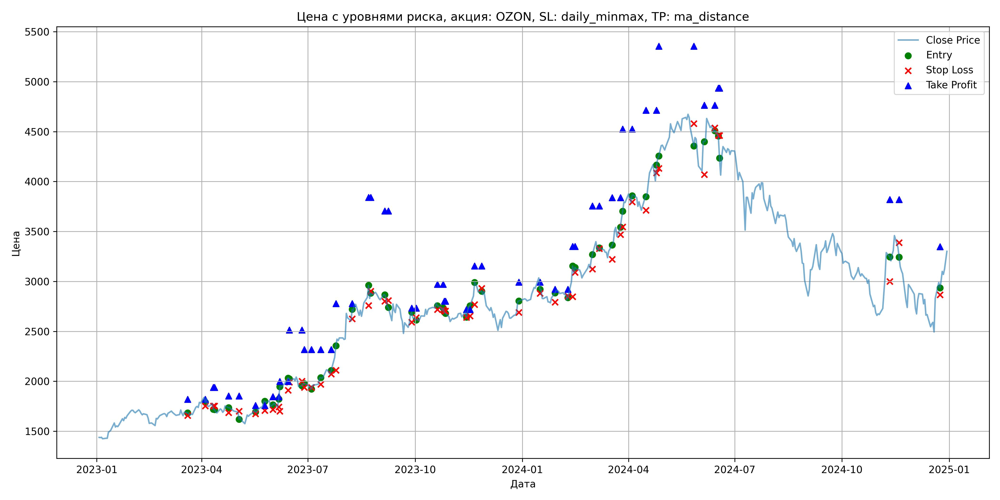
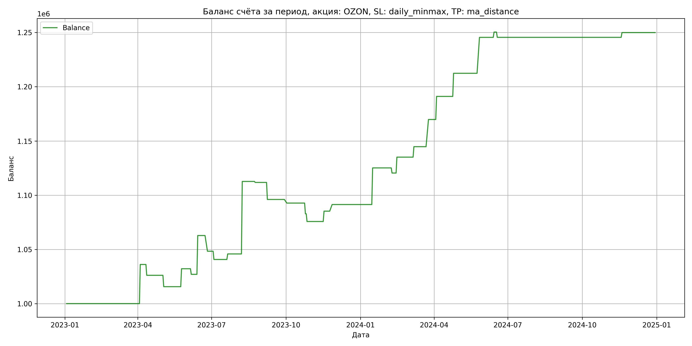

# Результаты торговой стратегии для OZON

**Дата:** 2025-05-17 12:22:31  
**Стратегия:** OZON,_SL_daily_minmax,_TP_ma_distance

## Конфигурация

```json
{
    "TICKER": "OZON",
    "EXCHANGE": "MOEX",
    "START_DATE": "2023-01-01",
    "END_DATE": "2024-12-31",
    "INTERVAL": "1d",
    "CAPITAL": 1000000,
    "RISK_PERCENT": 0.02,
    "PROFIT_TO_RISK": 3,
    "ATR_MULTIPLIER": 1.5,
    "ATR_WINDOW": 14,
    "STOP_LOSS_METHOD": "daily_minmax",
    "TAKE_PROFIT_METHOD": "ma_distance",
    "POSITION": "long"
}
```

## Метрики эффективности

- **Начальный баланс:** 1000000.00
- **Конечный баланс:** 1249973.50
- **Прибыль/Убыток:** 249973.50 (25.00% за период тестирования)
- **Количество сделок:** 28
- **Процент выигрышных сделок:** 57.14% (16 выигрышных, 12 убыточных)
- **Средняя прибыль:** 21515.19
- **Средний убыток:** -7855.79
- **Максимальная прибыль:** 66852.50
- **Максимальный убыток:** -15730.00
- **Коэффициент прибыли:** 3.65
- **Максимальная просадка:** -3.32%

## Графики

### График цены с уровнями риска



### График баланса счёта



## Завершённые сделки

**Всего сделок:** 57

| Сделка № | Дата | Тип | Покупка / продажа | Количество акций | Цена | Stop Loss в момент сделки | Take Profit в момент сделки | Прибыль / убыток | Прибыль / убыток с учётом комиссии |
|:--------:|:----:|:---:|:-----------------:|:----------------:|:----:|:-------------------------:|:---------------------------:|:----------------:|:----------------------------------:|
| 1 | 2023-03-20 00:00:00 | LONG | BUY | 236 | 1690.00 | 1657.50 | 1820.76 | 0.00 | -199.42 |
| 2 | 2023-04-04 00:00:00 | LONG | SELL | -236 | 1843.00 | 1753.22 | 1820.76 | 36108.00 | 35691.11 |
| 3 | 2023-04-11 00:00:00 | LONG | BUY | 206 | 1775.50 | 1753.50 | 1938.60 | 0.00 | -182.88 |
| 4 | 2023-04-12 00:00:00 | LONG | SELL | -206 | 1727.00 | 1753.50 | 1938.60 | -9991.00 | -10351.76 |
| 5 | 2023-04-24 00:00:00 | LONG | BUY | 172 | 1752.50 | 1685.00 | 1852.80 | 0.00 | -150.72 |
| 6 | 2023-05-03 00:00:00 | LONG | SELL | -172 | 1691.50 | 1701.28 | 1852.80 | -10492.00 | -10788.18 |
| 7 | 2023-05-17 00:00:00 | LONG | BUY | 177 | 1711.00 | 1675.00 | 1757.44 | 0.00 | -151.42 |
| 8 | 2023-05-25 00:00:00 | LONG | SELL | -177 | 1804.50 | 1707.16 | 1757.44 | 16549.50 | 16238.38 |
| 9 | 2023-06-01 00:00:00 | LONG | BUY | 220 | 1763.50 | 1717.00 | 1845.22 | 0.00 | -193.99 |
| 10 | 2023-06-06 00:00:00 | LONG | SELL | -220 | 1740.00 | 1744.40 | 1845.22 | -5170.00 | -5555.39 |
| 11 | 2023-06-07 00:00:00 | LONG | BUY | 200 | 1826.00 | 1701.00 | 1998.96 | 0.00 | -182.60 |
| 12 | 2023-06-14 00:00:00 | LONG | SELL | -200 | 2005.00 | 1910.51 | 1998.96 | 35800.00 | 35416.90 |
| 13 | 2023-06-15 00:00:00 | LONG | BUY | 193 | 2047.00 | 1991.50 | 2514.12 | 0.00 | -197.54 |
| 14 | 2023-06-26 00:00:00 | LONG | SELL | -193 | 1972.00 | 2001.16 | 2514.12 | -14475.00 | -14862.83 |
| 15 | 2023-06-28 00:00:00 | LONG | BUY | 175 | 1980.00 | 1938.00 | 2317.03 | 0.00 | -173.25 |
| 16 | 2023-07-04 00:00:00 | LONG | SELL | -175 | 1936.50 | 1938.44 | 2317.03 | -7612.50 | -7955.19 |
| 17 | 2023-07-12 00:00:00 | LONG | BUY | 179 | 2043.50 | 1970.00 | 2317.34 | 0.00 | -182.89 |
| 18 | 2023-07-21 00:00:00 | LONG | SELL | -179 | 2072.00 | 2072.70 | 2317.34 | 5101.50 | 4733.16 |
| 19 | 2023-07-25 00:00:00 | LONG | BUY | 187 | 2247.50 | 2110.50 | 2777.49 | 0.00 | -210.14 |
| 20 | 2023-08-08 00:00:00 | LONG | SELL | -187 | 2605.00 | 2625.42 | 2777.49 | 66852.50 | 66398.79 |
| 21 | 2023-08-22 00:00:00 | LONG | BUY | 105 | 2849.00 | 2759.50 | 3841.44 | 0.00 | -149.57 |
| 22 | 2023-08-24 00:00:00 | LONG | SELL | -105 | 2840.50 | 2901.29 | 3841.44 | -892.50 | -1191.20 |
| 23 | 2023-09-05 00:00:00 | LONG | BUY | 130 | 2867.00 | 2802.00 | 3704.50 | 0.00 | -186.36 |
| 24 | 2023-09-08 00:00:00 | LONG | SELL | -130 | 2746.00 | 2808.19 | 3704.50 | -15730.00 | -16094.84 |
| 25 | 2023-09-28 00:00:00 | LONG | BUY | 95 | 2675.00 | 2593.00 | 2733.54 | 0.00 | -127.06 |
| 26 | 2023-10-02 00:00:00 | LONG | SELL | -95 | 2640.00 | 2637.18 | 2733.54 | -3325.00 | -3577.46 |
| 27 | 2023-10-20 00:00:00 | LONG | BUY | 153 | 2784.00 | 2717.50 | 2970.99 | 0.00 | -212.98 |
| 28 | 2023-10-25 00:00:00 | LONG | SELL | -153 | 2719.50 | 2717.50 | 2970.99 | -9868.50 | -10289.52 |
| 29 | 2023-10-26 00:00:00 | LONG | BUY | 162 | 2734.00 | 2705.00 | 2802.63 | 0.00 | -221.45 |
| 30 | 2023-10-27 00:00:00 | LONG | SELL | -162 | 2690.00 | 2705.00 | 2802.63 | -7128.00 | -7567.34 |
| 31 | 2023-11-14 00:00:00 | LONG | BUY | 159 | 2700.00 | 2640.50 | 2718.33 | 0.00 | -214.65 |
| 32 | 2023-11-17 00:00:00 | LONG | SELL | -159 | 2760.00 | 2653.35 | 2718.33 | 9540.00 | 9105.93 |
| 33 | 2023-11-21 00:00:00 | LONG | BUY | 163 | 2852.50 | 2768.00 | 3153.92 | 0.00 | -232.48 |
| 34 | 2023-11-27 00:00:00 | LONG | SELL | -163 | 2890.00 | 2930.69 | 3153.92 | 6112.50 | 5644.49 |
| 35 | 2023-12-29 00:00:00 | LONG | BUY | 144 | 2800.50 | 2690.00 | 2991.84 | 0.00 | -201.64 |
| 36 | 2024-01-16 00:00:00 | LONG | SELL | -144 | 3035.00 | 2879.73 | 2991.84 | 33768.00 | 33347.84 |
| 37 | 2024-01-29 00:00:00 | LONG | BUY | 133 | 2849.50 | 2791.50 | 2921.87 | 0.00 | -189.49 |
| 38 | 2024-02-09 00:00:00 | LONG | SELL | -133 | 2814.00 | 2853.27 | 2921.87 | -4721.50 | -5098.12 |
| 39 | 2024-02-13 00:00:00 | LONG | BUY | 156 | 2996.00 | 2847.50 | 3350.69 | 0.00 | -233.69 |
| 40 | 2024-02-15 00:00:00 | LONG | SELL | -156 | 3090.00 | 3091.41 | 3350.69 | 14664.00 | 14189.29 |
| 41 | 2024-03-01 00:00:00 | LONG | BUY | 132 | 3233.00 | 3122.50 | 3756.35 | 0.00 | -213.38 |
| 42 | 2024-03-07 00:00:00 | LONG | SELL | -132 | 3306.00 | 3329.55 | 3756.35 | 9636.00 | 9204.43 |
| 43 | 2024-03-18 00:00:00 | LONG | BUY | 148 | 3300.00 | 3222.00 | 3837.70 | 0.00 | -244.20 |
| 44 | 2024-03-25 00:00:00 | LONG | SELL | -148 | 3469.50 | 3469.69 | 3837.70 | 25086.00 | 24585.06 |
| 45 | 2024-03-27 00:00:00 | LONG | BUY | 139 | 3633.00 | 3545.00 | 4525.65 | 0.00 | -252.49 |
| 46 | 2024-04-04 00:00:00 | LONG | SELL | -139 | 3786.00 | 3797.01 | 4525.65 | 21267.00 | 20751.38 |
| 47 | 2024-04-16 00:00:00 | LONG | BUY | 127 | 3850.00 | 3713.50 | 4713.74 | 0.00 | -244.47 |
| 48 | 2024-04-25 00:00:00 | LONG | SELL | -127 | 4018.00 | 4085.62 | 4713.74 | 21336.00 | 20836.38 |
| 49 | 2024-04-27 00:00:00 | LONG | BUY | 115 | 4228.00 | 4131.50 | 5353.93 | 0.00 | -243.11 |
| 50 | 2024-05-27 00:00:00 | LONG | SELL | -115 | 4516.00 | 4579.54 | 5353.93 | 33120.00 | 32617.22 |
| 51 | 2024-06-05 00:00:00 | LONG | BUY | 66 | 4443.50 | 4069.00 | 4763.06 | 0.00 | -146.64 |
| 52 | 2024-06-14 00:00:00 | LONG | SELL | -66 | 4517.50 | 4538.38 | 4763.06 | 4884.00 | 4588.29 |
| 53 | 2024-06-17 00:00:00 | LONG | BUY | 71 | 4506.00 | 4460.00 | 4935.91 | 0.00 | -159.96 |
| 54 | 2024-06-18 00:00:00 | LONG | SELL | -71 | 4437.50 | 4460.00 | 4935.91 | -4863.50 | -5180.99 |
| 55 | 2024-11-11 00:00:00 | LONG | BUY | 94 | 3306.00 | 3000.50 | 3818.57 | 0.00 | -155.38 |
| 56 | 2024-11-19 00:00:00 | LONG | SELL | -94 | 3353.00 | 3389.33 | 3818.57 | 4418.00 | 4105.03 |
| 57 | 2024-12-24 00:00:00 | LONG | BUY | 72 | 2991.00 | 2865.00 | 3346.56 | 0.00 | -107.68 |
