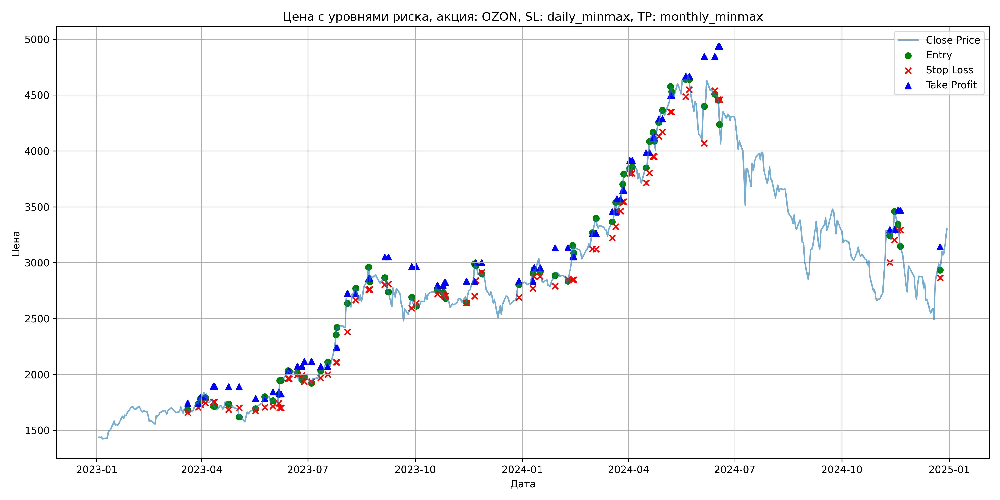
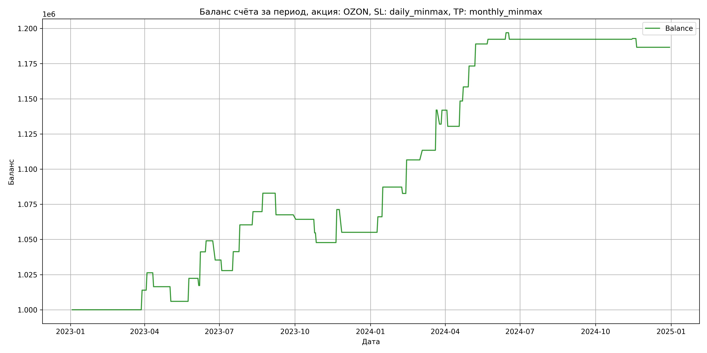

# Результаты торговой стратегии для OZON

**Дата:** 2025-05-17 12:22:30  
**Стратегия:** OZON,_SL_daily_minmax,_TP_monthly_minmax

## Конфигурация

```json
{
    "TICKER": "OZON",
    "EXCHANGE": "MOEX",
    "START_DATE": "2023-01-01",
    "END_DATE": "2024-12-31",
    "INTERVAL": "1d",
    "CAPITAL": 1000000,
    "RISK_PERCENT": 0.02,
    "PROFIT_TO_RISK": 3,
    "ATR_MULTIPLIER": 1.5,
    "ATR_WINDOW": 14,
    "STOP_LOSS_METHOD": "daily_minmax",
    "TAKE_PROFIT_METHOD": "monthly_minmax",
    "POSITION": "long"
}
```

## Метрики эффективности

- **Начальный баланс:** 1000000.00
- **Конечный баланс:** 1186613.50
- **Прибыль/Убыток:** 186613.50 (18.66% за период тестирования)
- **Количество сделок:** 38
- **Процент выигрышных сделок:** 60.53% (23 выигрышных, 15 убыточных)
- **Средняя прибыль:** 13977.48
- **Средний убыток:** -8991.23
- **Максимальная прибыль:** 28600.00
- **Максимальный убыток:** -16200.00
- **Коэффициент прибыли:** 2.38
- **Максимальная просадка:** -3.24%

## Графики

### График цены с уровнями риска



### График баланса счёта



## Завершённые сделки

**Всего сделок:** 77

| Сделка № | Дата | Тип | Покупка / продажа | Количество акций | Цена | Stop Loss в момент сделки | Take Profit в момент сделки | Прибыль / убыток | Прибыль / убыток с учётом комиссии |
|:--------:|:----:|:---:|:-----------------:|:----------------:|:----:|:-------------------------:|:---------------------------:|:----------------:|:----------------------------------:|
| 1 | 2023-03-20 00:00:00 | LONG | BUY | 236 | 1690.00 | 1657.50 | 1743.76 | 0.00 | -199.42 |
| 2 | 2023-03-29 00:00:00 | LONG | SELL | -236 | 1749.00 | 1705.20 | 1743.76 | 13924.00 | 13518.20 |
| 3 | 2023-03-31 00:00:00 | LONG | BUY | 250 | 1793.50 | 1731.50 | 1799.67 | 0.00 | -224.19 |
| 4 | 2023-04-04 00:00:00 | LONG | SELL | -250 | 1843.00 | 1745.38 | 1799.67 | 12375.00 | 11920.44 |
| 5 | 2023-04-11 00:00:00 | LONG | BUY | 204 | 1775.50 | 1753.50 | 1897.55 | 0.00 | -181.10 |
| 6 | 2023-04-12 00:00:00 | LONG | SELL | -204 | 1727.00 | 1753.50 | 1897.55 | -9894.00 | -10251.25 |
| 7 | 2023-04-24 00:00:00 | LONG | BUY | 171 | 1752.50 | 1685.00 | 1890.00 | 0.00 | -149.84 |
| 8 | 2023-05-03 00:00:00 | LONG | SELL | -171 | 1691.50 | 1701.28 | 1890.00 | -10431.00 | -10725.46 |
| 9 | 2023-05-17 00:00:00 | LONG | BUY | 175 | 1711.00 | 1675.00 | 1786.06 | 0.00 | -149.71 |
| 10 | 2023-05-25 00:00:00 | LONG | SELL | -175 | 1804.50 | 1707.16 | 1786.06 | 16362.50 | 16054.89 |
| 11 | 2023-06-01 00:00:00 | LONG | BUY | 218 | 1763.50 | 1717.00 | 1843.44 | 0.00 | -192.22 |
| 12 | 2023-06-06 00:00:00 | LONG | SELL | -218 | 1740.00 | 1744.40 | 1843.44 | -5123.00 | -5504.88 |
| 13 | 2023-06-07 00:00:00 | LONG | BUY | 198 | 1826.00 | 1701.00 | 1826.74 | 0.00 | -180.77 |
| 14 | 2023-06-08 00:00:00 | LONG | SELL | -198 | 1947.00 | 1701.00 | 1826.74 | 23958.00 | 23584.47 |
| 15 | 2023-06-14 00:00:00 | LONG | BUY | 187 | 2005.00 | 1964.00 | 2026.35 | 0.00 | -187.47 |
| 16 | 2023-06-15 00:00:00 | LONG | SELL | -187 | 2047.00 | 1964.00 | 2026.35 | 7854.00 | 7475.14 |
| 17 | 2023-06-22 00:00:00 | LONG | BUY | 191 | 2043.50 | 1995.50 | 2074.73 | 0.00 | -195.15 |
| 18 | 2023-06-26 00:00:00 | LONG | SELL | -191 | 1972.00 | 1995.50 | 2074.73 | -13656.50 | -14039.98 |
| 19 | 2023-06-28 00:00:00 | LONG | BUY | 173 | 1980.00 | 1938.00 | 2117.89 | 0.00 | -171.27 |
| 20 | 2023-07-04 00:00:00 | LONG | SELL | -173 | 1936.50 | 1938.44 | 2117.89 | -7525.50 | -7864.28 |
| 21 | 2023-07-12 00:00:00 | LONG | BUY | 176 | 2043.50 | 1970.00 | 2072.36 | 0.00 | -179.83 |
| 22 | 2023-07-18 00:00:00 | LONG | SELL | -176 | 2120.00 | 1998.22 | 2072.36 | 13464.00 | 13097.61 |
| 23 | 2023-07-25 00:00:00 | LONG | BUY | 186 | 2247.50 | 2110.50 | 2239.71 | 0.00 | -209.02 |
| 24 | 2023-07-26 00:00:00 | LONG | SELL | -186 | 2350.00 | 2110.50 | 2239.71 | 19065.00 | 18637.43 |
| 25 | 2023-08-04 00:00:00 | LONG | BUY | 140 | 2708.00 | 2380.50 | 2726.67 | 0.00 | -189.56 |
| 26 | 2023-08-11 00:00:00 | LONG | SELL | -140 | 2775.00 | 2665.60 | 2726.67 | 9380.00 | 8996.19 |
| 27 | 2023-08-22 00:00:00 | LONG | BUY | 101 | 2849.00 | 2759.50 | 2859.92 | 0.00 | -143.87 |
| 28 | 2023-08-23 00:00:00 | LONG | SELL | -101 | 2979.00 | 2759.50 | 2859.92 | 13130.00 | 12835.69 |
| 29 | 2023-09-05 00:00:00 | LONG | BUY | 127 | 2867.00 | 2802.00 | 3051.22 | 0.00 | -182.05 |
| 30 | 2023-09-08 00:00:00 | LONG | SELL | -127 | 2746.00 | 2808.19 | 3051.22 | -15367.00 | -15723.43 |
| 31 | 2023-09-28 00:00:00 | LONG | BUY | 92 | 2675.00 | 2593.00 | 2967.19 | 0.00 | -123.05 |
| 32 | 2023-10-02 00:00:00 | LONG | SELL | -92 | 2640.00 | 2637.18 | 2967.19 | -3220.00 | -3464.49 |
| 33 | 2023-10-20 00:00:00 | LONG | BUY | 149 | 2784.00 | 2717.50 | 2800.32 | 0.00 | -207.41 |
| 34 | 2023-10-25 00:00:00 | LONG | SELL | -149 | 2719.50 | 2717.50 | 2800.32 | -9610.50 | -10020.51 |
| 35 | 2023-10-26 00:00:00 | LONG | BUY | 157 | 2734.00 | 2705.00 | 2820.62 | 0.00 | -214.62 |
| 36 | 2023-10-27 00:00:00 | LONG | SELL | -157 | 2690.00 | 2705.00 | 2820.62 | -6908.00 | -7333.78 |
| 37 | 2023-11-14 00:00:00 | LONG | BUY | 154 | 2700.00 | 2640.50 | 2835.81 | 0.00 | -207.90 |
| 38 | 2023-11-21 00:00:00 | LONG | SELL | -154 | 2852.50 | 2700.88 | 2835.81 | 23485.00 | 23057.46 |
| 39 | 2023-11-22 00:00:00 | LONG | BUY | 150 | 2998.00 | 2843.50 | 3000.46 | 0.00 | -224.85 |
| 40 | 2023-11-27 00:00:00 | LONG | SELL | -150 | 2890.00 | 2915.50 | 3000.46 | -16200.00 | -16641.60 |
| 41 | 2023-12-29 00:00:00 | LONG | BUY | 139 | 2800.50 | 2690.00 | 2837.36 | 0.00 | -194.63 |
| 42 | 2024-01-10 00:00:00 | LONG | SELL | -139 | 2880.00 | 2768.99 | 2837.36 | 11050.50 | 10655.71 |
| 43 | 2024-01-11 00:00:00 | LONG | BUY | 165 | 2907.00 | 2875.00 | 2957.74 | 0.00 | -239.83 |
| 44 | 2024-01-16 00:00:00 | LONG | SELL | -165 | 3035.00 | 2879.73 | 2957.74 | 21120.00 | 20629.78 |
| 45 | 2024-01-29 00:00:00 | LONG | BUY | 128 | 2849.50 | 2791.50 | 3134.38 | 0.00 | -182.37 |
| 46 | 2024-02-09 00:00:00 | LONG | SELL | -128 | 2814.00 | 2853.27 | 3134.38 | -4544.00 | -4906.46 |
| 47 | 2024-02-13 00:00:00 | LONG | BUY | 151 | 2996.00 | 2847.50 | 3052.14 | 0.00 | -226.20 |
| 48 | 2024-02-14 00:00:00 | LONG | SELL | -151 | 3154.00 | 2847.50 | 3052.14 | 23858.00 | 23393.67 |
| 49 | 2024-03-01 00:00:00 | LONG | BUY | 128 | 3233.00 | 3122.50 | 3263.67 | 0.00 | -206.91 |
| 50 | 2024-03-04 00:00:00 | LONG | SELL | -128 | 3286.50 | 3122.50 | 3263.67 | 6848.00 | 6430.75 |
| 51 | 2024-03-18 00:00:00 | LONG | BUY | 143 | 3300.00 | 3222.00 | 3456.96 | 0.00 | -235.95 |
| 52 | 2024-03-21 00:00:00 | LONG | SELL | -143 | 3500.00 | 3322.20 | 3456.96 | 28600.00 | 28113.80 |
| 53 | 2024-03-22 00:00:00 | LONG | BUY | 140 | 3541.00 | 3461.00 | 3571.10 | 0.00 | -247.87 |
| 54 | 2024-03-25 00:00:00 | LONG | SELL | -140 | 3469.50 | 3461.00 | 3571.10 | -10010.00 | -10500.74 |
| 55 | 2024-03-27 00:00:00 | LONG | BUY | 134 | 3633.00 | 3545.00 | 3648.29 | 0.00 | -243.41 |
| 56 | 2024-03-28 00:00:00 | LONG | SELL | -134 | 3707.00 | 3545.00 | 3648.29 | 9916.00 | 9424.22 |
| 57 | 2024-04-02 00:00:00 | LONG | BUY | 129 | 3875.00 | 3800.00 | 3916.48 | 0.00 | -249.94 |
| 58 | 2024-04-04 00:00:00 | LONG | SELL | -129 | 3786.00 | 3800.00 | 3916.48 | -11481.00 | -11975.13 |
| 59 | 2024-04-16 00:00:00 | LONG | BUY | 120 | 3850.00 | 3713.50 | 3984.88 | 0.00 | -231.00 |
| 60 | 2024-04-19 00:00:00 | LONG | SELL | -120 | 4000.00 | 3804.85 | 3984.88 | 18000.00 | 17529.00 |
| 61 | 2024-04-22 00:00:00 | LONG | BUY | 118 | 4100.00 | 3951.00 | 4121.58 | 0.00 | -241.90 |
| 62 | 2024-04-23 00:00:00 | LONG | SELL | -118 | 4185.00 | 3951.00 | 4121.58 | 10030.00 | 9541.18 |
| 63 | 2024-04-27 00:00:00 | LONG | BUY | 110 | 4228.00 | 4131.50 | 4287.98 | 0.00 | -232.54 |
| 64 | 2024-04-30 00:00:00 | LONG | SELL | -110 | 4363.00 | 4171.37 | 4287.98 | 14850.00 | 14377.50 |
| 65 | 2024-05-07 00:00:00 | LONG | BUY | 112 | 4445.00 | 4350.00 | 4496.37 | 0.00 | -248.92 |
| 66 | 2024-05-08 00:00:00 | LONG | SELL | -112 | 4585.00 | 4350.00 | 4496.37 | 15680.00 | 15174.32 |
| 67 | 2024-05-20 00:00:00 | LONG | BUY | 111 | 4650.00 | 4485.00 | 4670.69 | 0.00 | -258.07 |
| 68 | 2024-05-23 00:00:00 | LONG | SELL | -111 | 4680.00 | 4549.16 | 4670.69 | 3330.00 | 2812.18 |
| 69 | 2024-06-05 00:00:00 | LONG | BUY | 63 | 4443.50 | 4069.00 | 4847.00 | 0.00 | -139.97 |
| 70 | 2024-06-14 00:00:00 | LONG | SELL | -63 | 4517.50 | 4538.38 | 4847.00 | 4662.00 | 4379.73 |
| 71 | 2024-06-17 00:00:00 | LONG | BUY | 68 | 4506.00 | 4460.00 | 4936.44 | 0.00 | -153.20 |
| 72 | 2024-06-18 00:00:00 | LONG | SELL | -68 | 4437.50 | 4460.00 | 4936.44 | -4658.00 | -4962.08 |
| 73 | 2024-11-11 00:00:00 | LONG | BUY | 90 | 3306.00 | 3000.50 | 3296.66 | 0.00 | -148.77 |
| 74 | 2024-11-15 00:00:00 | LONG | SELL | -90 | 3312.00 | 3203.13 | 3296.66 | 540.00 | 242.19 |
| 75 | 2024-11-18 00:00:00 | LONG | BUY | 104 | 3310.00 | 3292.50 | 3470.88 | 0.00 | -172.12 |
| 76 | 2024-11-20 00:00:00 | LONG | SELL | -104 | 3250.00 | 3292.50 | 3470.88 | -6240.00 | -6581.12 |
| 77 | 2024-12-24 00:00:00 | LONG | BUY | 68 | 2991.00 | 2865.00 | 3143.38 | 0.00 | -101.69 |
