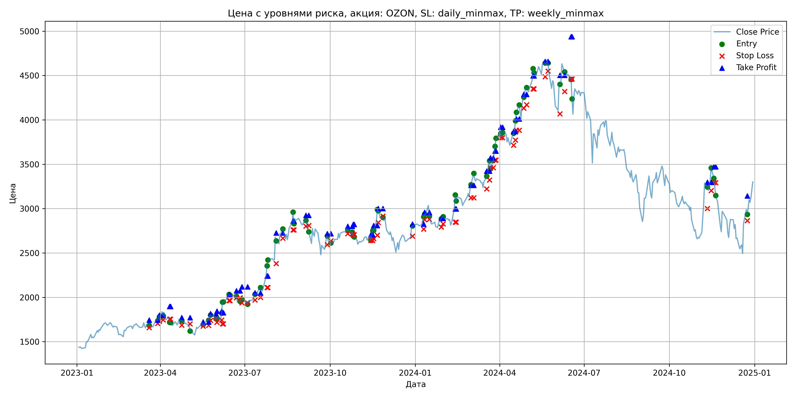
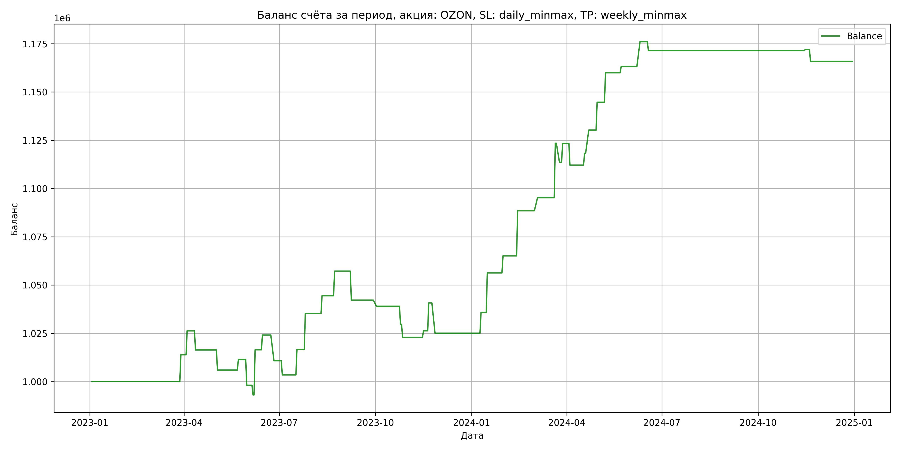

# Результаты торговой стратегии для OZON

**Дата:** 2025-05-17 12:22:28  
**Стратегия:** OZON,_SL_daily_minmax,_TP_weekly_minmax

## Конфигурация

```json
{
    "TICKER": "OZON",
    "EXCHANGE": "MOEX",
    "START_DATE": "2023-01-01",
    "END_DATE": "2024-12-31",
    "INTERVAL": "1d",
    "CAPITAL": 1000000,
    "RISK_PERCENT": 0.02,
    "PROFIT_TO_RISK": 3,
    "ATR_MULTIPLIER": 1.5,
    "ATR_WINDOW": 14,
    "STOP_LOSS_METHOD": "daily_minmax",
    "TAKE_PROFIT_METHOD": "weekly_minmax",
    "POSITION": "long"
}
```

## Метрики эффективности

- **Начальный баланс:** 1000000.00
- **Конечный баланс:** 1165868.00
- **Прибыль/Убыток:** 165868.00 (16.59% за период тестирования)
- **Количество сделок:** 40
- **Процент выигрышных сделок:** 62.50% (25 выигрышных, 15 убыточных)
- **Средняя прибыль:** 12277.16
- **Средний убыток:** -9404.07
- **Максимальная прибыль:** 28200.00
- **Максимальный убыток:** -15660.00
- **Коэффициент прибыли:** 2.18
- **Максимальная просадка:** -3.24%

## Графики

### График цены с уровнями риска



### График баланса счёта



## Завершённые сделки

**Всего сделок:** 81

| Сделка № | Дата | Тип | Покупка / продажа | Количество акций | Цена | Stop Loss в момент сделки | Take Profit в момент сделки | Прибыль / убыток | Прибыль / убыток с учётом комиссии |
|:--------:|:----:|:---:|:-----------------:|:----------------:|:----:|:-------------------------:|:---------------------------:|:----------------:|:----------------------------------:|
| 1 | 2023-03-20 00:00:00 | LONG | BUY | 236 | 1690.00 | 1657.50 | 1743.76 | 0.00 | -199.42 |
| 2 | 2023-03-29 00:00:00 | LONG | SELL | -236 | 1749.00 | 1705.20 | 1743.76 | 13924.00 | 13518.20 |
| 3 | 2023-03-31 00:00:00 | LONG | BUY | 250 | 1793.50 | 1731.50 | 1799.67 | 0.00 | -224.19 |
| 4 | 2023-04-04 00:00:00 | LONG | SELL | -250 | 1843.00 | 1745.38 | 1799.67 | 12375.00 | 11920.44 |
| 5 | 2023-04-11 00:00:00 | LONG | BUY | 204 | 1775.50 | 1753.50 | 1897.55 | 0.00 | -181.10 |
| 6 | 2023-04-12 00:00:00 | LONG | SELL | -204 | 1727.00 | 1753.50 | 1897.55 | -9894.00 | -10251.25 |
| 7 | 2023-04-24 00:00:00 | LONG | BUY | 171 | 1752.50 | 1685.00 | 1771.06 | 0.00 | -149.84 |
| 8 | 2023-05-03 00:00:00 | LONG | SELL | -171 | 1691.50 | 1701.28 | 1771.06 | -10431.00 | -10725.46 |
| 9 | 2023-05-17 00:00:00 | LONG | BUY | 175 | 1711.00 | 1675.00 | 1722.81 | 0.00 | -149.71 |
| 10 | 2023-05-23 00:00:00 | LONG | SELL | -175 | 1742.50 | 1683.15 | 1722.81 | 5512.50 | 5210.32 |
| 11 | 2023-05-25 00:00:00 | LONG | BUY | 221 | 1804.50 | 1739.50 | 1815.85 | 0.00 | -199.40 |
| 12 | 2023-05-31 00:00:00 | LONG | SELL | -221 | 1744.00 | 1767.43 | 1815.85 | -13370.50 | -13762.61 |
| 13 | 2023-06-01 00:00:00 | LONG | BUY | 212 | 1763.50 | 1717.00 | 1843.44 | 0.00 | -186.93 |
| 14 | 2023-06-06 00:00:00 | LONG | SELL | -212 | 1740.00 | 1744.40 | 1843.44 | -4982.00 | -5353.37 |
| 15 | 2023-06-07 00:00:00 | LONG | BUY | 193 | 1826.00 | 1701.00 | 1826.74 | 0.00 | -176.21 |
| 16 | 2023-06-08 00:00:00 | LONG | SELL | -193 | 1947.00 | 1701.00 | 1826.74 | 23353.00 | 22988.91 |
| 17 | 2023-06-14 00:00:00 | LONG | BUY | 182 | 2005.00 | 1964.00 | 2026.35 | 0.00 | -182.45 |
| 18 | 2023-06-15 00:00:00 | LONG | SELL | -182 | 2047.00 | 1964.00 | 2026.35 | 7644.00 | 7275.27 |
| 19 | 2023-06-22 00:00:00 | LONG | BUY | 186 | 2043.50 | 1995.50 | 2074.73 | 0.00 | -190.05 |
| 20 | 2023-06-26 00:00:00 | LONG | SELL | -186 | 1972.00 | 1995.50 | 2074.73 | -13299.00 | -13672.44 |
| 21 | 2023-06-28 00:00:00 | LONG | BUY | 169 | 1980.00 | 1938.00 | 2117.89 | 0.00 | -167.31 |
| 22 | 2023-07-04 00:00:00 | LONG | SELL | -169 | 1936.50 | 1938.44 | 2117.89 | -7351.50 | -7682.44 |
| 23 | 2023-07-12 00:00:00 | LONG | BUY | 172 | 2043.50 | 1970.00 | 2050.71 | 0.00 | -175.74 |
| 24 | 2023-07-18 00:00:00 | LONG | SELL | -172 | 2120.00 | 1998.22 | 2050.71 | 13158.00 | 12799.94 |
| 25 | 2023-07-25 00:00:00 | LONG | BUY | 182 | 2247.50 | 2110.50 | 2239.71 | 0.00 | -204.52 |
| 26 | 2023-07-26 00:00:00 | LONG | SELL | -182 | 2350.00 | 2110.50 | 2239.71 | 18655.00 | 18236.63 |
| 27 | 2023-08-04 00:00:00 | LONG | BUY | 137 | 2708.00 | 2380.50 | 2726.67 | 0.00 | -185.50 |
| 28 | 2023-08-11 00:00:00 | LONG | SELL | -137 | 2775.00 | 2665.60 | 2726.67 | 9179.00 | 8803.41 |
| 29 | 2023-08-22 00:00:00 | LONG | BUY | 98 | 2849.00 | 2759.50 | 2859.92 | 0.00 | -139.60 |
| 30 | 2023-08-23 00:00:00 | LONG | SELL | -98 | 2979.00 | 2759.50 | 2859.92 | 12740.00 | 12454.43 |
| 31 | 2023-09-05 00:00:00 | LONG | BUY | 124 | 2867.00 | 2802.00 | 2924.72 | 0.00 | -177.75 |
| 32 | 2023-09-08 00:00:00 | LONG | SELL | -124 | 2746.00 | 2808.19 | 2924.72 | -15004.00 | -15352.01 |
| 33 | 2023-09-28 00:00:00 | LONG | BUY | 90 | 2675.00 | 2593.00 | 2716.25 | 0.00 | -120.38 |
| 34 | 2023-10-02 00:00:00 | LONG | SELL | -90 | 2640.00 | 2637.18 | 2716.25 | -3150.00 | -3389.18 |
| 35 | 2023-10-20 00:00:00 | LONG | BUY | 145 | 2784.00 | 2717.50 | 2800.32 | 0.00 | -201.84 |
| 36 | 2023-10-25 00:00:00 | LONG | SELL | -145 | 2719.50 | 2717.50 | 2800.32 | -9352.50 | -9751.50 |
| 37 | 2023-10-26 00:00:00 | LONG | BUY | 154 | 2734.00 | 2705.00 | 2820.62 | 0.00 | -210.52 |
| 38 | 2023-10-27 00:00:00 | LONG | SELL | -154 | 2690.00 | 2705.00 | 2820.62 | -6776.00 | -7193.65 |
| 39 | 2023-11-14 00:00:00 | LONG | BUY | 151 | 2700.00 | 2640.50 | 2705.19 | 0.00 | -203.85 |
| 40 | 2023-11-16 00:00:00 | LONG | SELL | -151 | 2722.50 | 2640.50 | 2705.19 | 3397.50 | 2988.10 |
| 41 | 2023-11-17 00:00:00 | LONG | BUY | 156 | 2760.00 | 2662.00 | 2808.72 | 0.00 | -215.28 |
| 42 | 2023-11-21 00:00:00 | LONG | SELL | -156 | 2852.50 | 2700.88 | 2808.72 | 14430.00 | 13992.23 |
| 43 | 2023-11-22 00:00:00 | LONG | BUY | 145 | 2998.00 | 2843.50 | 3000.46 | 0.00 | -217.35 |
| 44 | 2023-11-27 00:00:00 | LONG | SELL | -145 | 2890.00 | 2915.50 | 3000.46 | -15660.00 | -16086.88 |
| 45 | 2023-12-29 00:00:00 | LONG | BUY | 135 | 2800.50 | 2690.00 | 2825.61 | 0.00 | -189.03 |
| 46 | 2024-01-10 00:00:00 | LONG | SELL | -135 | 2880.00 | 2768.99 | 2825.61 | 10732.50 | 10349.07 |
| 47 | 2024-01-11 00:00:00 | LONG | BUY | 160 | 2907.00 | 2875.00 | 2957.74 | 0.00 | -232.56 |
| 48 | 2024-01-16 00:00:00 | LONG | SELL | -160 | 3035.00 | 2879.73 | 2957.74 | 20480.00 | 20004.64 |
| 49 | 2024-01-29 00:00:00 | LONG | BUY | 125 | 2849.50 | 2791.50 | 2889.62 | 0.00 | -178.09 |
| 50 | 2024-01-31 00:00:00 | LONG | SELL | -125 | 2920.00 | 2828.28 | 2889.62 | 8812.50 | 8451.91 |
| 51 | 2024-02-13 00:00:00 | LONG | BUY | 148 | 2996.00 | 2847.50 | 2997.35 | 0.00 | -221.70 |
| 52 | 2024-02-14 00:00:00 | LONG | SELL | -148 | 3154.00 | 2847.50 | 2997.35 | 23384.00 | 22928.90 |
| 53 | 2024-03-01 00:00:00 | LONG | BUY | 126 | 3233.00 | 3122.50 | 3263.67 | 0.00 | -203.68 |
| 54 | 2024-03-04 00:00:00 | LONG | SELL | -126 | 3286.50 | 3122.50 | 3263.67 | 6741.00 | 6330.27 |
| 55 | 2024-03-18 00:00:00 | LONG | BUY | 141 | 3300.00 | 3222.00 | 3422.18 | 0.00 | -232.65 |
| 56 | 2024-03-21 00:00:00 | LONG | SELL | -141 | 3500.00 | 3322.20 | 3422.18 | 28200.00 | 27720.60 |
| 57 | 2024-03-22 00:00:00 | LONG | BUY | 138 | 3541.00 | 3461.00 | 3571.10 | 0.00 | -244.33 |
| 58 | 2024-03-25 00:00:00 | LONG | SELL | -138 | 3469.50 | 3461.00 | 3571.10 | -9867.00 | -10350.72 |
| 59 | 2024-03-27 00:00:00 | LONG | BUY | 132 | 3633.00 | 3545.00 | 3648.29 | 0.00 | -239.78 |
| 60 | 2024-03-28 00:00:00 | LONG | SELL | -132 | 3707.00 | 3545.00 | 3648.29 | 9768.00 | 9283.56 |
| 61 | 2024-04-02 00:00:00 | LONG | BUY | 126 | 3875.00 | 3800.00 | 3916.48 | 0.00 | -244.12 |
| 62 | 2024-04-04 00:00:00 | LONG | SELL | -126 | 3786.00 | 3800.00 | 3916.48 | -11214.00 | -11696.64 |
| 63 | 2024-04-16 00:00:00 | LONG | BUY | 118 | 3850.00 | 3713.50 | 3868.66 | 0.00 | -227.15 |
| 64 | 2024-04-18 00:00:00 | LONG | SELL | -118 | 3902.00 | 3771.04 | 3868.66 | 6136.00 | 5678.63 |
| 65 | 2024-04-19 00:00:00 | LONG | BUY | 120 | 4000.00 | 3883.50 | 4010.64 | 0.00 | -240.00 |
| 66 | 2024-04-22 00:00:00 | LONG | SELL | -120 | 4100.00 | 3883.50 | 4010.64 | 12000.00 | 11514.00 |
| 67 | 2024-04-27 00:00:00 | LONG | BUY | 107 | 4228.00 | 4131.50 | 4287.98 | 0.00 | -226.20 |
| 68 | 2024-04-30 00:00:00 | LONG | SELL | -107 | 4363.00 | 4171.37 | 4287.98 | 14445.00 | 13985.38 |
| 69 | 2024-05-07 00:00:00 | LONG | BUY | 109 | 4445.00 | 4350.00 | 4496.37 | 0.00 | -242.25 |
| 70 | 2024-05-08 00:00:00 | LONG | SELL | -109 | 4585.00 | 4350.00 | 4496.37 | 15260.00 | 14767.86 |
| 71 | 2024-05-20 00:00:00 | LONG | BUY | 108 | 4650.00 | 4485.00 | 4658.60 | 0.00 | -251.10 |
| 72 | 2024-05-23 00:00:00 | LONG | SELL | -108 | 4680.00 | 4549.16 | 4658.60 | 3240.00 | 2736.18 |
| 73 | 2024-06-05 00:00:00 | LONG | BUY | 62 | 4443.50 | 4069.00 | 4502.56 | 0.00 | -137.75 |
| 74 | 2024-06-10 00:00:00 | LONG | SELL | -62 | 4650.50 | 4319.84 | 4502.56 | 12834.00 | 12552.09 |
| 75 | 2024-06-17 00:00:00 | LONG | BUY | 67 | 4506.00 | 4460.00 | 4936.44 | 0.00 | -150.95 |
| 76 | 2024-06-18 00:00:00 | LONG | SELL | -67 | 4437.50 | 4460.00 | 4936.44 | -4589.50 | -4889.11 |
| 77 | 2024-11-11 00:00:00 | LONG | BUY | 88 | 3306.00 | 3000.50 | 3296.66 | 0.00 | -145.46 |
| 78 | 2024-11-15 00:00:00 | LONG | SELL | -88 | 3312.00 | 3203.13 | 3296.66 | 528.00 | 236.81 |
| 79 | 2024-11-18 00:00:00 | LONG | BUY | 102 | 3310.00 | 3292.50 | 3470.88 | 0.00 | -168.81 |
| 80 | 2024-11-20 00:00:00 | LONG | SELL | -102 | 3250.00 | 3292.50 | 3470.88 | -6120.00 | -6454.56 |
| 81 | 2024-12-24 00:00:00 | LONG | BUY | 67 | 2991.00 | 2865.00 | 3143.38 | 0.00 | -100.20 |
