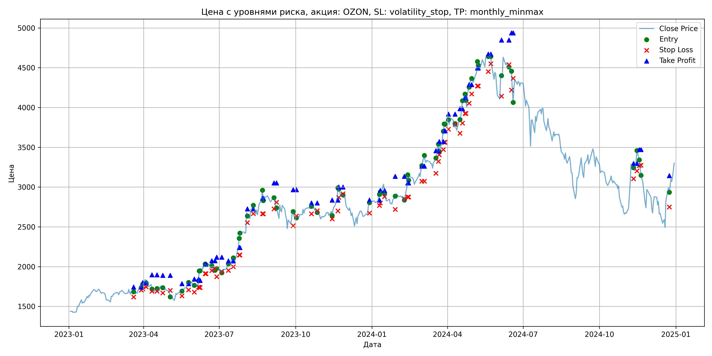
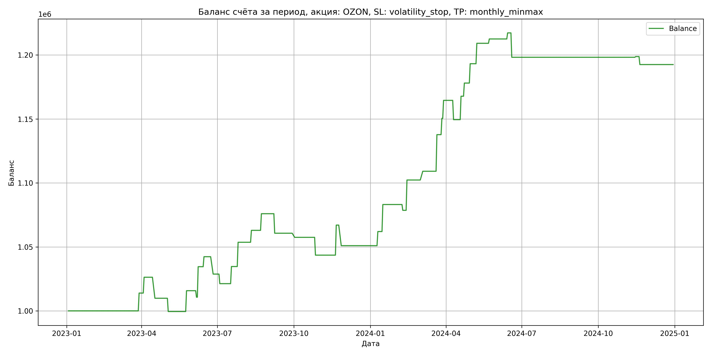

# Результаты торговой стратегии для OZON

**Дата:** 2025-05-17 12:22:34  
**Стратегия:** OZON,_SL_volatility_stop,_TP_monthly_minmax

## Конфигурация

```json
{
    "TICKER": "OZON",
    "EXCHANGE": "MOEX",
    "START_DATE": "2023-01-01",
    "END_DATE": "2024-12-31",
    "INTERVAL": "1d",
    "CAPITAL": 1000000,
    "RISK_PERCENT": 0.02,
    "PROFIT_TO_RISK": 3,
    "ATR_MULTIPLIER": 1.5,
    "ATR_WINDOW": 14,
    "STOP_LOSS_METHOD": "volatility_stop",
    "TAKE_PROFIT_METHOD": "monthly_minmax",
    "POSITION": "long"
}
```

## Метрики эффективности

- **Начальный баланс:** 1000000.00
- **Конечный баланс:** 1192518.50
- **Прибыль/Убыток:** 192518.50 (19.25% за период тестирования)
- **Количество сделок:** 37
- **Процент выигрышных сделок:** 64.86% (24 выигрышных, 13 убыточных)
- **Средняя прибыль:** 14117.35
- **Средний убыток:** -11253.69
- **Максимальная прибыль:** 28600.00
- **Максимальный убыток:** -19044.00
- **Коэффициент прибыли:** 2.32
- **Максимальная просадка:** -3.01%

## Графики

### График цены с уровнями риска



### График баланса счёта



## Завершённые сделки

**Всего сделок:** 75

| Сделка № | Дата | Тип | Покупка / продажа | Количество акций | Цена | Stop Loss в момент сделки | Take Profit в момент сделки | Прибыль / убыток | Прибыль / убыток с учётом комиссии |
|:--------:|:----:|:---:|:-----------------:|:----------------:|:----:|:-------------------------:|:---------------------------:|:----------------:|:----------------------------------:|
| 1 | 2023-03-20 00:00:00 | LONG | BUY | 236 | 1690.00 | 1618.82 | 1743.76 | 0.00 | -199.42 |
| 2 | 2023-03-29 00:00:00 | LONG | SELL | -236 | 1749.00 | 1705.20 | 1743.76 | 13924.00 | 13518.20 |
| 3 | 2023-03-31 00:00:00 | LONG | BUY | 250 | 1793.50 | 1721.00 | 1799.67 | 0.00 | -224.19 |
| 4 | 2023-04-04 00:00:00 | LONG | SELL | -250 | 1843.00 | 1745.38 | 1799.67 | 12375.00 | 11920.44 |
| 5 | 2023-04-11 00:00:00 | LONG | BUY | 204 | 1775.50 | 1690.63 | 1897.55 | 0.00 | -181.10 |
| 6 | 2023-04-17 00:00:00 | LONG | SELL | -204 | 1695.00 | 1690.63 | 1897.55 | -16422.00 | -16775.99 |
| 7 | 2023-04-24 00:00:00 | LONG | BUY | 170 | 1752.50 | 1669.50 | 1890.00 | 0.00 | -148.96 |
| 8 | 2023-05-03 00:00:00 | LONG | SELL | -170 | 1691.50 | 1701.28 | 1890.00 | -10370.00 | -10662.74 |
| 9 | 2023-05-17 00:00:00 | LONG | BUY | 174 | 1711.00 | 1632.28 | 1786.06 | 0.00 | -148.86 |
| 10 | 2023-05-25 00:00:00 | LONG | SELL | -174 | 1804.50 | 1707.16 | 1786.06 | 16269.00 | 15963.15 |
| 11 | 2023-06-01 00:00:00 | LONG | BUY | 216 | 1763.50 | 1678.91 | 1843.44 | 0.00 | -190.46 |
| 12 | 2023-06-06 00:00:00 | LONG | SELL | -216 | 1740.00 | 1744.40 | 1843.44 | -5076.00 | -5454.38 |
| 13 | 2023-06-07 00:00:00 | LONG | BUY | 197 | 1826.00 | 1736.17 | 1826.74 | 0.00 | -179.86 |
| 14 | 2023-06-08 00:00:00 | LONG | SELL | -197 | 1947.00 | 1736.17 | 1826.74 | 23837.00 | 23465.36 |
| 15 | 2023-06-14 00:00:00 | LONG | BUY | 186 | 2005.00 | 1911.87 | 2026.35 | 0.00 | -186.47 |
| 16 | 2023-06-15 00:00:00 | LONG | SELL | -186 | 2047.00 | 1911.87 | 2026.35 | 7812.00 | 7435.16 |
| 17 | 2023-06-22 00:00:00 | LONG | BUY | 190 | 2043.50 | 1950.17 | 2074.73 | 0.00 | -194.13 |
| 18 | 2023-06-26 00:00:00 | LONG | SELL | -190 | 1972.00 | 1971.76 | 2074.73 | -13585.00 | -13966.47 |
| 19 | 2023-06-28 00:00:00 | LONG | BUY | 172 | 1980.00 | 1873.92 | 2117.89 | 0.00 | -170.28 |
| 20 | 2023-07-04 00:00:00 | LONG | SELL | -172 | 1936.50 | 1938.44 | 2117.89 | -7482.00 | -7818.82 |
| 21 | 2023-07-12 00:00:00 | LONG | BUY | 175 | 2043.50 | 1952.93 | 2072.36 | 0.00 | -178.81 |
| 22 | 2023-07-18 00:00:00 | LONG | SELL | -175 | 2120.00 | 1998.22 | 2072.36 | 13387.50 | 13023.19 |
| 23 | 2023-07-25 00:00:00 | LONG | BUY | 185 | 2247.50 | 2145.61 | 2239.71 | 0.00 | -207.89 |
| 24 | 2023-07-26 00:00:00 | LONG | SELL | -185 | 2350.00 | 2145.61 | 2239.71 | 18962.50 | 18537.23 |
| 25 | 2023-08-04 00:00:00 | LONG | BUY | 139 | 2708.00 | 2552.81 | 2726.67 | 0.00 | -188.21 |
| 26 | 2023-08-11 00:00:00 | LONG | SELL | -139 | 2775.00 | 2665.60 | 2726.67 | 9313.00 | 8931.93 |
| 27 | 2023-08-22 00:00:00 | LONG | BUY | 100 | 2849.00 | 2663.19 | 2859.92 | 0.00 | -142.45 |
| 28 | 2023-08-23 00:00:00 | LONG | SELL | -100 | 2979.00 | 2663.19 | 2859.92 | 13000.00 | 12708.60 |
| 29 | 2023-09-05 00:00:00 | LONG | BUY | 126 | 2867.00 | 2724.76 | 3051.22 | 0.00 | -180.62 |
| 30 | 2023-09-08 00:00:00 | LONG | SELL | -126 | 2746.00 | 2808.19 | 3051.22 | -15246.00 | -15599.62 |
| 31 | 2023-09-28 00:00:00 | LONG | BUY | 92 | 2675.00 | 2515.02 | 2967.19 | 0.00 | -123.05 |
| 32 | 2023-10-02 00:00:00 | LONG | SELL | -92 | 2640.00 | 2637.18 | 2967.19 | -3220.00 | -3464.49 |
| 33 | 2023-10-20 00:00:00 | LONG | BUY | 148 | 2784.00 | 2663.93 | 2800.32 | 0.00 | -206.02 |
| 34 | 2023-10-27 00:00:00 | LONG | SELL | -148 | 2690.00 | 2701.86 | 2800.32 | -13912.00 | -14317.08 |
| 35 | 2023-11-14 00:00:00 | LONG | BUY | 154 | 2700.00 | 2599.38 | 2835.81 | 0.00 | -207.90 |
| 36 | 2023-11-21 00:00:00 | LONG | SELL | -154 | 2852.50 | 2700.88 | 2835.81 | 23485.00 | 23057.46 |
| 37 | 2023-11-22 00:00:00 | LONG | BUY | 149 | 2998.00 | 2871.31 | 3000.46 | 0.00 | -223.35 |
| 38 | 2023-11-27 00:00:00 | LONG | SELL | -149 | 2890.00 | 2915.50 | 3000.46 | -16092.00 | -16530.66 |
| 39 | 2023-12-29 00:00:00 | LONG | BUY | 139 | 2800.50 | 2673.27 | 2837.36 | 0.00 | -194.63 |
| 40 | 2024-01-10 00:00:00 | LONG | SELL | -139 | 2880.00 | 2768.99 | 2837.36 | 11050.50 | 10655.71 |
| 41 | 2024-01-11 00:00:00 | LONG | BUY | 165 | 2907.00 | 2799.70 | 2957.74 | 0.00 | -239.83 |
| 42 | 2024-01-16 00:00:00 | LONG | SELL | -165 | 3035.00 | 2879.73 | 2957.74 | 21120.00 | 20629.78 |
| 43 | 2024-01-29 00:00:00 | LONG | BUY | 128 | 2849.50 | 2718.91 | 3134.38 | 0.00 | -182.37 |
| 44 | 2024-02-09 00:00:00 | LONG | SELL | -128 | 2814.00 | 2853.27 | 3134.38 | -4544.00 | -4906.46 |
| 45 | 2024-02-13 00:00:00 | LONG | BUY | 150 | 2996.00 | 2875.28 | 3052.14 | 0.00 | -224.70 |
| 46 | 2024-02-14 00:00:00 | LONG | SELL | -150 | 3154.00 | 2875.28 | 3052.14 | 23700.00 | 23238.75 |
| 47 | 2024-03-01 00:00:00 | LONG | BUY | 128 | 3233.00 | 3072.61 | 3263.67 | 0.00 | -206.91 |
| 48 | 2024-03-04 00:00:00 | LONG | SELL | -128 | 3286.50 | 3072.61 | 3263.67 | 6848.00 | 6430.75 |
| 49 | 2024-03-18 00:00:00 | LONG | BUY | 143 | 3300.00 | 3173.07 | 3456.96 | 0.00 | -235.95 |
| 50 | 2024-03-21 00:00:00 | LONG | SELL | -143 | 3500.00 | 3322.20 | 3456.96 | 28600.00 | 28113.80 |
| 51 | 2024-03-22 00:00:00 | LONG | BUY | 139 | 3541.00 | 3405.12 | 3571.10 | 0.00 | -246.10 |
| 52 | 2024-03-27 00:00:00 | LONG | SELL | -139 | 3633.00 | 3471.65 | 3571.10 | 12788.00 | 12289.41 |
| 53 | 2024-03-28 00:00:00 | LONG | BUY | 136 | 3707.00 | 3562.40 | 3706.06 | 0.00 | -252.08 |
| 54 | 2024-03-29 00:00:00 | LONG | SELL | -136 | 3810.00 | 3562.40 | 3706.06 | 14008.00 | 13496.84 |
| 55 | 2024-04-02 00:00:00 | LONG | BUY | 131 | 3875.00 | 3727.43 | 3916.48 | 0.00 | -253.81 |
| 56 | 2024-04-10 00:00:00 | LONG | SELL | -131 | 3760.00 | 3789.17 | 3916.48 | -15065.00 | -15565.09 |
| 57 | 2024-04-16 00:00:00 | LONG | BUY | 122 | 3850.00 | 3675.33 | 3984.88 | 0.00 | -234.85 |
| 58 | 2024-04-19 00:00:00 | LONG | SELL | -122 | 4000.00 | 3804.85 | 3984.88 | 18300.00 | 17821.15 |
| 59 | 2024-04-22 00:00:00 | LONG | BUY | 121 | 4100.00 | 3925.48 | 4121.58 | 0.00 | -248.05 |
| 60 | 2024-04-23 00:00:00 | LONG | SELL | -121 | 4185.00 | 3925.48 | 4121.58 | 10285.00 | 9783.76 |
| 61 | 2024-04-27 00:00:00 | LONG | BUY | 112 | 4228.00 | 4052.89 | 4287.98 | 0.00 | -236.77 |
| 62 | 2024-04-30 00:00:00 | LONG | SELL | -112 | 4363.00 | 4171.37 | 4287.98 | 15120.00 | 14638.90 |
| 63 | 2024-05-07 00:00:00 | LONG | BUY | 114 | 4445.00 | 4270.06 | 4496.37 | 0.00 | -253.37 |
| 64 | 2024-05-08 00:00:00 | LONG | SELL | -114 | 4585.00 | 4270.06 | 4496.37 | 15960.00 | 15445.29 |
| 65 | 2024-05-20 00:00:00 | LONG | BUY | 113 | 4650.00 | 4450.51 | 4670.69 | 0.00 | -262.73 |
| 66 | 2024-05-23 00:00:00 | LONG | SELL | -113 | 4680.00 | 4549.16 | 4670.69 | 3390.00 | 2862.86 |
| 67 | 2024-06-05 00:00:00 | LONG | BUY | 64 | 4443.50 | 4142.86 | 4847.00 | 0.00 | -142.19 |
| 68 | 2024-06-14 00:00:00 | LONG | SELL | -64 | 4517.50 | 4538.38 | 4847.00 | 4736.00 | 4449.25 |
| 69 | 2024-06-17 00:00:00 | LONG | BUY | 69 | 4506.00 | 4220.07 | 4936.44 | 0.00 | -155.46 |
| 70 | 2024-06-19 00:00:00 | LONG | SELL | -69 | 4230.00 | 4366.39 | 4936.44 | -19044.00 | -19345.39 |
| 71 | 2024-11-11 00:00:00 | LONG | BUY | 91 | 3306.00 | 3105.99 | 3296.66 | 0.00 | -150.42 |
| 72 | 2024-11-15 00:00:00 | LONG | SELL | -91 | 3312.00 | 3203.13 | 3296.66 | 546.00 | 244.88 |
| 73 | 2024-11-18 00:00:00 | LONG | BUY | 104 | 3310.00 | 3268.95 | 3470.88 | 0.00 | -172.12 |
| 74 | 2024-11-20 00:00:00 | LONG | SELL | -104 | 3250.00 | 3275.16 | 3470.88 | -6240.00 | -6581.12 |
| 75 | 2024-12-24 00:00:00 | LONG | BUY | 69 | 2991.00 | 2749.74 | 3143.38 | 0.00 | -103.19 |
