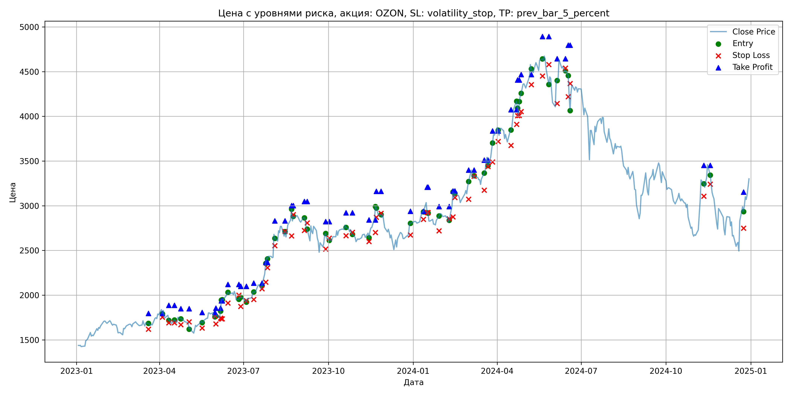

# Результаты торговой стратегии для OZON

**Дата:** 2025-05-17 12:22:33  
**Стратегия:** OZON,_SL_volatility_stop,_TP_prev_bar_5_percent

## Конфигурация

```json
{
    "TICKER": "OZON",
    "EXCHANGE": "MOEX",
    "START_DATE": "2023-01-01",
    "END_DATE": "2024-12-31",
    "INTERVAL": "1d",
    "CAPITAL": 1000000,
    "RISK_PERCENT": 0.02,
    "PROFIT_TO_RISK": 3,
    "ATR_MULTIPLIER": 1.5,
    "ATR_WINDOW": 14,
    "STOP_LOSS_METHOD": "volatility_stop",
    "TAKE_PROFIT_METHOD": "prev_bar_5_percent",
    "POSITION": "long"
}
```

## Метрики эффективности

- **Начальный баланс:** 1000000.00
- **Конечный баланс:** 1126802.00
- **Прибыль/Убыток:** 126802.00 (12.68% за период тестирования)
- **Количество сделок:** 31
- **Процент выигрышных сделок:** 48.39% (15 выигрышных, 16 убыточных)
- **Средняя прибыль:** 20162.47
- **Средний убыток:** -10977.19
- **Максимальная прибыль:** 37842.00
- **Максимальный убыток:** -19372.00
- **Коэффициент прибыли:** 1.72
- **Максимальная просадка:** -3.85%

## Графики

### График цены с уровнями риска



### График баланса счёта


## Завершённые сделки

**Всего сделок:** 63

| Сделка № | Дата | Тип | Покупка / продажа | Количество акций | Цена | Stop Loss в момент сделки | Take Profit в момент сделки | Прибыль / убыток | Прибыль / убыток с учётом комиссии |
|:--------:|:----:|:---:|:-----------------:|:----------------:|:----:|:-------------------------:|:---------------------------:|:----------------:|:----------------------------------:|
| 1 | 2023-03-20 00:00:00 | LONG | BUY | 236 | 1690.00 | 1618.82 | 1796.89 | 0.00 | -199.42 |
| 2 | 2023-04-04 00:00:00 | LONG | SELL | -236 | 1843.00 | 1753.22 | 1796.89 | 36108.00 | 35691.11 |
| 3 | 2023-04-11 00:00:00 | LONG | BUY | 206 | 1775.50 | 1690.63 | 1887.27 | 0.00 | -182.88 |
| 4 | 2023-04-17 00:00:00 | LONG | SELL | -206 | 1695.00 | 1690.63 | 1887.27 | -16583.00 | -16940.46 |
| 5 | 2023-04-24 00:00:00 | LONG | BUY | 171 | 1752.50 | 1669.50 | 1848.89 | 0.00 | -149.84 |
| 6 | 2023-05-03 00:00:00 | LONG | SELL | -171 | 1691.50 | 1701.28 | 1848.89 | -10431.00 | -10725.46 |
| 7 | 2023-05-17 00:00:00 | LONG | BUY | 175 | 1711.00 | 1632.28 | 1806.69 | 0.00 | -149.71 |
| 8 | 2023-05-31 00:00:00 | LONG | SELL | -175 | 1744.00 | 1767.43 | 1806.69 | 5775.00 | 5472.69 |
| 9 | 2023-06-01 00:00:00 | LONG | BUY | 216 | 1763.50 | 1678.91 | 1854.16 | 0.00 | -190.46 |
| 10 | 2023-06-06 00:00:00 | LONG | SELL | -216 | 1740.00 | 1744.40 | 1854.16 | -5076.00 | -5454.38 |
| 11 | 2023-06-07 00:00:00 | LONG | BUY | 197 | 1826.00 | 1736.17 | 1937.24 | 0.00 | -179.86 |
| 12 | 2023-06-08 00:00:00 | LONG | SELL | -197 | 1947.00 | 1736.17 | 1937.24 | 23837.00 | 23465.36 |
| 13 | 2023-06-14 00:00:00 | LONG | BUY | 186 | 2005.00 | 1911.87 | 2119.13 | 0.00 | -186.47 |
| 14 | 2023-06-26 00:00:00 | LONG | SELL | -186 | 1972.00 | 2001.16 | 2119.13 | -6138.00 | -6507.86 |
| 15 | 2023-06-28 00:00:00 | LONG | BUY | 172 | 1980.00 | 1873.92 | 2098.86 | 0.00 | -170.28 |
| 16 | 2023-07-04 00:00:00 | LONG | SELL | -172 | 1936.50 | 1938.44 | 2098.86 | -7482.00 | -7818.82 |
| 17 | 2023-07-12 00:00:00 | LONG | BUY | 175 | 2043.50 | 1952.93 | 2134.68 | 0.00 | -178.81 |
| 18 | 2023-07-21 00:00:00 | LONG | SELL | -175 | 2072.00 | 2072.70 | 2134.68 | 4987.50 | 4627.39 |
| 19 | 2023-07-25 00:00:00 | LONG | BUY | 183 | 2247.50 | 2145.61 | 2366.46 | 0.00 | -205.65 |
| 20 | 2023-07-27 00:00:00 | LONG | SELL | -183 | 2425.00 | 2308.39 | 2366.46 | 32482.50 | 32054.97 |
| 21 | 2023-08-04 00:00:00 | LONG | BUY | 140 | 2708.00 | 2552.81 | 2831.50 | 0.00 | -189.56 |
| 22 | 2023-08-15 00:00:00 | LONG | SELL | -140 | 2649.00 | 2714.11 | 2831.50 | -8260.00 | -8634.99 |
| 23 | 2023-08-22 00:00:00 | LONG | BUY | 99 | 2849.00 | 2663.19 | 3001.67 | 0.00 | -141.03 |
| 24 | 2023-08-24 00:00:00 | LONG | SELL | -99 | 2840.50 | 2901.29 | 3001.67 | -841.50 | -1123.13 |
| 25 | 2023-09-05 00:00:00 | LONG | BUY | 123 | 2867.00 | 2724.76 | 3048.34 | 0.00 | -176.32 |
| 26 | 2023-09-08 00:00:00 | LONG | SELL | -123 | 2746.00 | 2808.19 | 3048.34 | -14883.00 | -15228.20 |
| 27 | 2023-09-28 00:00:00 | LONG | BUY | 90 | 2675.00 | 2515.02 | 2822.12 | 0.00 | -120.38 |
| 28 | 2023-10-02 00:00:00 | LONG | SELL | -90 | 2640.00 | 2637.18 | 2822.12 | -3150.00 | -3389.18 |
| 29 | 2023-10-20 00:00:00 | LONG | BUY | 144 | 2784.00 | 2663.93 | 2920.76 | 0.00 | -200.45 |
| 30 | 2023-10-27 00:00:00 | LONG | SELL | -144 | 2690.00 | 2701.86 | 2920.76 | -13536.00 | -13930.13 |
| 31 | 2023-11-14 00:00:00 | LONG | BUY | 150 | 2700.00 | 2599.38 | 2841.64 | 0.00 | -202.50 |
| 32 | 2023-11-21 00:00:00 | LONG | SELL | -150 | 2852.50 | 2700.88 | 2841.64 | 22875.00 | 22458.56 |
| 33 | 2023-11-22 00:00:00 | LONG | BUY | 145 | 2998.00 | 2871.31 | 3160.73 | 0.00 | -217.35 |
| 34 | 2023-11-27 00:00:00 | LONG | SELL | -145 | 2890.00 | 2915.50 | 3160.73 | -15660.00 | -16086.88 |
| 35 | 2023-12-29 00:00:00 | LONG | BUY | 136 | 2800.50 | 2673.27 | 2937.55 | 0.00 | -190.43 |
| 36 | 2024-01-12 00:00:00 | LONG | SELL | -136 | 2940.50 | 2848.86 | 2937.55 | 19040.00 | 18649.61 |
| 37 | 2024-01-16 00:00:00 | LONG | BUY | 155 | 3035.00 | 2922.69 | 3207.77 | 0.00 | -235.21 |
| 38 | 2024-01-17 00:00:00 | LONG | SELL | -155 | 2922.00 | 2922.69 | 3207.77 | -17515.00 | -17976.67 |
| 39 | 2024-01-29 00:00:00 | LONG | BUY | 121 | 2849.50 | 2718.91 | 2991.98 | 0.00 | -172.39 |
| 40 | 2024-02-09 00:00:00 | LONG | SELL | -121 | 2814.00 | 2853.27 | 2991.98 | -4295.50 | -4638.14 |
| 41 | 2024-02-13 00:00:00 | LONG | BUY | 142 | 2996.00 | 2875.28 | 3164.96 | 0.00 | -212.72 |
| 42 | 2024-02-15 00:00:00 | LONG | SELL | -142 | 3090.00 | 3091.41 | 3164.96 | 13348.00 | 12915.89 |
| 43 | 2024-03-01 00:00:00 | LONG | BUY | 120 | 3233.00 | 3072.61 | 3399.07 | 0.00 | -193.98 |
| 44 | 2024-03-07 00:00:00 | LONG | SELL | -120 | 3306.00 | 3329.55 | 3399.07 | 8760.00 | 8367.66 |
| 45 | 2024-03-18 00:00:00 | LONG | BUY | 134 | 3300.00 | 3173.07 | 3510.85 | 0.00 | -221.10 |
| 46 | 2024-03-22 00:00:00 | LONG | SELL | -134 | 3541.00 | 3439.31 | 3510.85 | 32294.00 | 31835.65 |
| 47 | 2024-03-27 00:00:00 | LONG | BUY | 127 | 3633.00 | 3490.30 | 3837.17 | 0.00 | -230.70 |
| 48 | 2024-04-02 00:00:00 | LONG | SELL | -127 | 3875.00 | 3718.12 | 3837.17 | 30734.00 | 30257.24 |
| 49 | 2024-04-16 00:00:00 | LONG | BUY | 118 | 3850.00 | 3675.33 | 4073.84 | 0.00 | -227.15 |
| 50 | 2024-04-22 00:00:00 | LONG | SELL | -118 | 4100.00 | 3910.20 | 4073.84 | 29500.00 | 29030.95 |
| 51 | 2024-04-23 00:00:00 | LONG | BUY | 116 | 4185.00 | 4006.34 | 4406.32 | 0.00 | -242.73 |
| 52 | 2024-04-25 00:00:00 | LONG | SELL | -116 | 4018.00 | 4008.20 | 4406.32 | -19372.00 | -19847.77 |
| 53 | 2024-04-27 00:00:00 | LONG | BUY | 106 | 4228.00 | 4052.89 | 4468.15 | 0.00 | -224.08 |
| 54 | 2024-05-08 00:00:00 | LONG | SELL | -106 | 4585.00 | 4354.14 | 4468.15 | 37842.00 | 37374.91 |
| 55 | 2024-05-20 00:00:00 | LONG | BUY | 108 | 4650.00 | 4450.51 | 4891.45 | 0.00 | -251.10 |
| 56 | 2024-05-27 00:00:00 | LONG | SELL | -108 | 4516.00 | 4579.54 | 4891.45 | -14472.00 | -14966.96 |
| 57 | 2024-06-05 00:00:00 | LONG | BUY | 61 | 4443.50 | 4142.86 | 4643.58 | 0.00 | -135.53 |
| 58 | 2024-06-14 00:00:00 | LONG | SELL | -61 | 4517.50 | 4538.38 | 4643.58 | 4514.00 | 4240.69 |
| 59 | 2024-06-17 00:00:00 | LONG | BUY | 65 | 4506.00 | 4220.07 | 4794.73 | 0.00 | -146.44 |
| 60 | 2024-06-19 00:00:00 | LONG | SELL | -65 | 4230.00 | 4366.39 | 4794.73 | -17940.00 | -18223.92 |
| 61 | 2024-11-11 00:00:00 | LONG | BUY | 85 | 3306.00 | 3105.99 | 3450.76 | 0.00 | -140.51 |
| 62 | 2024-11-18 00:00:00 | LONG | SELL | -85 | 3310.00 | 3241.35 | 3450.76 | 340.00 | 58.82 |
| 63 | 2024-12-24 00:00:00 | LONG | BUY | 65 | 2991.00 | 2749.74 | 3152.34 | 0.00 | -97.21 |
