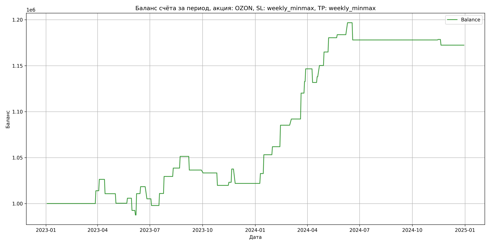

# Результаты торговой стратегии для OZON

**Дата:** 2025-05-17 12:22:37  
**Стратегия:** OZON,_SL_weekly_minmax,_TP_weekly_minmax

## Конфигурация

```json
{
    "TICKER": "OZON",
    "EXCHANGE": "MOEX",
    "START_DATE": "2023-01-01",
    "END_DATE": "2024-12-31",
    "INTERVAL": "1d",
    "CAPITAL": 1000000,
    "RISK_PERCENT": 0.02,
    "PROFIT_TO_RISK": 3,
    "ATR_MULTIPLIER": 1.5,
    "ATR_WINDOW": 14,
    "STOP_LOSS_METHOD": "weekly_minmax",
    "TAKE_PROFIT_METHOD": "weekly_minmax",
    "POSITION": "long"
}
```

## Метрики эффективности

- **Начальный баланс:** 1000000.00
- **Конечный баланс:** 1172368.50
- **Прибыль/Убыток:** 172368.50 (17.24% за период тестирования)
- **Количество сделок:** 39
- **Процент выигрышных сделок:** 66.67% (26 выигрышных, 13 убыточных)
- **Средняя прибыль:** 12467.71
- **Средний убыток:** -11676.31
- **Максимальная прибыль:** 28200.00
- **Максимальный убыток:** -18768.00
- **Коэффициент прибыли:** 2.14
- **Максимальная просадка:** -3.78%

## Графики

### График цены с уровнями риска


### График баланса счёта



## Завершённые сделки

**Всего сделок:** 79

| Сделка № | Дата | Тип | Покупка / продажа | Количество акций | Цена | Stop Loss в момент сделки | Take Profit в момент сделки | Прибыль / убыток | Прибыль / убыток с учётом комиссии |
|:--------:|:----:|:---:|:-----------------:|:----------------:|:----:|:-------------------------:|:---------------------------:|:----------------:|:----------------------------------:|
| 1 | 2023-03-20 00:00:00 | LONG | BUY | 236 | 1690.00 | 1612.00 | 1743.76 | 0.00 | -199.42 |
| 2 | 2023-03-29 00:00:00 | LONG | SELL | -236 | 1749.00 | 1705.20 | 1743.76 | 13924.00 | 13518.20 |
| 3 | 2023-03-31 00:00:00 | LONG | BUY | 250 | 1793.50 | 1662.00 | 1799.67 | 0.00 | -224.19 |
| 4 | 2023-04-04 00:00:00 | LONG | SELL | -250 | 1843.00 | 1745.38 | 1799.67 | 12375.00 | 11920.44 |
| 5 | 2023-04-11 00:00:00 | LONG | BUY | 204 | 1775.50 | 1715.50 | 1897.55 | 0.00 | -181.10 |
| 6 | 2023-04-14 00:00:00 | LONG | SELL | -204 | 1699.00 | 1715.50 | 1897.55 | -15606.00 | -15960.40 |
| 7 | 2023-04-24 00:00:00 | LONG | BUY | 170 | 1752.50 | 1670.00 | 1771.06 | 0.00 | -148.96 |
| 8 | 2023-05-03 00:00:00 | LONG | SELL | -170 | 1691.50 | 1701.28 | 1771.06 | -10370.00 | -10662.74 |
| 9 | 2023-05-17 00:00:00 | LONG | BUY | 174 | 1711.00 | 1575.00 | 1722.81 | 0.00 | -148.86 |
| 10 | 2023-05-23 00:00:00 | LONG | SELL | -174 | 1742.50 | 1683.15 | 1722.81 | 5481.00 | 5180.55 |
| 11 | 2023-05-25 00:00:00 | LONG | BUY | 220 | 1804.50 | 1680.00 | 1815.85 | 0.00 | -198.50 |
| 12 | 2023-05-31 00:00:00 | LONG | SELL | -220 | 1744.00 | 1767.43 | 1815.85 | -13310.00 | -13700.33 |
| 13 | 2023-06-01 00:00:00 | LONG | BUY | 211 | 1763.50 | 1700.50 | 1843.44 | 0.00 | -186.05 |
| 14 | 2023-06-06 00:00:00 | LONG | SELL | -211 | 1740.00 | 1744.40 | 1843.44 | -4958.50 | -5328.12 |
| 15 | 2023-06-07 00:00:00 | LONG | BUY | 192 | 1826.00 | 1701.00 | 1826.74 | 0.00 | -175.30 |
| 16 | 2023-06-08 00:00:00 | LONG | SELL | -192 | 1947.00 | 1701.00 | 1826.74 | 23232.00 | 22869.79 |
| 17 | 2023-06-14 00:00:00 | LONG | BUY | 181 | 2005.00 | 1701.00 | 2026.35 | 0.00 | -181.45 |
| 18 | 2023-06-15 00:00:00 | LONG | SELL | -181 | 2047.00 | 1701.00 | 2026.35 | 7602.00 | 7235.29 |
| 19 | 2023-06-22 00:00:00 | LONG | BUY | 185 | 2043.50 | 1970.00 | 2074.73 | 0.00 | -189.02 |
| 20 | 2023-06-26 00:00:00 | LONG | SELL | -185 | 1972.00 | 1971.76 | 2074.73 | -13227.50 | -13598.93 |
| 21 | 2023-06-28 00:00:00 | LONG | BUY | 168 | 1980.00 | 1880.00 | 2117.89 | 0.00 | -166.32 |
| 22 | 2023-07-04 00:00:00 | LONG | SELL | -168 | 1936.50 | 1938.44 | 2117.89 | -7308.00 | -7636.99 |
| 23 | 2023-07-12 00:00:00 | LONG | BUY | 171 | 2043.50 | 1934.50 | 2050.71 | 0.00 | -174.72 |
| 24 | 2023-07-18 00:00:00 | LONG | SELL | -171 | 2120.00 | 1998.22 | 2050.71 | 13081.50 | 12725.52 |
| 25 | 2023-07-25 00:00:00 | LONG | BUY | 181 | 2247.50 | 2050.00 | 2239.71 | 0.00 | -203.40 |
| 26 | 2023-07-26 00:00:00 | LONG | SELL | -181 | 2350.00 | 2050.00 | 2239.71 | 18552.50 | 18136.43 |
| 27 | 2023-08-04 00:00:00 | LONG | BUY | 136 | 2708.00 | 2380.50 | 2726.67 | 0.00 | -184.14 |
| 28 | 2023-08-11 00:00:00 | LONG | SELL | -136 | 2775.00 | 2665.60 | 2726.67 | 9112.00 | 8739.16 |
| 29 | 2023-08-22 00:00:00 | LONG | BUY | 98 | 2849.00 | 2589.00 | 2859.92 | 0.00 | -139.60 |
| 30 | 2023-08-23 00:00:00 | LONG | SELL | -98 | 2979.00 | 2589.00 | 2859.92 | 12740.00 | 12454.43 |
| 31 | 2023-09-05 00:00:00 | LONG | BUY | 123 | 2867.00 | 2780.00 | 2924.72 | 0.00 | -176.32 |
| 32 | 2023-09-08 00:00:00 | LONG | SELL | -123 | 2746.00 | 2808.19 | 2924.72 | -14883.00 | -15228.20 |
| 33 | 2023-09-28 00:00:00 | LONG | BUY | 90 | 2675.00 | 2460.00 | 2716.25 | 0.00 | -120.38 |
| 34 | 2023-10-02 00:00:00 | LONG | SELL | -90 | 2640.00 | 2637.18 | 2716.25 | -3150.00 | -3389.18 |
| 35 | 2023-10-20 00:00:00 | LONG | BUY | 144 | 2784.00 | 2696.00 | 2800.32 | 0.00 | -200.45 |
| 36 | 2023-10-27 00:00:00 | LONG | SELL | -144 | 2690.00 | 2701.86 | 2800.32 | -13536.00 | -13930.13 |
| 37 | 2023-11-14 00:00:00 | LONG | BUY | 150 | 2700.00 | 2638.00 | 2705.19 | 0.00 | -202.50 |
| 38 | 2023-11-16 00:00:00 | LONG | SELL | -150 | 2722.50 | 2638.00 | 2705.19 | 3375.00 | 2968.31 |
| 39 | 2023-11-17 00:00:00 | LONG | BUY | 156 | 2760.00 | 2610.00 | 2808.72 | 0.00 | -215.28 |
| 40 | 2023-11-21 00:00:00 | LONG | SELL | -156 | 2852.50 | 2700.88 | 2808.72 | 14430.00 | 13992.23 |
| 41 | 2023-11-22 00:00:00 | LONG | BUY | 145 | 2998.00 | 2628.00 | 3000.46 | 0.00 | -217.35 |
| 42 | 2023-11-27 00:00:00 | LONG | SELL | -145 | 2890.00 | 2915.50 | 3000.46 | -15660.00 | -16086.88 |
| 43 | 2023-12-29 00:00:00 | LONG | BUY | 135 | 2800.50 | 2615.50 | 2825.61 | 0.00 | -189.03 |
| 44 | 2024-01-10 00:00:00 | LONG | SELL | -135 | 2880.00 | 2768.99 | 2825.61 | 10732.50 | 10349.07 |
| 45 | 2024-01-11 00:00:00 | LONG | BUY | 160 | 2907.00 | 2777.50 | 2957.74 | 0.00 | -232.56 |
| 46 | 2024-01-16 00:00:00 | LONG | SELL | -160 | 3035.00 | 2879.73 | 2957.74 | 20480.00 | 20004.64 |
| 47 | 2024-01-29 00:00:00 | LONG | BUY | 124 | 2849.50 | 2736.00 | 2889.62 | 0.00 | -176.67 |
| 48 | 2024-01-31 00:00:00 | LONG | SELL | -124 | 2920.00 | 2828.28 | 2889.62 | 8742.00 | 8384.29 |
| 49 | 2024-02-13 00:00:00 | LONG | BUY | 148 | 2996.00 | 2780.00 | 2997.35 | 0.00 | -221.70 |
| 50 | 2024-02-14 00:00:00 | LONG | SELL | -148 | 3154.00 | 2780.00 | 2997.35 | 23384.00 | 22928.90 |
| 51 | 2024-03-01 00:00:00 | LONG | BUY | 126 | 3233.00 | 3005.00 | 3263.67 | 0.00 | -203.68 |
| 52 | 2024-03-04 00:00:00 | LONG | SELL | -126 | 3286.50 | 3005.00 | 3263.67 | 6741.00 | 6330.27 |
| 53 | 2024-03-18 00:00:00 | LONG | BUY | 141 | 3300.00 | 3221.50 | 3422.18 | 0.00 | -232.65 |
| 54 | 2024-03-21 00:00:00 | LONG | SELL | -141 | 3500.00 | 3322.20 | 3422.18 | 28200.00 | 27720.60 |
| 55 | 2024-03-22 00:00:00 | LONG | BUY | 137 | 3541.00 | 3222.00 | 3571.10 | 0.00 | -242.56 |
| 56 | 2024-03-27 00:00:00 | LONG | SELL | -137 | 3633.00 | 3471.65 | 3571.10 | 12604.00 | 12112.58 |
| 57 | 2024-03-28 00:00:00 | LONG | BUY | 134 | 3707.00 | 3421.00 | 3706.06 | 0.00 | -248.37 |
| 58 | 2024-03-29 00:00:00 | LONG | SELL | -134 | 3810.00 | 3421.00 | 3706.06 | 13802.00 | 13298.36 |
| 59 | 2024-04-02 00:00:00 | LONG | BUY | 129 | 3875.00 | 3545.00 | 3916.48 | 0.00 | -249.94 |
| 60 | 2024-04-10 00:00:00 | LONG | SELL | -129 | 3760.00 | 3789.17 | 3916.48 | -14835.00 | -15327.46 |
| 61 | 2024-04-16 00:00:00 | LONG | BUY | 120 | 3850.00 | 3682.50 | 3868.66 | 0.00 | -231.00 |
| 62 | 2024-04-18 00:00:00 | LONG | SELL | -120 | 3902.00 | 3771.04 | 3868.66 | 6240.00 | 5774.88 |
| 63 | 2024-04-19 00:00:00 | LONG | BUY | 122 | 4000.00 | 3682.50 | 4010.64 | 0.00 | -244.00 |
| 64 | 2024-04-22 00:00:00 | LONG | SELL | -122 | 4100.00 | 3682.50 | 4010.64 | 12200.00 | 11705.90 |
| 65 | 2024-04-27 00:00:00 | LONG | BUY | 109 | 4228.00 | 3987.00 | 4287.98 | 0.00 | -230.43 |
| 66 | 2024-04-30 00:00:00 | LONG | SELL | -109 | 4363.00 | 4171.37 | 4287.98 | 14715.00 | 14246.79 |
| 67 | 2024-05-07 00:00:00 | LONG | BUY | 111 | 4445.00 | 4237.00 | 4496.37 | 0.00 | -246.70 |
| 68 | 2024-05-08 00:00:00 | LONG | SELL | -111 | 4585.00 | 4237.00 | 4496.37 | 15540.00 | 15038.83 |
| 69 | 2024-05-20 00:00:00 | LONG | BUY | 110 | 4650.00 | 4457.50 | 4658.60 | 0.00 | -255.75 |
| 70 | 2024-05-23 00:00:00 | LONG | SELL | -110 | 4680.00 | 4549.16 | 4658.60 | 3300.00 | 2786.85 |
| 71 | 2024-06-05 00:00:00 | LONG | BUY | 63 | 4443.50 | 3957.00 | 4502.56 | 0.00 | -139.97 |
| 72 | 2024-06-10 00:00:00 | LONG | SELL | -63 | 4650.50 | 4319.84 | 4502.56 | 13041.00 | 12754.54 |
| 73 | 2024-06-17 00:00:00 | LONG | BUY | 68 | 4506.00 | 4154.50 | 4936.44 | 0.00 | -153.20 |
| 74 | 2024-06-19 00:00:00 | LONG | SELL | -68 | 4230.00 | 4366.39 | 4936.44 | -18768.00 | -19065.02 |
| 75 | 2024-11-11 00:00:00 | LONG | BUY | 89 | 3306.00 | 2645.00 | 3296.66 | 0.00 | -147.12 |
| 76 | 2024-11-15 00:00:00 | LONG | SELL | -89 | 3312.00 | 3203.13 | 3296.66 | 534.00 | 239.50 |
| 77 | 2024-11-18 00:00:00 | LONG | BUY | 103 | 3310.00 | 3175.00 | 3470.88 | 0.00 | -170.47 |
| 78 | 2024-11-20 00:00:00 | LONG | SELL | -103 | 3250.00 | 3275.16 | 3470.88 | -6180.00 | -6517.84 |
| 79 | 2024-12-24 00:00:00 | LONG | BUY | 67 | 2991.00 | 2453.50 | 3143.38 | 0.00 | -100.20 |
