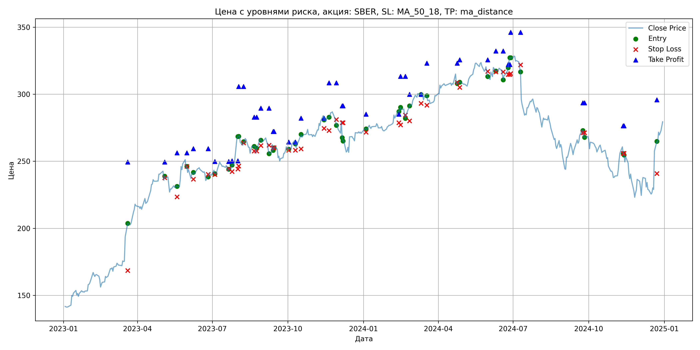
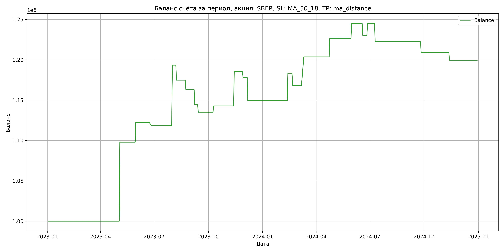

# Результаты торговой стратегии для SBER

**Дата:** 2025-05-17 12:23:45  
**Стратегия:** SBER,_SL_MA_50_18,_TP_ma_distance

## Конфигурация

```json
{
    "TICKER": "SBER",
    "EXCHANGE": "MOEX",
    "START_DATE": "2023-01-01",
    "END_DATE": "2024-12-31",
    "INTERVAL": "1d",
    "CAPITAL": 1000000,
    "RISK_PERCENT": 0.02,
    "PROFIT_TO_RISK": 3,
    "ATR_MULTIPLIER": 1.5,
    "ATR_WINDOW": 14,
    "STOP_LOSS_METHOD": "MA_50_18",
    "TAKE_PROFIT_METHOD": "ma_distance",
    "POSITION": "long"
}
```

## Метрики эффективности

- **Начальный баланс:** 1000000.00
- **Конечный баланс:** 1199417.81
- **Прибыль/Убыток:** 199417.81 (19.94% за период тестирования)
- **Количество сделок:** 23
- **Процент выигрышных сделок:** 43.48% (10 выигрышных, 13 убыточных)
- **Средняя прибыль:** 37324.75
- **Средний убыток:** -13371.52
- **Максимальная прибыль:** 97883.65
- **Максимальный убыток:** -28425.30
- **Коэффициент прибыли:** 2.15
- **Максимальная просадка:** -4.89%

## Графики

### График цены с уровнями риска



### График баланса счёта



## Завершённые сделки

**Всего сделок:** 47

| Сделка № | Дата | Тип | Покупка / продажа | Количество акций | Цена | Stop Loss в момент сделки | Take Profit в момент сделки | Прибыль / убыток | Прибыль / убыток с учётом комиссии |
|:--------:|:----:|:---:|:-----------------:|:----------------:|:----:|:-------------------------:|:---------------------------:|:----------------:|:----------------------------------:|
| 1 | 2023-03-20 00:00:00 | LONG | BUY | 2395 | 196.02 | 168.62 | 249.50 | 0.00 | -234.73 |
| 2 | 2023-05-04 00:00:00 | LONG | SELL | -2395 | 236.89 | 237.77 | 249.50 | 97883.65 | 97365.24 |
| 3 | 2023-05-19 00:00:00 | LONG | BUY | 1874 | 230.99 | 223.50 | 256.32 | 0.00 | -216.44 |
| 4 | 2023-05-31 00:00:00 | LONG | SELL | -1874 | 244.00 | 246.16 | 256.32 | 24380.74 | 23935.67 |
| 5 | 2023-06-08 00:00:00 | LONG | BUY | 2032 | 241.30 | 236.61 | 259.43 | 0.00 | -245.16 |
| 6 | 2023-06-26 00:00:00 | LONG | SELL | -2032 | 239.60 | 240.28 | 259.43 | -3454.40 | -3942.99 |
| 7 | 2023-07-04 00:00:00 | LONG | BUY | 2280 | 243.40 | 240.13 | 249.83 | 0.00 | -277.48 |
| 8 | 2023-07-21 00:00:00 | LONG | SELL | -2280 | 243.18 | 244.41 | 249.83 | -501.60 | -1056.30 |
| 9 | 2023-07-25 00:00:00 | LONG | BUY | 3191 | 245.48 | 242.39 | 250.29 | 0.00 | -391.66 |
| 10 | 2023-08-01 00:00:00 | LONG | SELL | -3191 | 269.00 | 244.26 | 250.29 | 75052.32 | 74231.47 |
| 11 | 2023-08-02 00:00:00 | LONG | BUY | 2827 | 268.50 | 246.42 | 305.70 | 0.00 | -379.52 |
| 12 | 2023-08-08 00:00:00 | LONG | SELL | -2827 | 261.92 | 263.73 | 305.70 | -18601.66 | -19351.41 |
| 13 | 2023-08-21 00:00:00 | LONG | BUY | 2477 | 262.44 | 257.67 | 282.81 | 0.00 | -325.03 |
| 14 | 2023-08-24 00:00:00 | LONG | SELL | -2477 | 257.63 | 257.67 | 282.81 | -11914.37 | -12558.48 |
| 15 | 2023-08-29 00:00:00 | LONG | BUY | 2149 | 266.70 | 261.73 | 289.58 | 0.00 | -286.57 |
| 16 | 2023-09-08 00:00:00 | LONG | SELL | -2149 | 258.08 | 262.04 | 289.58 | -18524.38 | -19088.26 |
| 17 | 2023-09-13 00:00:00 | LONG | BUY | 2653 | 262.40 | 260.17 | 272.16 | 0.00 | -348.07 |
| 18 | 2023-09-14 00:00:00 | LONG | SELL | -2653 | 258.90 | 260.17 | 272.16 | -9285.50 | -9977.00 |
| 19 | 2023-10-02 00:00:00 | LONG | BUY | 2191 | 261.37 | 258.28 | 264.41 | 0.00 | -286.33 |
| 20 | 2023-10-10 00:00:00 | LONG | SELL | -2191 | 264.89 | 258.28 | 264.41 | 7712.32 | 7135.80 |
| 21 | 2023-10-17 00:00:00 | LONG | BUY | 2772 | 268.30 | 259.26 | 282.10 | 0.00 | -371.86 |
| 22 | 2023-11-14 00:00:00 | LONG | SELL | -2772 | 283.70 | 274.59 | 282.10 | 42688.80 | 41923.73 |
| 23 | 2023-11-20 00:00:00 | LONG | BUY | 2929 | 281.96 | 272.95 | 308.48 | 0.00 | -412.93 |
| 24 | 2023-11-29 00:00:00 | LONG | SELL | -2929 | 279.36 | 281.11 | 308.48 | -7615.40 | -8437.45 |
| 25 | 2023-12-06 00:00:00 | LONG | BUY | 2311 | 279.92 | 278.76 | 291.26 | 0.00 | -323.45 |
| 26 | 2023-12-07 00:00:00 | LONG | SELL | -2311 | 267.62 | 278.76 | 291.26 | -28425.30 | -29057.98 |
| 27 | 2024-01-04 00:00:00 | LONG | BUY | 2641 | 274.67 | 271.73 | 285.10 | 0.00 | -362.70 |
| 28 | 2024-02-13 00:00:00 | LONG | SELL | -2641 | 287.52 | 278.72 | 285.10 | 33936.85 | 33194.48 |
| 29 | 2024-02-15 00:00:00 | LONG | BUY | 2843 | 289.30 | 277.15 | 313.24 | 0.00 | -411.24 |
| 30 | 2024-02-21 00:00:00 | LONG | SELL | -2843 | 283.90 | 284.44 | 313.24 | -15352.20 | -16167.00 |
| 31 | 2024-02-26 00:00:00 | LONG | BUY | 2846 | 288.52 | 280.16 | 299.88 | 0.00 | -410.56 |
| 32 | 2024-03-11 00:00:00 | LONG | SELL | -2846 | 301.00 | 293.19 | 299.88 | 35518.08 | 34679.19 |
| 33 | 2024-03-18 00:00:00 | LONG | BUY | 2799 | 299.40 | 291.85 | 323.05 | 0.00 | -419.01 |
| 34 | 2024-04-24 00:00:00 | LONG | SELL | -2799 | 307.50 | 308.69 | 323.05 | 22671.90 | 21822.54 |
| 35 | 2024-04-27 00:00:00 | LONG | BUY | 2751 | 309.25 | 305.04 | 325.60 | 0.00 | -425.37 |
| 36 | 2024-05-31 00:00:00 | LONG | SELL | -2751 | 316.00 | 317.07 | 325.60 | 18569.25 | 17709.22 |
| 37 | 2024-06-10 00:00:00 | LONG | BUY | 2255 | 320.80 | 316.60 | 332.16 | 0.00 | -361.70 |
| 38 | 2024-06-19 00:00:00 | LONG | SELL | -2255 | 314.38 | 316.60 | 332.16 | -14477.10 | -15193.27 |
| 39 | 2024-06-25 00:00:00 | LONG | BUY | 2032 | 317.50 | 314.70 | 322.07 | 0.00 | -322.58 |
| 40 | 2024-06-27 00:00:00 | LONG | SELL | -2032 | 324.80 | 314.70 | 322.07 | 14833.60 | 14181.02 |
| 41 | 2024-06-28 00:00:00 | LONG | BUY | 2561 | 327.87 | 315.42 | 346.04 | 0.00 | -419.84 |
| 42 | 2024-07-10 00:00:00 | LONG | SELL | -2561 | 319.00 | 321.80 | 346.04 | -22716.07 | -23544.39 |
| 43 | 2024-09-24 00:00:00 | LONG | BUY | 2122 | 273.90 | 271.25 | 293.58 | 0.00 | -290.61 |
| 44 | 2024-09-26 00:00:00 | LONG | SELL | -2122 | 267.54 | 271.25 | 293.58 | -13495.92 | -14070.39 |
| 45 | 2024-11-12 00:00:00 | LONG | BUY | 2014 | 259.99 | 255.84 | 276.43 | 0.00 | -261.81 |
| 46 | 2024-11-13 00:00:00 | LONG | SELL | -2014 | 255.29 | 255.84 | 276.43 | -9465.80 | -9984.69 |
| 47 | 2024-12-23 00:00:00 | LONG | BUY | 1625 | 260.00 | 240.84 | 295.83 | 0.00 | -211.25 |
