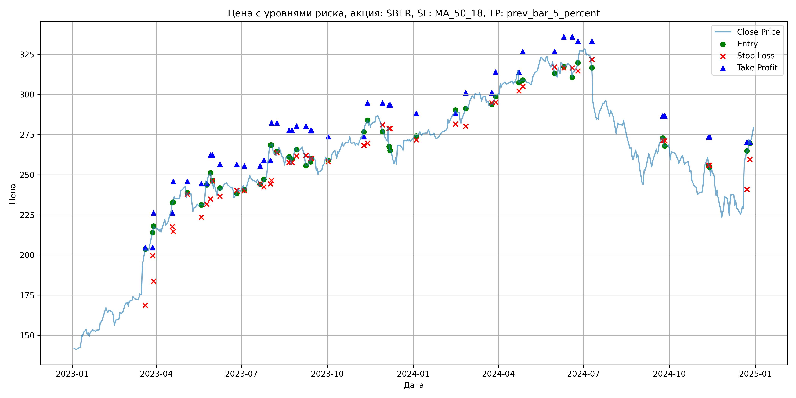
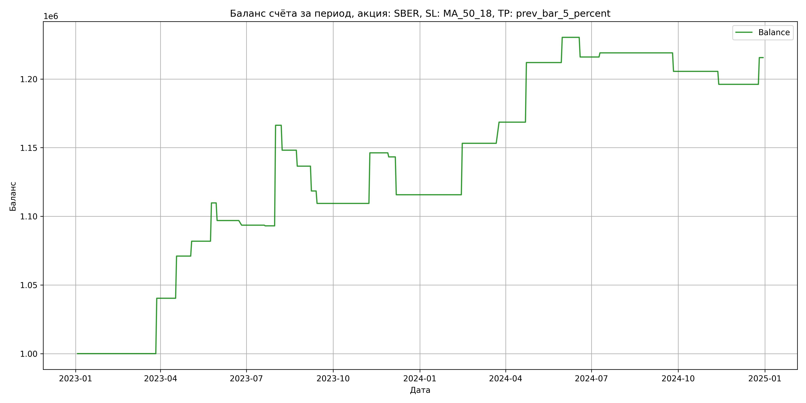

# Результаты торговой стратегии для SBER

**Дата:** 2025-05-17 12:23:42  
**Стратегия:** SBER,_SL_MA_50_18,_TP_prev_bar_5_percent

## Конфигурация

```json
{
    "TICKER": "SBER",
    "EXCHANGE": "MOEX",
    "START_DATE": "2023-01-01",
    "END_DATE": "2024-12-31",
    "INTERVAL": "1d",
    "CAPITAL": 1000000,
    "RISK_PERCENT": 0.02,
    "PROFIT_TO_RISK": 3,
    "ATR_MULTIPLIER": 1.5,
    "ATR_WINDOW": 14,
    "STOP_LOSS_METHOD": "MA_50_18",
    "TAKE_PROFIT_METHOD": "prev_bar_5_percent",
    "POSITION": "long"
}
```

## Метрики эффективности

- **Начальный баланс:** 1000000.00
- **Конечный баланс:** 1215581.25
- **Прибыль/Убыток:** 215581.25 (21.56% за период тестирования)
- **Количество сделок:** 24
- **Процент выигрышных сделок:** 50.00% (12 выигрышных, 12 убыточных)
- **Средняя прибыль:** 29744.59
- **Средний убыток:** -11779.48
- **Максимальная прибыль:** 73241.28
- **Максимальный убыток:** -27564.30
- **Коэффициент прибыли:** 2.53
- **Максимальная просадка:** -4.88%

## Графики

### График цены с уровнями риска



### График баланса счёта



## Завершённые сделки

**Всего сделок:** 48

| Сделка № | Дата | Тип | Покупка / продажа | Количество акций | Цена | Stop Loss в момент сделки | Take Profit в момент сделки | Прибыль / убыток | Прибыль / убыток с учётом комиссии |
|:--------:|:----:|:---:|:-----------------:|:----------------:|:----:|:-------------------------:|:---------------------------:|:----------------:|:----------------------------------:|
| 1 | 2023-03-20 00:00:00 | LONG | BUY | 2395 | 196.02 | 168.62 | 204.61 | 0.00 | -234.73 |
| 2 | 2023-03-28 00:00:00 | LONG | SELL | -2395 | 212.86 | 199.66 | 204.61 | 40331.80 | 39842.17 |
| 3 | 2023-03-29 00:00:00 | LONG | BUY | 2355 | 214.85 | 183.58 | 226.21 | 0.00 | -252.99 |
| 4 | 2023-04-18 00:00:00 | LONG | SELL | -2355 | 227.89 | 217.77 | 226.21 | 30709.20 | 30187.87 |
| 5 | 2023-04-19 00:00:00 | LONG | BUY | 2568 | 232.67 | 214.63 | 245.90 | 0.00 | -298.75 |
| 6 | 2023-05-04 00:00:00 | LONG | SELL | -2568 | 236.89 | 237.77 | 245.90 | 10836.96 | 10234.04 |
| 7 | 2023-05-19 00:00:00 | LONG | BUY | 1845 | 230.99 | 223.50 | 244.44 | 0.00 | -213.09 |
| 8 | 2023-05-25 00:00:00 | LONG | SELL | -1845 | 246.10 | 231.70 | 244.44 | 27877.95 | 27437.83 |
| 9 | 2023-05-29 00:00:00 | LONG | BUY | 2219 | 249.78 | 234.82 | 262.22 | 0.00 | -277.13 |
| 10 | 2023-05-31 00:00:00 | LONG | SELL | -2219 | 244.00 | 246.16 | 262.22 | -12825.82 | -13373.67 |
| 11 | 2023-06-08 00:00:00 | LONG | BUY | 1983 | 241.30 | 236.61 | 256.51 | 0.00 | -239.25 |
| 12 | 2023-06-26 00:00:00 | LONG | SELL | -1983 | 239.60 | 240.28 | 256.51 | -3371.10 | -3847.91 |
| 13 | 2023-07-04 00:00:00 | LONG | BUY | 2225 | 243.40 | 240.13 | 255.50 | 0.00 | -270.78 |
| 14 | 2023-07-21 00:00:00 | LONG | SELL | -2225 | 243.18 | 244.41 | 255.50 | -489.50 | -1030.82 |
| 15 | 2023-07-25 00:00:00 | LONG | BUY | 3114 | 245.48 | 242.39 | 258.95 | 0.00 | -382.21 |
| 16 | 2023-08-01 00:00:00 | LONG | SELL | -3114 | 269.00 | 244.26 | 258.95 | 73241.28 | 72440.23 |
| 17 | 2023-08-02 00:00:00 | LONG | BUY | 2759 | 268.50 | 246.42 | 282.39 | 0.00 | -370.40 |
| 18 | 2023-08-08 00:00:00 | LONG | SELL | -2759 | 261.92 | 263.73 | 282.39 | -18154.22 | -18885.93 |
| 19 | 2023-08-21 00:00:00 | LONG | BUY | 2417 | 262.44 | 257.67 | 277.66 | 0.00 | -317.16 |
| 20 | 2023-08-24 00:00:00 | LONG | SELL | -2417 | 257.63 | 257.67 | 277.66 | -11625.77 | -12254.27 |
| 21 | 2023-08-29 00:00:00 | LONG | BUY | 2097 | 266.70 | 261.73 | 280.28 | 0.00 | -279.63 |
| 22 | 2023-09-08 00:00:00 | LONG | SELL | -2097 | 258.08 | 262.04 | 280.28 | -18076.14 | -18626.37 |
| 23 | 2023-09-13 00:00:00 | LONG | BUY | 2589 | 262.40 | 260.17 | 277.49 | 0.00 | -339.68 |
| 24 | 2023-09-14 00:00:00 | LONG | SELL | -2589 | 258.90 | 260.17 | 277.49 | -9061.50 | -9736.32 |
| 25 | 2023-10-02 00:00:00 | LONG | BUY | 2138 | 261.37 | 258.28 | 273.76 | 0.00 | -279.40 |
| 26 | 2023-11-09 00:00:00 | LONG | SELL | -2138 | 278.60 | 268.26 | 273.76 | 36837.74 | 36260.51 |
| 27 | 2023-11-13 00:00:00 | LONG | BUY | 2844 | 280.40 | 269.60 | 294.69 | 0.00 | -398.73 |
| 28 | 2023-11-29 00:00:00 | LONG | SELL | -2844 | 279.36 | 281.11 | 294.69 | -2957.76 | -3753.74 |
| 29 | 2023-12-06 00:00:00 | LONG | BUY | 2241 | 279.92 | 278.76 | 293.60 | 0.00 | -313.65 |
| 30 | 2023-12-07 00:00:00 | LONG | SELL | -2241 | 267.62 | 278.76 | 293.60 | -27564.30 | -28177.82 |
| 31 | 2024-01-04 00:00:00 | LONG | BUY | 2561 | 274.67 | 271.73 | 288.29 | 0.00 | -351.71 |
| 32 | 2024-02-15 00:00:00 | LONG | SELL | -2561 | 289.30 | 281.53 | 288.29 | 37467.43 | 36745.27 |
| 33 | 2024-02-26 00:00:00 | LONG | BUY | 2810 | 288.52 | 280.16 | 301.14 | 0.00 | -405.37 |
| 34 | 2024-03-25 00:00:00 | LONG | SELL | -2810 | 294.00 | 294.88 | 301.14 | 15398.80 | 14580.36 |
| 35 | 2024-03-29 00:00:00 | LONG | BUY | 2711 | 299.38 | 295.13 | 313.95 | 0.00 | -405.81 |
| 36 | 2024-04-23 00:00:00 | LONG | SELL | -2711 | 315.39 | 302.12 | 313.95 | 43403.11 | 42569.79 |
| 37 | 2024-04-27 00:00:00 | LONG | BUY | 2719 | 309.25 | 305.04 | 326.77 | 0.00 | -420.43 |
| 38 | 2024-05-31 00:00:00 | LONG | SELL | -2719 | 316.00 | 317.07 | 326.77 | 18353.25 | 17503.22 |
| 39 | 2024-06-10 00:00:00 | LONG | BUY | 2229 | 320.80 | 316.60 | 335.89 | 0.00 | -357.53 |
| 40 | 2024-06-19 00:00:00 | LONG | SELL | -2229 | 314.38 | 316.60 | 335.89 | -14310.18 | -15018.09 |
| 41 | 2024-06-25 00:00:00 | LONG | BUY | 2009 | 317.50 | 314.70 | 333.11 | 0.00 | -318.93 |
| 42 | 2024-07-10 00:00:00 | LONG | SELL | -2009 | 319.00 | 321.80 | 333.11 | 3013.50 | 2374.14 |
| 43 | 2024-09-24 00:00:00 | LONG | BUY | 2118 | 273.90 | 271.25 | 286.69 | 0.00 | -290.06 |
| 44 | 2024-09-26 00:00:00 | LONG | SELL | -2118 | 267.54 | 271.25 | 286.69 | -13470.48 | -14043.86 |
| 45 | 2024-11-12 00:00:00 | LONG | BUY | 2010 | 259.99 | 255.84 | 273.64 | 0.00 | -261.29 |
| 46 | 2024-11-13 00:00:00 | LONG | SELL | -2010 | 255.29 | 255.84 | 273.64 | -9447.00 | -9964.86 |
| 47 | 2024-12-23 00:00:00 | LONG | BUY | 1622 | 260.00 | 240.84 | 270.35 | 0.00 | -210.86 |
| 48 | 2024-12-26 00:00:00 | LONG | SELL | -1622 | 272.00 | 259.60 | 270.35 | 19464.00 | 19032.55 |
