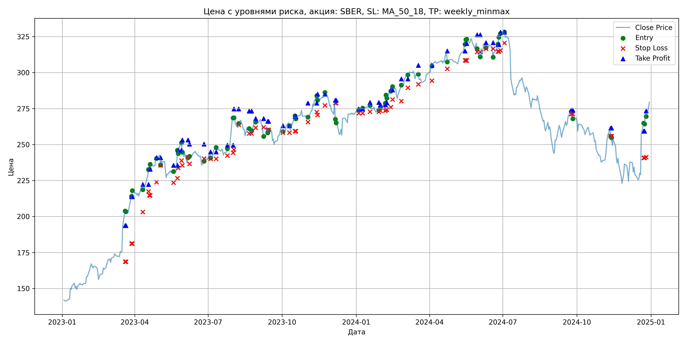
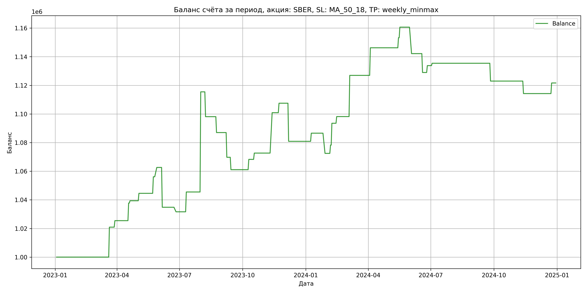

# Результаты торговой стратегии для SBER

**Дата:** 2025-05-17 12:23:43  
**Стратегия:** SBER,_SL_MA_50_18,_TP_weekly_minmax

## Конфигурация

```json
{
    "TICKER": "SBER",
    "EXCHANGE": "MOEX",
    "START_DATE": "2023-01-01",
    "END_DATE": "2024-12-31",
    "INTERVAL": "1d",
    "CAPITAL": 1000000,
    "RISK_PERCENT": 0.02,
    "PROFIT_TO_RISK": 3,
    "ATR_MULTIPLIER": 1.5,
    "ATR_WINDOW": 14,
    "STOP_LOSS_METHOD": "MA_50_18",
    "TAKE_PROFIT_METHOD": "weekly_minmax",
    "POSITION": "long"
}
```

## Метрики эффективности

- **Начальный баланс:** 1000000.00
- **Конечный баланс:** 1121653.13
- **Прибыль/Убыток:** 121653.13 (12.17% за период тестирования)
- **Количество сделок:** 36
- **Процент выигрышных сделок:** 66.67% (24 выигрышных, 12 убыточных)
- **Средняя прибыль:** 12524.66
- **Средний убыток:** -14911.56
- **Максимальная прибыль:** 69948.48
- **Максимальный убыток:** -27803.84
- **Коэффициент прибыли:** 1.68
- **Максимальная просадка:** -4.87%

## Графики

### График цены с уровнями риска



### График баланса счёта



## Завершённые сделки

**Всего сделок:** 73

| Сделка № | Дата | Тип | Покупка / продажа | Количество акций | Цена | Stop Loss в момент сделки | Take Profit в момент сделки | Прибыль / убыток | Прибыль / убыток с учётом комиссии |
|:--------:|:----:|:---:|:-----------------:|:----------------:|:----:|:-------------------------:|:---------------------------:|:----------------:|:----------------------------------:|
| 1 | 2023-03-20 00:00:00 | LONG | BUY | 2395 | 196.02 | 168.62 | 193.69 | 0.00 | -234.73 |
| 2 | 2023-03-21 00:00:00 | LONG | SELL | -2395 | 204.76 | 168.62 | 193.69 | 20932.30 | 20452.37 |
| 3 | 2023-03-28 00:00:00 | LONG | BUY | 2278 | 212.86 | 181.23 | 213.78 | 0.00 | -242.45 |
| 4 | 2023-03-29 00:00:00 | LONG | SELL | -2278 | 214.85 | 181.23 | 213.78 | 4533.22 | 4046.06 |
| 5 | 2023-04-11 00:00:00 | LONG | BUY | 2464 | 222.90 | 203.05 | 222.28 | 0.00 | -274.61 |
| 6 | 2023-04-18 00:00:00 | LONG | SELL | -2464 | 227.89 | 217.43 | 222.28 | 12295.36 | 11739.99 |
| 7 | 2023-04-19 00:00:00 | LONG | BUY | 2487 | 232.67 | 214.63 | 232.80 | 0.00 | -289.33 |
| 8 | 2023-04-20 00:00:00 | LONG | SELL | -2487 | 233.32 | 214.63 | 232.80 | 1616.55 | 1037.09 |
| 9 | 2023-04-28 00:00:00 | LONG | BUY | 2655 | 240.90 | 223.83 | 240.85 | 0.00 | -319.79 |
| 10 | 2023-05-03 00:00:00 | LONG | SELL | -2655 | 242.85 | 235.57 | 240.85 | 5177.25 | 4535.07 |
| 11 | 2023-05-19 00:00:00 | LONG | BUY | 1779 | 230.99 | 223.50 | 235.54 | 0.00 | -205.47 |
| 12 | 2023-05-24 00:00:00 | LONG | SELL | -1779 | 237.49 | 226.64 | 235.54 | 11563.50 | 11146.79 |
| 13 | 2023-05-25 00:00:00 | LONG | BUY | 1770 | 246.10 | 233.81 | 246.15 | 0.00 | -217.80 |
| 14 | 2023-05-29 00:00:00 | LONG | SELL | -1770 | 249.78 | 238.88 | 246.15 | 6513.60 | 6074.75 |
| 15 | 2023-05-30 00:00:00 | LONG | BUY | 2152 | 248.84 | 235.58 | 253.19 | 0.00 | -267.75 |
| 16 | 2023-06-06 00:00:00 | LONG | SELL | -2152 | 235.92 | 241.25 | 253.19 | -27803.84 | -28325.44 |
| 17 | 2023-06-08 00:00:00 | LONG | BUY | 1868 | 241.30 | 236.61 | 250.34 | 0.00 | -225.37 |
| 18 | 2023-06-26 00:00:00 | LONG | SELL | -1868 | 239.60 | 240.28 | 250.34 | -3175.60 | -3624.76 |
| 19 | 2023-07-04 00:00:00 | LONG | BUY | 2095 | 243.40 | 240.13 | 244.87 | 0.00 | -254.96 |
| 20 | 2023-07-11 00:00:00 | LONG | SELL | -2095 | 250.01 | 240.13 | 244.87 | 13847.95 | 13331.10 |
| 21 | 2023-07-25 00:00:00 | LONG | BUY | 2974 | 245.48 | 242.39 | 249.51 | 0.00 | -365.03 |
| 22 | 2023-08-01 00:00:00 | LONG | SELL | -2974 | 269.00 | 244.26 | 249.51 | 69948.48 | 69183.45 |
| 23 | 2023-08-02 00:00:00 | LONG | BUY | 2635 | 268.50 | 246.42 | 274.77 | 0.00 | -353.75 |
| 24 | 2023-08-08 00:00:00 | LONG | SELL | -2635 | 261.92 | 263.73 | 274.77 | -17338.30 | -18037.13 |
| 25 | 2023-08-21 00:00:00 | LONG | BUY | 2308 | 262.44 | 257.67 | 273.20 | 0.00 | -302.86 |
| 26 | 2023-08-24 00:00:00 | LONG | SELL | -2308 | 257.63 | 257.67 | 273.20 | -11101.48 | -11701.64 |
| 27 | 2023-08-29 00:00:00 | LONG | BUY | 2003 | 266.70 | 261.73 | 268.05 | 0.00 | -267.10 |
| 28 | 2023-09-08 00:00:00 | LONG | SELL | -2003 | 258.08 | 262.04 | 268.05 | -17265.86 | -17791.43 |
| 29 | 2023-09-13 00:00:00 | LONG | BUY | 2473 | 262.40 | 260.17 | 266.09 | 0.00 | -324.46 |
| 30 | 2023-09-14 00:00:00 | LONG | SELL | -2473 | 258.90 | 260.17 | 266.09 | -8655.50 | -9300.09 |
| 31 | 2023-10-02 00:00:00 | LONG | BUY | 2042 | 261.37 | 258.28 | 263.06 | 0.00 | -266.86 |
| 32 | 2023-10-10 00:00:00 | LONG | SELL | -2042 | 264.89 | 258.28 | 263.06 | 7187.84 | 6650.53 |
| 33 | 2023-10-17 00:00:00 | LONG | BUY | 2584 | 268.30 | 259.26 | 269.46 | 0.00 | -346.64 |
| 34 | 2023-10-18 00:00:00 | LONG | SELL | -2584 | 270.00 | 259.26 | 269.46 | 4392.80 | 3697.32 |
| 35 | 2023-11-02 00:00:00 | LONG | BUY | 2715 | 270.00 | 265.59 | 278.76 | 0.00 | -366.52 |
| 36 | 2023-11-13 00:00:00 | LONG | SELL | -2715 | 280.40 | 272.59 | 278.76 | 28236.00 | 27488.83 |
| 37 | 2023-11-14 00:00:00 | LONG | BUY | 2688 | 283.70 | 270.56 | 285.04 | 0.00 | -381.29 |
| 38 | 2023-11-23 00:00:00 | LONG | SELL | -2688 | 286.16 | 277.25 | 285.04 | 6612.48 | 5846.59 |
| 39 | 2023-12-06 00:00:00 | LONG | BUY | 2165 | 279.92 | 278.76 | 280.80 | 0.00 | -303.01 |
| 40 | 2023-12-07 00:00:00 | LONG | SELL | -2165 | 267.62 | 278.76 | 280.80 | -26629.50 | -27222.21 |
| 41 | 2024-01-04 00:00:00 | LONG | BUY | 2474 | 274.67 | 271.73 | 274.74 | 0.00 | -339.77 |
| 42 | 2024-01-09 00:00:00 | LONG | SELL | -2474 | 276.97 | 271.73 | 274.74 | 5690.20 | 5007.82 |
| 43 | 2024-01-18 00:00:00 | LONG | BUY | 2704 | 278.24 | 272.77 | 279.32 | 0.00 | -376.18 |
| 44 | 2024-01-29 00:00:00 | LONG | SELL | -2704 | 273.02 | 272.77 | 279.32 | -14114.88 | -14860.18 |
| 45 | 2024-01-31 00:00:00 | LONG | BUY | 2690 | 275.84 | 273.52 | 277.64 | 0.00 | -371.00 |
| 46 | 2024-02-06 00:00:00 | LONG | SELL | -2690 | 278.00 | 273.52 | 277.64 | 5810.40 | 5065.49 |
| 47 | 2024-02-07 00:00:00 | LONG | BUY | 2673 | 278.82 | 274.29 | 279.04 | 0.00 | -372.64 |
| 48 | 2024-02-08 00:00:00 | LONG | SELL | -2673 | 284.52 | 274.29 | 279.04 | 15236.10 | 14483.20 |
| 49 | 2024-02-13 00:00:00 | LONG | BUY | 2628 | 287.52 | 276.00 | 288.00 | 0.00 | -377.80 |
| 50 | 2024-02-15 00:00:00 | LONG | SELL | -2628 | 289.30 | 281.33 | 288.00 | 4677.84 | 3919.90 |
| 51 | 2024-02-26 00:00:00 | LONG | BUY | 2661 | 288.52 | 280.16 | 295.59 | 0.00 | -383.88 |
| 52 | 2024-03-05 00:00:00 | LONG | SELL | -2661 | 299.33 | 289.47 | 295.59 | 28765.41 | 27983.28 |
| 53 | 2024-03-18 00:00:00 | LONG | BUY | 2606 | 299.40 | 291.85 | 304.98 | 0.00 | -390.12 |
| 54 | 2024-04-04 00:00:00 | LONG | SELL | -2606 | 306.80 | 294.42 | 304.98 | 19284.40 | 18494.52 |
| 55 | 2024-04-23 00:00:00 | LONG | BUY | 2509 | 315.39 | 302.64 | 315.00 | 0.00 | -395.66 |
| 56 | 2024-05-15 00:00:00 | LONG | SELL | -2509 | 318.20 | 308.55 | 315.00 | 7050.29 | 6255.45 |
| 57 | 2024-05-16 00:00:00 | LONG | BUY | 2486 | 320.00 | 308.48 | 320.24 | 0.00 | -397.76 |
| 58 | 2024-05-17 00:00:00 | LONG | SELL | -2486 | 322.96 | 308.48 | 320.24 | 7358.56 | 6559.36 |
| 59 | 2024-05-30 00:00:00 | LONG | BUY | 2495 | 320.91 | 314.36 | 326.27 | 0.00 | -400.34 |
| 60 | 2024-06-03 00:00:00 | LONG | SELL | -2495 | 313.50 | 314.36 | 326.27 | -18487.95 | -19279.38 |
| 61 | 2024-06-10 00:00:00 | LONG | BUY | 2054 | 320.80 | 316.60 | 320.82 | 0.00 | -329.46 |
| 62 | 2024-06-19 00:00:00 | LONG | SELL | -2054 | 314.38 | 316.60 | 320.82 | -13186.68 | -13839.01 |
| 63 | 2024-06-25 00:00:00 | LONG | BUY | 1851 | 317.50 | 314.70 | 319.44 | 0.00 | -293.85 |
| 64 | 2024-06-26 00:00:00 | LONG | SELL | -1851 | 320.10 | 314.70 | 319.44 | 4812.60 | 4222.50 |
| 65 | 2024-06-28 00:00:00 | LONG | BUY | 2315 | 327.87 | 315.42 | 328.03 | 0.00 | -379.51 |
| 66 | 2024-07-03 00:00:00 | LONG | SELL | -2315 | 328.58 | 320.61 | 328.03 | 1643.65 | 883.81 |
| 67 | 2024-09-24 00:00:00 | LONG | BUY | 1957 | 273.90 | 271.25 | 273.95 | 0.00 | -268.01 |
| 68 | 2024-09-26 00:00:00 | LONG | SELL | -1957 | 267.54 | 271.25 | 273.95 | -12446.52 | -12976.32 |
| 69 | 2024-11-12 00:00:00 | LONG | BUY | 1858 | 259.99 | 255.84 | 261.44 | 0.00 | -241.53 |
| 70 | 2024-11-13 00:00:00 | LONG | SELL | -1858 | 255.29 | 255.84 | 261.44 | -8732.60 | -9211.30 |
| 71 | 2024-12-23 00:00:00 | LONG | BUY | 1499 | 260.00 | 240.84 | 259.31 | 0.00 | -194.87 |
| 72 | 2024-12-24 00:00:00 | LONG | SELL | -1499 | 264.94 | 240.84 | 259.31 | 7405.06 | 7011.62 |
| 73 | 2024-12-26 00:00:00 | LONG | BUY | 1422 | 272.00 | 241.20 | 273.31 | 0.00 | -193.39 |
