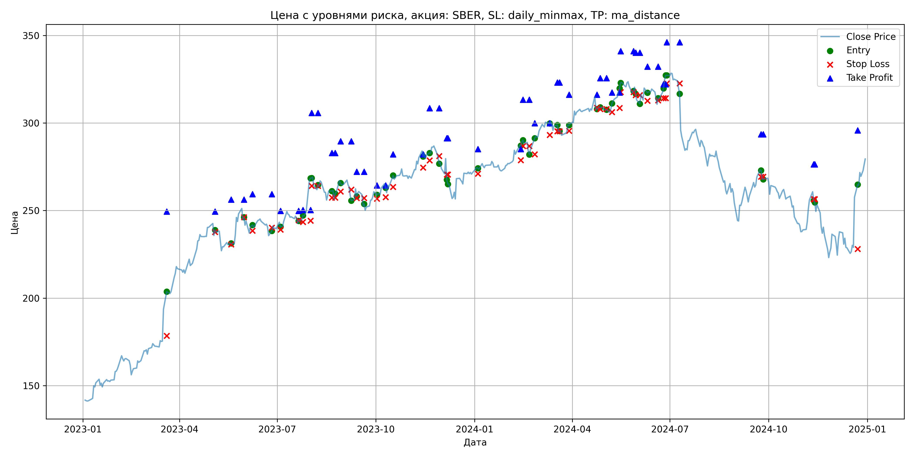
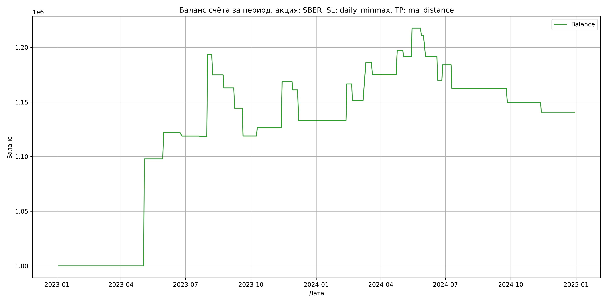

# Результаты торговой стратегии для SBER

**Дата:** 2025-05-17 12:23:28  
**Стратегия:** SBER,_SL_daily_minmax,_TP_ma_distance

## Конфигурация

```json
{
    "TICKER": "SBER",
    "EXCHANGE": "MOEX",
    "START_DATE": "2023-01-01",
    "END_DATE": "2024-12-31",
    "INTERVAL": "1d",
    "CAPITAL": 1000000,
    "RISK_PERCENT": 0.02,
    "PROFIT_TO_RISK": 3,
    "ATR_MULTIPLIER": 1.5,
    "ATR_WINDOW": 14,
    "STOP_LOSS_METHOD": "daily_minmax",
    "TAKE_PROFIT_METHOD": "ma_distance",
    "POSITION": "long"
}
```

## Метрики эффективности

- **Начальный баланс:** 1000000.00
- **Конечный баланс:** 1140694.81
- **Прибыль/Убыток:** 140694.81 (14.07% за период тестирования)
- **Количество сделок:** 27
- **Процент выигрышных сделок:** 37.04% (10 выигрышных, 17 убыточных)
- **Средняя прибыль:** 37785.23
- **Средний убыток:** -13950.44
- **Максимальная прибыль:** 97883.65
- **Максимальный убыток:** -28019.40
- **Коэффициент прибыли:** 1.59
- **Максимальная просадка:** -6.32%

## Графики

### График цены с уровнями риска



### График баланса счёта



## Завершённые сделки

**Всего сделок:** 55

| Сделка № | Дата | Тип | Покупка / продажа | Количество акций | Цена | Stop Loss в момент сделки | Take Profit в момент сделки | Прибыль / убыток | Прибыль / убыток с учётом комиссии |
|:--------:|:----:|:---:|:-----------------:|:----------------:|:----:|:-------------------------:|:---------------------------:|:----------------:|:----------------------------------:|
| 1 | 2023-03-20 00:00:00 | LONG | BUY | 2395 | 196.02 | 178.56 | 249.50 | 0.00 | -234.73 |
| 2 | 2023-05-04 00:00:00 | LONG | SELL | -2395 | 236.89 | 237.77 | 249.50 | 97883.65 | 97365.24 |
| 3 | 2023-05-19 00:00:00 | LONG | BUY | 1874 | 230.99 | 230.72 | 256.32 | 0.00 | -216.44 |
| 4 | 2023-05-31 00:00:00 | LONG | SELL | -1874 | 244.00 | 246.16 | 256.32 | 24380.74 | 23935.67 |
| 5 | 2023-06-08 00:00:00 | LONG | BUY | 2032 | 241.30 | 238.56 | 259.43 | 0.00 | -245.16 |
| 6 | 2023-06-26 00:00:00 | LONG | SELL | -2032 | 239.60 | 240.28 | 259.43 | -3454.40 | -3942.99 |
| 7 | 2023-07-04 00:00:00 | LONG | BUY | 2280 | 243.40 | 239.15 | 249.83 | 0.00 | -277.48 |
| 8 | 2023-07-21 00:00:00 | LONG | SELL | -2280 | 243.18 | 244.41 | 249.83 | -501.60 | -1056.30 |
| 9 | 2023-07-25 00:00:00 | LONG | BUY | 3191 | 245.48 | 243.52 | 250.29 | 0.00 | -391.66 |
| 10 | 2023-08-01 00:00:00 | LONG | SELL | -3191 | 269.00 | 244.26 | 250.29 | 75052.32 | 74231.47 |
| 11 | 2023-08-02 00:00:00 | LONG | BUY | 2827 | 268.50 | 264.10 | 305.70 | 0.00 | -379.52 |
| 12 | 2023-08-08 00:00:00 | LONG | SELL | -2827 | 261.92 | 264.10 | 305.70 | -18601.66 | -19351.41 |
| 13 | 2023-08-21 00:00:00 | LONG | BUY | 2477 | 262.44 | 257.35 | 282.81 | 0.00 | -325.03 |
| 14 | 2023-08-24 00:00:00 | LONG | SELL | -2477 | 257.63 | 257.35 | 282.81 | -11914.37 | -12558.48 |
| 15 | 2023-08-29 00:00:00 | LONG | BUY | 2149 | 266.70 | 260.81 | 289.58 | 0.00 | -286.57 |
| 16 | 2023-09-08 00:00:00 | LONG | SELL | -2149 | 258.08 | 262.04 | 289.58 | -18524.38 | -19088.26 |
| 17 | 2023-09-13 00:00:00 | LONG | BUY | 2653 | 262.40 | 257.09 | 272.16 | 0.00 | -348.07 |
| 18 | 2023-09-20 00:00:00 | LONG | SELL | -2653 | 252.80 | 257.09 | 272.16 | -25468.80 | -26152.21 |
| 19 | 2023-10-02 00:00:00 | LONG | BUY | 2160 | 261.37 | 256.71 | 264.41 | 0.00 | -282.28 |
| 20 | 2023-10-10 00:00:00 | LONG | SELL | -2160 | 264.89 | 257.67 | 264.41 | 7603.20 | 7034.84 |
| 21 | 2023-10-17 00:00:00 | LONG | BUY | 2733 | 268.30 | 263.51 | 282.10 | 0.00 | -366.63 |
| 22 | 2023-11-14 00:00:00 | LONG | SELL | -2733 | 283.70 | 274.59 | 282.10 | 42088.20 | 41333.89 |
| 23 | 2023-11-20 00:00:00 | LONG | BUY | 2887 | 281.96 | 278.66 | 308.48 | 0.00 | -407.01 |
| 24 | 2023-11-29 00:00:00 | LONG | SELL | -2887 | 279.36 | 281.11 | 308.48 | -7506.20 | -8316.47 |
| 25 | 2023-12-06 00:00:00 | LONG | BUY | 2278 | 279.92 | 270.54 | 291.26 | 0.00 | -318.83 |
| 26 | 2023-12-07 00:00:00 | LONG | SELL | -2278 | 267.62 | 270.54 | 291.26 | -28019.40 | -28643.05 |
| 27 | 2024-01-04 00:00:00 | LONG | BUY | 2603 | 274.67 | 271.00 | 285.10 | 0.00 | -357.48 |
| 28 | 2024-02-13 00:00:00 | LONG | SELL | -2603 | 287.52 | 278.72 | 285.10 | 33448.55 | 32716.86 |
| 29 | 2024-02-15 00:00:00 | LONG | BUY | 2803 | 289.30 | 286.84 | 313.24 | 0.00 | -405.45 |
| 30 | 2024-02-21 00:00:00 | LONG | SELL | -2803 | 283.90 | 286.84 | 313.24 | -15136.20 | -15939.54 |
| 31 | 2024-02-26 00:00:00 | LONG | BUY | 2806 | 288.52 | 282.10 | 299.88 | 0.00 | -404.79 |
| 32 | 2024-03-11 00:00:00 | LONG | SELL | -2806 | 301.00 | 293.19 | 299.88 | 35018.88 | 34191.78 |
| 33 | 2024-03-18 00:00:00 | LONG | BUY | 2759 | 299.40 | 295.29 | 323.05 | 0.00 | -413.02 |
| 34 | 2024-03-20 00:00:00 | LONG | SELL | -2759 | 295.30 | 295.29 | 323.05 | -11311.90 | -12132.29 |
| 35 | 2024-03-29 00:00:00 | LONG | BUY | 2724 | 299.38 | 295.50 | 316.10 | 0.00 | -407.76 |
| 36 | 2024-04-24 00:00:00 | LONG | SELL | -2724 | 307.50 | 308.69 | 316.10 | 22118.88 | 21292.31 |
| 37 | 2024-04-27 00:00:00 | LONG | BUY | 2684 | 309.25 | 308.00 | 325.60 | 0.00 | -415.01 |
| 38 | 2024-05-03 00:00:00 | LONG | SELL | -2684 | 307.11 | 308.00 | 325.60 | -5743.76 | -6570.92 |
| 39 | 2024-05-08 00:00:00 | LONG | BUY | 2676 | 308.41 | 306.21 | 317.42 | 0.00 | -412.65 |
| 40 | 2024-05-15 00:00:00 | LONG | SELL | -2676 | 318.20 | 308.55 | 317.42 | 26198.04 | 25359.64 |
| 41 | 2024-05-16 00:00:00 | LONG | BUY | 2635 | 320.00 | 317.70 | 341.05 | 0.00 | -421.60 |
| 42 | 2024-05-28 00:00:00 | LONG | SELL | -2635 | 317.50 | 317.70 | 341.05 | -6587.50 | -7427.41 |
| 43 | 2024-05-30 00:00:00 | LONG | BUY | 2613 | 320.91 | 315.92 | 340.09 | 0.00 | -419.27 |
| 44 | 2024-06-03 00:00:00 | LONG | SELL | -2613 | 313.50 | 315.92 | 340.09 | -19362.33 | -20191.19 |
| 45 | 2024-06-10 00:00:00 | LONG | BUY | 2152 | 320.80 | 312.73 | 332.16 | 0.00 | -345.18 |
| 46 | 2024-06-20 00:00:00 | LONG | SELL | -2152 | 310.70 | 312.96 | 332.16 | -21735.20 | -22414.69 |
| 47 | 2024-06-25 00:00:00 | LONG | BUY | 1926 | 317.50 | 314.14 | 322.07 | 0.00 | -305.75 |
| 48 | 2024-06-27 00:00:00 | LONG | SELL | -1926 | 324.80 | 314.14 | 322.07 | 14059.80 | 13441.27 |
| 49 | 2024-06-28 00:00:00 | LONG | BUY | 2427 | 327.87 | 322.63 | 346.04 | 0.00 | -397.87 |
| 50 | 2024-07-10 00:00:00 | LONG | SELL | -2427 | 319.00 | 322.63 | 346.04 | -21527.49 | -22312.47 |
| 51 | 2024-09-24 00:00:00 | LONG | BUY | 2011 | 273.90 | 269.30 | 293.58 | 0.00 | -275.41 |
| 52 | 2024-09-26 00:00:00 | LONG | SELL | -2011 | 267.54 | 269.30 | 293.58 | -12789.96 | -13334.38 |
| 53 | 2024-11-12 00:00:00 | LONG | BUY | 1909 | 259.99 | 256.49 | 276.43 | 0.00 | -248.16 |
| 54 | 2024-11-13 00:00:00 | LONG | SELL | -1909 | 255.29 | 256.49 | 276.43 | -8972.30 | -9464.13 |
| 55 | 2024-12-23 00:00:00 | LONG | BUY | 1540 | 260.00 | 228.03 | 295.83 | 0.00 | -200.20 |
